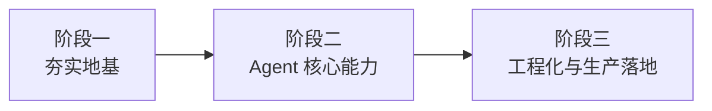

如果你现在正在犹豫"要不要学 Agent 开发"，学长想直接告诉你：别再等了。

这不是一句空洞的励志话。2024 年到 2026 年，对学长来说是亲眼看着 AI Agent 这件事从"实验室玩具"变成"真实生产系统"的两年。各大互联网公司的岗位 JD 里，"LLM 应用开发""Agent 工程师""大模型落地"这类关键词的出现频率以肉眼可见的速度在增长，薪资溢价明显。更重要的是，现在市面上能系统做 Agent 工程的人，依然少得可怜。

这个时间窗口不会永远开着。先进来的人，会建立起知识积累和项目经验的先发优势——而这个优势，在技术浪潮早期往往能维持相当长的时间。

## 这个时机为什么特别？

过去几年，大模型的能力在悄悄越过一个临界点。

2023 年之前，让模型"自主完成复杂任务"基本停留在 demo 阶段——规划能力弱、工具调用不稳定、上下文窗口太小。但从 2024 年开始，情况发生了本质变化：更强的推理能力、更长的上下文、更稳定的 Function Calling，让 Agent 真正具备了落地条件。

与此同时，企业侧的需求也爆发了。自动化客服、代码生成助手、数据分析 Agent、多 Agent 协作流……这些不再是 PPT 上的概念，而是在实际产线跑着的系统。工程师的价值，也从"会调 API"升级成了"能设计和维护可靠的 Agent 系统"。

你现在学，刚好赶上这波浪的前半段。

## 这条成长路径是什么样的？

学长把这个系列课程设计成了三个递进阶段，也是大多数 Agent 工程师实际成长的路径：

**第一阶段：夯实地基。** 在动手做 Agent 之前，你需要真正理解大模型是怎么工作的——不是背参数，而是建立直觉。Token 是什么、模型为什么会"幻觉"、上下文窗口如何影响设计决策……这些基础认知会在后续每一个工程决策里发挥作用。如果你对这部分还不熟悉，建议先去**知识库 → 大模型基础**系统过一遍，课程里我们会快速带你建立这套认知框架。

**第二阶段：Agent 核心能力。** 这一阶段聚焦 Agent 的本质——规划、记忆、工具调用、多 Agent 协作。你会写出第一个能真正"干活"的 Agent，理解 ReAct、CoT 等常用范式背后的逻辑，也会踩到很多新手必踩的坑。在这里，**知识库 → AI 智能体 → 初识 Agent** 里的两篇文章（`agent-history.md` 和 `agent-first-demo.md`）是很好的伴读材料——前者帮你建立历史感，后者直接带你上手第一个 demo。

**第三阶段：工程化与生产落地。** 从"能跑"到"能上线"，中间隔着一条鸿沟。这个阶段我们会聊 Agent 的可靠性、可观测性、成本控制、安全边界……这些是让 Agent 系统真正有价值的工程能力，也是区分初级和高级 Agent 工程师的分水岭。

## 怎么把课程和知识库结合起来用？

学长设计这套学习体系时，有一个核心思路：**课程是导航地图，知识库是详细地形图。**

课程告诉你"现在应该学什么、为什么学、学到什么程度"，帮你在整条成长路径上不迷路；知识库则提供每个知识点的深度内容，你可以按需深挖。

实际使用建议是这样的：先看课程的讲解，建立整体认知和框架；遇到某个概念想深入时，直接跳到知识库对应章节；做项目遇到具体问题时，知识库是你随时可以查的参考资料。

比如学到 Prompt 工程这一块，课程会讲核心原则和常见误区，但**知识库 → Prompt 工程**里有大量经过验证的模板和进阶技巧，值得反复翻阅。

这两部分不是割裂的，而是互相咬合的。

## 7 门课的整体弧线

这个系列共 7 门课，从"大模型基础认知"出发，经过"Agent 设计与实现"的核心地带，最终走向"多 Agent 系统架构"和"生产环境工程实践"。

不用现在就把 7 门课的内容记住——你只需要知道这条路是完整的、有人走通过的。每门课都有清晰的前置依赖和学习目标，按顺序走不会迷路。

## 出发前的一句话

学长最喜欢的一句话是：**最好的入场时机是昨天，其次是现在。**

Agent 工程这件事，技术在快速演进，但工程能力的积累需要时间。你现在开始，每写一个 Agent、每踩一个坑、每优化一次系统提示词，都是别人追不上的经验资产。

准备好了吗？我们开始。
