很多同学在开始学 Agent 之前，都会问我同一个问题："学长，我该从哪里开始？"这个问题我太熟悉了——当年我自己也在面对一堆概念：大模型、Prompt、RAG、ReAct、LangChain……完全不知道该先碰哪个。

所以这篇路线图，是我把自己踩过的弯路都填上之后，梳理出来给你的。它不是最完美的路径，但一定是最务实的路径。按这条路走，你可以在 **12 到 17 周**内，从完全不懂 AI 到独立做出一个能上线的 Agent 产品。

---

## 四个阶段总览

```mermaid
gantt
    title Agent Engineer 成长路线（周为单位）
    dateFormat  X
    axisFormat 第%s周

    section Phase 1：打地基
    大模型基础 + Prompt 工程        :p1, 0, 3w

    section Phase 2：学 Agent 核心
    Agent 原理 + ReAct 实战         :p2, after p1, 4w

    section Phase 3：进阶与生态
    框架 + RAG + 多智能体            :p3, after p2, 4w

    section Phase 4：工程化与实战
    完整产品 + 上线 + 作品集          :p4, after p3, 6w
```

---

## Phase 1：打地基（2–3 周）

**目标：** 理解大模型是怎么工作的，能自己调用 API，能写出让模型"听话"的 Prompt。

这一阶段的意义经常被低估。很多人急着上手框架，结果发现自己连"为什么这个 Prompt 没用"都搞不清楚。地基打扎实了，后面每一步都会快得多。

知识库推荐阅读顺序：

**大模型基础（全部 5 篇）**
- `transformer-arch`：搞清楚 Transformer 架构，知道"注意力机制"是什么
- `llm-token-context`：理解 Token 是什么，Context Window 为什么重要
- `llm-inference-params`：temperature、top_p 这些参数到底控制什么
- `llm-model-compare`：主流模型横向对比，心里有个谱
- `llm-model-selection`：根据场景选模型的决策框架

**Prompt 工程（基础三篇）**
- `prompt-basics`：Prompt 的基本结构和写法
- `prompt-system`：System Prompt 的作用和写法
- `prompt-cot`：Chain-of-Thought，让模型"慢慢想"

**阶段实践：** 用 OpenAI 或 Claude API 写一个简单的聊天界面，能发消息、能收回复、能保留上下文。

**里程碑：** 你能向别人解释清楚"Token 是什么"，能说清楚为什么同一个问题换一种说法模型的回答质量会差很多。能到这里，第一阶段就过了。

---

## Phase 2：学 Agent 核心（3–4 周）

**目标：** 从原理上搞懂 Agent 是什么，动手从零写一个 ReAct Agent。

这是整个路线最核心的阶段。很多人会绕过这里直接去用 LangChain，结果碰到问题完全不知道从哪里排查。我的建议是：先自己手写一遍，再去用框架——那时候你会觉得框架太好用了。

知识库推荐阅读顺序：

**AI 智能体系列**
- `agent-history`：Agent 的发展历程，知道我们站在哪里
- `agent-first-demo`：第一个 Agent Demo，跟着敲一遍
- `agent-react`：ReAct 模式是 Agent 的核心范式，重点理解
- `agent-paradigms`：Plan-and-Execute、MRKL 等各种 Agent 范式对比
- `agent-memory`：Agent 的记忆系统，短期记忆 vs 长期记忆
- `context-engineering`：如何设计 Context，让 Agent 保持"清醒"

**Prompt 工程（进阶三篇）**
- `few-shot`：Few-shot 示例的威力
- `structured-output`：让模型输出结构化 JSON，这是 Tool Call 的基础
- `prompt-versioning`：Prompt 也要版本管理，这是工程思维

**阶段实践：** 不借助框架，手写一个能调用工具的 Agent——比如能搜索网页、然后总结内容的 Agent。

**里程碑：** 你的 Agent 能处理"先搜索，再分析，再生成报告"这种多步骤任务，中间不需要你手动干预。

---

## Phase 3：进阶与生态（3–4 周）

**目标：** 学会用主流框架，会搭 RAG 系统，理解多智能体的设计思路。

有了前两个阶段的基础，这一阶段学框架会非常顺畅——因为你知道框架在帮你做什么，而不是黑盒操作。

知识库推荐阅读顺序：

**AI 智能体系列（框架与生态）**
- `build-agent-framework`：从零理解 Agent 框架是怎么设计的
- `langchain-js`：LangChain JS 版本，前端同学的首选
- `vercel-ai-sdk`：Vercel AI SDK，做 Web 产品最顺手的工具
- `mcp-protocol`：Model Context Protocol，Agent 工具调用的新标准
- `multi-agent`：多 Agent 协作的模式与设计
- `agent-evaluation`：如何评估 Agent 的质量，这很重要但经常被忽视

**RAG 全部 6 篇**
- `embedding-basics`：Embedding 是什么，语义相似度怎么算
- `rag-pipeline`：RAG 的完整流程
- `rag-chunking`：文档切割策略，细节决定成败
- `rag-hybrid-search`：混合检索，比纯向量搜索好用很多
- `rag-evaluation`：RAG 系统怎么评测
- `vector-db-selection`：向量数据库选型

**阶段实践：** 搭一个基于 RAG 的问答 Agent（比如对你自己的知识库提问），然后尝试用两个不同的框架各实现一遍。

**里程碑：** 你能搭出一个生产可用的 RAG 系统，遇到检索质量问题知道从哪里入手调优；面对一个新框架，能快速上手而不是一脸茫然。

---

## Phase 4：工程化与实战（4–6 weeks）

**目标：** 做出一个真实的 Agent 产品，能部署上线，形成作品集。

前三个阶段是学，这个阶段是造。造一个真实产品和写一个 Demo 的差距，比你想象的要大——日志、监控、错误处理、成本控制……这些"无聊"的工程问题，往往才是真正拦住你的东西。

知识库推荐阅读顺序：

**AI 智能体系列（前沿方向）**
- `agentic-rl`：强化学习在 Agent 中的应用，理解 RLHF 背后的逻辑
- `agent-deep-research`：Deep Research 类 Agent 的架构解析
- `agent-lowcode`：AI + 低代码，这个方向机会很多

**基础设施知识**
- 数据研发模块：了解数据管道，Agent 的知识来源需要数据工程支撑
- 后端研发模块：API 设计、数据库、部署——做产品绕不开

**阶段实践（选一个做）：**
1. **知识库助手**：帮某个垂直领域（法律、医疗、技术文档）做问答 Agent
2. **Deep Research Agent**：给定一个问题，自动搜集资料、分析、生成报告
3. **代码助手**：能理解一个代码仓库，回答关于代码的问题
4. **工作流自动化**：接入邮件/日历/任务系统，帮用户处理日常工作

**里程碑：** 产品已部署，有监控，有成本控制，能向别人演示。写一篇技术博客或者录一个 Demo 视频，放进你的简历和作品集。

---

## 常见误区

学长见过很多同学在这条路上摔跟头，总结了几个最高频的误区，提前告诉你：

**误区一：跳过基础，直接上框架。**
LangChain 确实强大，但如果你不知道 ReAct 是什么、不懂 Tool Call 的机制，遇到问题你只会一遍一遍地问 ChatGPT，效率极低。先把 Phase 1 和 Phase 2 踩扎实，框架只是顺手的工具。

**误区二：把 Demo 当产品。**
能跑通 Happy Path 不等于做出了产品。真实的 Agent 产品需要处理各种边界情况：模型幻觉、工具调用失败、上下文超长、费用超支……这些工程问题往往比算法问题更难。Phase 4 的核心就是直面这些问题。

**误区三：只看不练，囤了一堆教程。**
知识库里的文章是给你指路的，不是让你全部背诵的。每个阶段结束之前，一定要有可以运行的代码。学完 `agent-react`，你的电脑里就应该已经有一个能跑的 ReAct Agent，哪怕只有 100 行。

**误区四：用 GPT-4 解决一切。**
最贵的模型不一定是最好的选择。做产品要考虑成本，很多任务用小模型 + 好 Prompt 就能搞定，或者用 Claude Haiku 做初步过滤、再用 Opus 做精细处理。`llm-model-selection` 这篇一定要读，学会根据场景选模型。

---

路线图只是地图，最终带你走到终点的还是你自己的双脚。每完成一个里程碑，都来知识库里记录一下你的收获——那些笔记，将来都是你作品集里最有说服力的证据。

我在终点等你。
