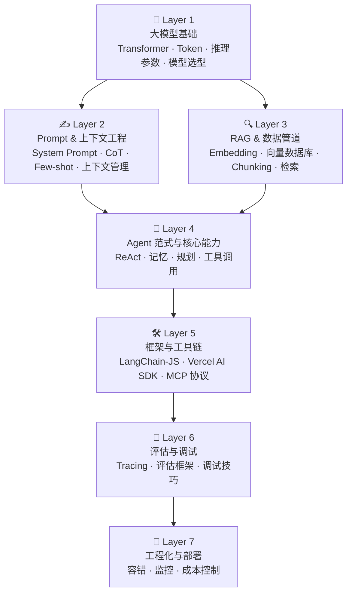

很多同学拿到这份技能图谱之后，第一反应是把它当作一份清单——逐条划掉，直到全部打勾为止。学长想先纠正这个思路：**技能图谱的真正用处，是帮你建立一个「我在哪里、下一步去哪里」的心理坐标系**。它不是终点，而是地图。地图不会告诉你怎么走每一步，但它能让你在迷路的时候知道自己偏了多远、偏向哪个方向。

Agent 工程师这个方向，知识面宽、层次深、工具链还在快速演变。如果没有一个清晰的层次感，很容易陷入「学了很多、但拼不起来」的困境。下面这张图谱把核心技能分成七层，自底向上逐层递进——越底层越基础，越顶层越贴近真实的工程落地。

---

## Layer 1：大模型基础

这是整个体系的地基。你不需要从头推导 Transformer 的数学，但你必须知道它是怎么工作的：注意力机制在做什么、Token 是什么单位、为什么上下文窗口是一个硬约束。推理参数（temperature、top-p、max_tokens）不是魔法旋钮，背后有清晰的统计含义。模型选型也是这一层的能力——同样的任务，用 Claude Haiku 还是 Claude Sonnet，成本和效果差距可以是数量级的。

这些基础知识在知识库的「**大模型基础**」章节都有覆盖，建议你在动手写第一行 Agent 代码之前先过一遍。

---

## Layer 2：Prompt & 上下文工程

有了模型基础之后，最快出效果的方向就是 Prompt 工程。System Prompt 的写法、Chain-of-Thought 的触发方式、Few-shot 示例的选取——这些技巧看起来「软」，但在实际项目里往往决定了你的 Agent 能不能稳定工作。

上下文工程是 Prompt 工程的延伸：当对话轮次变多、信息量变大，如何取舍放进上下文的内容，如何避免「遗忘」和「幻觉」，是更进阶的挑战。

这部分内容分布在知识库的「**Prompt 工程**」以及「**AI 智能体 → 上下文工程**」两个章节，建议搭配着看。

---

## Layer 3：RAG & 数据管道

大模型的知识是有截止日期的，私有数据更是模型完全不知道的。RAG（检索增强生成）就是解决这个问题的标准方案：把文档向量化、存入向量数据库，在推理时检索相关片段塞进上下文。

这一层你需要理解 Embedding 的本质、分块策略（Chunking）对检索质量的影响、以及不同向量数据库的取舍。检索质量的好坏，直接决定了 Agent 能否给出准确的答案。

对应知识库的「**RAG**」章节，里面有完整的方案介绍和代码示例。

---

## Layer 4：Agent 范式与核心能力

这是整个技能树的核心层。ReAct（Reasoning + Acting）是目前最主流的 Agent 执行范式，理解它的思考-行动-观察循环，是你设计 Agent 行为的基础框架。

除了执行范式，Agent 还需要三项核心能力：**记忆**（短期会话记忆 vs 长期持久记忆）、**规划**（任务拆解与子任务编排）、**工具调用**（Tool Use / Function Calling 的机制与边界）。这三项能力的组合方式，决定了你的 Agent 能解决多复杂的问题。

这部分的深度内容在知识库「**AI 智能体**」章节，是这门课程的重点，建议多花时间。

---

## Layer 5：框架与工具链

理解了范式之后，你需要选择合适的工具来落地。学长这里重点介绍三个方向：

- **LangChain-JS**：生态最丰富的 Agent 框架，抽象层次高，上手快，适合快速原型；
- **Vercel AI SDK**：对前端工程师非常友好，天然集成 Next.js，流式输出体验好；
- **MCP 协议**（Model Context Protocol）：Anthropic 推出的标准化工具调用协议，是目前 Agent 与外部工具互联互通的重要方向，值得重点关注。

对应知识库「**AI 智能体 → 框架/MCP**」章节，有各框架的对比分析和实战示例。

---

## Layer 6：评估与调试

这是很多工程师容易忽视的一层，但在生产环境里它决定了你能不能对 Agent 的行为有信心。LLM 的输出是概率性的，同样的输入在不同时刻可能给出不同的结果——如果没有系统性的评估手段，你根本不知道你的 Agent 是在进步还是在退步。

Tracing（链路追踪）让你能看到每一次 LLM 调用的输入输出；评估框架让你量化 Agent 的准确率和稳定性；调试技巧让你在 Agent 表现异常时快速定位问题。

这部分在知识库「**AI 智能体 → 评估**」章节，建议在你开始接手第一个正式项目之前仔细研读。

---

## Layer 7：工程化与部署

最后一层是让 Agent 在真实环境中稳定运行的工程能力。这包括：生产环境的容错设计（超时、重试、降级）、可观测性（日志、监控、告警）、以及成本控制（Token 用量追踪、缓存策略、模型分级调用）。

一个在 Demo 里跑得很顺的 Agent，到了生产环境可能因为成本超支或者偶发性错误变得不可用。这一层的能力是 Agent 工程师区别于「玩具项目开发者」的关键。

对应知识库「**大模型基础 → 生产**」章节，有生产实践的完整指南。

---

## 技能图谱全貌

用一张图来展示这七层的递进关系和依赖结构：

从图中可以看到，Layer 2 和 Layer 3 都依赖于 Layer 1 的基础，它们共同汇聚到 Layer 4 这个核心层。Layer 4 往上是工具链、评估、工程化的递进——这也是你在实际项目中会自然经历的成长路径。

---

最后学长想说：技能图谱是给你看方向的，不是用来焦虑的。不同的人会在不同的层次上有各自的短板，找到自己的薄弱点、有针对性地补齐，比漫无目的地刷内容效率高得多。带着这张地图去学习，你会发现每一个知识点都有了它应在的位置，学习的过程也会清晰很多。

加油，咱们一起把这张图谱走完。
