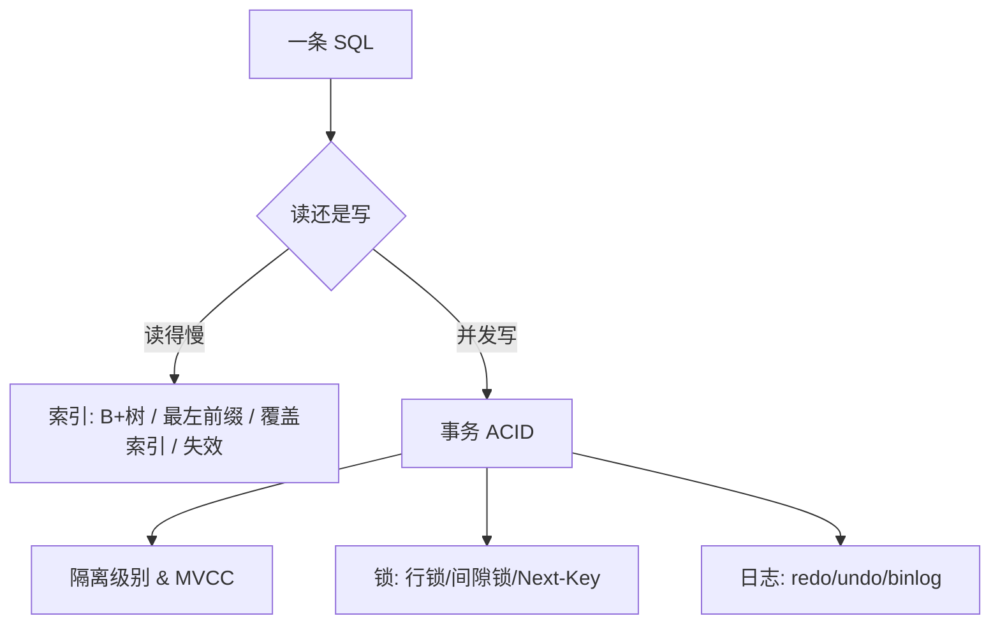

# 数据库与 MySQL 篇·高频考点与串讲思路

数据库是后端与全栈面试的「硬通货」,也是 Agent 应用真正存数据的地方——会话、消息、用户画像、任务状态,最终都要落库。这一篇帮你把 MySQL 的核心考点串成一条逻辑线。

## 串讲主线:从「一条查询如何变快、一笔写入如何不丢不乱」展开

整块知识可以挂在两个问题上:**查得快吗?**(索引)和 **写得对吗?**(事务/锁/日志)。

### 索引这条线
- **为什么用 B+ 树**:相比哈希(不支持范围)、B 树(更高、范围扫描差),B+ 树非叶不存数据、叶子用双向链表串起来,既矮又利于范围查询。
- **聚簇索引与回表**:InnoDB 主键就是数据本身;走二级索引要回表,这正是「覆盖索引」能优化的原因。
- **索引优化与失效**:最左前缀、覆盖索引、索引下推;以及那些让索引白建的写法(函数运算、隐式转换、前导 `%`)。

### 事务这条线
- **ACID 怎么来的**:原子性靠 undo log 回滚,持久性靠 redo log + WAL,隔离性靠锁 + MVCC,一致性是前三者的结果。
- **隔离级别与 MVCC**:脏读/不可重复读/幻读 → 四个隔离级别 → InnoDB 默认 RR;MVCC 用版本链 + ReadView 实现「读不加锁」的快照读。
- **锁**:记录锁、间隙锁、临键锁;RR 下如何用 Next-Key Lock 防幻读;死锁如何排查。
- **三种日志**:redo(崩溃恢复)、undo(回滚 + 多版本)、binlog(主从复制/归档),以及两阶段提交为什么必要。

## 推荐阅读顺序(对应「知识库 → 计算机基础 → 数据库与 MySQL」)

1. MySQL 索引为什么用 B+ 树
2. 如何优化索引:最左前缀、覆盖索引与索引失效
3. 事务的 ACID 特性是如何保证的
4. 事务隔离级别与 MVCC 原理
5. MySQL 的锁机制:行锁、间隙锁与死锁
6. redo log、undo log 与 binlog 有什么区别

> **对 Agent 工程的意义**:多轮对话的消息写入要保证不丢、扣费/额度变更要保证不乱、慢查询会拖垮整个服务的响应。把索引和事务吃透,你才能让 Agent 后端在百万级数据下依然稳。

## 自测建议

「B+ 树为什么适合做索引」「MVCC 怎么实现可重复读」「redo 和 binlog 的区别与两阶段提交」是高区分度题目。用 Iris「考一考」反复抽测,并尝试用一个真实表结构举例。
