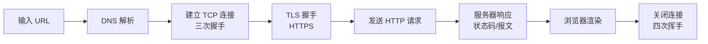

# 网络篇·高频考点与串讲思路

网络是计算机基础里出现频率最高的一块,几乎每场技术面都会问。它也最贴近日常开发:你写的每一次 `fetch`、每一个流式响应、每一次超时重试,背后都是这套协议在工作。

## 一条主线把知识点串起来

最好的串讲方式,是顺着「**在浏览器输入 URL 到看到页面**」这条主线走一遍,沿途的每个环节都对应一组考点:

- **DNS 解析**:域名怎么变成 IP,递归与迭代查询,缓存在哪几层。
- **TCP 三次握手 / 四次挥手**:为什么是三次不是两次?为什么挥手要四次?`TIME_WAIT` 和 `CLOSE_WAIT` 各代表什么、过多怎么办——这是最爱考的细节。
- **TCP vs UDP**:可靠 vs 实时,各自适用场景;视频/直播为什么常用 UDP。
- **HTTP / HTTPS**:报文结构、常见状态码(2xx/3xx/4xx/5xx)、GET 与 POST 区别、HTTP/1.1 与 HTTP/2、长连接 keep-alive;HTTPS 如何用「非对称握手 + 对称加密」兼顾安全与性能。
- **缓存与存储**:Cookie / Session / LocalStorage 区别,HTTP 缓存(强缓存与协商缓存)。
- **安全**:XSS、CSRF 的原理与防御。

## 推荐阅读顺序(对应「知识库 → 计算机网络」)

1. 浏览器输入 URL 的全过程(总览)
2. TCP 三次握手 / 为什么不是两次 / 四次挥手 / TIME-WAIT
3. TCP 与 UDP 的区别与场景 / 滑动窗口与拥塞控制
4. HTTP 与 HTTPS 区别 / HTTPS 连接建立过程 / 状态码 / GET 与 POST
5. Cookie 与 Session / 三种前端存储区别
6. XSS 与 CSRF 攻防

> **对 Agent 工程的意义**:LLM 的流式输出走的是 HTTP 长连接 + SSE;调用外部工具要处理超时、重试与连接复用;部署服务必然涉及 HTTPS 与跨域。把网络这条线打通,排查线上「请求卡住/断流/跨域失败」时你会比别人快得多。

## 自测建议

读完每篇后,在文章右侧 Iris 点「考一考」让它抽题考你;重点练「为什么三次握手」「TIME_WAIT 为什么要等 2MSL」「HTTPS 握手流程」这几道——它们几乎是必考且最能区分深度的题。
