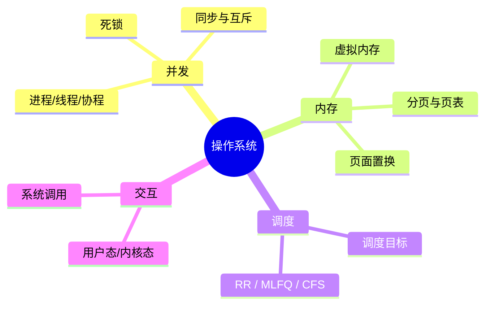

# 操作系统篇·高频考点与串讲思路

操作系统这块,面试问得「虚」但其实最能体现工程素养:你对并发、内存、调度的理解,直接决定你能不能写出高吞吐、不卡死、不 OOM 的服务。

## 一张图看清四个核心主题

## 串讲主线:从「一个程序如何被并发地跑起来」说起

- **进程、线程、协程**:进程是资源分配单位,线程是调度单位,协程是用户态自己调度的轻量执行单元。理解三者切换成本的差异,就理解了「为什么高并发 IO 用协程/异步而不是开成千上万个线程」。
- **同步与互斥**:多个执行流抢共享数据会产生竞态。互斥锁、读写锁、自旋锁、信号量、条件变量各自解决什么、开销如何;乐观锁(CAS)与悲观锁的取舍。
- **死锁**:四个必要条件(互斥、持有并等待、不可剥夺、循环等待),以及预防/避免/检测三类对策。工程上最实用的一招:**全局统一加锁顺序**。
- **虚拟内存**:为什么每个进程都觉得自己独占内存?分页、页表、多级页表、TLB、缺页中断、页面置换(LRU/Clock)。理解了它,你就懂「内存不够时系统在干什么、为什么会抖动」。
- **进程调度**:FCFS / SJF / 时间片轮转 / 多级反馈队列 / Linux CFS。核心是在吞吐、响应、公平之间权衡。

## 推荐阅读顺序(对应「知识库 → 计算机基础 → 操作系统」)

1. 进程、线程与协程有什么区别
2. 进程间通信(IPC)有哪些方式
3. 线程同步与互斥:锁、信号量与条件变量
4. 死锁是如何产生的?如何预防和避免
5. 虚拟内存与分页机制是怎么工作的
6. 操作系统的进程调度算法有哪些

> **对 Agent 工程的意义**:一个 Agent 常常要并发调用多个工具或多个子任务。用协程/异步 IO 把等待 LLM/网络的时间利用起来,用锁或队列保护共享状态,用对内存的理解避免把大上下文一股脑塞进进程导致 OOM——这些都直接来自操作系统的功底。

## 自测建议

「进程和线程的区别」「协程为什么轻量」「死锁四条件」「虚拟内存解决了什么问题」是必答题。读完用 Iris「考一考」抽测,确保能脱口而出、还能举出工程例子。
