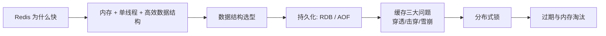

# Redis 与缓存篇·高频考点与串讲思路

Redis 几乎是每个高并发系统的标配,也是面试里「广度 + 深度」都爱考的一块。在 Agent 应用里,它承担应答缓存、限流、分布式锁、热点数据等关键角色。这一篇帮你把 Redis 的考点串起来。

## 串讲主线:从「为什么快」到「怎么稳」

- **数据结构与场景**:String/Hash/List/Set/ZSet 各自的底层编码与典型用途(计数、对象缓存、消息、去重、排行榜),以及 Bitmap/HLL/Stream 等进阶类型。选对结构,内存和性能都受益。
- **持久化**:RDB 快照 vs AOF 追加,以及混合持久化;在「丢一点数据可接受」和「尽量不丢」之间如何取舍。
- **缓存三大问题**:穿透(查不存在 → 布隆过滤器/缓存空值)、击穿(热点 key 失效 → 互斥锁/逻辑过期)、雪崩(大量同时失效 → 过期加随机 + 高可用 + 限流降级)。这是缓存面试的「必考三连」。
- **分布式锁**:`SET NX PX` + 唯一 value + Lua 释放,锁续期(看门狗),以及 RedLock 的争议。
- **过期与淘汰**:惰性 + 定期删除;`maxmemory` 下的 8 种淘汰策略怎么选。

## 推荐阅读顺序(对应「知识库 → 计算机基础 → Redis 与缓存」)

1. Redis 有哪些数据结构?各自适合什么场景
2. Redis 持久化:RDB 与 AOF 怎么选
3. 缓存穿透、击穿、雪崩及解决方案
4. 如何用 Redis 实现分布式锁
5. Redis 的过期删除与内存淘汰策略

> **对 Agent 工程的意义**:把相同输入的 LLM 应答缓存起来能显著省 Token 和延迟;用 Redis 计数做按用户限流、防刷;用分布式锁保证同一个任务不被多个 worker 重复执行。缓存三大问题处理不好,流量一上来数据库会被瞬间打穿——这正是缓存这块的工程价值。

## 自测建议

「缓存穿透/击穿/雪崩的区别与对策」「分布式锁怎么保证安全释放」「淘汰策略怎么选」是高频题。读完用 Iris「考一考」抽测,并把每个解决方案对应到一个真实场景里。
