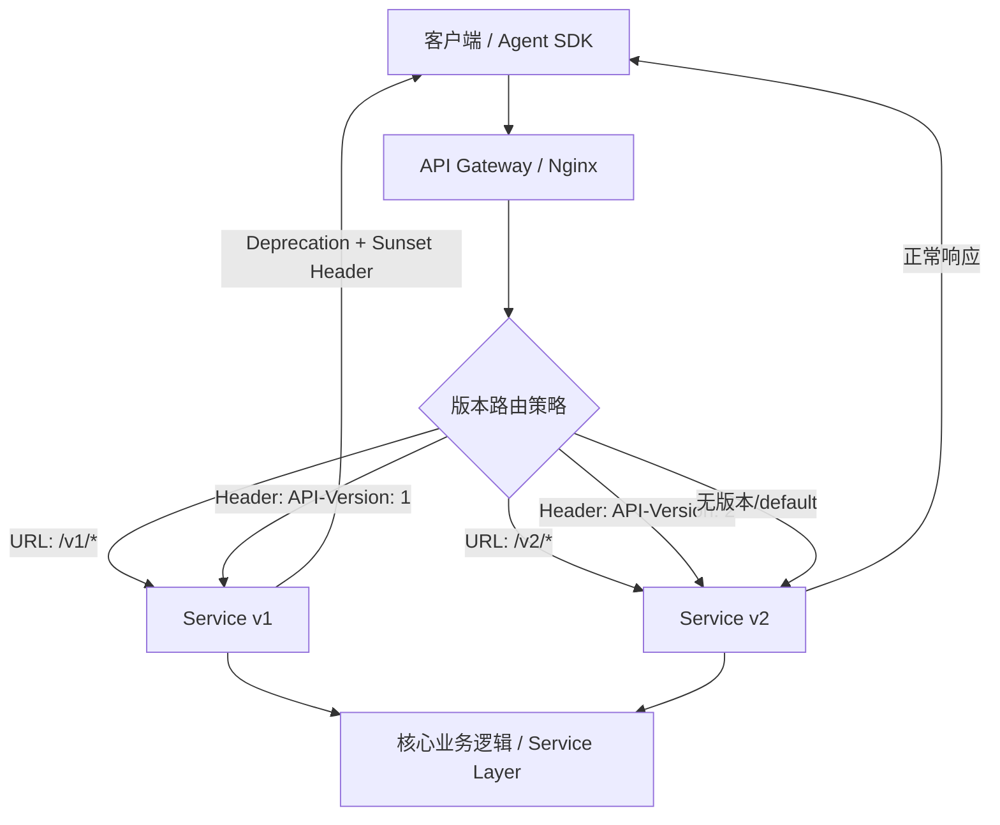

随着业务持续演进，API 变更不可避免——字段重命名、数据结构调整、业务语义更新，每一项都可能让已上线的客户端或 SDK 瞬间崩溃。API 版本管理（API Versioning）就是在"迭代新功能"与"保持向后兼容（Backward Compatibility）"之间建立护栏的工程实践。

## 为什么需要版本管理

API 的消费方是多样且分散的：移动端 App、第三方集成商、内部微服务、AI Agent 的 tool calling 层……它们往往无法与服务端同步升级。一旦服务端贸然修改接口，就会出现：

- 旧版 App 请求新接口字段不存在，前端渲染崩溃
- Agent 的 tool schema 与实际响应结构不匹配，LLM 解析失败
- 第三方合作方因接口突变触发 SLA 违约

版本管理的本质是给"不兼容的变更"打上隔离边界，让新旧客户端各自按自己的节奏迁移。

## 破坏性变更（Breaking Change）vs 非破坏性变更

在决定是否需要引入新版本之前，首先要判断变更的性质：

| 变更类型 | 示例 | 是否需要新版本 |
|---|---|---|
| 新增响应字段（可选） | `{ "name": "..." }` → 增加 `"avatar"` 字段 | 否 |
| 新增可选请求参数 | `POST /users` 新增可选 `locale` 字段 | 否 |
| 新增 API 端点 | `GET /api/v1/reports` 全新路由 | 否 |
| 新增枚举值 | `status: "PENDING" \| "PAID"` 增加 `"REFUNDED"` | 否（客户端需容错） |
| Bug 修复（行为趋正确） | 修正了错误的计算逻辑 | 否 |
| 删除或重命名字段 | `username` → `name` | **是** |
| 修改字段类型 | `"count": "10"` → `"count": 10`（string → number） | **是** |
| 修改业务语义 | 相同参数返回含义不同的结果 | **是** |
| 修改必填规则 | 原本可选的字段变为必填 | **是** |
| 修改 HTTP 方法或路径 | `PUT /users/:id` → `PATCH /users/:id` | **是** |
| 修改认证/授权模型 | 从 API Key 切换到 Bearer Token | **是** |

原则：**只有破坏性变更才引入新版本号**，非破坏性变更直接在当前版本上叠加，避免版本爆炸。

## 版本化策略对比

目前业界主流有四种版本化方案，各有取舍：

| 策略 | 示例 | 优点 | 缺点 | 适用场景 |
|---|---|---|---|---|
| **URL Path** | `GET /api/v2/users` | 直观、易调试、缓存友好、文档好分组 | URL 不够"纯粹"，路由层略冗余 | 公开 API、跨团队协作、绝大多数场景 |
| **Query Parameter** | `GET /api/users?version=2` | 灵活，URL 路径不变 | 易被业务参数混淆，缓存键复杂，不直观 | 内部调试、小规模内部 API |
| **Header（自定义）** | `API-Version: 2` | URL 干净 | 调试不直观，需要代理层支持，无法书签化 | 企业内网 API |
| **Content Negotiation** | `Accept: application/vnd.myapp.v2+json` | 符合 HTTP 规范最纯粹 | 实现复杂，客户端配置繁琐，浏览器调试困难 | 追求 RESTful 规范的平台 API |

**工程实践中首选 URL Path 版本**，原因是对 CDN 缓存、API 网关路由、Swagger 文档生成都最友好，排查线上问题时一眼可见版本号。

## 语义化版本（Semver）在 API 中的应用

SemVer（`MAJOR.MINOR.PATCH`）在 API 领域的映射：

- **MAJOR（主版本）**：有破坏性变更，需要显式版本升级，客户端必须迁移（`v1 → v2`）
- **MINOR（次版本）**：新增功能但向后兼容，通常不需要 URL 版本号变更，在同一版本内直接发布
- **PATCH（补丁版本）**：Bug 修复，完全向后兼容，对外透明

实际 API 版本管理中，URL 只暴露 MAJOR 版本号（`/v1/`、`/v2/`），MINOR 和 PATCH 变更透明滚动，通过 `API-Version-Released` 或 Changelog 对外公告即可。

> 对 Agent 后端而言，MAJOR 版本边界尤为关键——当 tool calling schema 结构发生破坏性调整时（如参数名重构、返回结构重组），必须通过主版本隔离，确保老版本 Agent prompt 中的 tool definition 仍然有效。

## 多版本路由分发流程



网关层是版本分发的核心枢纽——无论 URL Path 还是 Header 策略，都可以在网关层统一路由，后端服务只需各自实现对应版本的 Controller 和 DTO。

## TypeScript + NestJS 多版本路由实现

NestJS 内置版本控制支持，无需手写路由分发逻辑。

### 启用全局版本控制

```typescript
// main.ts
import { VersioningType } from '@nestjs/common';

async function bootstrap() {
  const app = await NestFactory.create(AppModule);

  app.enableVersioning({
    type: VersioningType.URI,      // /v1/, /v2/
    // type: VersioningType.HEADER, // 自定义 Header 模式
    // header: 'API-Version',       // 配合 HEADER 模式使用
    defaultVersion: '1',           // 未指定版本时的默认路由
  });

  await app.listen(3000);
}
```

### 控制器级别版本隔离

```typescript
// users/v1/users.controller.ts
@Controller({ path: 'users', version: '1' })
export class UsersV1Controller {
  constructor(private readonly usersService: UsersService) {}

  @Get()
  findAll(): UserV1ResponseDto[] {
    // v1: 返回扁平化用户列表
    return this.usersService.findAllV1();
  }
}

// users/v2/users.controller.ts
@Controller({ path: 'users', version: '2' })
export class UsersV2Controller {
  constructor(private readonly usersService: UsersService) {}

  @Get()
  findAll(): PagedResponseDto<UserV2ResponseDto> {
    // v2: 返回分页结构 + 扩展用户信息
    return this.usersService.findAllV2();
  }
}
```

### 单路由级别的细粒度版本控制

```typescript
// 同一 Controller 内区分版本（适合差异较小的场景）
@Controller('products')
export class ProductsController {
  @Get()
  @Version('1')
  findAllV1(): ProductV1Dto[] {
    return this.productsService.findAllLegacy();
  }

  @Get()
  @Version(['2', '3'])    // 多个版本共用同一实现
  findAllV2(): ProductV2Dto[] {
    return this.productsService.findAll();
  }
}
```

### DTO 层版本隔离（重点）

版本差异最好收敛在 DTO 层，业务逻辑（Service、Repository）保持共用：

```typescript
// dto/v1/user-response.dto.ts
export class UserV1ResponseDto {
  id: number;
  username: string;    // v1 用 username
  email: string;
}

// dto/v2/user-response.dto.ts
export class UserV2ResponseDto {
  id: string;          // v2 改为 UUID
  name: string;        // v2 改名为 name
  email: string;
  avatar?: string;     // v2 新增头像字段
  createdAt: string;   // v2 新增时间戳
}

// users.service.ts — 核心逻辑只写一份
@Injectable()
export class UsersService {
  findAllV1(): UserV1ResponseDto[] {
    const users = this.userRepo.findAll();
    return users.map(u => ({
      id: u.id,
      username: u.name,  // 字段映射适配 v1 结构
      email: u.email,
    }));
  }

  findAllV2(): PagedResponseDto<UserV2ResponseDto> {
    const users = this.userRepo.findAll();
    return {
      items: users.map(u => ({
        id: u.uuid,
        name: u.name,
        email: u.email,
        avatar: u.avatar,
        createdAt: u.createdAt.toISOString(),
      })),
      total: users.length,
    };
  }
}
```

## 版本废弃（Deprecation）策略

新版本发布后，旧版本需要给消费方足够的迁移窗口（通常 3–6 个月），按以下节奏推进：

```
新版本发布 → 双版本并行维护 → 废弃声明（Deprecation Notice）→ Sunset 倒计时 → 旧版本下线
```

### Sunset Header 与废弃通知

`Deprecation` 和 `Sunset` 是 IETF 草案标准响应头，SDK 和监控工具可自动感知：

```typescript
// 在废弃版本的响应中注入标准头
@Get()
@Version('1')
async findAllV1(
  @Res({ passthrough: true }) res: Response,
): Promise<UserV1ResponseDto[]> {
  res.setHeader('Deprecation', 'true');
  res.setHeader(
    'Sunset',
    new Date('2026-12-31T23:59:59Z').toUTCString(),
  );
  res.setHeader(
    'Link',
    '</api/v2/users>; rel="successor-version", <https://docs.example.com/migration/v2>; rel="deprecation"',
  );

  return this.usersService.findAllV1();
}
```

### NestJS 废弃拦截器（统一注入）

针对整个 v1 模块批量注入废弃头，避免每个路由手写：

```typescript
// deprecation.interceptor.ts
@Injectable()
export class DeprecationInterceptor implements NestInterceptor {
  constructor(
    private readonly sunsetDate: string,
    private readonly successorUrl: string,
  ) {}

  intercept(context: ExecutionContext, next: CallHandler): Observable<any> {
    const response = context.switchToHttp().getResponse<Response>();
    response.setHeader('Deprecation', 'true');
    response.setHeader('Sunset', this.sunsetDate);
    response.setHeader(
      'Link',
      `<${this.successorUrl}>; rel="successor-version"`,
    );
    return next.handle();
  }
}

// users-v1.module.ts — 在模块级绑定拦截器
@Module({
  controllers: [UsersV1Controller],
  providers: [
    {
      provide: APP_INTERCEPTOR,
      useValue: new DeprecationInterceptor(
        'Wed, 31 Dec 2026 23:59:59 GMT',
        '/api/v2/users',
      ),
    },
  ],
})
export class UsersV1Module {}
```

## API 版本与 SDK 版本的协同

API 版本和客户端 SDK 版本需要建立明确的映射关系，否则消费方无法知道该用哪个 SDK 调用哪个 API：

| API 版本 | SDK 版本范围 | 状态 | 下线时间 |
|---|---|---|---|
| `/v1/*` | SDK `1.x.x` | Deprecated | 2026-12-31 |
| `/v2/*` | SDK `2.x.x` | Active | — |
| `/v3/*` | SDK `3.0.0+` | Beta | — |

SDK 版本管理原则：
- SDK MAJOR 版本与 API MAJOR 版本保持对齐
- SDK 内部通过 `baseUrl` 或 `apiVersion` 配置项切换对应 API 版本
- SDK 在初始化时检测 `Deprecation` 响应头，在控制台打印迁移警告

```typescript
// SDK 客户端示例：感知废弃头
class ApiClient {
  private readonly http: AxiosInstance;

  constructor(private config: { apiVersion: 'v1' | 'v2'; baseUrl: string }) {
    this.http = axios.create({ baseURL: `${config.baseUrl}/api/${config.apiVersion}` });

    // 响应拦截器：感知废弃信号
    this.http.interceptors.response.use((response) => {
      if (response.headers['deprecation'] === 'true') {
        const sunset = response.headers['sunset'];
        console.warn(
          `[ApiClient] API ${config.apiVersion} 已废弃，将于 ${sunset} 下线，请尽快迁移。`,
        );
      }
      return response;
    });
  }
}
```

## Agent 后端的版本平滑迁移

AI Agent 服务对 API 版本管理有额外的敏感性：Agent 的 tool definition（工具定义）通常硬编码在 prompt 模板或配置文件中，一旦后端 API 的参数结构发生破坏性变更，Agent 的调用就会静默失败——LLM 仍然按旧 schema 生成 tool call，后端却按新 schema 解析，导致数据解析错误或业务逻辑异常。

**典型场景：tool calling schema 版本迁移**

```typescript
// v1 Tool Schema（原始）
const searchTool_v1 = {
  name: 'search_products',
  parameters: {
    type: 'object',
    properties: {
      keyword: { type: 'string' },
      page: { type: 'number' },
    },
    required: ['keyword'],
  },
};

// v2 Tool Schema（重构后：参数重命名 + 新增过滤器）
const searchTool_v2 = {
  name: 'search_products',
  parameters: {
    type: 'object',
    properties: {
      query: { type: 'string' },    // keyword → query（破坏性）
      pagination: {                  // page 移入对象（破坏性）
        type: 'object',
        properties: {
          page: { type: 'number' },
          pageSize: { type: 'number' },
        },
      },
      filters: {                     // 新增过滤器（非破坏性）
        type: 'object',
        properties: {
          category: { type: 'string' },
          priceRange: { type: 'array' },
        },
      },
    },
    required: ['query'],
  },
};
```

**迁移策略**：
1. **并行部署**：同时维护 `/v1/search` 和 `/v2/search`，新 Agent prompt 指向 v2，存量 Agent 继续使用 v1
2. **兼容适配层**：在 v2 Controller 内兼容 `keyword` 参数（同时接受 `keyword` 和 `query`），给迁移窗口内的 Agent 提供容错
3. **Prompt 版本化**：Agent 的 system prompt 和 tool definition 纳入版本控制，与 API 版本号绑定，方便回滚

## 代码目录组织建议

版本差异集中在 Controller 和 DTO 层，业务核心（Service、Repository）保持共用：

```
src/
  users/
    v1/
      users.controller.ts     ← v1 路由与响应结构
      dto/
        user-response.dto.ts  ← v1 DTO
    v2/
      users.controller.ts     ← v2 路由与响应结构
      dto/
        user-response.dto.ts  ← v2 DTO
    users.service.ts          ← 公共业务逻辑（v1/v2 共用）
    users.repository.ts       ← 数据访问层（版本无关）
    users.module.ts
```

## 常见误区

**误区一：每次改动都引入新版本号**

非破坏性变更（加字段、加端点）不需要新版本。过度版本化会导致：维护多份逻辑、文档碎片化、消费方困惑不知用哪个版本。

**误区二：旧版本永不下线**

无限期维护旧版本会积累大量技术债务：测试矩阵翻倍、基础库升级受阻、Bug 需要多处修复。应制定明确的废弃时间表，配合 Sunset header 和迁移文档，驱动消费方主动迁移。

**误区三：版本号从 0 开始**

对外公开的 API 应从 `v1` 开始，`v0` 容易被认为是不稳定的实验性接口，消费方不敢接入。内部测试阶段可用 `beta` 或 `preview` 标识。

**误区四：忽视版本下线后的流量监控**

下线前应持续观察旧版本的请求量，当流量降至极低（如低于总量 1%）且无关键消费方后再执行下线。建议在 API 网关层配置版本级别的请求监控看板。

**误区五：版本只做 URL 层面的隔离，忽略数据库 Schema 兼容**

API 版本背后往往涉及数据模型变更。数据库迁移（Migration）需要与 API 版本同步规划，避免 v1/v2 共用同一数据库表时的字段冲突。

## 面试常问要点

- **推荐哪种版本管理方式？** URL Path（`/v1/`）最直观，工程上最易维护，是大多数团队的实际选择；Header 版本在学术上更"RESTful"，但实践中调试和运维成本更高。
- **什么时候需要发新版本？** 有破坏性变更时才需要新版本；非破坏性变更（加字段、加接口）直接在当前版本上叠加发布。
- **如何判断一个变更是否破坏性？** 以消费方视角验证：老客户端不做任何改动，调用新接口是否会出错？会出错则是破坏性变更。
- **旧版本何时可以下线？** 监控旧版本请求量降至极低（低于 1%），且完成对外公告并给出充足迁移期（通常 3–6 个月）之后。
- **Deprecation 与 Sunset header 的区别？** `Deprecation` 表示"此版本已进入废弃状态"，`Sunset` 指定具体的下线日期时间，两者配合使用，SDK 可自动感知并告警。
- **GraphQL 需要 API 版本管理吗？** 通常不需要，通过 `@deprecated` 字段指令逐步演进 Schema，保持单一端点；发生重大破坏性重构时可引入新端点（`/graphql/v2`）。
- **Agent 工程中 API 版本管理的特殊性？** Agent 的 tool schema 硬编码在 prompt 中，API 破坏性变更后 LLM 会按旧 schema 调用新接口导致静默错误；需要将 tool definition 纳入版本控制，并在迁移期提供兼容适配层。
