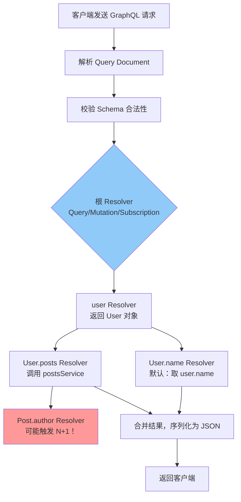

GraphQL 是 Facebook 开源的 API 查询语言与运行时，让客户端精确声明所需数据结构，从根本上解决 REST API 中长期存在的过度获取（over-fetching）和获取不足（under-fetching）问题。对 AI/Agent 后端而言，GraphQL 的强类型 Schema 与精确查询能力，可以让前端精细控制 Agent 状态字段的订阅范围，显著减少无效数据传输。

## GraphQL vs REST：一张表说清核心差异

| 维度 | REST | GraphQL |
|------|------|---------|
| 数据获取 | 固定字段，多端共用同一接口，易过/欠获取 | 客户端精确声明字段，服务端按需返回 |
| 请求次数 | 多资源往往需多次串行请求 | 单次请求可跨多资源聚合 |
| 端点数量 | 多端点（`/users`, `/posts`, ...） | 单端点（通常 `/graphql`） |
| 类型系统 | 无强制约束，靠文档约定 | SDL 强类型，自描述，可自动生成客户端类型 |
| 版本管理 | 需 v1/v2 版本号 | 通过 `@deprecated` 指令平滑演进，无需版本号 |
| HTTP 缓存 | GET 请求天然可缓存 | 通常 POST，需借助 APQ（Persisted Query）或客户端缓存 |
| 学习曲线 | 低，基于 HTTP 语义 | 较高，需理解 SDL、Resolver、DataLoader 等概念 |
| 适用场景 | 简单 CRUD、公开 API、移动流量敏感场景 | 复杂关联数据、多端需求差异大、强类型优先场景 |

**过获取示例**：REST `GET /users/:id` 返回全部 20 个字段，但移动端只用 3 个；**欠获取示例**：展示用户及其文章需先请求 `/users/:id` 再请求 `/users/:id/posts`，两次往返。GraphQL 用一次查询解决两个问题。

## Schema 定义语言（SDL）

GraphQL API 从 Schema 开始。Schema 是服务端与客户端之间的**合同（Contract）**，描述所有可用类型和操作。

```graphql
# 标量类型：ID、String、Int、Float、Boolean
# 对象类型
type User {
  id: ID!
  name: String!
  email: String!
  role: UserRole!          # 枚举
  posts: [Post!]!          # 非空列表，元素非空
  createdAt: String
}

type Post {
  id: ID!
  title: String!
  content: String          # 可为 null
  author: User!
  tags: [String!]!
}

# 枚举类型
enum UserRole {
  ADMIN
  EDITOR
  VIEWER
}

# 三大根操作类型
type Query {
  user(id: ID!): User
  users(page: Int, pageSize: Int): [User!]!
  post(id: ID!): Post
}

type Mutation {
  createUser(input: CreateUserInput!): User!
  updateUser(id: ID!, input: UpdateUserInput!): User
  deletePost(id: ID!): Boolean!
}

type Subscription {
  postCreated: Post!
  agentStatusChanged(agentId: ID!): AgentStatus!  # Agent 后端场景
}

# 输入类型（Input Type）：专用于参数传递，不可做返回类型
input CreateUserInput {
  name: String!
  email: String!
  role: UserRole = VIEWER
}
```

`!` 表示非空（Non-Null）修饰符，`[Post!]!` 表示"非空数组，且数组内每个元素也非空"。Input Type 与 Object Type 形式相似但职责严格分离——这一点在工程实践中至关重要（见后文误区）。

## Resolver 机制：请求的解析链路

GraphQL 运行时收到请求后，按字段树逐级调用对应的 Resolver 函数解析数据。每个字段都有一个 Resolver，未显式定义则使用默认行为（从父对象取同名属性）。



### Context：贯穿整个请求的认证上下文

每次请求创建一个 `context` 对象，所有 Resolver 共享。这是传递认证信息、DataLoader 实例、服务依赖的标准方式：

```typescript
// Apollo Server 配置 context
const server = new ApolloServer({
  typeDefs,
  resolvers,
  context: async ({ req }): Promise<AppContext> => {
    const token = req.headers.authorization?.replace('Bearer ', '');
    const user = token ? await verifyJWT(token) : null;
    return {
      currentUser: user,
      // DataLoader 实例必须在每次请求时新建，避免跨请求缓存污染
      loaders: createLoaders(),
    };
  },
});

// Resolver 中访问 context
const resolvers = {
  Query: {
    me: (_parent, _args, context: AppContext) => {
      if (!context.currentUser) throw new AuthenticationError('未登录');
      return context.currentUser;
    },
  },
  User: {
    posts: (parent: User, _args, context: AppContext) => {
      // 使用 DataLoader 批量加载
      return context.loaders.postsByUserId.load(parent.id);
    },
  },
};
```

## N+1 问题与 DataLoader 批量解决方案

这是 GraphQL 最常见的性能陷阱。查询 100 个用户及其文章时，`User.posts` Resolver 会被触发 100 次，每次独立查一次数据库，共 101 次查询。

**DataLoader** 利用 Node.js 的事件循环（microtask queue）将同一 tick 内的所有 `.load()` 调用收集起来，合并为一次批量查询：

```typescript
import DataLoader from 'dataloader';
import { In } from 'typeorm';

// 创建 DataLoader：key 为 userId，返回对应 Post[]
function createPostsByUserIdLoader() {
  return new DataLoader<string, Post[]>(async (userIds: readonly string[]) => {
    // 1 次 IN 查询替代 N 次单独查询
    const posts = await postRepository.find({
      where: { userId: In([...userIds]) },
    });

    // 关键：返回结果顺序必须与 userIds 顺序一一对应
    const postMap = new Map<string, Post[]>();
    for (const post of posts) {
      const list = postMap.get(post.userId) ?? [];
      list.push(post);
      postMap.set(post.userId, list);
    }

    return userIds.map((id) => postMap.get(id) ?? []);
  });
}

// 每个请求创建新实例（request-scoped）
function createLoaders() {
  return {
    postsByUserId: createPostsByUserIdLoader(),
  };
}
```

DataLoader 同时提供**请求级缓存**：同一请求内对同一 key 的第二次 `.load()` 直接返回缓存值，不再重复查询。

## 变量（Variables）与片段（Fragments）

### 变量

将动态参数从查询字符串中抽离，避免字符串拼接（SQL 注入类似风险），同时支持查询预编译（APQ）：

```graphql
# 声明变量 $input，类型必须与 Schema 匹配
mutation CreateUser($input: CreateUserInput!) {
  createUser(input: $input) {
    id
    name
    email
  }
}
```

请求体中通过独立的 `variables` 字段传入：

```json
{
  "query": "mutation CreateUser($input: ...) { ... }",
  "variables": {
    "input": { "name": "Alice", "email": "alice@example.com" }
  }
}
```

### 片段（Fragments）

片段是可复用的字段集合，避免多处重复相同字段：

```graphql
# 定义片段
fragment UserBasicInfo on User {
  id
  name
  email
  role
}

# 在多个查询中复用
query GetUser($id: ID!) {
  user(id: $id) {
    ...UserBasicInfo    # 展开片段
    posts {
      id
      title
    }
  }
}

query GetCurrentUser {
  me {
    ...UserBasicInfo
    createdAt
  }
}
```

内联片段（Inline Fragment）常用于接口（Interface）和联合类型（Union）的条件字段展开：

```graphql
query GetSearchResults($query: String!) {
  search(query: $query) {
    ... on User { name email }       # 当结果是 User 类型时
    ... on Post { title content }    # 当结果是 Post 类型时
  }
}
```

## TypeScript 代码优先：type-graphql 实践

代码优先（Code First）方案用装饰器从 TypeScript 类自动生成 SDL，类型安全，与 NestJS 生态高度契合：

```typescript
import { ObjectType, Field, ID, InputType, Resolver, Query, Mutation, Args, ResolveField, Parent } from 'type-graphql';

// 对象类型：SDL 中的 type
@ObjectType()
class User {
  @Field(() => ID)
  id: string;

  @Field()
  name: string;

  @Field()
  email: string;

  @Field(() => [Post])
  posts: Post[];  // 由 @ResolveField 填充，不在 DB 列
}

// 输入类型：SDL 中的 input
@InputType()
class CreateUserInput {
  @Field()
  name: string;

  @Field()
  email: string;
}

// Resolver
@Resolver(() => User)
class UserResolver {
  constructor(
    private usersService: UsersService,
    private postsService: PostsService,
  ) {}

  @Query(() => User, { nullable: true })
  async user(@Args('id', { type: () => ID }) id: string): Promise<User | null> {
    return this.usersService.findById(id);
  }

  @Mutation(() => User)
  async createUser(@Args('input') input: CreateUserInput): Promise<User> {
    return this.usersService.create(input);
  }

  // 字段解析器：仅在客户端查询了 posts 字段时才触发
  @ResolveField(() => [Post])
  async posts(@Parent() user: User, @Ctx() ctx: AppContext): Promise<Post[]> {
    return ctx.loaders.postsByUserId.load(user.id);
  }
}
```

## Subscription：基于 WebSocket 的实时推送

Subscription 用于 AI Agent 场景中的状态实时同步（如 Agent 执行进度、流式输出），底层基于 WebSocket 或 Server-Sent Events。

**SDL 定义**：

```graphql
type AgentStatus {
  agentId: ID!
  state: AgentState!   # PENDING | RUNNING | COMPLETED | FAILED
  progress: Int        # 0-100
  output: String       # 流式输出片段
}

enum AgentState {
  PENDING
  RUNNING
  COMPLETED
  FAILED
}

type Subscription {
  agentStatusChanged(agentId: ID!): AgentStatus!
}
```

**服务端使用 PubSub 发布事件**：

```typescript
import { PubSub } from 'graphql-subscriptions';

const pubSub = new PubSub();

const resolvers = {
  Subscription: {
    agentStatusChanged: {
      // asyncIterator 返回事件流
      subscribe: (_parent, { agentId }) =>
        pubSub.asyncIterator(`AGENT_STATUS_${agentId}`),
    },
  },
  Mutation: {
    runAgent: async (_parent, { agentId }) => {
      // 触发 Agent 执行，异步推送状态
      runAgentJob(agentId, (status) => {
        pubSub.publish(`AGENT_STATUS_${agentId}`, { agentStatusChanged: status });
      });
      return { agentId, state: 'PENDING' };
    },
  },
};
```

**客户端订阅**：

```graphql
subscription WatchAgent($agentId: ID!) {
  agentStatusChanged(agentId: $agentId) {
    state
    progress
    output   # 只订阅需要的字段，减少传输量
  }
}
```

## 分页：Relay Cursor Pagination 规范

Relay 规范（也称 Connections 规范）是业界主流的 GraphQL 分页标准，支持前向/后向翻页，比 offset 分页在大数据量下性能更好：

```graphql
# 标准 Connection 类型结构
type UserConnection {
  edges: [UserEdge!]!
  pageInfo: PageInfo!
  totalCount: Int!
}

type UserEdge {
  node: User!
  cursor: String!   # 该条记录的不透明游标
}

type PageInfo {
  hasNextPage: Boolean!
  hasPreviousPage: Boolean!
  startCursor: String
  endCursor: String
}

type Query {
  users(
    first: Int        # 前向分页：取前 N 条
    after: String     # 游标：从此游标之后开始
    last: Int         # 后向分页：取后 N 条
    before: String
  ): UserConnection!
}
```

**查询示例**：

```graphql
query GetUsersPage($after: String) {
  users(first: 10, after: $after) {
    edges {
      node { id name email }
      cursor
    }
    pageInfo {
      hasNextPage
      endCursor
    }
  }
}
```

## GraphQL 对 Agent 后端的工程意义

在 AI Agent 系统中，GraphQL 的核心价值在于**精确的字段粒度控制**：

- **减少无效数据传输**：Agent 状态对象可能包含几十个字段（执行日志、中间结果、元数据），前端界面可能只展示 `state` 和 `progress`。GraphQL 确保只传输声明的字段，对移动端和低带宽环境尤为关键。
- **多客户端差异化需求**：调试面板需要完整 Agent 上下文，终端用户界面只需状态摘要——同一后端 Schema，不同查询形状，无需为每种前端单独开接口。
- **Subscription 实时流**：Agent 流式输出（streaming output）天然契合 GraphQL Subscription 模型，客户端可以精确声明订阅哪些字段，避免接收无关的状态噪声。
- **强类型契约**：Agent 的工具调用结果（Tool Result）、中间推理步骤可以用 SDL 精确描述，配合代码生成工具自动产出 TypeScript 类型，前后端类型安全有保障。

## 常见误区与最佳实践

### 误区一：直接将数据库模型（DB Model）暴露为 GraphQL Type

这是最严重的设计错误。数据库表结构往往包含内部字段（密码哈希、内部状态码、软删除标记），直接映射会导致：

- **安全漏洞**：敏感字段（如 `passwordHash`、`internalNotes`）可能被客户端查询到
- **职责耦合**：数据库 Schema 变更直接破坏 API 契约
- **类型语义错误**：DB 的 `created_at TIMESTAMP` 与 GraphQL 的 `createdAt: String` 在格式、时区上存在隐式转换

**正确做法**：定义独立的 GraphQL DTO（Data Transfer Object），在 Resolver 层做显式映射。

### 误区二：不做查询深度和复杂度限制（DoS 风险）

GraphQL 的灵活性允许客户端构造任意深度的嵌套查询：

```graphql
# 恶意查询：无限递归，可耗尽服务器资源
{
  user(id: "1") {
    posts {
      author {
        posts {
          author {
            posts { ... }  # 无限嵌套
          }
        }
      }
    }
  }
}
```

**防护措施**：

```typescript
import depthLimit from 'graphql-depth-limit';
import { createComplexityLimitRule } from 'graphql-validation-complexity';

const server = new ApolloServer({
  validationRules: [
    depthLimit(7),                           // 限制最大查询深度
    createComplexityLimitRule(1000),          // 限制查询复杂度分值
  ],
});
```

### 误区三：在生产环境开启 GraphQL Introspection

Introspection 会暴露完整的 Schema 结构，等同于给攻击者一份 API 文档。生产环境应关闭：

```typescript
new ApolloServer({
  introspection: process.env.NODE_ENV !== 'production',
});
```

### 最佳实践清单

| 实践 | 说明 |
|------|------|
| DataLoader 批量加载 | 每个一对多关系都应配置 DataLoader，避免 N+1 |
| Request-scoped DataLoader | DataLoader 实例每次请求新建，防止跨请求缓存污染 |
| 查询深度限制 | 设置 `maxDepth`，推荐不超过 7 层 |
| 查询复杂度限制 | 为列表字段配置复杂度权重，防止大查询攻击 |
| DTO 隔离 | GraphQL Type 与 DB Entity 分离，显式映射 |
| 关闭生产环境 Introspection | 防止 Schema 结构泄露 |
| 错误码扩展 | 在 `extensions.code` 中返回业务错误码，便于客户端分类处理 |
| APQ（自动持久化查询） | 减少重复传输查询字符串，提升缓存命中率 |

## 面试常问要点

**GraphQL 一定比 REST 好吗？**
不一定。REST 在简单 CRUD、公开 API（CDN 缓存友好）、团队 GraphQL 经验不足时更合适。GraphQL 优势在数据关系复杂、多端（Web/Mobile/Agent）需求差异大、强类型优先的场景。

**什么是 N+1 问题，如何解决？**
查询列表时，对每条记录单独触发关联数据查询，导致 1 + N 次数据库查询。解决方案是 DataLoader：收集同一事件循环 tick 内所有 `.load(key)` 调用，合并为一次 `WHERE id IN (...)` 批量查询。

**GraphQL 的 Schema 优先与代码优先哪种更好？**
各有适用场景。SDL 优先（Schema First）合同清晰，前后端可并行开发；代码优先（Code First，如 type-graphql/NestJS）类型安全，避免 SDL 与实现不同步，TypeScript 项目推荐代码优先。

**Resolver 的执行顺序是什么？**
根 Resolver 先执行返回父对象，子字段 Resolver 并行执行（同层）；DataLoader 利用并行特性在单 tick 内收集所有批量请求。Mutation 字段顺序执行（串行），Query 字段并行执行。

**如何防止 GraphQL 查询复杂度攻击（DoS）？**
双重防护：`graphql-depth-limit` 限制最大嵌套深度（推荐 ≤7），`graphql-query-complexity` 为每个字段配置复杂度权重并设置总上限，超出则拒绝执行。

**GraphQL Subscription 与 REST SSE 如何选择？**
Subscription 适合双向通信需求、客户端需精确控制订阅字段（如 Agent 状态）；SSE 实现更简单，适合单向服务端推送、无需字段精细控制的场景（如日志流）。在 Agent 后端中，若已有 GraphQL 服务，优先使用 Subscription 保持架构一致性。

**Fragment 与 Inline Fragment 区别？**
Fragment（命名片段）是可跨查询复用的字段集合，定义在查询外部；Inline Fragment（内联片段）用 `... on TypeName` 语法在查询内部对接口/联合类型做条件字段展开，不可复用。
