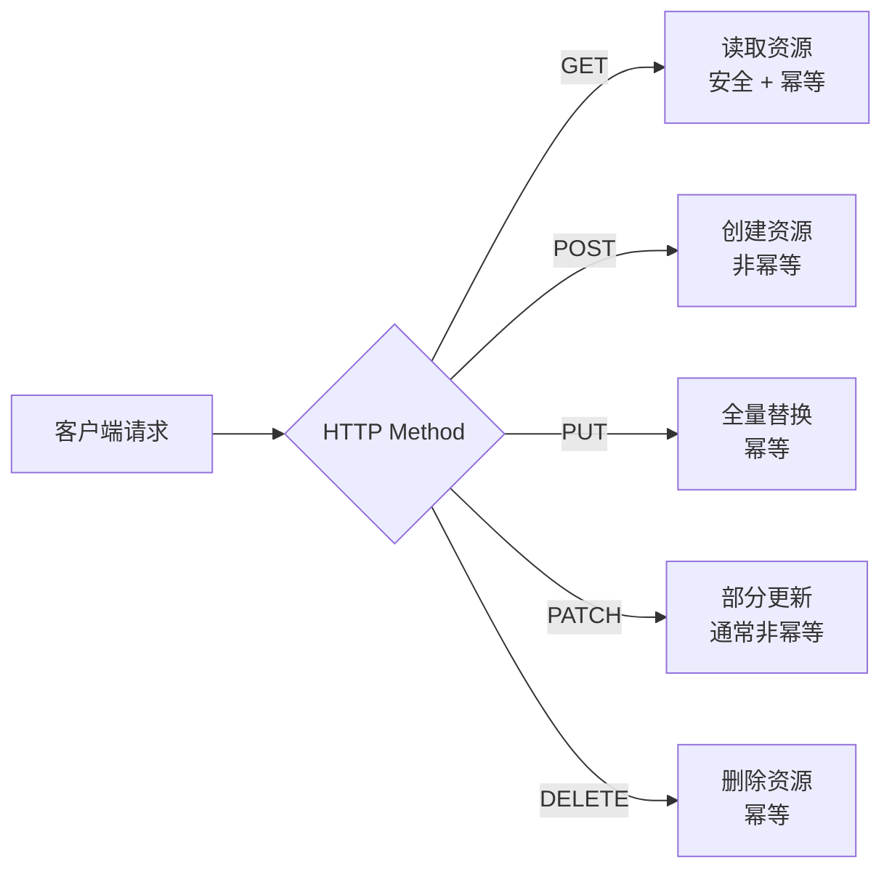
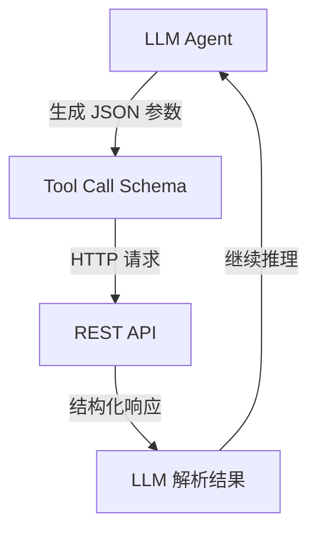

REST（Representational State Transfer）并非协议，而是 Roy Fielding 在 2000 年博士论文中提出的一套架构风格约束，基于 HTTP 协议天然实现，是当前 Web API 和 AI Agent Tool Call 的主流设计范式。掌握 RESTful 规范不只是"写出能跑的接口"，而是让 API 成为自描述、可缓存、可演化的系统契约。

## REST 六大架构约束

Fielding 定义的六条约束是 RESTful 设计的理论基础，工程师常把其中几条视为"默认遵守"而忽视了边界条件：

| 约束 | 含义 | 违反的典型场景 |
|------|------|----------------|
| Client-Server（客户端-服务器分离） | UI 与数据存储关注点分离 | 服务端直接推送 HTML 渲染逻辑 |
| Stateless（无状态） | 每次请求携带完整上下文，服务器不存储会话 | 用 Session 存储请求状态 |
| Cacheable（可缓存） | 响应需显式声明是否可缓存 | 未设置 `Cache-Control`，接口被意外缓存 |
| Uniform Interface（统一接口） | 资源标识、资源操作、自描述消息、HATEOAS | 用 `POST /doSomething` 绕过语义约束 |
| Layered System（分层系统） | 客户端无需感知中间层（网关、CDN、LB） | 接口要求客户端直连数据库地址 |
| Code on Demand（按需代码，可选） | 服务器可向客户端下发可执行代码 | 几乎不在 API 设计中体现，了解即可 |

**无状态约束**对 AI Agent 后端尤为关键：LLM 发起的 Tool Call 通常跨会话，每次调用需通过 JWT/API Key 携带完整身份信息，服务器不应依赖上一次请求的会话上下文。

## 资源命名：以名词为核心

URL 是资源的地址，不是动作的描述。好的资源命名遵循以下规则：

- 使用**名词复数**（`/users` 而非 `/user` 或 `/getUser`）
- 使用**小写字母和连字符**（`/user-profiles` 而非 `/UserProfiles`）
- 层级关系表达从属，但**不超过两级嵌套**
- 过滤、排序等操作用**查询参数**，而非路径

```
# 推荐：清晰的资源路径
GET    /users                    → 用户列表
GET    /users/{id}               → 单个用户
POST   /users                    → 创建用户
PUT    /users/{id}               → 全量替换用户
PATCH  /users/{id}               → 部分更新用户
DELETE /users/{id}               → 删除用户

GET    /users/{id}/orders        → 用户下的订单列表
GET    /users/{id}/orders/{oid}  → 用户下的特定订单

# 不推荐：超过两级嵌套，改为查询参数
# GET /users/42/orders/7/items/3 ← 路径语义混乱
GET /order-items?orderId=7       ← 推荐

# 不推荐：URL 含动词
# POST /createUser
# GET  /getUserList
# POST /users/42/delete
```

对于非 CRUD 的操作（如"发布文章"、"重置密码"），可将动作建模为子资源或状态变更：

```
POST /articles/{id}/publish      → 将文章状态变更为已发布
POST /users/{id}/password-reset  → 触发密码重置流程
PATCH /orders/{id}               → body: { "status": "cancelled" } 取消订单
```

## HTTP 方法语义与幂等性



| 方法 | 语义 | 幂等性 | 安全性（不改变服务器状态） | 请求体 | 响应体 |
|------|------|--------|---------------------------|--------|--------|
| GET | 查询 | 是 | 是 | 无 | 有 |
| POST | 创建 | **否** | 否 | 有 | 有（含新资源） |
| PUT | 全量替换 | 是 | 否 | 有（完整字段） | 有或无 |
| PATCH | 部分更新 | 否（通常） | 否 | 有（增量字段） | 有或无 |
| DELETE | 删除 | 是 | 否 | 无 | 无（204） |
| HEAD | 获取元信息 | 是 | 是 | 无 | 无（只有 Header） |
| OPTIONS | 查询支持的方法 | 是 | 是 | 无 | 有 |

**幂等性（Idempotency）**：多次执行相同请求，结果与执行一次相同。DELETE 是幂等的——删除已不存在的资源应返回 `404`，但不应抛出 `500`。PATCH 是否幂等取决于实现：`{ "views": views + 1 }` 的递增操作是非幂等的，而 `{ "status": "active" }` 是幂等的。

## HTTP 状态码规范

状态码是 REST 的"自描述"核心，客户端无需解析响应体即可判断请求结果。

| 状态码 | 含义 | 典型场景 |
|--------|------|---------|
| **200** OK | 请求成功 | GET/PUT/PATCH 成功 |
| **201** Created | 资源已创建 | POST 创建成功，配合 `Location` 响应头 |
| **204** No Content | 成功但无响应体 | DELETE 成功 |
| **206** Partial Content | 分块响应 | 文件下载、流式输出 |
| **301** Moved Permanently | 永久重定向 | API 版本迁移 |
| **304** Not Modified | 缓存有效 | 配合 `ETag`/`If-None-Match` |
| **400** Bad Request | 请求参数错误 | 类型校验、必填项缺失 |
| **401** Unauthorized | 未认证 | Token 缺失或过期 |
| **403** Forbidden | 已认证但无权限 | 跨用户访问资源 |
| **404** Not Found | 资源不存在 | ID 不存在 |
| **409** Conflict | 资源冲突 | 邮箱重复注册 |
| **422** Unprocessable Entity | 语义错误 | 参数格式合法但业务不通过 |
| **429** Too Many Requests | 限流 | 触发速率限制 |
| **500** Internal Server Error | 服务器未预期错误 | 代码异常、数据库连接失败 |
| **503** Service Unavailable | 服务暂不可用 | 维护、过载 |

> 一个核心原则：**绝对不要用 200 响应所有请求再在 body 里放错误码**，这破坏了 HTTP 协议语义，也让 Agent 无法通过状态码做错误路由。

## 统一响应体设计（Envelope 格式）

统一的响应结构（Envelope Pattern）让前端和 AI Agent 都可以用一致的方式处理响应：

```typescript
// 成功响应（单个资源）
interface SuccessResponse<T> {
  data: T;
  meta?: {
    timestamp: string;
    requestId: string;
  };
}

// 成功响应（列表 + 分页）
interface ListResponse<T> {
  data: T[];
  pagination: {
    total: number;
    page: number;
    pageSize: number;
    totalPages: number;
    // 游标分页时使用
    nextCursor?: string;
    prevCursor?: string;
  };
}

// 错误响应
interface ErrorResponse {
  error: {
    code: string;        // 业务错误码，如 "USER_NOT_FOUND"
    message: string;     // 人类可读的错误描述
    details?: Array<{
      field: string;     // 出错字段
      issue: string;     // 具体问题
      value?: unknown;   // 导致错误的值
    }>;
  };
}
```

**分页策略选择**：

| 分页方式 | 适用场景 | 优点 | 缺点 |
|---------|---------|------|------|
| Offset/Page（页码分页） | 后台管理、可跳转页码 | 实现简单，可任意跳页 | 数据量大时性能差，插入数据导致"漂移" |
| Cursor（游标分页） | 无限滚动、Feed 流 | 性能稳定，无漂移 | 不能任意跳页 |
| Keyset（键集分页） | 大数据量排序列表 | 数据库友好，利用索引 | 需要稳定的排序键 |

## 过滤、排序与字段选择

```
# 过滤：用查询参数表达业务条件
GET /orders?status=paid&userId=42
GET /products?minPrice=100&maxPrice=500&category=electronics

# 排序：用 + 表示升序（可省略），- 表示降序，支持多字段
GET /products?sort=-createdAt,+name
GET /articles?sort=-publishedAt

# 字段选择（Sparse Fieldsets）：降低传输量，对 LLM Tool Call 尤其重要
GET /users?fields=id,name,email
GET /articles?fields=id,title,summary,author.name

# 搜索
GET /articles?q=restful+design

# 组合使用
GET /products?category=phone&sort=-sales&fields=id,name,price&page=1&pageSize=20
```

字段选择（`fields` 参数）在 Agent 场景下价值显著：LLM 调用工具时通常只需要部分字段，精确控制返回字段可减少 Token 消耗、降低 LLM 混淆。

## 错误处理规范

错误码体系应结构化、可枚举，避免泛泛的 `"error": "something went wrong"`：

```typescript
// 业务错误码枚举
export enum ApiErrorCode {
  // 通用
  VALIDATION_ERROR = 'VALIDATION_ERROR',
  NOT_FOUND = 'NOT_FOUND',
  UNAUTHORIZED = 'UNAUTHORIZED',
  FORBIDDEN = 'FORBIDDEN',
  RATE_LIMITED = 'RATE_LIMITED',

  // 用户模块
  USER_NOT_FOUND = 'USER_NOT_FOUND',
  USER_EMAIL_CONFLICT = 'USER_EMAIL_CONFLICT',
  USER_INVALID_PASSWORD = 'USER_INVALID_PASSWORD',

  // 订单模块
  ORDER_ALREADY_PAID = 'ORDER_ALREADY_PAID',
  ORDER_INSUFFICIENT_STOCK = 'ORDER_INSUFFICIENT_STOCK',
}

// 错误响应示例
// HTTP 422
{
  "error": {
    "code": "VALIDATION_ERROR",
    "message": "请求参数校验失败",
    "details": [
      { "field": "email", "issue": "邮箱格式不合法", "value": "notanemail" },
      { "field": "age",   "issue": "必须大于 0",      "value": -1 }
    ]
  }
}

// HTTP 409
{
  "error": {
    "code": "USER_EMAIL_CONFLICT",
    "message": "该邮箱已被注册",
    "details": [
      { "field": "email", "issue": "email alice@example.com already exists" }
    ]
  }
}
```

## TypeScript + NestJS 规范化控制器

```typescript
import {
  Controller, Get, Post, Put, Patch, Delete,
  Param, Body, Query, HttpCode, HttpStatus,
  ParseIntPipe, NotFoundException,
} from '@nestjs/common';

// DTO 定义
export class CreateUserDto {
  name: string;
  email: string;
  role?: 'admin' | 'member';
}

export class UpdateUserDto {
  name?: string;
  email?: string;
}

export class UserQueryDto {
  page?: number = 1;
  pageSize?: number = 20;
  sort?: string = '-createdAt';
  fields?: string;
  status?: 'active' | 'inactive';
}

@Controller('users')
export class UsersController {
  constructor(private readonly usersService: UsersService) {}

  // GET /users?page=1&pageSize=20&sort=-createdAt&status=active
  @Get()
  async findAll(@Query() query: UserQueryDto) {
    const { data, total } = await this.usersService.findAll(query);
    return {
      data,
      pagination: {
        total,
        page: query.page,
        pageSize: query.pageSize,
        totalPages: Math.ceil(total / query.pageSize),
      },
    };
  }

  // GET /users/:id
  @Get(':id')
  async findOne(@Param('id', ParseIntPipe) id: number) {
    const user = await this.usersService.findOne(id);
    if (!user) throw new NotFoundException({
      error: { code: 'USER_NOT_FOUND', message: `User ${id} not found` },
    });
    return { data: user };
  }

  // POST /users → 201 Created + Location header
  @Post()
  @HttpCode(HttpStatus.CREATED)
  async create(@Body() dto: CreateUserDto, @Res({ passthrough: true }) res: Response) {
    const user = await this.usersService.create(dto);
    res.setHeader('Location', `/users/${user.id}`);
    return { data: user };
  }

  // PATCH /users/:id（部分更新）
  @Patch(':id')
  async update(
    @Param('id', ParseIntPipe) id: number,
    @Body() dto: UpdateUserDto,
  ) {
    const user = await this.usersService.update(id, dto);
    return { data: user };
  }

  // DELETE /users/:id → 204 No Content
  @Delete(':id')
  @HttpCode(HttpStatus.NO_CONTENT)
  async remove(@Param('id', ParseIntPipe) id: number) {
    await this.usersService.remove(id);
    // 不返回任何内容
  }
}
```

## HATEOAS：超媒体驱动的状态转移

HATEOAS（Hypermedia as the Engine of Application State）是 REST 成熟度模型（Richardson Maturity Model）的第三级，响应中嵌入可操作的链接，让客户端"发现"下一步操作，而无需硬编码 URL。

```json
{
  "data": {
    "id": 42,
    "name": "Alice",
    "status": "active"
  },
  "links": {
    "self":    { "href": "/users/42", "method": "GET" },
    "update":  { "href": "/users/42", "method": "PATCH" },
    "delete":  { "href": "/users/42", "method": "DELETE" },
    "orders":  { "href": "/users/42/orders", "method": "GET" }
  }
}
```

实际工程中 HATEOAS 完全实现成本较高，通常只在开放平台 API 或对 Agent 友好的接口中选择性应用。

## Agent 后端意义：为 LLM Tool Call 设计 REST API

AI Agent 通过 Tool Call 调用 REST API 时，接口设计的规范性直接影响 LLM 的参数生成质量：



**对 Agent 友好的 API 设计要点**：

1. **清晰的路径语义**：`GET /orders?status=pending` 比 `POST /queryOrders` 更易被 LLM 推断，减少幻觉参数
2. **精确的错误码**：`USER_NOT_FOUND` 比 `"error": "not found"` 更利于 Agent 做条件分支决策
3. **字段选择支持**：允许 `?fields=id,name` 减少无关字段，降低 LLM context 消耗
4. **幂等操作标注**：在 OpenAPI Schema 中标注幂等性，Agent 可安全重试失败请求
5. **响应结构稳定**：固定的 Envelope 格式（`data`/`error`）让 Agent 无需针对每个接口写解析逻辑

```typescript
// Agent Tool Call 定义示例（OpenAI Function Calling 格式）
{
  "name": "get_user_orders",
  "description": "获取指定用户的订单列表，支持按状态过滤和分页",
  "parameters": {
    "type": "object",
    "properties": {
      "userId": {
        "type": "integer",
        "description": "用户 ID"
      },
      "status": {
        "type": "string",
        "enum": ["pending", "paid", "shipped", "cancelled"],
        "description": "订单状态过滤"
      },
      "page": { "type": "integer", "default": 1 },
      "pageSize": { "type": "integer", "default": 20, "maximum": 100 }
    },
    "required": ["userId"]
  }
}
```

参数使用 `enum` 约束枚举值，与后端 API 的过滤参数保持一致，能显著减少 LLM 生成非法参数的概率。

## 常见误区

**1. 用 GET 做写操作**

```
# 错误：GET 带有副作用
GET /users/42/delete
GET /orders?action=cancel&id=7

# 正确
DELETE /users/42
PATCH  /orders/7  body: { "status": "cancelled" }
```

GET 请求可能被浏览器预取、CDN 缓存、爬虫访问，带有副作用极危险。

**2. 状态码全用 200，错误藏在 body 里**

```json
// 错误：HTTP 200 但业务失败
HTTP 200
{ "code": -1, "msg": "用户不存在", "data": null }

// 正确：HTTP 404，错误结构化
HTTP 404
{ "error": { "code": "USER_NOT_FOUND", "message": "用户不存在" } }
```

这种"伪 200"模式让所有 HTTP 中间件（监控、熔断、重试）失效，也让 Agent 无法通过状态码做路由。

**3. PUT 和 PATCH 混用**

PUT 是全量替换，客户端必须传入所有字段；未传的字段会被置为默认值甚至 null。用 PUT 做部分更新，会导致字段丢失。部分更新应使用 PATCH。

**4. 嵌套路径超过两级**

```
# 不推荐
GET /companies/1/departments/5/employees/42/tasks

# 推荐：将深层资源提升为一级，用查询参数过滤
GET /tasks?employeeId=42&departmentId=5
```

**5. 接口不考虑幂等性导致重复操作**

支付、创建订单等关键接口应通过幂等键（Idempotency-Key 请求头）保证重复提交安全：

```
POST /payments
Idempotency-Key: uuid-1234-5678
```

## 面试常问

- **REST 和 HTTP 的关系？** REST 是架构风格，HTTP 是协议。REST 通常基于 HTTP 实现，但 REST 本身不依赖 HTTP。

- **PUT 和 PATCH 的区别？** PUT 是全量替换（不传的字段会被重置），PATCH 是部分更新（只修改传入的字段）。POST + 指定 ID 的 PUT 也可以创建资源，区别在于 URL 由客户端还是服务端决定。

- **POST 是否幂等？** 不是。多次 POST 会创建多个资源（除非后端通过幂等键去重）。这是 POST 区别于 PUT/DELETE 的核心。

- **401 和 403 的区别？** 401 是"未认证"（你是谁我不知道，请先登录），403 是"已认证但无权限"（我知道你是 Alice，但你无法访问这个资源）。

- **什么是 Richardson Maturity Model？** 衡量 REST 成熟度的四级模型：Level 0（单端点 RPC）→ Level 1（资源）→ Level 2（HTTP 方法 + 状态码）→ Level 3（HATEOAS）。大多数工程实践在 Level 2。

- **为什么说 REST 是"无状态"的，JWT 算不算状态？** 无状态指服务器不保存会话状态。JWT 是客户端携带的令牌，服务器每次从 Token 中解析状态，符合无状态约束；Session 则在服务器端存储会话，不符合。

- **如何设计对 LLM Agent 友好的 REST API？** 核心是：规范化的错误码（便于 Agent 决策分支）、稳定的 Envelope 响应格式（便于统一解析）、枚举约束参数（减少幻觉），以及幂等操作标注（允许 Agent 安全重试）。
