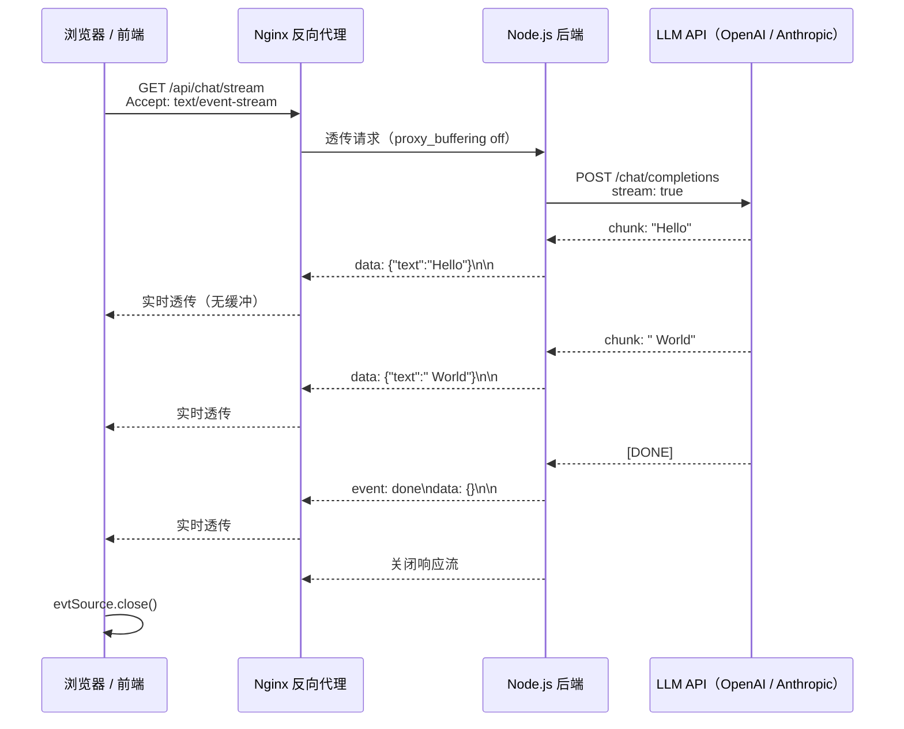

*图：沿 EventSource 与服务端时间线读取 `id/event/data` 事件；断线后顺着 `retry` 和 `Last-Event-ID` 回到重连分支，并留意代理缓冲边界。*

---

SSE（Server-Sent Events）是构建 LLM 流式输出服务的事实标准——ChatGPT、Claude、Gemini 的逐 token 打字机效果，底层几乎无一例外地使用了 SSE。理解 SSE 协议细节与服务端实现，是 AI/Agent 后端工程师的必备技能。

## SSE 协议本质

SSE 的事件流仍运行在 HTTP 响应之上，状态码、字段和缓存含义遵循 [RFC 9110](https://www.rfc-editor.org/rfc/rfc9110.html)；`text/event-stream` 的解析与自动重连则由 HTML 标准规定。


SSE 使用一个可长期保持的 HTTP 响应，响应头声明 `Content-Type: text/event-stream`，服务端以纯文本格式持续写入事件，浏览器 `EventSource` 增量消费。连接仍可能因服务端结束、超时或网络故障关闭，客户端再按标准规则决定是否重连。

### 数据帧格式

每条事件由若干字段行组成，以**空行（`\n\n`）** 作为事件终止标志：

```
id: 42
event: token
data: {"text": "Hello"}

id: 43
event: token
data: {"text": " World"}

: 这是注释行，客户端忽略，常用于心跳保活

retry: 3000

```

四个字段含义：

| 字段 | 是否必填 | 说明 |
|------|----------|------|
| `data` | 必填 | 消息正文，多行时每行写一个 `data:` |
| `event` | 可选 | 自定义事件类型，默认为 `message` |
| `id` | 可选 | 事件 ID，断线重连时作为 `Last-Event-ID` 头发送 |
| `retry` | 可选 | 重连等待毫秒数，服务端可动态调整客户端重连间隔 |

**注意**：每行必须以 `\n` 结尾，事件块以 `\n\n`（即额外一个空行）结束，这是最常见的初学者踩坑点。

---

## 浏览器 EventSource API（TypeScript）

```typescript
// 建立 SSE 连接
const evtSource = new EventSource('/api/chat/stream', {
  withCredentials: true, // 跨域时携带 cookie
});

// 监听默认 message 事件
evtSource.addEventListener('message', (e: MessageEvent) => {
  const payload = JSON.parse(e.data) as { text: string };
  appendToUI(payload.text);
});

// 监听自定义 event 类型（如 Agent 思考步骤）
evtSource.addEventListener('thought', (e: MessageEvent) => {
  const thought = JSON.parse(e.data) as { step: string; content: string };
  renderThoughtBubble(thought);
});

// 监听 done 事件，主动关闭连接
evtSource.addEventListener('done', () => {
  evtSource.close();
  markGenerationComplete();
});

evtSource.addEventListener('error', (e: Event) => {
  if (evtSource.readyState === EventSource.CLOSED) {
    console.warn('连接已关闭，浏览器将按 retry 间隔自动重连');
  }
});
```

`EventSource` 的关键特性：
- **自动重连**：连接断开后浏览器自动重连，默认间隔约 3 秒，可由 `retry:` 字段覆盖
- **Last-Event-ID 续传**：重连请求自动携带 `Last-Event-ID` 请求头，服务端可据此从断点处续发
- **仅支持 GET**：原生 API 不支持 POST 请求体；需要传参时，可改用 `fetch` + `ReadableStream` 手动解析

---

## SSE vs WebSocket vs 长轮询（Long Polling）

| 维度 | SSE | WebSocket | Long Polling |
|------|-----|-----------|--------------|
| 通信方向 | 单向（Server → Client） | 双向 | 单向（模拟） |
| 协议层 | 纯 HTTP/1.1 或 HTTP/2 | 独立 TCP（Upgrade） | HTTP |
| 浏览器自动重连 | 是（内置） | 否（需手动实现） | 否（需手动循环） |
| 代理/防火墙兼容 | 优（标准 HTTP） | 需额外配置 | 优 |
| 服务端实现复杂度 | 低 | 中 | 低 |
| 连接数开销 | 中（长连接） | 中（长连接） | 高（反复建连） |
| 典型场景 | LLM 流式输出、通知推送、进度条 | 实时聊天、在线游戏 | 低频状态轮询 |

**选型建议**：凡是"服务端持续向客户端推数据、客户端不需要频繁反向发送消息"的场景，优先选 SSE——协议简单、天然重连、HTTP 兼容性最佳，LLM 流式输出是其黄金用例。

---

## SSE 连接建立与 LLM Token 流式推送时序



---

## 服务端实现：NestJS + Express（TypeScript）

### 基础 SSE 响应骨架

```typescript
// events.controller.ts
import { Controller, Get, Req, Res } from '@nestjs/common';
import { Request, Response } from 'express';

@Controller('events')
export class EventsController {
  @Get('stream')
  async streamEvents(@Res() res: Response, @Req() req: Request) {
    // 必须的响应头三件套
    res.setHeader('Content-Type', 'text/event-stream');
    res.setHeader('Cache-Control', 'no-cache');
    res.setHeader('Connection', 'keep-alive');
    // 通知 Nginx 禁用缓冲（见后文 Nginx 配置章节）
    res.setHeader('X-Accel-Buffering', 'no');
    res.flushHeaders(); // 立即发送响应头，不等待第一条数据

    let eventId = 0;

    const sendEvent = (eventType: string, data: unknown) => {
      res.write(`id: ${++eventId}\n`);
      res.write(`event: ${eventType}\n`);
      res.write(`data: ${JSON.stringify(data)}\n\n`);
    };

    // 心跳注释行，防止代理/防火墙因空闲超时断连
    const heartbeat = setInterval(() => {
      res.write(': heartbeat\n\n');
    }, 15_000);

    // 客户端断开时必须清理，否则 setInterval 持续泄漏
    req.on('close', () => {
      clearInterval(heartbeat);
      res.end();
    });
  }
}
```

### LLM 流式输出核心实现

以下骨架同时覆盖 OpenAI 与 Anthropic SDK 的流式调用模式：

```typescript
import { Controller, Post, Body, Req, Res } from '@nestjs/common';
import { Request, Response } from 'express';
import Anthropic from '@anthropic-ai/sdk';
import OpenAI from 'openai';

@Controller('chat')
export class ChatController {
  private readonly anthropic = new Anthropic();
  private readonly openai = new OpenAI();

  // ---- Anthropic 流式示例 ----
  @Post('anthropic/stream')
  async anthropicStream(
    @Body() body: { prompt: string },
    @Res() res: Response,
    @Req() req: Request,
  ) {
    res.setHeader('Content-Type', 'text/event-stream');
    res.setHeader('Cache-Control', 'no-cache');
    res.setHeader('Connection', 'keep-alive');
    res.setHeader('X-Accel-Buffering', 'no');
    res.flushHeaders();

    const stream = await this.anthropic.messages.stream({
      model: 'claude-opus-4-5',
      max_tokens: 1024,
      messages: [{ role: 'user', content: body.prompt }],
    });

    for await (const event of stream) {
      // 文本 delta 事件
      if (
        event.type === 'content_block_delta' &&
        event.delta.type === 'text_delta'
      ) {
        res.write(`event: token\n`);
        res.write(`data: ${JSON.stringify({ text: event.delta.text })}\n\n`);
      }
    }

    res.write('event: done\ndata: {}\n\n');
    res.end();

    // 客户端提前断开时取消上游请求，避免浪费 LLM token
    req.on('close', () => stream.abort());
  }

  // ---- OpenAI 流式示例 ----
  @Post('openai/stream')
  async openaiStream(
    @Body() body: { prompt: string },
    @Res() res: Response,
    @Req() req: Request,
  ) {
    res.setHeader('Content-Type', 'text/event-stream');
    res.setHeader('Cache-Control', 'no-cache');
    res.setHeader('Connection', 'keep-alive');
    res.setHeader('X-Accel-Buffering', 'no');
    res.flushHeaders();

    const stream = await this.openai.chat.completions.create({
      model: 'gpt-4o',
      messages: [{ role: 'user', content: body.prompt }],
      stream: true,
    });

    for await (const chunk of stream) {
      const delta = chunk.choices[0]?.delta?.content ?? '';
      if (delta) {
        res.write(`event: token\n`);
        res.write(`data: ${JSON.stringify({ text: delta })}\n\n`);
      }
    }

    res.write('event: done\ndata: {}\n\n');
    res.end();

    req.on('close', () => stream.controller.abort());
  }
}
```

**Agent 扩展**：在 Agent 场景中，除了 `token` 事件，还可以自定义事件类型：

```typescript
// Agent 思考步骤实时推送
res.write(`event: thought\n`);
res.write(`data: ${JSON.stringify({ step: 'planning', content: '分析用户意图…' })}\n\n`);

// 工具调用开始
res.write(`event: tool_call\n`);
res.write(`data: ${JSON.stringify({ tool: 'web_search', input: 'SSE specification' })}\n\n`);

// 工具调用结果
res.write(`event: tool_result\n`);
res.write(`data: ${JSON.stringify({ tool: 'web_search', output: '…搜索结果…' })}\n\n`);
```

前端监听对应 `event` 类型，即可实现 Agent 思考链（Chain-of-Thought）的实时可视化，显著改善用户等待体验。

---

## 断线重连与 Last-Event-ID 续传

[HTML Server-sent Events 标准](https://html.spec.whatwg.org/multipage/server-sent-events.html) 定义 EventSource 状态、事件流解析、`retry`、自动重连和 `Last-Event-ID`；连接可能因网络或服务端结束而关闭，并非“永不关闭”。


浏览器在 SSE 断线后自动重连，重连请求会携带 `Last-Event-ID` 请求头：

```typescript
@Get('stream')
async streamWithResume(@Req() req: Request, @Res() res: Response) {
  // 读取客户端上次收到的最后事件 ID
  const lastEventId = req.headers['last-event-id'] as string | undefined;
  const startFromId = lastEventId ? parseInt(lastEventId, 10) + 1 : 0;

  res.setHeader('Content-Type', 'text/event-stream');
  res.setHeader('Cache-Control', 'no-cache');
  res.setHeader('retry', '3000'); // 建议重连间隔 3 秒
  res.flushHeaders();

  // 从 startFromId 处开始补发历史消息（适用于通知/日志场景）
  const missedEvents = await this.eventStore.getFrom(startFromId);
  for (const event of missedEvents) {
    res.write(`id: ${event.id}\nevent: ${event.type}\ndata: ${event.payload}\n\n`);
  }

  // 继续推送后续事件…
}
```

> LLM 流式输出通常**不需要断点续传**——用户重连后重新发起请求即可；断点续传更适合通知系统、日志流等有持久化存储的场景。

---

## Nginx 反向代理配置

Nginx 默认开启响应体缓冲（`proxy_buffering on`），会将后端数据积攒到足够大的 buffer 才一次性发给客户端，导致 SSE 的 token 无法实时到达，这是生产环境最高频的 SSE 故障。

```nginx
# /etc/nginx/sites-available/your-app.conf

server {
    listen 80;
    server_name api.example.com;

    location /api/chat/stream {
        proxy_pass http://backend:3000;

        # 关键：关闭缓冲，SSE 数据实时透传
        proxy_buffering off;
        proxy_cache off;

        # 保持长连接
        proxy_http_version 1.1;
        proxy_set_header Connection '';

        # 防止代理 60s 超时断连（LLM 推理可能较慢）
        proxy_read_timeout 300s;
        proxy_send_timeout 300s;

        # 透传必要请求头
        proxy_set_header Host $host;
        proxy_set_header X-Real-IP $remote_addr;
    }
}
```

除 Nginx 配置外，服务端响应头也可设置 `X-Accel-Buffering: no`，效果等同于 `proxy_buffering off`，适合在代码层面兜底。

---

## Agent 后端意义

在 AI Agent 服务中，SSE 不只是"打字机效果"的实现手段，它直接影响用户对 Agent 智能程度的感知：

- **思考过程可视化**：通过 `event: thought` 实时推送 Agent 的规划步骤，让用户知道 Agent 在"想什么"，降低焦虑感
- **工具调用实时反馈**：`event: tool_call` 和 `event: tool_result` 让用户看到 Agent 正在调用哪些工具、获得了什么结果，提升透明度
- **长任务进度汇报**：对于需要多步骤执行的 Agent 任务（如代码生成、数据分析），SSE 可以实时汇报每个阶段的完成情况，而不是让用户盯着转圈圈等待
- **错误提前感知**：若某个工具调用失败，可立即通过 `event: error` 推送，前端及时展示局部错误，无需等待整个任务结束

---

## 常见误区与最佳实践

### 误区一：Nginx 未关缓冲，token 积攒后一次性推送

**现象**：本地开发正常，部署到带 Nginx 的生产环境后，LLM 响应全部等到生成完才一次性出现。

**修复**：在 Nginx location 块中加 `proxy_buffering off;`，或在服务端响应头中设置 `X-Accel-Buffering: no`。

### 误区二：忘记 `\n\n` 结束符

**现象**：`res.write('data: hello\n')` 写完，客户端收不到任何事件。

**原因**：SSE 协议规定事件块必须以**两个换行符**（空行）结束，单个 `\n` 只是字段行分隔，不触发事件分发。

**修复**：始终以 `\n\n` 结尾：`res.write('data: hello\n\n')`。

### 误区三：未处理客户端断连导致内存/资源泄漏

**现象**：服务运行数小时后内存持续增长，重启后恢复。

**原因**：客户端关闭标签页或网络断开后，服务端的 `setInterval`（心跳、数据推送）、上游 LLM 请求仍在运行，且持有 `res` 对象引用，无法被 GC。

**修复**：必须监听 `req.on('close', cleanup)`，在回调中清理所有定时器并 `abort()` 上游请求。

### 误区四：用 `res.send()` 或 `res.json()` 发送 SSE

**现象**：调用后连接立即关闭，只收到一条数据。

**原因**：`res.send()` / `res.json()` 会自动关闭响应流，SSE 必须使用 `res.write()` 持续写入 + 最后手动 `res.end()`。

### 最佳实践清单

- `res.flushHeaders()` 在写任何数据前调用，确保响应头立即发送
- 始终设置 `X-Accel-Buffering: no` 作为代码层缓冲兜底
- 心跳注释行（`: heartbeat\n\n`）间隔 15~30 秒，防止代理超时
- 生产环境将 `proxy_read_timeout` 设置为不低于 LLM 最大推理时间
- 使用 `event:` 字段区分不同数据类型（token / thought / tool_call / done / error），前端按类型分别处理，避免所有逻辑堆在 `message` 事件里

---

## 面试常问要点

**Q：SSE 和 WebSocket 如何选型？**

单向推送（通知、进度、LLM 流式输出）优先 SSE——更简单、天然支持自动重连、纯 HTTP 无需协议升级；需要客户端频繁双向通信（实时聊天、在线协同编辑、多人游戏）时用 WebSocket。

**Q：SSE 能穿越代理/防火墙吗？**

由于是标准 HTTP，兼容性优于 WebSocket；但长连接可能被某些代理因空闲超时断开，需要心跳注释行保活，并在代理侧配置足够长的 `read_timeout`。

**Q：浏览器原生 EventSource 不支持 POST，怎么传复杂参数？**

方案一：将参数序列化到 URL query string（GET 请求体积限制约 2~8 KB）。方案二：先用 POST 接口创建一个 session ID，再用 GET + session ID 建立 SSE 连接。方案三：改用 `fetch` + `ReadableStream` 手动实现 SSE 解析，支持任意 HTTP 方法。

**Q：为什么 LLM 流式输出几乎都用 SSE 而不是 WebSocket？**

LLM 推理是典型的"单次请求、持续响应"模型，客户端只需发一次 prompt，服务端持续推送 token，属于单向推送场景。SSE 协议开销更小，浏览器自动重连省去额外实现，且 HTTP/2 下可多路复用——选型上 SSE 占尽优势。

**Q：Last-Event-ID 的工作原理？**

服务端在每个事件帧写 `id: <number>`，浏览器自动记录最后一次收到的 ID。连接断开重连时，浏览器自动在请求头中附带 `Last-Event-ID: <last-id>`，服务端读取此头，从对应 ID 之后的事件续发，实现断点续传。

**Q：SSE 在 HTTP/2 下有什么变化？**

HTTP/2 原生支持多路复用，多个 SSE 流可以在同一个 TCP 连接上并发传输，解决了 HTTP/1.1 下浏览器同源连接数限制（通常 6 个）的问题，在大量并发 Agent 任务的场景下尤为重要。

## 参考资料

- [HTML Standard: Server-sent events](https://html.spec.whatwg.org/multipage/server-sent-events.html)
- [RFC 9110: HTTP Semantics](https://www.rfc-editor.org/rfc/rfc9110.html)
