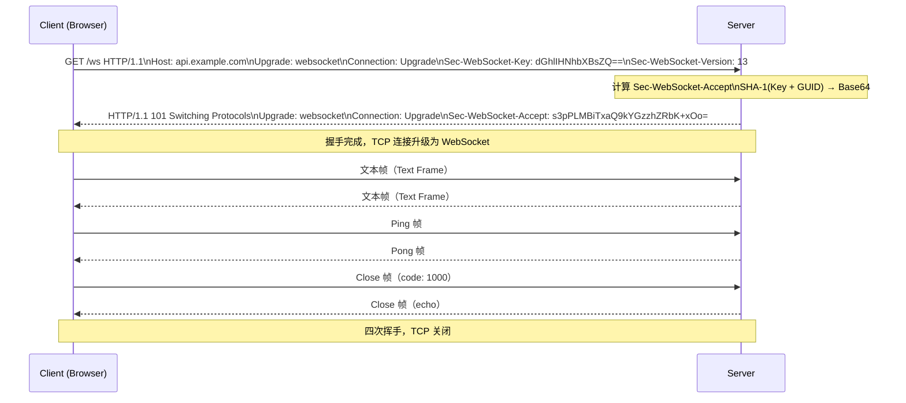
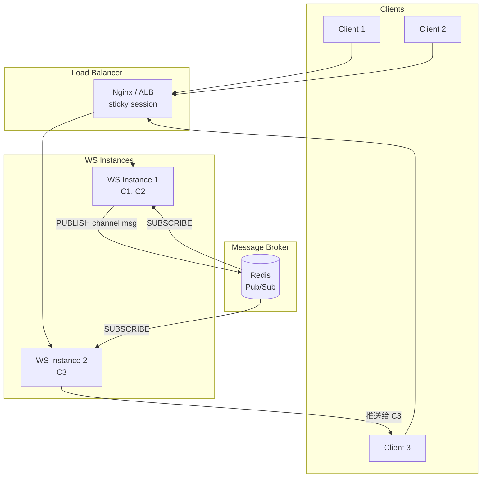

*图：沿图中的节点与箭头阅读，重点是准确描述 HTTP Upgrade 握手、frame、消息分片、ping/pong、关闭握手和应用层背压。*

---

WebSocket 是建立在 TCP 之上的全双工通信协议，通过 HTTP 握手升级后在客户端与服务端之间交换独立消息。相比应用层轮询，它允许任一端主动发送数据，适用于实时聊天、协同编辑和 Agent 执行状态推送等场景；连接管理、背压与重连仍由应用负责。

## 握手升级（HTTP Upgrade）过程

WebSocket 连接的建立需借助 HTTP/1.1 的协议升级机制。客户端发送一个特殊的 `GET` 请求，携带升级所需的协议头；服务端验证通过后返回 `101 Switching Protocols`，此后该 TCP 连接脱离 HTTP 协议，进入 WebSocket 帧传输模式。（参见 [RFC 6455: The WebSocket Protocol](https://www.rfc-editor.org/rfc/rfc6455.html)）



握手阶段的关键字段：

- `Sec-WebSocket-Key`：客户端随机生成的 16 字节 Base64 字符串，用于防止缓存代理误处理
- `Sec-WebSocket-Accept`：服务端将 Key 拼接 GUID（`258EAFA5-E914-47DA-95CA-C5AB0DC85B11`）后做 SHA-1 + Base64，客户端会校验此值
- `Sec-WebSocket-Protocol`：可选，声明应用层子协议（如 `chat`、`token.xxx`），常用于握手阶段传递认证 Token
- `Sec-WebSocket-Version: 13`：当前唯一正式版本

## 帧结构（Frame）

WebSocket 数据以"帧"为单位传输，每帧包含一个固定格式的二进制头部：

```
 0                   1                   2                   3
 0 1 2 3 4 5 6 7 8 9 0 1 2 3 4 5 6 7 8 9 0 1 2 3 4 5 6 7 8 9 0 1
+-+-+-+-+-------+-+-------------+-------------------------------+
|F|R|R|R| opcode|M| Payload len |    Extended payload length    |
|I|S|S|S|  (4)  |A|     (7)    |             (16/64)           |
|N|V|V|V|       |S|             |                               |
| |1|2|3|       |K|             |                               |
+-+-+-+-+-------+-+-------------+-------------------------------+
```

核心字段说明：

| 字段 | 位数 | 说明 |
|------|------|------|
| `FIN` | 1 bit | 为 1 表示这是消息的最后一帧；分片传输时中间帧为 0 |
| `opcode` | 4 bit | 帧类型，见下表 |
| `MASK` | 1 bit | 客户端→服务端必须为 1（掩码），服务端→客户端为 0 |
| `Payload len` | 7 bit | 0-125 直接表示长度；126 时后 2 字节为实际长度；127 时后 8 字节 |

opcode 取值及含义：

| opcode | 值 | 类型 |
|--------|-----|------|
| `0x0` | 0 | 延续帧（Continuation Frame） |
| `0x1` | 1 | 文本帧（UTF-8 编码） |
| `0x2` | 2 | 二进制帧（Binary Frame） |
| `0x8` | 8 | 关闭帧（Close Frame） |
| `0x9` | 9 | Ping 帧 |
| `0xA` | 10 | Pong 帧 |

## WebSocket vs SSE vs 轮询

浏览器侧的 [WHATWG WebSockets Standard](https://websockets.spec.whatwg.org/) 定义了连接状态、`send()`、`bufferedAmount` 与关闭算法；`bufferedAmount` 只能用于观察排队字节，应用仍需自行设计背压阈值。


三种实时通信方案覆盖不同的工程场景，选型前需明确通信方向和复杂度预算：

| 维度 | WebSocket | SSE（Server-Sent Events） | 长轮询（Long Polling） |
|------|-----------|--------------------------|----------------------|
| 通信方向 | 全双工（双向） | 单向（服务端→客户端） | 模拟单向推送 |
| 协议 | ws:// / wss:// | HTTP/1.1、HTTP/2 | HTTP/1.1 |
| 浏览器支持 | IE10+，全现代浏览器 | IE 不支持，现代浏览器全支持 | 全支持 |
| 自动重连 | 需手动实现 | 浏览器原生支持 | 需手动实现 |
| 消息格式 | 文本 / 二进制 | 纯文本（`text/event-stream`） | 任意 HTTP 响应体 |
| 服务端复杂度 | 中（需维护长连接状态） | 低（普通 HTTP 响应流） | 低 |
| 水平扩展 | 难（有状态连接，需 Pub/Sub） | 较难（同上） | 相对易（无状态） |
| 适用场景 | 聊天、游戏、协同编辑、Agent 双向交互 | 通知推送、日志流、Agent 步骤进度 | 偶发性低频更新 |
| 代理/防火墙穿透 | 有时被企业防火墙阻断 | 纯 HTTP，穿透性最好 | 纯 HTTP，穿透性最好 |

**选型建议**：只需服务端推送时优先选 SSE（更简单、HTTP/2 下可多路复用）；需要客户端也主动发送实时数据时选 WebSocket；轮询仅用于遗留兼容场景。

## 服务端实现：Node.js ws 库 + TypeScript

`ws` 是 Node.js 生态最轻量的原生 WebSocket 库，零抽象层、低开销，适合对性能敏感的 Agent 后端。

```typescript
import { WebSocketServer, WebSocket, RawData } from 'ws';
import { IncomingMessage } from 'http';
import { parse } from 'url';
import { verify, JwtPayload } from 'jsonwebtoken';

interface Client {
  ws: WebSocket;
  id: string;
  userId?: string;
  isAlive: boolean;
}

const clients = new Map<string, Client>();

const wss = new WebSocketServer({ port: 8080 });

function requiredEnv(name: string): string {
  const value = process.env[name];
  if (!value) throw new Error(`Missing required environment variable: ${name}`);
  return value;
}

const jwtConfig = {
  secret: requiredEnv('JWT_SECRET'),
  issuer: requiredEnv('JWT_ISSUER'),
  audience: requiredEnv('JWT_AUDIENCE'),
};

function verifyJwt(token: string): string | null {
  try {
    const payload = verify(token, jwtConfig.secret, {
      algorithms: ['HS256'],
      issuer: jwtConfig.issuer,
      audience: jwtConfig.audience,
    });

    if (typeof payload === 'string') return null;
    const { sub } = payload as JwtPayload;
    return typeof sub === 'string' && sub.length > 0 ? sub : null;
  } catch {
    // 过期、签名不匹配、issuer/audience 错误都按未认证处理。
    return null;
  }
}

// ── 认证：从 query param 中读取 token ──────────────────────────────
function authenticate(req: IncomingMessage): string | null {
  const { query } = parse(req.url ?? '', true);
  const token = query.token as string | undefined;
  if (!token) return null;
  return verifyJwt(token);
}

wss.on('connection', (ws: WebSocket, req: IncomingMessage) => {
  const userId = authenticate(req);
  if (!userId) {
    ws.close(4001, 'Unauthorized');
    return;
  }

  const clientId = crypto.randomUUID();
  const client: Client = { ws, id: clientId, userId, isAlive: true };
  clients.set(clientId, client);

  console.log(`[WS] Client connected: ${clientId}, user: ${userId}`);

  // ── 消息处理 ───────────────────────────────────────────────────────
  ws.on('message', (raw: RawData) => {
    try {
      const msg = JSON.parse(raw.toString());
      handleMessage(client, msg);
    } catch {
      ws.send(JSON.stringify({ type: 'error', message: 'Invalid JSON' }));
    }
  });

  // ── Pong 响应：标记客户端仍然存活 ──────────────────────────────────
  ws.on('pong', () => {
    client.isAlive = true;
  });

  ws.on('close', (code, reason) => {
    clients.delete(clientId);
    console.log(`[WS] Client disconnected: ${clientId}, code: ${code}`);
  });

  ws.on('error', (err) => {
    console.error(`[WS] Error for ${clientId}:`, err.message);
  });

  // 发送欢迎消息
  ws.send(JSON.stringify({ type: 'connected', clientId }));
});

function handleMessage(client: Client, msg: Record<string, unknown>) {
  switch (msg.type) {
    case 'ping':
      client.ws.send(JSON.stringify({ type: 'pong' }));
      break;
    case 'broadcast':
      broadcast(msg, client.id);
      break;
    default:
      console.log(`[WS] Unknown message type: ${msg.type}`);
  }
}

function broadcast(msg: unknown, excludeId?: string) {
  const payload = JSON.stringify(msg);
  for (const [id, client] of clients) {
    if (id !== excludeId && client.ws.readyState === WebSocket.OPEN) {
      client.ws.send(payload);
    }
  }
}
```

## 心跳机制（Ping/Pong）

代理服务器（Nginx、AWS ALB 等）通常会在连接无数据传输超过一定时间后主动断开（默认 60s）。WebSocket 协议内置了 Ping/Pong 控制帧，由服务端定期发送 Ping，客户端必须立即回复 Pong。

```typescript
// 服务端：定时心跳检测（基于上面的 clients Map）
const HEARTBEAT_INTERVAL = 30_000; // 30 秒

const heartbeatTimer = setInterval(() => {
  for (const [id, client] of clients) {
    if (!client.isAlive) {
      // 上一个周期内未收到 Pong，判定为失活
      console.warn(`[WS] Client ${id} timed out, terminating`);
      client.ws.terminate(); // 强制关闭，不发 Close 帧
      clients.delete(id);
      continue;
    }
    client.isAlive = false;    // 重置标志
    client.ws.ping();          // 发送 WS 协议级 Ping 帧
  }
}, HEARTBEAT_INTERVAL);

wss.on('close', () => clearInterval(heartbeatTimer));
```

客户端浏览器 API 不暴露协议级 Ping/Pong，通常改为应用层心跳（发送 `{ type: "ping" }` JSON 消息），服务端回复 `{ type: "pong" }`。

## 认证：握手阶段 Token 验证

WebSocket 握手本质上是一次 HTTP 请求，有两种主流认证方式：

**方式一：Query Parameter（简单，但 Token 会出现在 URL 日志）**

```typescript
// 客户端
const token = localStorage.getItem('access_token');
const ws = new WebSocket(`wss://api.example.com/ws?token=${token}`);

// 服务端（握手阶段）
wss.on('connection', (ws, req) => {
  const { query } = parse(req.url ?? '', true);
  const userId = verifyJwt(query.token as string);
  if (!userId) { ws.close(4001, 'Unauthorized'); return; }
});
```

**方式二：Sec-WebSocket-Protocol 子协议头（Token 不进入 URL）**

```typescript
// 客户端：将 token 作为子协议名传递（RFC 6455 允许自定义子协议）
const ws = new WebSocket('wss://api.example.com/ws', [`token.${accessToken}`]);

// 服务端
import { createServer } from 'http';

const server = createServer();
const wss = new WebSocketServer({ noServer: true });

server.on('upgrade', (req, socket, head) => {
  const protocols = req.headers['sec-websocket-protocol']?.split(', ') ?? [];
  const tokenProto = protocols.find((p) => p.startsWith('token.'));
  const token = tokenProto?.replace('token.', '');
  const userId = token ? verifyJwt(token) : null;

  if (!userId) {
    socket.write('HTTP/1.1 401 Unauthorized\r\n\r\n');
    socket.destroy();
    return;
  }

  wss.handleUpgrade(req, socket, head, (ws) => {
    wss.emit('connection', ws, req, { userId });
  });
});
```

两种方式对比：Query Param 实现简单但 Token 会落入 Nginx 访问日志；子协议方式安全性更好，是生产环境推荐做法。

## 水平扩展：多实例 Pub/Sub（Redis Adapter）

WebSocket 连接是有状态的——每个客户端只连接到某一个服务实例。当服务水平扩展至多个实例时，实例 A 上的连接无法直接收到实例 B 发出的消息，必须引入中间层做消息广播。



**Socket.IO + Redis Adapter 实现**

```typescript
import { createClient } from 'redis';
import { Server } from 'socket.io';
import { createAdapter } from '@socket.io/redis-adapter';

const pubClient = createClient({ url: 'redis://localhost:6379' });
const subClient = pubClient.duplicate();

await Promise.all([pubClient.connect(), subClient.connect()]);

const io = new Server(httpServer, { cors: { origin: '*' } });
io.adapter(createAdapter(pubClient, subClient));

// 此后 io.to(roomId).emit(...) 会自动通过 Redis 广播到所有实例
io.on('connection', (socket) => {
  socket.on('join', (roomId: string) => socket.join(roomId));
  socket.on('message', ({ roomId, content }) => {
    io.to(roomId).emit('message', { content, from: socket.id });
  });
});
```

**原生 ws + Redis 手动实现**

```typescript
import { createClient } from 'redis';

const publisher = createClient({ url: process.env.REDIS_URL });
const subscriber = publisher.duplicate();
await Promise.all([publisher.connect(), subscriber.connect()]);

const CHANNEL = 'ws:broadcast';

// 订阅：收到消息后推送给本实例的所有连接
await subscriber.subscribe(CHANNEL, (message) => {
  const payload = JSON.parse(message);
  for (const client of clients.values()) {
    if (client.ws.readyState === WebSocket.OPEN) {
      client.ws.send(JSON.stringify(payload));
    }
  }
});

// 发布：将消息发布到 Redis，所有实例都会收到
function publishToAll(data: unknown) {
  publisher.publish(CHANNEL, JSON.stringify(data));
}
```

注意：负载均衡器需开启 **Sticky Session**（IP Hash 或 Cookie），确保同一客户端的 HTTP 握手请求与后续 WebSocket 帧路由到同一实例。

## Socket.IO 与原生 ws 的取舍

| 维度 | 原生 ws | Socket.IO |
|------|---------|-----------|
| 包大小（客户端） | 无额外包 | ~40KB（含 engine.io） |
| 自动重连 | 需手动实现 | 内置，指数退避 |
| 房间 / 命名空间 | 需自行管理 Map | 内置 Room + Namespace |
| 降级兼容 | 不支持（无 WS 则失败） | 自动降级为 Long Polling |
| 二进制支持 | 原生支持 | 支持，但包一层协议头 |
| Redis 扩展 | 需手写 Pub/Sub | 官方 Adapter，开箱即用 |
| 协议开销 | 最小 | 有 Socket.IO 协议包装 |
| 适用场景 | 高性能、自控协议（Agent、游戏） | 快速落地、需要房间管理 |

**结论**：团队初期、功能优先选 Socket.IO；对延迟敏感或需要自定义协议（如 Agent 的 JSON-RPC over WS）时选原生 `ws`。

## 对 Agent 后端的意义

WebSocket 是 AI Agent 后端实时交互的核心通道，典型场景包括：

**1. Agent 执行步骤实时推送**

```typescript
// Agent 执行器每完成一个步骤，立即推送给前端
async function runAgent(agentId: string, input: string, clientId: string) {
  const client = clients.get(clientId);
  if (!client) return;

  const push = (event: string, data: unknown) => {
    client.ws.send(JSON.stringify({ event, agentId, data }));
  };

  push('agent:start', { input });

  for await (const step of agent.stream(input)) {
    push('agent:step', {
      type: step.type,          // 'thought' | 'tool_call' | 'tool_result'
      content: step.content,
      toolName: step.toolName,
    });
  }

  push('agent:done', { output: agent.finalAnswer });
}
```

**2. 多智能体状态同步**

多个 Agent 并行执行时，通过 WebSocket + Redis Pub/Sub 将各 Agent 的状态变更实时广播给订阅了该任务的所有前端客户端，实现任务看板的实时更新。

**3. 双向交互（Human-in-the-Loop）**

Agent 执行过程中如需用户确认（如调用高风险工具），通过 WebSocket 向前端发送 `agent:approval_required` 事件，用户点击确认后客户端发回 `user:approve`，Agent 恢复执行——这种交互模式用 HTTP 难以优雅实现。

## 常见误区与最佳实践

**误区一：不实现断线重连**

`close` 事件触发时不做任何处理，导致网络抖动后连接永久断开。应实现带指数退避的重连逻辑，避免重连风暴。

**误区二：无心跳，依赖代理服务器保活**

Nginx 默认 `proxy_read_timeout 60s`，AWS ALB 默认 idle timeout 60s。若连接无数据传输，代理会静默关闭 TCP 连接，而客户端和服务端都不会收到通知。务必在 30s 内发送 Ping/Pong 或应用层心跳。

**误区三：不做消息大小限制**

恶意客户端发送超大消息（如 100MB JSON）会打满服务内存。`ws` 库通过 `maxPayload` 选项限制：

```typescript
const wss = new WebSocketServer({ port: 8080, maxPayload: 1024 * 1024 }); // 1MB
```

**误区四：在握手前连接已建立时才做认证**

连接建立后再发消息认证会有一个短暂的"未授权窗口"。应在 `upgrade` 事件（握手阶段）完成认证，认证失败直接拒绝升级，不建立 WebSocket 连接。

**误区五：忽略 Close Frame 的状态码**

关闭帧携带数字状态码（1000=正常关闭，1001=离开，4000-4999=应用自定义）。记录并监控异常关闭码（如 4001 认证失败、1006 异常断开）有助于排查问题。

## 面试常问

- **WebSocket 握手过程中 `Sec-WebSocket-Key` 的作用是什么？** 防止缓存代理将 WebSocket 握手请求误作缓存的 HTTP 响应返回，并非用于安全加密；真正的安全靠 TLS（wss://）。

- **为什么客户端发送的帧必须 Mask，而服务端不需要？** RFC 6455 规定，Mask 用于防止代理服务器将 WebSocket 数据误判为 HTTP 响应，从而触发缓存投毒攻击（Cache Poisoning）。服务端→客户端不经过代理，不需要 Mask。

- **WebSocket 和 HTTP/2 Server Push 有什么区别？** HTTP/2 Server Push 是服务端在响应主请求时预先推送关联资源（CSS、JS），浏览器已逐渐废弃该特性；WebSocket 是持久的全双工通道，两者应用场景完全不同。

- **如何防止 WebSocket 跨站攻击（CSWSH）？** 握手阶段校验 `Origin` 头，只允许可信域名建立连接；配合 Token 认证，避免纯 Cookie 认证（Cookie 会自动随 WS 握手请求发送）。

- **Socket.IO 的房间（Room）原理是什么？** 服务端维护一个 `room → Set<socketId>` 的 Map，`emit to room` 时遍历该 Set 逐个推送；Redis Adapter 将这个 Map 同步到 Redis，使多实例共享房间状态。

- **WebSocket 在 HTTP/2 下如何工作？** RFC 8441 定义了 WebSocket over HTTP/2（使用 `CONNECT` 方法在 HTTP/2 流上建立 WebSocket），可复用 HTTP/2 连接、节省端口，但目前生产环境多数仍走 HTTP/1.1 升级。

## 参考资料

- [RFC 6455: The WebSocket Protocol](https://www.rfc-editor.org/rfc/rfc6455.html)
- [WHATWG WebSockets Standard](https://websockets.spec.whatwg.org/)
