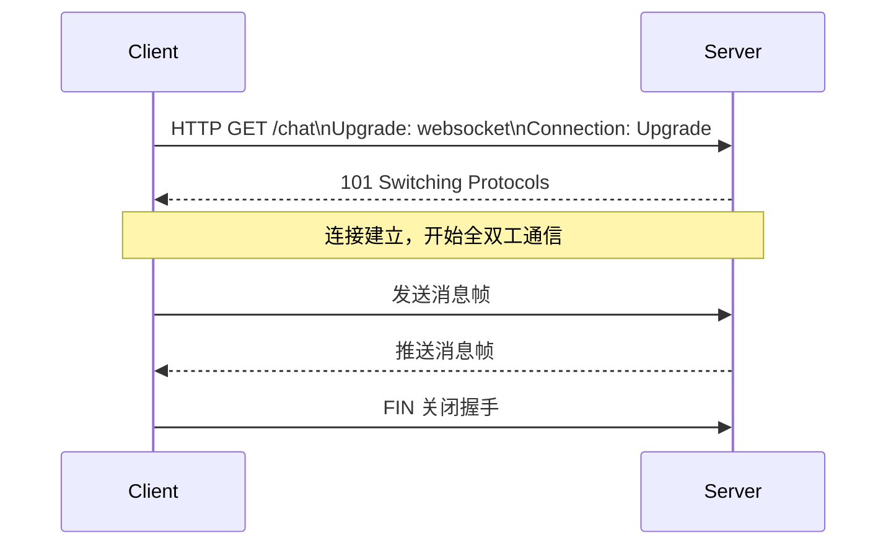

# WebSocket 实时通信

WebSocket 是一种在单个 TCP 连接上提供全双工通信的协议，解决了 HTTP 轮询的效率问题，是实现实时功能（聊天、协同编辑、实时推送）的核心技术。

## WebSocket 与 HTTP 的关系

WebSocket 借助 HTTP 完成握手升级，之后脱离 HTTP 成为独立的持久连接。



握手请求关键头：
- `Upgrade: websocket`
- `Connection: Upgrade`
- `Sec-WebSocket-Key`：客户端随机生成的 Base64 字符串
- `Sec-WebSocket-Version: 13`

服务端响应 `101 Switching Protocols` 后，连接升级完成。

## 浏览器端 WebSocket API

```typescript
// 建立连接
const ws = new WebSocket('wss://api.example.com/ws');
// wss:// 是加密连接（类似 https），ws:// 是明文

// 连接成功
ws.addEventListener('open', () => {
  console.log('连接已建立');
  ws.send(JSON.stringify({ type: 'auth', token: 'xxx' }));
});

// 接收消息
ws.addEventListener('message', (event) => {
  const data = JSON.parse(event.data);
  console.log('收到消息:', data);
});

// 连接关闭
ws.addEventListener('close', (event) => {
  console.log(`连接关闭，code: ${event.code}, reason: ${event.reason}`);
  // 实现自动重连
  setTimeout(() => reconnect(), 3000);
});

// 错误处理
ws.addEventListener('error', (error) => {
  console.error('WebSocket 错误:', error);
});

// 发送消息
function sendMessage(content: string) {
  if (ws.readyState === WebSocket.OPEN) {
    ws.send(JSON.stringify({ type: 'message', content }));
  }
}

// 主动关闭
ws.close(1000, '用户离开');
```

`readyState` 枚举：`CONNECTING(0)` / `OPEN(1)` / `CLOSING(2)` / `CLOSED(3)`。

## NestJS 服务端实现

```typescript
// chat.gateway.ts
import {
  WebSocketGateway, WebSocketServer,
  SubscribeMessage, ConnectedSocket,
  MessageBody, OnGatewayConnection, OnGatewayDisconnect
} from '@nestjs/websockets';
import { Server, Socket } from 'socket.io';

@WebSocketGateway({ cors: { origin: '*' }, namespace: '/chat' })
export class ChatGateway implements OnGatewayConnection, OnGatewayDisconnect {
  @WebSocketServer()
  server: Server;

  // 连接建立
  handleConnection(client: Socket) {
    console.log(`客户端连接: ${client.id}`);
  }

  // 连接断开
  handleDisconnect(client: Socket) {
    console.log(`客户端断开: ${client.id}`);
  }

  // 监听客户端事件
  @SubscribeMessage('joinRoom')
  handleJoinRoom(
    @ConnectedSocket() client: Socket,
    @MessageBody() roomId: string,
  ) {
    client.join(roomId);
    client.emit('joinedRoom', { roomId });
  }

  @SubscribeMessage('sendMessage')
  handleMessage(
    @ConnectedSocket() client: Socket,
    @MessageBody() payload: { roomId: string; content: string },
  ) {
    const message = {
      id: Date.now(),
      content: payload.content,
      senderId: client.id,
      timestamp: new Date().toISOString(),
    };
    // 向房间内所有人广播（包括发送者）
    this.server.to(payload.roomId).emit('newMessage', message);
  }

  // 服务端主动推送（可在其他 Service 中注入 ChatGateway 调用）
  broadcastToRoom(roomId: string, event: string, data: unknown) {
    this.server.to(roomId).emit(event, data);
  }
}
```

NestJS 的 WebSocket Gateway 底层默认使用 Socket.IO，也支持原生 `ws` 库（通过 `WsAdapter`）。

## 心跳检测与断线重连

WebSocket 连接可能因网络抖动而静默断开，需要心跳机制检测存活状态：

```typescript
// 客户端心跳
class WebSocketClient {
  private ws: WebSocket | null = null;
  private heartbeatTimer: ReturnType<typeof setInterval> | null = null;
  private reconnectTimer: ReturnType<typeof setTimeout> | null = null;

  connect(url: string) {
    this.ws = new WebSocket(url);
    this.ws.addEventListener('open', () => this.startHeartbeat());
    this.ws.addEventListener('close', () => this.scheduleReconnect(url));
    this.ws.addEventListener('message', (e) => this.handleMessage(e));
  }

  private startHeartbeat() {
    this.heartbeatTimer = setInterval(() => {
      if (this.ws?.readyState === WebSocket.OPEN) {
        this.ws.send(JSON.stringify({ type: 'ping' }));
      }
    }, 30000); // 每 30 秒发送心跳
  }

  private scheduleReconnect(url: string) {
    if (this.heartbeatTimer) clearInterval(this.heartbeatTimer);
    this.reconnectTimer = setTimeout(() => this.connect(url), 3000);
  }

  private handleMessage(event: MessageEvent) {
    const data = JSON.parse(event.data);
    if (data.type === 'pong') return; // 心跳响应，忽略
    // 处理业务消息...
  }
}
```

## 适用场景对比

| 场景 | 推荐方案 | 原因 |
|------|----------|------|
| 聊天室、多人游戏 | WebSocket | 需要双向实时通信 |
| 通知推送、进度更新 | SSE | 只需服务端推送，更简单 |
| 实时协同编辑 | WebSocket | 需要双向低延迟同步 |
| 偶发性状态更新 | Long Polling | 实现简单，不需要持久连接 |

## 面试常问

- **WebSocket 和 HTTP 轮询的区别？**
  HTTP 轮询由客户端定时发起请求，有延迟且浪费资源（每次请求都有 HTTP 头开销）；WebSocket 一次握手后保持持久连接，服务端可主动推送，延迟低、开销小。
- **WebSocket 如何保证消息顺序？**
  TCP 层保证消息有序到达；如需业务层序号（如网络重连后补发），需在消息体中加 `seq` 字段自行管理。
- **wss 和 ws 的区别？**
  wss 是 WebSocket over TLS，数据加密传输，类似 https；生产环境应始终使用 wss。
- **Socket.IO 和原生 WebSocket 的区别？**
  Socket.IO 是封装层，提供房间、命名空间、自动重连、降级兼容（旧浏览器降级为 Long Polling）等特性，代价是增加了协议层开销。
