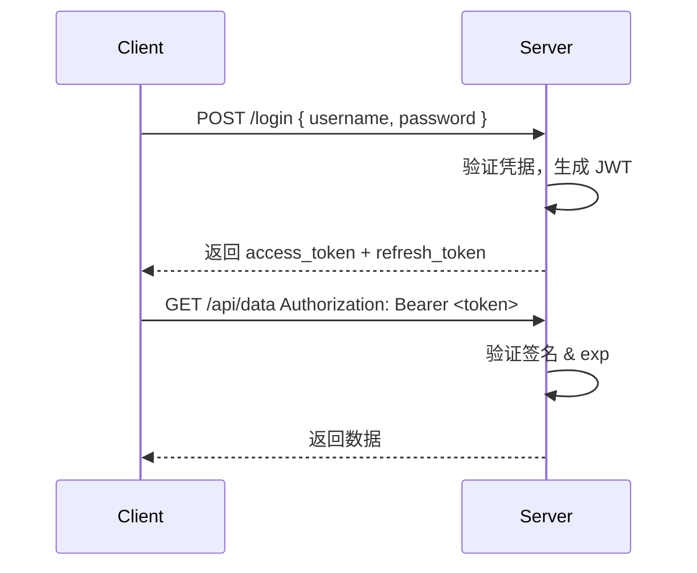

# JWT 认证机制深度解析

JWT（JSON Web Token）是目前最流行的无状态认证方案，广泛应用于前后端分离、微服务及移动端场景。理解它的结构与安全边界，是后端开发的必备技能。

## JWT 的结构

JWT 由三段 Base64URL 编码的字符串组成，用 `.` 分隔：

```
Header.Payload.Signature
```

**Header**：声明算法类型

```json
{
  "alg": "HS256",
  "typ": "JWT"
}
```

**Payload**：存放声明（Claims），分为注册声明（iss/sub/exp/iat 等）和自定义声明。

**Signature**：用密钥对 `Base64URL(header) + "." + Base64URL(payload)` 进行签名，防止篡改。

> 注意：Payload 只是 Base64URL 编码，并非加密，**不要在其中存放敏感信息**（如密码、银行卡号）。

## 认证流程



## Node.js 实现示例

使用 `jsonwebtoken` 库（以 TypeScript 为例）：

```ts
import jwt from 'jsonwebtoken';

const ACCESS_SECRET = process.env.JWT_ACCESS_SECRET!;
const REFRESH_SECRET = process.env.JWT_REFRESH_SECRET!;

// 签发 Access Token（短期，15 分钟）
export function signAccessToken(userId: string): string {
  return jwt.sign({ sub: userId }, ACCESS_SECRET, { expiresIn: '15m' });
}

// 签发 Refresh Token（长期，7 天）
export function signRefreshToken(userId: string): string {
  return jwt.sign({ sub: userId }, REFRESH_SECRET, { expiresIn: '7d' });
}

// 验证 Access Token
export function verifyAccessToken(token: string): { sub: string } {
  return jwt.verify(token, ACCESS_SECRET) as { sub: string };
}
```

**中间件校验**：

```ts
import { Request, Response, NextFunction } from 'express';

export function authMiddleware(req: Request, res: Response, next: NextFunction) {
  const authHeader = req.headers.authorization;
  if (!authHeader?.startsWith('Bearer ')) {
    return res.status(401).json({ message: 'Missing token' });
  }
  const token = authHeader.slice(7);
  try {
    const payload = verifyAccessToken(token);
    req.userId = payload.sub;
    next();
  } catch {
    return res.status(401).json({ message: 'Invalid or expired token' });
  }
}
```

## Access Token + Refresh Token 双令牌策略

| 令牌类型 | 有效期 | 用途 |
|---|---|---|
| Access Token | 短（15m–1h） | 请求鉴权，存内存或 sessionStorage |
| Refresh Token | 长（7d–30d） | 换取新 Access Token，存 HttpOnly Cookie |

**刷新逻辑**：

```ts
// POST /auth/refresh
export async function refreshHandler(req: Request, res: Response) {
  const refreshToken = req.cookies.refresh_token; // HttpOnly Cookie
  if (!refreshToken) return res.status(401).end();

  try {
    const payload = jwt.verify(refreshToken, REFRESH_SECRET) as { sub: string };
    // 可在此查数据库确认 refresh token 未被吊销
    const newAccess = signAccessToken(payload.sub);
    return res.json({ access_token: newAccess });
  } catch {
    return res.status(401).json({ message: 'Refresh token invalid' });
  }
}
```

## JWT 吊销问题

JWT 天生无状态，**无法主动失效**。常见解决方案：

1. **短过期时间**：Access Token 15 分钟内自动失效，配合 Refresh Token 续期。
2. **黑名单（Token Denylist）**：在 Redis 存储已登出的 jti（JWT ID），每次验证时查询。
3. **版本号（Token Version）**：用户数据库存 `token_version`，强制下线时递增，Token Payload 携带版本号做比对。

## 安全注意事项

- **算法选择**：生产环境优先选 `RS256`（非对称）而非 `HS256`，私钥签名、公钥验证，各服务无需共享密钥。
- **密钥管理**：密钥应足够随机（≥256 位），通过环境变量或密钥服务注入，绝不硬编码。
- **存储位置**：Access Token 存 `sessionStorage` 或内存；Refresh Token 存 `HttpOnly; Secure; SameSite=Strict` 的 Cookie，防 XSS 窃取。
- **不在 Payload 存密码**：Payload 可被任意解码，只放鉴权所需的最小字段（userId、roles）。

## 面试常问

- **JWT 与 Session 的区别**：Session 服务端存状态（需共享 Session Store），JWT 无状态（适合水平扩展）；JWT 吊销难，Session 删除即失效。
- **HS256 vs RS256**：HS256 是对称 HMAC，所有服务共享同一密钥；RS256 非对称，只有签发方持有私钥，其他服务仅需公钥。
- **如何防止 JWT 被篡改**：签名由密钥生成，修改 Payload 后签名验证失败，服务端拒绝。
- **exp 已过期的 Token 怎么处理**：`jsonwebtoken` 会抛出 `TokenExpiredError`，应返回 401 并引导客户端用 Refresh Token 换新 Token。
