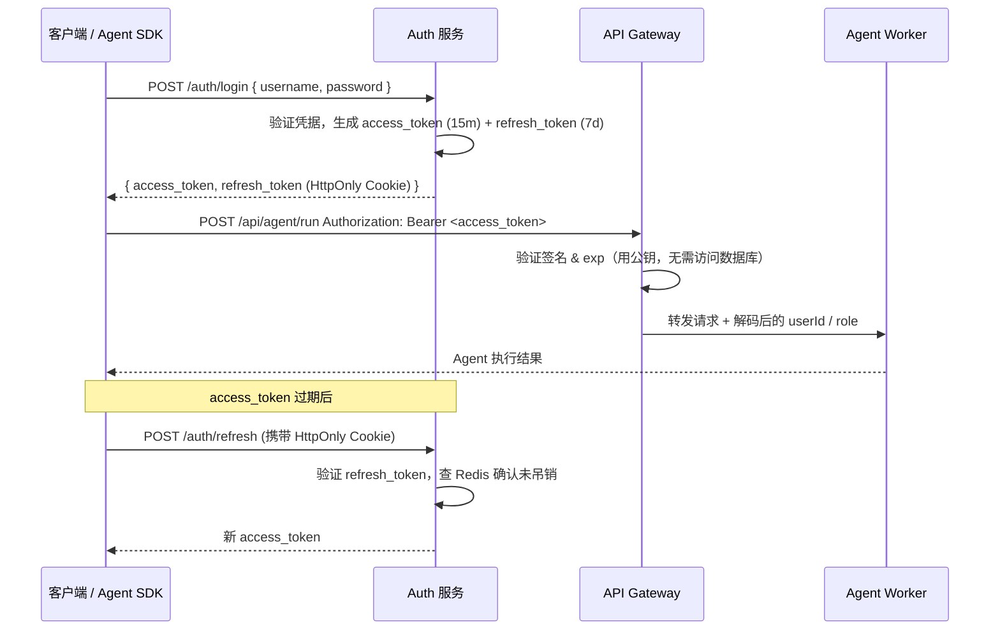

JWT（JSON Web Token）是目前最主流的无状态认证方案，在前后端分离、微服务、移动端乃至 AI Agent 服务中被广泛采用。掌握它的结构细节与安全边界，是构建可信赖后端服务的必备基础。

## JWT 的结构详解

JWT 由三段 Base64URL 编码的字符串拼接而成，用 `.` 分隔：

```
eyJhbGciOiJSUzI1NiIsInR5cCI6IkpXVCJ9
.eyJzdWIiOiJ1c2VyXzEyMyIsInJvbGUiOiJhZ2VudCIsImV4cCI6MTcxNjAwMDAwMH0
.SflKxwRJSMeKKF2QT4fwpMeJf36POk6yJV_adQssw5c
```

### Header

声明签名算法与 Token 类型：

```json
{
  "alg": "RS256",
  "typ": "JWT"
}
```

### Payload

承载 Claims（声明），分为三类：

- **Registered Claims**（注册声明）：`iss`（签发方）、`sub`（主题/用户ID）、`exp`（过期时间）、`iat`（签发时间）、`jti`（唯一标识，用于吊销）
- **Public Claims**：公开约定的字段，如 `email`、`role`
- **Private Claims**：业务自定义字段，如 `agentQuota`、`tenantId`

```json
{
  "sub": "user_123",
  "iss": "https://api.example.com",
  "iat": 1716000000,
  "exp": 1716000900,
  "jti": "abc-uuid-xyz",
  "role": "agent_user"
}
```

> 关键提示：Payload 仅做 Base64URL **编码**，并非加密。任何人拿到 Token 就能解码读取内容，因此绝对不能存放密码、银行卡号、密钥等敏感数据。

### Signature

服务端用密钥对 `Base64URL(header) + "." + Base64URL(payload)` 进行签名：

```
RSASHA256(
  base64UrlEncode(header) + "." + base64UrlEncode(payload),
  privateKey
)
```

签名保证了 Token 的**完整性**：任何对 Header 或 Payload 的篡改都会导致签名验证失败。

## 签名算法对比

三种主流算法在安全性、性能和适用场景上各有侧重：

| 算法 | 类型 | 密钥 | 适用场景 | 安全性 |
|------|------|------|----------|--------|
| HS256 | 对称（HMAC） | 签名和验证用同一密钥 | 单体应用、内部服务 | 密钥泄露全线崩溃 |
| RS256 | 非对称（RSA） | 私钥签名，公钥验证 | 微服务、跨服务鉴权 | 高，私钥只在签发方 |
| ES256 | 非对称（ECDSA） | 私钥签名，公钥验证 | 对性能有要求的场景 | 高，密钥更短更快 |

**Agent 服务推荐 RS256 或 ES256**：当多个 Agent Worker 节点需要独立验证 Token 时，只需分发公钥，私钥由 Auth 服务集中管理，大幅降低密钥泄露风险。

## Token 生命周期

JWT 的生命周期包含四个阶段：**签发 → 传输 → 验证 → 刷新/吊销**。



## Node.js / TypeScript 实现

安装依赖：

```bash
npm install jsonwebtoken
npm install -D @types/jsonwebtoken
```

### 签发 Token

```typescript
import jwt from 'jsonwebtoken';
import { readFileSync } from 'fs';

// RS256：从文件或环境变量加载密钥
const PRIVATE_KEY = readFileSync('./keys/private.pem');
const PUBLIC_KEY = readFileSync('./keys/public.pem');
const REFRESH_SECRET = process.env.JWT_REFRESH_SECRET!;

interface TokenPayload {
  sub: string;
  role: string;
  jti?: string;
}

// 签发 Access Token（短期，15 分钟）
export function signAccessToken(userId: string, role: string): string {
  return jwt.sign(
    { sub: userId, role } satisfies TokenPayload,
    PRIVATE_KEY,
    {
      algorithm: 'RS256',
      expiresIn: '15m',
      issuer: 'https://api.example.com',
      jwtid: crypto.randomUUID(), // jti，用于吊销
    }
  );
}

// 签发 Refresh Token（长期，7 天，使用对称密钥即可）
export function signRefreshToken(userId: string): string {
  return jwt.sign({ sub: userId }, REFRESH_SECRET, {
    expiresIn: '7d',
    jwtid: crypto.randomUUID(),
  });
}

// 验证 Access Token（使用公钥）
export function verifyAccessToken(token: string): TokenPayload {
  return jwt.verify(token, PUBLIC_KEY, {
    algorithms: ['RS256'],    // 明确指定算法，防止 alg:none 攻击
    issuer: 'https://api.example.com',
  }) as TokenPayload;
}
```

### 鉴权中间件

```typescript
import { Request, Response, NextFunction } from 'express';

export function authMiddleware(req: Request, res: Response, next: NextFunction) {
  const authHeader = req.headers.authorization;
  if (!authHeader?.startsWith('Bearer ')) {
    return res.status(401).json({ code: 'MISSING_TOKEN' });
  }

  const token = authHeader.slice(7);
  try {
    const payload = verifyAccessToken(token);
    req.user = { id: payload.sub, role: payload.role };
    next();
  } catch (err) {
    if (err instanceof jwt.TokenExpiredError) {
      return res.status(401).json({ code: 'TOKEN_EXPIRED' });
    }
    return res.status(401).json({ code: 'INVALID_TOKEN' });
  }
}
```

### 保护 Agent API 端点

```typescript
import express from 'express';
import { authMiddleware } from './middleware/auth';

const router = express.Router();

// /api/agent/run 端点：需要有效 JWT 才能触发 Agent 执行
router.post('/api/agent/run', authMiddleware, async (req, res) => {
  const { id: userId, role } = req.user!;

  // 可根据 role 做细粒度鉴权
  if (role !== 'agent_user' && role !== 'admin') {
    return res.status(403).json({ code: 'FORBIDDEN' });
  }

  const result = await runAgentTask({ userId, ...req.body });
  res.json(result);
});
```

## Access Token + Refresh Token 双令牌机制

| 令牌类型 | 有效期 | 存储位置 | 用途 |
|----------|--------|----------|------|
| Access Token | 15m – 1h | 内存 / sessionStorage | 每次请求携带，鉴权入口 |
| Refresh Token | 7d – 30d | HttpOnly Secure Cookie | 仅用于换取新 Access Token |

**刷新端点实现：**

```typescript
export async function refreshHandler(req: Request, res: Response) {
  const refreshToken = req.cookies.refresh_token;
  if (!refreshToken) return res.status(401).end();

  try {
    const payload = jwt.verify(refreshToken, REFRESH_SECRET) as { sub: string; jti: string };

    // 查 Redis：确认此 refresh token 未被加入黑名单
    const isRevoked = await redis.get(`revoked:${payload.jti}`);
    if (isRevoked) return res.status(401).json({ code: 'TOKEN_REVOKED' });

    const newAccessToken = signAccessToken(payload.sub, await getUserRole(payload.sub));
    return res.json({ access_token: newAccessToken });
  } catch {
    return res.status(401).json({ code: 'INVALID_REFRESH_TOKEN' });
  }
}
```

## Token 吊销策略

JWT 无状态天然无法主动失效，以下是三种工程实践：

| 策略 | 实现 | 适用场景 |
|------|------|----------|
| 短过期时间 | Access Token 15 分钟自动失效 | 低风险场景，依赖 Refresh Token 续期 |
| Redis 黑名单 | 登出时将 `jti` 存入 Redis，TTL 与 Token 过期一致 | 需要即时吊销（如账号封禁） |
| Token Version | 用户表存 `tokenVersion`，强制登出时 +1，Payload 携带版本号比对 | 需要批量吊销某用户所有 Token |

## JWT 在 Agent 服务中的应用

AI Agent 服务有其特殊性：一次任务调用可能耗时数十秒乃至数分钟，期间 Access Token 可能过期；同时 Agent 调用链涉及多个微服务，需要在服务间传递身份上下文。

**推荐实践：**

1. **任务启动时验证，执行中不重复验证**：在 `/api/agent/run` 入口校验 Token，颁发一次性的 `taskToken`（短期内部 Token）传入 Worker，避免长任务中途 401。
2. **Payload 携带 Agent 配额信息**：在 JWT Payload 中携带 `agentQuota`、`modelAccess` 等轻量权限字段，避免每次请求都查数据库。
3. **服务间使用 RS256 传递身份**：API Gateway 解码 Token 后，通过 `X-User-Id`、`X-User-Role` 等 Header 向下游 Agent Worker 传递身份，Worker 无需重新验证签名。
4. **Webhook 回调使用独立 Token**：Agent 异步回调时携带签名 Token，防止伪造回调请求。

## 常见误区 / 最佳实践 / 面试要点

### 常见误区

- **把敏感数据放 Payload**：Payload 是 Base64URL 编码，不是加密，任何人可解码。只放最小必要字段（userId、role），敏感数据用 `sub` 引用，在服务端按需查询。
- **不验证 `alg` 字段（alg:none 攻击）**：攻击者可将 Header 的 `alg` 改为 `none`，绕过签名验证。**务必在 `jwt.verify` 中显式指定 `algorithms` 白名单**。
- **所有 Token 用同一密钥**：Access Token 和 Refresh Token 应使用不同的密钥/算法，防止一方泄露影响另一方。
- **Token 存 localStorage**：localStorage 可被 XSS 脚本读取；Access Token 存内存，Refresh Token 存 HttpOnly Cookie。

### 最佳实践

- 生产环境优先 RS256/ES256，私钥集中管理，各服务只持有公钥
- `jti` + Redis 黑名单实现精准吊销
- 合理设置 `iss` 和 `aud`，防止 Token 在不同服务间被跨站复用
- 密钥轮换策略：支持多公钥（`kid` 字段），平滑过渡

### 面试要点

- **JWT vs Session**：Session 服务端有状态（需 Session Store，水平扩展需 Sticky Session 或共享 Redis）；JWT 无状态，天然适合水平扩展，代价是吊销复杂。
- **HS256 vs RS256**：HS256 对称，所有验证方必须持有同一密钥，密钥泄露风险高；RS256 非对称，私钥仅签发方持有，验证方只需公钥，更适合微服务。
- **如何防篡改**：修改 Payload 后签名验证失败，服务端拒绝请求；前提是 `algorithms` 白名单不包含 `none`。
- **Token 过期怎么处理**：`jwt.verify` 抛 `TokenExpiredError`，返回 401 + `code: TOKEN_EXPIRED`，客户端用 Refresh Token 换新 Access Token，若 Refresh Token 也过期则跳登录。
- **如何实现"踢下线"**：方案一：Redis 黑名单记录 `jti`；方案二：数据库存 `tokenVersion`，Token Payload 携带版本号，不匹配则拒绝。
