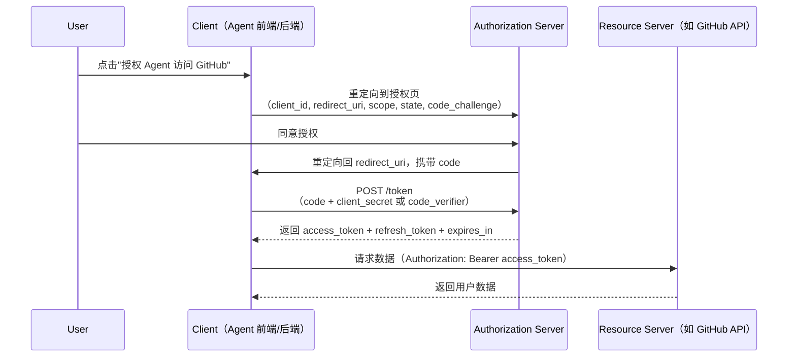

*图：沿图中的节点与箭头阅读，重点是突出 Authorization Code + PKCE、客户端类型、state/nonce 和 token 边界。*

---

OAuth 2.0 是行业标准的授权框架（RFC 6749），解决的核心问题是：**第三方应用如何在不获取用户密码的前提下，代表用户访问其资源**。对于 AI Agent 工程师，OAuth2 是打通生态的关键——Agent 服务需要代表用户调用 GitHub API 提交代码、调用 Google Calendar 读取日程、或通过企业 SSO 访问内部系统，这些场景都依赖 OAuth2 授权链路。

## 核心角色

[RFC 6749](https://www.rfc-editor.org/rfc/rfc6749.html) 定义 resource owner、client、authorization server、resource server 以及授权/token 端点；OAuth 授予的是受限访问权，不直接规定用户身份认证。


| 角色 | 说明 | Agent 场景映射 |
|---|---|---|
| Resource Owner | 资源所有者，即用户 | 授权 Agent 访问其 GitHub 仓库的用户 |
| Client | 需要访问资源的第三方应用 | Agent 服务后端 |
| Authorization Server | 验证身份、颁发 Token 的服务 | GitHub / Google / 企业 IdP |
| Resource Server | 持有受保护数据的服务 | GitHub API / Google Drive API |

## 四种授权模式对比

| 模式 | 适用场景 | 是否有用户参与 | 安全性 | 备注 |
|---|---|---|---|---|
| Authorization Code | Web 应用、有后端的 SPA | 是 | 高 | 推荐，配合 PKCE 更安全 |
| Implicit | 已废弃（旧版 SPA） | 是 | 低 | RFC 9700 不再推荐 |
| Client Credentials | M2M、Agent 后台服务 | 否 | 高（需保护 secret） | Agent 无用户上下文时使用 |
| Resource Owner Password | 高度信任的自有应用 | 是 | 低（密码直接暴露给 Client） | 尽量避免使用 |

## Authorization Code Flow 详解

授权码流程是最常用的模式，核心思路是将敏感的 `access_token` 换取过程移到后端完成，避免 token 暴露在浏览器 URL 历史中。



**关键参数说明：**

- `state`：每次请求生成的随机字符串，回调时严格比对，防 CSRF 攻击
- `scope`：请求的权限范围，遵循最小权限原则
- `code`：一次性授权码，有效期通常 10 分钟，只能使用一次
- `redirect_uri`：必须与注册时一致，防止授权码被劫持到恶意地址

## PKCE 扩展

PKCE（Proof Key for Code Exchange，RFC 7636）解决的问题：SPA 和移动 App 无法安全存储 `client_secret`，攻击者若拦截到授权码，可直接用它换 token。PKCE 通过引入 `code_verifier`/`code_challenge` 配对，使授权码即使被截获也无法使用。（参见 [RFC 9700: Best Current Practice for OAuth 2.0 Security](https://www.rfc-editor.org/rfc/rfc9700.html)）

**流程：**
1. 客户端生成随机 `code_verifier`
2. 计算 `code_challenge = BASE64URL(SHA256(code_verifier))`
3. 授权请求携带 `code_challenge`（AuthServer 存储）
4. 换 token 时携带原始 `code_verifier`，AuthServer 验证哈希是否匹配

```ts
import crypto from 'crypto';

function generatePKCE(): { verifier: string; challenge: string } {
  const verifier = crypto.randomBytes(32).toString('base64url');
  const challenge = crypto
    .createHash('sha256')
    .update(verifier)
    .digest('base64url');
  return { verifier, challenge };
}

function buildAuthorizationURL(params: {
  clientId: string;
  redirectUri: string;
  scope: string;
  state: string;
  codeChallenge: string;
}): string {
  const url = new URL('https://github.com/login/oauth/authorize');
  url.searchParams.set('client_id', params.clientId);
  url.searchParams.set('redirect_uri', params.redirectUri);
  url.searchParams.set('scope', params.scope);
  url.searchParams.set('state', params.state);
  url.searchParams.set('code_challenge', params.codeChallenge);
  url.searchParams.set('code_challenge_method', 'S256');
  return url.toString();
}
```

## TypeScript 实现：完整授权码 + Token 管理

```ts
import crypto from 'crypto';

interface TokenResponse {
  access_token: string;
  refresh_token?: string;
  expires_in: number;
  token_type: string;
}

// 1. 构建授权 URL
function buildAuthURL(clientId: string, redirectUri: string, state: string): string {
  const url = new URL('https://accounts.google.com/o/oauth2/v2/auth');
  url.searchParams.set('client_id', clientId);
  url.searchParams.set('redirect_uri', redirectUri);
  url.searchParams.set('response_type', 'code');
  url.searchParams.set('scope', 'openid email profile');
  url.searchParams.set('state', state);
  url.searchParams.set('access_type', 'offline'); // Google 特有：获取 refresh_token
  return url.toString();
}

// 2. 用 code 换取 token
async function exchangeCodeForToken(
  code: string,
  clientId: string,
  clientSecret: string,
  redirectUri: string
): Promise<TokenResponse> {
  const response = await fetch('https://oauth2.googleapis.com/token', {
    method: 'POST',
    headers: { 'Content-Type': 'application/x-www-form-urlencoded' },
    body: new URLSearchParams({
      grant_type: 'authorization_code',
      code,
      client_id: clientId,
      client_secret: clientSecret,
      redirect_uri: redirectUri,
    }),
  });
  if (!response.ok) {
    throw new Error(`Token exchange failed: ${response.status}`);
  }
  return response.json();
}

// 3. 刷新 access_token
async function refreshAccessToken(
  refreshToken: string,
  clientId: string,
  clientSecret: string
): Promise<TokenResponse> {
  const response = await fetch('https://oauth2.googleapis.com/token', {
    method: 'POST',
    headers: { 'Content-Type': 'application/x-www-form-urlencoded' },
    body: new URLSearchParams({
      grant_type: 'refresh_token',
      refresh_token: refreshToken,
      client_id: clientId,
      client_secret: clientSecret,
    }),
  });
  if (!response.ok) {
    throw new Error(`Token refresh failed: ${response.status}`);
  }
  return response.json();
}
```

## Agent 场景：Client Credentials 模式（M2M）

当 Agent 服务以自身身份调用第三方 API（无用户上下文），使用 Client Credentials Flow。典型场景：

- **Agent 后台任务**：定时抓取数据、批量处理，不依赖在线用户
- **微服务间调用**：Agent 编排服务调用工具服务，服务间互信鉴权
- **企业内部 API 集成**：Agent 调用企业 ERP/CRM，以服务账号身份访问

```ts
interface M2MTokenManager {
  token: string | null;
  expiresAt: number;
}

const tokenCache: M2MTokenManager = { token: null, expiresAt: 0 };

async function getM2MToken(
  tokenEndpoint: string,
  clientId: string,
  clientSecret: string,
  scope: string
): Promise<string> {
  // 提前 60 秒刷新，避免边界情况下 token 过期
  if (tokenCache.token && Date.now() < tokenCache.expiresAt - 60_000) {
    return tokenCache.token;
  }

  const response = await fetch(tokenEndpoint, {
    method: 'POST',
    headers: { 'Content-Type': 'application/x-www-form-urlencoded' },
    body: new URLSearchParams({
      grant_type: 'client_credentials',
      client_id: clientId,
      client_secret: clientSecret,
      scope,
    }),
  });

  const { access_token, expires_in }: TokenResponse = await response.json();
  tokenCache.token = access_token;
  tokenCache.expiresAt = Date.now() + expires_in * 1000;
  return access_token;
}

// Agent 工具调用封装
async function callGitHubAPIAsAgent(endpoint: string): Promise<unknown> {
  const token = await getM2MToken(
    'https://auth.example.com/oauth/token',
    process.env.CLIENT_ID!,
    process.env.CLIENT_SECRET!,
    'repos:read'
  );
  const response = await fetch(`https://api.github.com${endpoint}`, {
    headers: { Authorization: `Bearer ${token}` },
  });
  return response.json();
}
```

## OpenID Connect（OIDC）与 OAuth2 的关系

OAuth2 只解决**授权**问题（你有没有权限），不包含**认证**（你是谁）。OIDC（OpenID Connect）是构建在 OAuth2 之上的身份层扩展（增加了 `id_token`），专门解决认证问题。

| 对比维度 | OAuth 2.0 | OIDC |
|---|---|---|
| 解决问题 | 授权（Authorization） | 认证（Authentication）|
| 核心产物 | access_token | id_token（JWT）+ access_token |
| 用户信息获取 | 需额外调用 `/userinfo` | 直接解码 id_token |
| 触发方式 | 任意 scope | scope 包含 `openid` |

OIDC 中的 `id_token` 是标准 JWT，包含 `sub`（用户唯一 ID）、`email`、`name`、`iat`、`exp` 等标准 claims，前端/后端可直接解码验证，无需额外网络请求获取用户身份。

```
# 触发 OIDC：scope 加 openid
scope=openid profile email
```

对于 Agent 服务，OIDC 意味着在完成 OAuth2 授权后，同时获得用户身份信息，可用于：将用户 GitHub 账号与 Agent 平台账号绑定、记录 Agent 操作的用户归属、多租户场景下的数据隔离。

## 常见误区

**误区 1：OAuth2 = 登录认证**
OAuth2 本质是授权协议，不是认证协议。"使用 GitHub 登录"背后是 OIDC（OAuth2 + 身份层），而非纯 OAuth2。混淆两者会导致错误地用 `access_token` 验证用户身份——攻击者可以把 A 应用的 `access_token` 拿到 B 应用冒充用户。

**误区 2：access_token 存在 localStorage**
localStorage 无法阻止 XSS 攻击读取，`access_token` 和 `refresh_token` 应存于 `HttpOnly Secure Cookie`，或仅保存在内存中（页面刷新后重新走授权流程）。

**误区 3：忽略 state 参数校验**
`state` 不是可选的装饰品，是防 CSRF 的核心机制。回调时必须严格比对，且 state 应为不可预测的随机值，不能使用固定字符串。

**误区 4：Public Client 不用 PKCE**
SPA 和移动 App 的代码可被逆向，`client_secret` 无法保密，必须使用 PKCE 替代。仍在 2024 年后使用无 PKCE 的 Implicit Flow 是严重的安全问题。

## 最佳实践

- **Token 存储**：`access_token` 存内存，`refresh_token` 存 HttpOnly Secure Cookie，永远不存 localStorage
- **最小 scope**：只申请业务必需的权限，scope 越小，泄露影响面越小
- **Token 轮换**：每次使用 `refresh_token` 换取新 token 时，同时颁发新的 `refresh_token`（Refresh Token Rotation），旧 token 立即失效
- **M2M Token 缓存**：Client Credentials 换来的 token 应缓存至接近过期，避免每次请求都重新获取造成性能损耗
- **redirect_uri 精确匹配**：注册时填写精确 URI，不使用通配符，防止 open redirect 攻击

## 面试要点

**Q：Authorization Code Flow 为什么不直接返回 token，而要先返回 code？**
授权码通过前端 URL 传递，可能被浏览器历史、日志、Referer header 记录。code 只是一次性的临时凭证，真正的 token 通过后端对后端的 POST 请求换取，不会出现在 URL 中。

**Q：OAuth2 和 OIDC 的本质区别？**
OAuth2 是授权框架（你有没有权限访问某资源），OIDC 是认证协议（你是谁）。OIDC 在 OAuth2 基础上增加 `id_token` 和标准的用户信息端点，scope 中加 `openid` 即触发 OIDC。

**Q：PKCE 解决什么问题？**
防止授权码拦截攻击（Authorization Code Interception Attack）。即使攻击者截获 `code`，没有对应的 `code_verifier` 也无法换取 token，因为 `code_verifier` 只存在于发起授权的客户端。

**Q：Agent 服务应该用哪种 OAuth2 流程？**
- 代表用户操作（如帮用户提 PR）：Authorization Code + PKCE，提前获取并持久化 `refresh_token`，Agent 运行时自动刷新
- Agent 自身调用 API（无用户上下文）：Client Credentials Flow，token 缓存复用

**Q：refresh_token 如何安全存储？**
服务端存数据库（加密存储），通过 HttpOnly Secure Cookie 下发 session 标识，绝不直接将 refresh_token 返回给前端 JavaScript 环境。

## 参考资料

- [RFC 6749: The OAuth 2.0 Authorization Framework](https://www.rfc-editor.org/rfc/rfc6749.html)
- [RFC 9700: Best Current Practice for OAuth 2.0 Security](https://www.rfc-editor.org/rfc/rfc9700.html)
