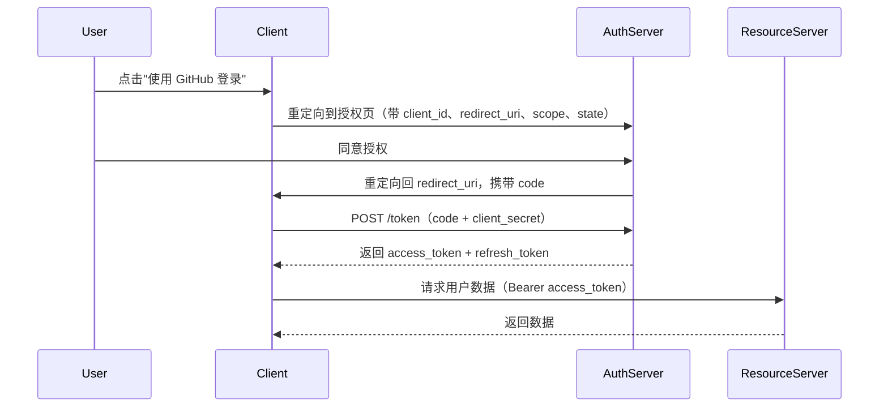

# OAuth 2.0 授权流程

OAuth 2.0 是行业标准授权框架，解决"第三方应用在不获取用户密码的前提下访问其资源"的问题。微信登录、GitHub OAuth、企业 SSO 等场景都基于此协议。

## 核心角色

| 角色 | 说明 |
|---|---|
| Resource Owner | 资源所有者，即用户 |
| Client | 第三方应用（需要访问资源的一方） |
| Authorization Server | 授权服务器，验证用户身份并颁发 Token |
| Resource Server | 资源服务器，持有受保护的用户数据 |

## 四种授权流程

### 1. Authorization Code Flow（最推荐，适合 Web 应用）



**关键参数说明**：

- `state`：随机字符串，防 CSRF；回调时必须校验是否与发出的一致。
- `code_verifier` / `code_challenge`：PKCE 扩展，防止授权码被截获（公开客户端必须使用）。

### 2. Authorization Code + PKCE（移动端 / SPA 必须）

SPA 和移动 App 无法安全存储 `client_secret`，必须使用 PKCE（Proof Key for Code Exchange）：

```ts
import crypto from 'crypto';

// 客户端生成
function generatePKCE() {
  const verifier = crypto.randomBytes(32).toString('base64url');
  const challenge = crypto
    .createHash('sha256')
    .update(verifier)
    .digest('base64url');
  return { verifier, challenge };
}

// 授权请求附加
// &code_challenge=<challenge>&code_challenge_method=S256

// 换 Token 时附加
// &code_verifier=<verifier>
```

### 3. Client Credentials Flow（机器对机器）

无用户参与，服务与服务之间鉴权：

```ts
const response = await fetch('https://auth.example.com/oauth/token', {
  method: 'POST',
  headers: { 'Content-Type': 'application/x-www-form-urlencoded' },
  body: new URLSearchParams({
    grant_type: 'client_credentials',
    client_id: process.env.CLIENT_ID!,
    client_secret: process.env.CLIENT_SECRET!,
    scope: 'read:metrics',
  }),
});
const { access_token } = await response.json();
```

### 4. Device Authorization Flow（TV / CLI 设备）

设备无键盘输入能力时使用，用户在手机/电脑上输入设备码完成授权（如 GitHub CLI `gh auth login`）。

## OpenID Connect（OIDC）

OIDC 是基于 OAuth 2.0 的身份层扩展，在 `access_token` 之外额外颁发 `id_token`（JWT 格式），包含用户身份信息（sub、email、name 等），用于**认证**（Authentication），而非仅授权（Authorization）。

`scope` 加上 `openid` 即触发 OIDC：

```
scope=openid profile email
```

解码 `id_token` 即可获取用户基本信息，无需再调用 `/userinfo` 接口。

## Node.js 接入示例（Express + GitHub OAuth）

```ts
import express from 'express';
import crypto from 'crypto';

const app = express();
const CLIENT_ID = process.env.GITHUB_CLIENT_ID!;
const CLIENT_SECRET = process.env.GITHUB_CLIENT_SECRET!;
const REDIRECT_URI = 'http://localhost:3000/auth/callback';

// 存 state（生产用 Redis，此处简化用 Map）
const stateStore = new Map<string, boolean>();

app.get('/auth/login', (_req, res) => {
  const state = crypto.randomBytes(16).toString('hex');
  stateStore.set(state, true);
  const url = new URL('https://github.com/login/oauth/authorize');
  url.searchParams.set('client_id', CLIENT_ID);
  url.searchParams.set('redirect_uri', REDIRECT_URI);
  url.searchParams.set('scope', 'read:user user:email');
  url.searchParams.set('state', state);
  res.redirect(url.toString());
});

app.get('/auth/callback', async (req, res) => {
  const { code, state } = req.query as { code: string; state: string };
  if (!stateStore.has(state)) {
    return res.status(400).send('Invalid state');
  }
  stateStore.delete(state);

  // 换取 access_token
  const tokenRes = await fetch('https://github.com/login/oauth/access_token', {
    method: 'POST',
    headers: { Accept: 'application/json', 'Content-Type': 'application/json' },
    body: JSON.stringify({ client_id: CLIENT_ID, client_secret: CLIENT_SECRET, code }),
  });
  const { access_token } = await tokenRes.json();

  // 获取用户信息
  const userRes = await fetch('https://api.github.com/user', {
    headers: { Authorization: `Bearer ${access_token}` },
  });
  const user = await userRes.json();

  // 在此创建/更新本地用户，签发自己的 session/JWT
  res.json({ user });
});
```

## 安全要点

- **校验 state**：每次授权请求生成唯一 state，回调时严格比对，防 CSRF。
- **HTTPS 传输**：redirect_uri 必须是 HTTPS，防止授权码在传输中泄露。
- **最小 scope**：只申请业务必需的权限，减少泄露影响面。
- **Token 不存 localStorage**：access_token 存内存或 HttpOnly Cookie，防 XSS。
- **公开客户端必须用 PKCE**：SPA/移动端没有后端，不能持有 client_secret。

## 面试常问

- **OAuth 2.0 是认证还是授权**：OAuth 2.0 本身只是**授权**协议；OIDC 在其上加了身份层，才是**认证**。
- **Authorization Code Flow 为什么不直接返回 token 而要先返回 code**：code 通过前端 URL 传递（可能被浏览器历史/日志记录），token 通过后端对后端的 POST 请求换取，避免 token 暴露在 URL 中。
- **refresh_token 怎么安全存储**：HttpOnly Secure Cookie；绝不存 localStorage。
- **PKCE 解决什么问题**：防止恶意 App 拦截授权码后直接换 token（因为无法伪造 `code_verifier`）。
