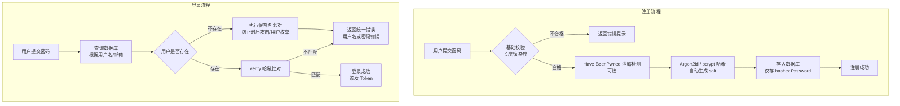

*图：注册路径把 password + unique salt 送入 memory-hard KDF，pepper 来自独立 secret store；登录重算并常量时间比较，参数过旧时再 rehash。*

---

密码存储是应用安全的第一道防线，也是最容易被低估的一道。数据库一旦泄露，错误的存储方式会导致用户密码被批量破解；而正确的方式让攻击者即便拿到数据，也无从下手。对于 AI Agent 平台而言，数据库中不仅存有用户密码，还存有大量 API Key 和第三方凭证，密码哈希策略的重要性更是倍增。

## 哈希 vs 加密：本质区别

很多人混淆了这两个概念：

- **加密（Encryption）**：双向操作，有密钥则可解密还原原文。适合需要取回原文的场景（如存储 API Key 供后续请求使用）。
- **哈希（Hashing）**：单向操作，无法逆推原文。适合存储密码——系统根本不需要知道用户的原始密码，只需验证用户输入是否匹配。

密码应当哈希而非加密。如果你加密存储密码，密钥一旦泄露，所有密码即刻暴露；而哈希后的密码，即便数据库被拖走，攻击者也只能逐个暴力猜测。

## 为什么 MD5 / SHA-1 不能用于密码存储

MD5、SHA-1、SHA-256 是通用哈希算法，设计目标是**快速**——这恰恰是密码存储的致命缺陷。

**彩虹表攻击（Rainbow Table）**：攻击者预先计算数十亿常见密码的哈希值，构建查找表。一旦有了哈希值，查表瞬间还原原文。加盐（salt）虽然能抵御预计算彩虹表，但并未解决根本问题。

**暴力破解速度极快**：
- 现代 GPU（如 RTX 4090）每秒可计算约 **164 亿次** MD5
- 即便加了随机 salt，8 位纯数字密码仍能在秒级破解
- SHA-256 稍慢，但量级相同，仍属于不可接受范围

**碰撞漏洞**：MD5 和 SHA-1 已被证明存在碰撞（collision）——两个不同输入能产生相同哈希值，这在密码验证场景下会导致额外的安全隐患。

> SHA-256 无碰撞问题，但因为速度太快，同样不适合密码存储。"加了 salt 用 SHA-256" 是一个极其常见的误区。

## bcrypt：慢哈希的经典实现

bcrypt 由 Niels Provos 和 David Mazières 于 1999 年设计，至今仍是最广泛使用的密码哈希算法。其核心设计哲学是 **slowness by design（故意变慢）**。

**关键机制：**

1. **内置 salt**：每次哈希自动生成 128 位随机 salt，嵌入结果字符串，无需单独存储。
2. **cost factor（工作因子）**：控制哈希迭代次数。每增加 1，计算时间翻倍。`cost=10` 约耗时 100ms，`cost=12` 约耗时 400ms。
3. **固定输出长度**：始终输出 60 字符的字符串，便于数据库字段设计。

```typescript
import bcrypt from 'bcrypt';

const SALT_ROUNDS = 12; // 生产环境推荐 12，高安全场景可用 14

// 注册时：对明文密码进行哈希
export async function hashPassword(plaintext: string): Promise<string> {
  return bcrypt.hash(plaintext, SALT_ROUNDS);
}

// 登录时：验证密码（bcrypt.compare 自动从哈希串中提取 salt）
export async function verifyPassword(
  plaintext: string,
  hashed: string
): Promise<boolean> {
  return bcrypt.compare(plaintext, hashed);
}
```

bcrypt 输出示例：
```
$2b$12$LKHd3.RcKA.eNy9MRb2sVeZFd9PaVV4DX4W.QkgWbKBFElXZBU9m2
 ↑   ↑  ←——————— 22字符 salt ————————→←——— 31字符 hash ———→
版本  cost
```

**注意**：bcrypt 只处理密码的**前 72 字节**，超长密码会被静默截断。如需支持长密码，可在传入前先做一次 SHA-256（转为固定长度的十六进制字符串）：

```typescript
import crypto from 'crypto';

function prehash(password: string): string {
  return crypto.createHash('sha256').update(password).digest('hex');
}

export async function hashPassword(plaintext: string): Promise<string> {
  return bcrypt.hash(prehash(plaintext), SALT_ROUNDS);
}
```

## Argon2：现代首选

[OWASP Password Storage Cheat Sheet](https://cheatsheetseries.owasp.org/cheatsheets/Password_Storage_Cheat_Sheet.html) 优先建议 Argon2id，并要求为每个密码使用唯一 salt、按部署能力设置工作因子；pepper 应与密码数据库分离保存。


Argon2 是 2015 年密码哈希大赛（Password Hashing Competition，PHC）的冠军算法，专为对抗 GPU 和 ASIC 硬件破解而设计。

**三种变体：**
- `Argon2d`：抗 GPU 最强，但有侧信道风险，适合无交互场景
- `Argon2i`：抗侧信道，适合密码哈希
- `Argon2id`：两者结合，**PHC 官方推荐用于密码存储**

**可配置的三个维度：**

| 参数 | 含义 | OWASP 最低推荐值 |
|------|------|-----------------|
| `memoryCost` | 内存用量（KB） | 64 MB（65536） |
| `timeCost` | 迭代次数 | 3 |
| `parallelism` | 并行线程数 | 4 |

```typescript
import argon2 from 'argon2';

export async function hashPassword(plaintext: string): Promise<string> {
  return argon2.hash(plaintext, {
    type: argon2.argon2id,
    memoryCost: 65536, // 64 MB，使 GPU 并行破解极为昂贵
    timeCost: 3,
    parallelism: 4,
  });
}

export async function verifyPassword(
  hashed: string,
  plaintext: string
): Promise<boolean> {
  return argon2.verify(hashed, plaintext);
}
```

Argon2 的内存硬度（memory-hardness）是核心优势：破解每个哈希都需要大量内存，GPU 并行破解的成本呈指数级上升，而 bcrypt 在这方面相对较弱。

## 算法对比

| 算法 | 速度 | 内存硬度 | 抗 GPU | 适用场景 | 推荐度 |
|------|------|----------|--------|---------|--------|
| MD5 | 极快 | 无 | 极差 | 数据校验（非密码） | 禁止用于密码 |
| SHA-256 | 很快 | 无 | 差 | 数字签名、HMAC | 禁止用于密码 |
| bcrypt | 慢（可调） | 低 | 中等 | 密码存储 | 可用，老项目稳妥选择 |
| scrypt | 慢（可调） | 中等 | 较好 | 密码存储 | 较好，Node 内置 |
| Argon2id | 慢（可调） | 高 | 最强 | 密码存储、密钥派生 | 新项目首选 |

## 注册与登录流程

[NIST SP 800-63B](https://pages.nist.gov/800-63-4/sp800-63b.html) 对密码验证、受阻密码列表、速率限制和存储提出要求；验证系统不应依赖“复杂度规则”替代泄露密码检查。




**时序攻击防护（Timing Attack）**：登录时无论用户是否存在，都应执行等时的哈希比对。否则"用户不存在"会比"密码错误"响应更快，攻击者可借此枚举有效用户名。

```typescript
// 防用户枚举的登录实现
const DUMMY_HASH = '$2b$12$LKHd3.RcKA.eNy9MRb2sVeZFd9PaVV4DX4W.QkgWbKBFElXZBU9m2';

async function login(email: string, password: string) {
  const user = await db.user.findUnique({ where: { email } });

  // 无论用户是否存在，都执行 compare，耗时保持一致
  const isValid = user
    ? await bcrypt.compare(password, user.password)
    : await bcrypt.compare(password, DUMMY_HASH);

  if (!user || !isValid) {
    throw new Error('用户名或密码错误');
  }
  return user;
}
```

## API Key 存储最佳实践

Agent 平台不仅存储用户密码，还存储用户配置的第三方 API Key（如 OpenAI Key、数据库凭证等）。这类凭证有两种策略：

**策略 A：需要原文取回（如代理请求时直接使用）**
- 使用**对称加密**（AES-256-GCM），密钥存于环境变量或 KMS，不进数据库
- 数据库只存密文，应用层解密后使用

**策略 B：仅需验证（如用户自己粘贴 Key 验证所有权）**
- 哈希存储，展示时只显示前缀，其余脱敏
- 格式：`sk-proj-xxxx...` → 数据库存 `SHA-256(key)` + 前缀 `sk-proj-xxxx`

```typescript
import crypto from 'crypto';

interface StoredApiKey {
  prefix: string;      // 展示给用户：'sk-proj-Ab3x'
  hashedKey: string;   // 存数据库：SHA-256 哈希
  createdAt: Date;
}

export function storeApiKey(rawKey: string): StoredApiKey {
  const prefix = rawKey.slice(0, 12); // 保留前缀用于展示
  const hashedKey = crypto.createHash('sha256').update(rawKey).digest('hex');
  return { prefix, hashedKey, createdAt: new Date() };
}

export function verifyApiKey(rawKey: string, stored: StoredApiKey): boolean {
  const hash = crypto.createHash('sha256').update(rawKey).digest('hex');
  // 使用 timingSafeEqual 防止时序攻击
  return crypto.timingSafeEqual(
    Buffer.from(hash),
    Buffer.from(stored.hashedKey)
  );
}
```

API Key 列表展示效果：
```
sk-proj-Ab3x...（创建于 2024-01-15）
sk-ant-Kd9m...（创建于 2024-03-22）
```

原始 Key 在创建时一次性展示给用户，之后系统永不存储原文。

## 常见误区与最佳实践

**误区 1：加了 salt 用 SHA-256 就安全了**

Salt 解决了彩虹表攻击，但没有解决暴力破解。SHA-256 太快，GPU 每秒仍可尝试数十亿次。**必须使用慢哈希算法**，salt 只是其中一个要素。

**误区 2：cost factor 设太低**

bcrypt `cost=10` 对低配服务器可接受，但高并发场景下要评估服务器承受能力。建议在部署机器上实测，哈希耗时控制在 100–500ms 之间。

**误区 3：前端先哈希再传输**

前端哈希后，哈希值本身变成了"新密码"，中间人劫持后直接使用哈希值即可登录。密码应通过 HTTPS 明文传输（相对前端哈希而言），服务端哈希。

**误区 4：忘记处理 bcrypt 72 字节截断**

长密码（passphrase 风格）在 bcrypt 下会被截断，需要预处理或改用 Argon2。

**最佳实践清单：**
- 使用 Argon2id（新项目）或 bcrypt `cost≥12`（老项目）
- 密码强度校验：长度 ≥ 12，可用 `zxcvbn` 库评分
- 登录失败计数 + 指数退避锁定（防暴力破解）
- 注册时可选接入 HaveIBeenPwned 泄露检测
- 所有密码操作在服务端执行，前端只做格式校验
- API Key 哈希存储，只展示前缀，永不记录原文

## 面试要点

- **bcrypt 的 salt 存哪里**：salt 直接嵌入 60 字符的哈希结果字符串中，`compare` 时自动提取，无需单独存储列。

- **为什么不直接 SHA-256 加 salt**：salt 解决了彩虹表（预计算），但 SHA-256 本身太快，GPU 可实时暴力破解。bcrypt/Argon2 的慢哈希特性（人为增加计算成本）才是关键防线，二者缺一不可。

- **如何防止用户枚举**：无论用户存在与否，都执行等时的哈希比对操作，返回统一错误信息。否则响应时间差会泄露账号是否存在。

- **Argon2 vs bcrypt 核心差异**：Argon2 增加了内存硬度（memory-hardness），破解每个哈希需要大量内存，GPU 并行破解成本极高；bcrypt 仅有时间成本，无内存约束，在 GPU 集群面前抵抗力相对弱。

- **Agent 平台 API Key 如何存储**：需区分"验证用"和"原文取用"两种场景。前者哈希存储（SHA-256 + 前缀展示）；后者需加密存储（AES-256-GCM），密钥走 KMS，数据库只存密文，且比较时使用 `timingSafeEqual` 防时序攻击。

## 参考资料

- [OWASP Password Storage Cheat Sheet](https://cheatsheetseries.owasp.org/cheatsheets/Password_Storage_Cheat_Sheet.html)
- [NIST SP 800-63B Digital Identity Guidelines](https://pages.nist.gov/800-63-4/sp800-63b.html)
