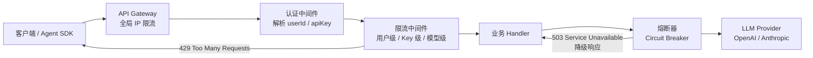
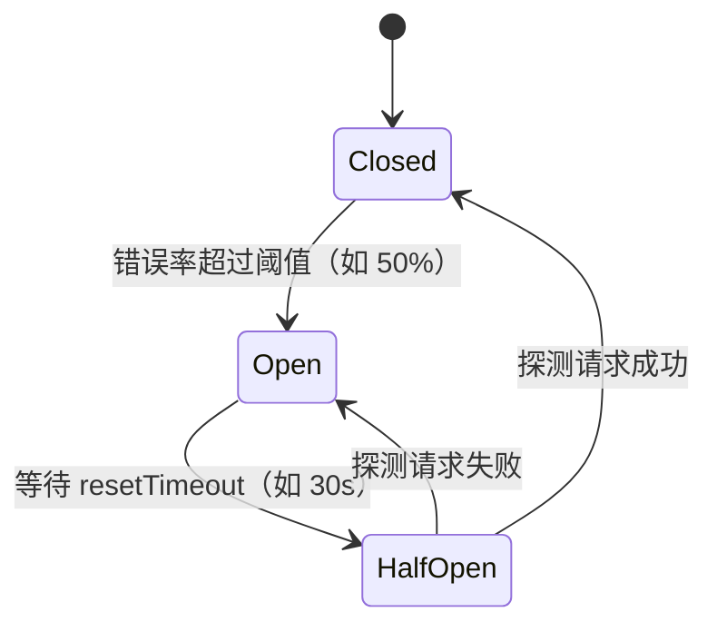

在 AI Agent 服务中，每一次 LLM API 调用都直接产生费用，一个失控的请求循环或恶意用户的批量调用足以在分钟内耗尽月度预算。限流（Rate Limiting）和熔断（Circuit Breaker）是两道互补的防线：限流控制流量入口，熔断隔离下游故障。

## 为什么限流对 AI 服务尤为关键

普通 REST API 的限流主要防止 DDoS 和服务过载；AI 服务还多了一层**成本放大效应**。一个 GPT-4 请求可能消耗数千 token，若无限流：

- 单用户的失控 Agent 循环可触发数百次 LLM 调用，产生数十美元费用
- 多租户系统中，某用户的突发流量会抢占其他用户的 API 配额
- 下游 LLM Provider（OpenAI / Anthropic）本身也有速率限制，需要通过本地限流削峰，避免触发 Provider 的 429

## 限流算法对比

| 算法 | 原理 | 优点 | 缺点 | 适用场景 |
|------|------|------|------|----------|
| 固定窗口（Fixed Window） | 时间切成等长窗口，窗口内计数超限拒绝 | 实现极简，内存占用低 | 窗口边界存在突刺，跨窗口实际 QPS 最高达限额 2 倍 | 粗粒度全局保护 |
| 滑动窗口（Sliding Window） | 用时间戳队列记录请求，实时清除窗口外记录再计数 | 流量平滑，无边界突刺 | 内存随并发量增长，Redis 实现需 ZSET | 用户级精准限流 |
| 令牌桶（Token Bucket） | 固定速率向桶中补充令牌，每次请求消耗令牌，桶空拒绝 | 允许受控突发（桶容量即突发上限） | 实现稍复杂，需维护令牌状态 | **生产最常用**，API 网关 |
| 漏桶（Leaky Bucket） | 请求入队，以恒定速率出队处理，队满丢弃 | 严格平滑输出，保护下游稳定 | 不允许任何突发，延迟偏高 | 对下游有严格流量要求（如 LLM Provider 调用） |

> AI 场景推荐：**令牌桶**用于控制用户请求速率，**漏桶**用于平滑向 LLM Provider 的出站调用。

## 限流中间件在 Agent 请求链路中的位置



## 分层限流策略

AI 服务需要在四个维度叠加限流，由粗到细：

| 维度 | 限制目标 | 典型限额 | Key 设计 |
|------|---------|---------|---------|
| IP 维度 | 防 DDoS、爬虫 | 100 req/min | `rl:ip:{clientIp}` |
| 用户维度 | 控制单用户消耗 | 60 req/min | `rl:user:{userId}` |
| API Key 维度 | 管理第三方调用方配额 | 按套餐定制 | `rl:key:{apiKey}` |
| 模型维度 | 控制高成本模型用量 | GPT-4：10 req/min | `rl:model:{userId}:{model}` |

### TypeScript 实现：滑动窗口 Redis 限流器

```typescript
import { Redis } from 'ioredis';

const redis = new Redis(process.env.REDIS_URL!);

/**
 * 基于 Redis ZSET 的滑动窗口限流
 * @returns true = 放行, false = 限流
 */
async function slidingWindowRateLimit(
  key: string,
  limit: number,
  windowMs: number
): Promise<boolean> {
  const now = Date.now();
  const windowStart = now - windowMs;
  const requestId = `${now}-${Math.random()}`;

  const pipeline = redis.pipeline();
  pipeline.zremrangebyscore(key, '-inf', windowStart);   // 清除窗口外旧记录
  pipeline.zadd(key, now, requestId);                     // 记录本次请求
  pipeline.zcard(key);                                    // 计算当前窗口请求数
  pipeline.pexpire(key, windowMs);                        // 设置 key 过期

  const results = await pipeline.exec();
  const count = results![2][1] as number;

  return count <= limit;
}

// Express 中间件：用户级 + 模型级双重限流
import { Request, Response, NextFunction } from 'express';

export function aiRateLimiter(model: string) {
  return async (req: Request, res: Response, next: NextFunction) => {
    const userId = req.user?.id;
    if (!userId) return next(); // 未认证走 IP 层限流

    const userKey = `rl:user:${userId}`;
    const modelKey = `rl:model:${userId}:${model}`;

    // 高成本模型（如 gpt-4o）单独限流
    const isHighCostModel = ['gpt-4o', 'claude-opus-4'].includes(model);
    const modelLimit = isHighCostModel ? 10 : 30;

    const [userOk, modelOk] = await Promise.all([
      slidingWindowRateLimit(userKey, 60, 60_000),
      slidingWindowRateLimit(modelKey, modelLimit, 60_000),
    ]);

    if (!userOk || !modelOk) {
      return res.status(429).json({
        error: 'rate_limit_exceeded',
        message: !userOk
          ? '请求过于频繁，请稍后重试'
          : `${model} 模型调用超出每分钟限额`,
        retryAfter: 60,
      });
    }

    next();
  };
}
```

## AI 专项：Token 用量限额与并发 Agent 控制

除了请求速率，AI 服务还需要控制**Token 消耗**和**并发 Agent 任务数**：

```typescript
// Token 用量限额：每用户每日 Token 预算
async function checkTokenBudget(
  userId: string,
  estimatedTokens: number
): Promise<{ allowed: boolean; remaining: number }> {
  const key = `token:budget:${userId}:${new Date().toISOString().slice(0, 10)}`;
  const dailyLimit = 100_000; // 每用户每日 10 万 token

  const current = await redis.incrby(key, estimatedTokens);
  if (current === estimatedTokens) {
    // 首次写入，设置 24 小时过期
    await redis.expire(key, 86400);
  }

  return {
    allowed: current <= dailyLimit,
    remaining: Math.max(0, dailyLimit - current),
  };
}

// 并发 Agent 任务数限制：防止单用户独占资源
async function acquireAgentSlot(userId: string): Promise<boolean> {
  const key = `agent:slots:${userId}`;
  const maxConcurrent = 3;

  const count = await redis.incr(key);
  await redis.expire(key, 300); // 5 分钟兜底过期，防止泄漏

  if (count > maxConcurrent) {
    await redis.decr(key);
    return false;
  }
  return true;
}

async function releaseAgentSlot(userId: string) {
  await redis.decr(`agent:slots:${userId}`);
}
```

## 熔断器（Circuit Breaker）

熔断保护的是**出站调用**——当下游 LLM Provider 出现大规模超时或错误时，熔断器快速失败，避免请求线程被阻塞堆积。



| 状态 | 行为 |
|------|------|
| Closed（关闭） | 正常放行，持续统计错误率 |
| Open（打开） | 直接快速失败，不发起真实调用 |
| Half-Open（半开） | 放行少量探测请求，判断下游是否恢复 |

### TypeScript 实现（opossum 库）

```typescript
import CircuitBreaker from 'opossum';
import Anthropic from '@anthropic-ai/sdk';

const client = new Anthropic();

async function callLLM(prompt: string) {
  return client.messages.create({
    model: 'claude-opus-4-5',
    max_tokens: 1024,
    messages: [{ role: 'user', content: prompt }],
  });
}

const llmBreaker = new CircuitBreaker(callLLM, {
  timeout: 30_000,                 // 30 秒超时视为失败（LLM 响应慢）
  errorThresholdPercentage: 50,    // 错误率 50% 触发熔断
  resetTimeout: 30_000,            // 30 秒后进入 Half-Open
  volumeThreshold: 5,              // 至少 5 次请求才统计错误率
});

// 降级策略：返回缓存结果或切换到更小模型
llmBreaker.fallback(async (prompt: string) => {
  const cached = await redis.get(`llm:cache:${hashPrompt(prompt)}`);
  if (cached) return JSON.parse(cached);

  // 降级到更小、更稳定的模型
  return client.messages.create({
    model: 'claude-haiku-4-5',
    max_tokens: 512,
    messages: [{ role: 'user', content: prompt }],
  });
});

llmBreaker.on('open', () => {
  console.error('[CircuitBreaker] LLM service OPEN — fast failing');
  // 触发告警（PagerDuty / Slack）
});

export async function generateWithFallback(prompt: string) {
  return llmBreaker.fire(prompt);
}
```

## 服务降级策略

| 降级方案 | 适用场景 | 注意事项 |
|---------|---------|---------|
| 返回缓存结果 | 查询类 Agent，允许轻微数据滞后 | 缓存 key 要足够精确，避免错误命中 |
| 降级到更小模型 | 对话质量要求不极致时 | 提前测试小模型输出是否满足基本可用 |
| 队列排队 | 非实时任务（批处理、报告生成） | 需配合任务状态轮询或 WebSocket 推送 |
| 返回友好错误 | 任何场景的最后兜底 | 带 `retryAfter` 字段，客户端指数退避 |

## 常见误区与最佳实践

**误区一：只做全局 IP 限流，不做用户级限流**
IP 限流无法区分正常用户和恶意用户，在 NAT 场景下多个用户共享同一 IP，全局 IP 限流会误杀正常流量。AI 服务必须在用户维度叠加限流。

**误区二：熔断阈值设置过于激进**
将 `errorThresholdPercentage` 设为 10% 且 `volumeThreshold` 设为 2，LLM 偶发超时就触发熔断，导致整个服务频繁降级。应结合实际 SLA 设置合理阈值，并搭配充足的 `volumeThreshold`。

**误区三：忽视 Token 维度的限流**
按请求次数限流无法控制费用，一个携带超大 context 的请求可消耗普通请求 100 倍的 token。应同时监控 token 用量并设置每日/月度预算上限。

**最佳实践清单：**
- 分层限流：网关 IP 层 → 用户层 → API Key 层 → 模型层，层层收窄
- 响应头返回 `RateLimit-Remaining` 和 `Retry-After`，客户端按指数退避重试
- 熔断必须有 fallback，降级优先级：缓存结果 → 小模型 → 队列 → 友好报错
- 将限流触发次数、熔断状态变化接入 Prometheus + Grafana，超阈值触发告警
- 多实例部署必须用 Redis 集中计数，本地内存限流在横向扩展时会失效

## 面试要点

**令牌桶与漏桶的核心区别**：令牌桶允许桶内积累令牌，可短时突发消耗；漏桶以恒定速率出队，严格平滑，完全不允许突发。AI 服务向外调用 LLM Provider 时推荐漏桶，避免因突发触发 Provider 的速率限制。

**为什么多实例部署必须用 Redis 限流**：本地内存各节点独立计数，10 个节点实际放行量是设定限额的 10 倍；Redis 提供跨实例的原子计数，ZSET + pipeline 可实现无竞争的滑动窗口。

**熔断 Half-Open 状态的作用**：Open 状态下完全拒绝请求，Half-Open 是一个"试探恢复"的过渡态，只放行少量请求验证下游是否真正恢复，成功则关闭熔断，失败则重新打开，避免下游刚恢复就被大量请求再次压垮。

**AI 服务特有的限流维度**：除常规请求速率外，还需控制 Token 消耗（费用）、并发 Agent 任务数（资源隔离）、模型维度（高成本模型单独限额），三者结合才能有效管控 AI 配额。
