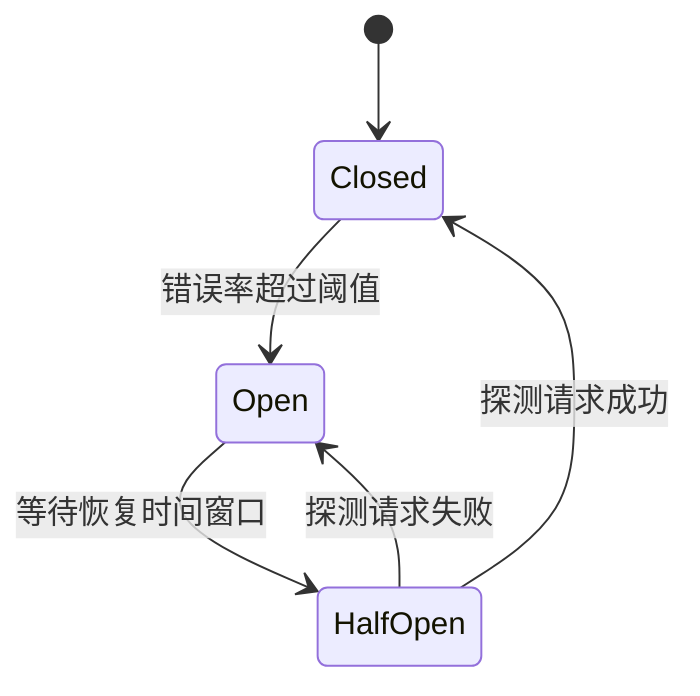

# 接口限流与熔断

限流（Rate Limiting）和熔断（Circuit Breaker）是构建高可用后端服务的两大稳定性基石。限流保护服务不被过量请求压垮；熔断防止故障在服务间级联扩散。

## 限流

### 常见算法

**固定窗口（Fixed Window）**：
时间切成等长窗口（如每分钟），窗口内计数超限则拒绝请求。实现简单但存在窗口边界突刺问题（跨窗口实际 QPS 可达限额 2 倍）。

**滑动窗口（Sliding Window）**：
用队列记录请求时间戳，每次请求时清除窗口外的旧记录，再计数。更平滑，消耗更多内存。

**令牌桶（Token Bucket）**：
以固定速率向桶中添加令牌，每次请求消耗一个令牌，桶空则拒绝。允许短时突发（突发量 = 桶容量），是最常用的生产方案。

**漏桶（Leaky Bucket）**：
请求入队，以固定速率出队处理，超出队列容量则丢弃。严格平滑输出速率，适合对下游有严格流量要求的场景。

### Node.js 实现（express-rate-limit + Redis）

```ts
import rateLimit from 'express-rate-limit';
import RedisStore from 'rate-limit-redis';
import { createClient } from 'redis';

const redisClient = createClient({ url: process.env.REDIS_URL });
await redisClient.connect();

// 全局限流：每 IP 每分钟最多 100 次
export const globalLimiter = rateLimit({
  windowMs: 60 * 1000,
  max: 100,
  standardHeaders: true,  // 返回 RateLimit-* 响应头
  legacyHeaders: false,
  store: new RedisStore({
    sendCommand: (...args: string[]) => redisClient.sendCommand(args),
  }),
  handler: (_req, res) => {
    res.status(429).json({ message: 'Too many requests, please try again later.' });
  },
});

// 登录接口专用：每 IP 每 15 分钟最多 5 次，防暴力破解
export const loginLimiter = rateLimit({
  windowMs: 15 * 60 * 1000,
  max: 5,
  store: new RedisStore({
    sendCommand: (...args: string[]) => redisClient.sendCommand(args),
  }),
});
```

```ts
import express from 'express';
import { globalLimiter, loginLimiter } from './middleware/rateLimiter';

const app = express();
app.use(globalLimiter);                         // 全局应用
app.post('/auth/login', loginLimiter, loginHandler); // 登录接口加强限流
```

### 基于用户 ID 的限流（已登录用户）

```ts
export const userLimiter = rateLimit({
  windowMs: 60 * 1000,
  max: 200,
  keyGenerator: (req) => req.userId ?? req.ip, // 已登录用 userId，未登录用 IP
  store: new RedisStore({ sendCommand: (...args) => redisClient.sendCommand(args) }),
});
```

### 响应头规范（RateLimit Headers）

```
RateLimit-Limit: 100
RateLimit-Remaining: 43
RateLimit-Reset: 1718000060
Retry-After: 30   # 429 时返回，告知客户端等待秒数
```

## 熔断

### 熔断器三态



| 状态 | 行为 |
|---|---|
| Closed（关闭） | 正常通行，持续统计错误率 |
| Open（打开） | 直接拒绝请求（快速失败），不再调用下游 |
| Half-Open（半开） | 放行少量探测请求，判断下游是否恢复 |

### Node.js 实现（opossum 库）

```ts
import CircuitBreaker from 'opossum';
import axios from 'axios';

async function callPaymentService(orderId: string) {
  return axios.post('http://payment-service/charge', { orderId });
}

const breaker = new CircuitBreaker(callPaymentService, {
  timeout: 3000,          // 3 秒超时视为失败
  errorThresholdPercentage: 50, // 错误率 50% 触发熔断
  resetTimeout: 10000,    // 10 秒后进入 Half-Open
  volumeThreshold: 5,     // 至少 5 次请求才统计错误率
});

breaker.fallback((orderId: string) => {
  // 降级方案：返回默认值或排队重试
  console.warn(`Payment service unavailable, order ${orderId} queued`);
  return { status: 'pending', message: '支付服务暂时不可用，将自动重试' };
});

breaker.on('open', () => console.error('Circuit breaker OPEN'));
breaker.on('halfOpen', () => console.info('Circuit breaker HALF-OPEN'));
breaker.on('close', () => console.info('Circuit breaker CLOSED'));

// 使用
export async function chargeOrder(orderId: string) {
  return breaker.fire(orderId);
}
```

## 限流 vs 熔断

| 维度 | 限流 | 熔断 |
|---|---|---|
| 保护对象 | 保护**本服务**不被上游打垮 | 保护**调用链**不被下游故障拖垮 |
| 触发条件 | 请求量/速率超过阈值 | 下游错误率/超时率超过阈值 |
| 拒绝来源 | 拒绝入站请求 | 拦截出站调用 |
| 典型位置 | API 网关、接口层 | 服务调用客户端 |

## 最佳实践

- **分层限流**：网关层（全局）+ 接口层（业务特定）+ 用户层（区分 VIP 和普通用户）。
- **区分正常与恶意流量**：对已认证用户放宽限额，对未认证 IP 从严。
- **熔断降级要有 fallback**：熔断后返回缓存数据、默认值或友好提示，而非直接 500。
- **监控告警**：将限流触发次数、熔断状态变化接入监控大盘（Prometheus + Grafana 或云监控）。

## 面试常问

- **令牌桶和漏桶的区别**：令牌桶允许突发（桶中积累的令牌可短时爆发消耗）；漏桶以恒定速率处理，严格平滑，不允许突发。
- **为什么用 Redis 做限流而不用本地内存**：多实例部署时本地内存各节点独立计数，限额实际变成 N 倍；Redis 提供跨实例的集中计数。
- **熔断打开后如何恢复**：经过 `resetTimeout` 进入 Half-Open，放行一批探测请求；成功率恢复则关闭熔断，失败则重新打开。
- **如何防止 429 对用户体验的影响**：在响应头返回 `Retry-After`，客户端按指数退避重试；对关键请求做请求排队而非直接拒绝。
