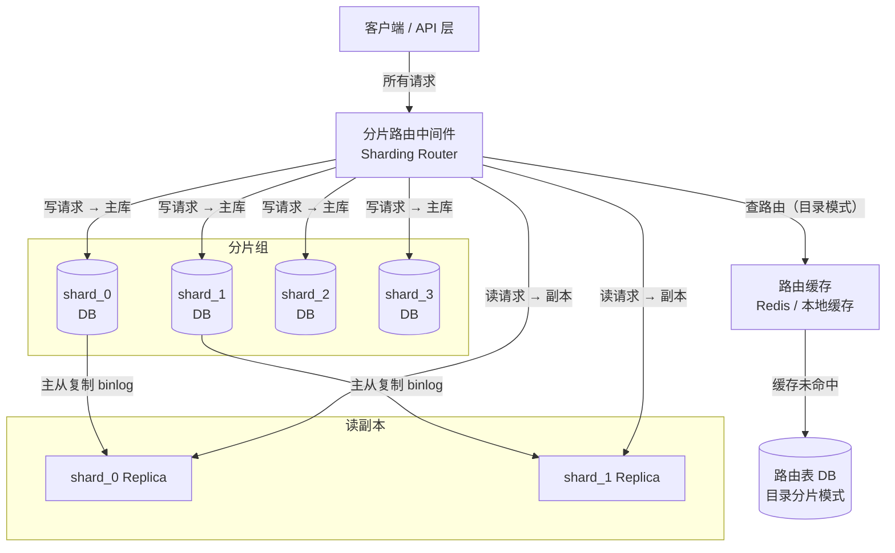

当单表数据量突破千万行，查询响应时间从毫秒级劣化到秒级，或单机磁盘已无法容纳增量数据时，数据库的水平扩展就成了必须面对的工程课题。分库分表（Database Sharding）与读写分离（Read-Write Splitting）是这条路上最核心的两种手段，两者解决的问题维度不同，工程实践中往往叠加使用。

## 为什么需要分库分表

MySQL InnoDB 的 B+ 树索引在单表行数超过约 2000 万后，树高会从 3 层增长到 4 层，每次查询多一次磁盘 I/O，查询性能出现明显拐点。更底层的限制来自单机资源上限：

- **存储上限**：单机磁盘容量有限，日志类、对话历史类数据每天写入几亿行，几个月就能把单机撑满。
- **写入 QPS**：MySQL 单机写入上限约 2000–5000 QPS（取决于硬件），并发写高时出现锁等待和队列积压。
- **连接数**：单库连接池上限通常几百到千，高并发下连接耗尽是常见故障。

> **对 Agent 后端的意义**：大规模 LLM 应用中，每次对话会写入多轮消息记录，Agent 执行链写入 Tool Call 日志、步骤状态。如果所有 Agent Session 都落在同一张表，百万用户场景下这张表会以每天数亿行的速度膨胀，分表几乎是必然选项。

## 垂直拆分 vs 水平拆分

拆分有两个正交维度：按"列"拆（垂直）还是按"行"拆（水平）。

| 维度 | 垂直拆分（Vertical Sharding） | 水平拆分（Horizontal Sharding） |
|------|-------------------------------|----------------------------------|
| 拆分对象 | 表的列 / 库的业务 | 表的行 |
| 解决问题 | 宽表、业务耦合 | 单表数据量过大 |
| 结构变化 | 多张结构不同的表 | 多张结构相同的表 |
| 跨分片查询 | 跨库 JOIN 变难 | 跨分片 JOIN / 排序变难 |
| 扩容方式 | 按业务继续拆 | 增加分片数量 |
| 常见场景 | 微服务拆库、宽表瘦身 | 订单表、日志表、消息表 |

### 垂直拆分

**垂直分库**：将不同业务的表迁移到独立数据库，降低单库负载并实现业务解耦。

```
拆分前：monolith_db
  ├── users / profiles
  ├── orders / order_items
  ├── products / categories
  └── agent_sessions / agent_logs

拆分后：
  user_db     → users, profiles
  order_db    → orders, order_items
  product_db  → products, categories
  agent_db    → agent_sessions, agent_logs   ← AI 业务独立库
```

**垂直分表**：将宽表中低频访问的大字段（`TEXT`、`BLOB`、`JSON`）拆到独立表，减少热表行宽，让 Buffer Pool 缓存更多有效行。

```sql
-- 拆分前：users（id, name, email, avatar_url, bio, settings_json, …）
-- 拆分后：
CREATE TABLE users_core (
  id       BIGINT PRIMARY KEY,
  name     VARCHAR(64) NOT NULL,
  email    VARCHAR(128) NOT NULL
);  -- 高频访问，行小，缓存命中率高

CREATE TABLE users_profile (
  user_id       BIGINT PRIMARY KEY,
  bio           TEXT,
  settings_json JSON
);  -- 低频访问，单独读取
```

### 水平分表（Sharding）

水平分表将同一张表的行按某个维度（Sharding Key）散布到多张结构相同的表或多个库中。

```
orders_0  → user_id % 4 == 0 的订单
orders_1  → user_id % 4 == 1 的订单
orders_2  → user_id % 4 == 2 的订单
orders_3  → user_id % 4 == 3 的订单
```

## 分片键（Sharding Key）选择原则

分片键是水平拆分中最关键的设计决策，一旦上线极难更改。

**核心原则：**

1. **均匀分布**：各分片数据量、写入 QPS 尽量均衡，避免热点分片成为瓶颈。
2. **业务查询友好**：绝大多数查询能通过分片键定位到单个分片，减少跨分片 Scatter-Gather。
3. **高基数**（High Cardinality）：分片键的取值数量要远大于分片数，否则无法均匀分布。
4. **不可变性**：分片键一旦写入不应修改，否则需要跨分片迁移行。

**常见选择：**

- `user_id`：按用户维度查询的场景（如消息记录、订单）最合适。
- `order_id`（雪花 ID）：订单服务中按 ID 直查的场景。
- `tenant_id`：SaaS 多租户场景，天然隔离。
- **不推荐 `created_at`**：时间戳会导致所有新写入集中在最后一个分片（热点写入），参见"常见误区"。

## 分片策略对比

| 策略 | 规则 | 优点 | 缺点 |
|------|------|------|------|
| Hash 取模（Hash Mod） | `shard = key % N` | 分布均匀，实现简单 | 扩容需迁移约 `(N-1)/N` 的数据 |
| 一致性哈希（Consistent Hash） | 虚拟环映射 | 扩容只迁移相邻节点数据 | 实现复杂，分布可能不够均匀 |
| 范围分片（Range） | `id [0, 1M) → shard0` | 扩容简单，范围查询高效 | 新数据集中在末尾，写热点 |
| 目录分片（Directory / Lookup） | 路由表记录每个 key 的分片 | 灵活，支持任意分布 | 路由表本身成为单点，需缓存 |

目录分片（路由表）是最灵活的方案，适合需要自定义数据分布或在线迁移数据的场景：

```sql
-- 路由表：记录每个 tenant 属于哪个分片
CREATE TABLE shard_routing (
  tenant_id  BIGINT PRIMARY KEY,
  shard_id   TINYINT NOT NULL,
  created_at TIMESTAMP DEFAULT CURRENT_TIMESTAMP
);

-- 查询时先查路由表，再去对应分片
-- SELECT shard_id FROM shard_routing WHERE tenant_id = ?
-- 然后连接 shard_{shard_id}.agent_sessions
```

## 路由架构图



## TypeScript 分片路由中间件示例

下面是一个中间件层路由骨架，封装了 Hash 取模和目录分片两种模式，外部调用无需感知底层分片细节。

```typescript
// shard-router.ts
import { DataSource } from 'typeorm';

type ShardStrategy = 'hash' | 'directory';

interface ShardConfig {
  strategy: ShardStrategy;
  totalShards: number;
  dataSources: DataSource[];        // 每个分片对应一个 DataSource（含读写分离配置）
  lookupFn?: (key: string | number) => Promise<number>; // 目录分片的路由查找函数
}

export class ShardRouter {
  constructor(private config: ShardConfig) {}

  /**
   * 根据 Sharding Key 解析目标 DataSource
   */
  async resolve(shardingKey: string | number): Promise<DataSource> {
    let shardIndex: number;

    if (this.config.strategy === 'hash') {
      // Hash 取模：key 转为数字后取模
      const numKey = typeof shardingKey === 'string'
        ? this.hashString(shardingKey)
        : shardingKey;
      shardIndex = numKey % this.config.totalShards;

    } else {
      // 目录分片：查路由表（通常加缓存）
      if (!this.config.lookupFn) throw new Error('lookupFn required for directory strategy');
      shardIndex = await this.config.lookupFn(shardingKey);
    }

    return this.config.dataSources[shardIndex];
  }

  /**
   * 跨分片 Scatter-Gather：向所有分片并发查询，应用层归并
   */
  async scatterQuery<T>(
    queryFn: (ds: DataSource, shardIndex: number) => Promise<T[]>
  ): Promise<T[]> {
    const results = await Promise.all(
      this.config.dataSources.map((ds, idx) => queryFn(ds, idx))
    );
    return results.flat();
  }

  private hashString(str: string): number {
    let hash = 0;
    for (let i = 0; i < str.length; i++) {
      hash = (hash * 31 + str.charCodeAt(i)) >>> 0; // 无符号右移保持正整数
    }
    return hash;
  }
}

// ---- 使用示例 ----

const router = new ShardRouter({
  strategy: 'hash',
  totalShards: 4,
  dataSources: [ds0, ds1, ds2, ds3],
});

// 单分片写入：Agent Session 按 userId 路由
async function createAgentSession(userId: number, sessionData: object) {
  const ds = await router.resolve(userId);
  await ds.getRepository(AgentSession).save({ userId, ...sessionData });
}

// 跨分片分页（谨慎使用）：全局最新 10 条日志
async function getLatestLogs(limit = 10) {
  const allLogs = await router.scatterQuery(async (ds) =>
    ds.getRepository(AgentLog)
      .createQueryBuilder('log')
      .orderBy('log.createdAt', 'DESC')
      .limit(limit)      // 每个分片取 limit 条
      .getMany()
  );
  // 应用层归并排序，取最终 Top N
  return allLogs
    .sort((a, b) => b.createdAt.getTime() - a.createdAt.getTime())
    .slice(0, limit);
}
```

## 读写分离（Read-Write Splitting）

读写分离与分库分表是正交的优化：前者解决读多写少场景下的读 QPS 瓶颈，后者解决数据量和写 QPS 的瓶颈，实际系统常常同时使用。

**架构要点：**

- 主库（Master）处理所有写操作，通过 binlog 异步/半同步复制到一个或多个从库（Replica）。
- 读请求路由到从库，多个从库间做负载均衡（Round Robin 或最小连接数）。
- 从库只读，禁止应用写入。

**主从延迟（Replication Lag）** 是读写分离最常见的踩坑点：

- 正常情况延迟在毫秒级，网络抖动或从库性能不足时可达秒级。
- 写后立即读可能读到旧数据（Read-Your-Own-Writes 问题）。
- 解法：强一致性读强制走主库；或记录最后写入时间戳，读时比对从库延迟。

```typescript
// TypeORM 读写分离配置示例
const dataSource = new DataSource({
  type: 'mysql',
  replication: {
    master: {
      host: 'master.db.internal',
      port: 3306,
      username: 'app',
      password: process.env.DB_PASSWORD,
      database: 'agent_db',
    },
    slaves: [
      { host: 'replica1.db.internal', port: 3306, username: 'app', password: process.env.DB_PASSWORD, database: 'agent_db' },
      { host: 'replica2.db.internal', port: 3306, username: 'app', password: process.env.DB_PASSWORD, database: 'agent_db' },
    ],
  },
});

// 普通查询走从库（TypeORM 默认）
const sessions = await dataSource.getRepository(AgentSession).find({ where: { userId } });

// 强制走主库：支付后查余额 / 写后立即读
const qr = dataSource.createQueryRunner('master');
try {
  const freshBalance = await qr.manager.findOneBy(Account, { userId });
} finally {
  await qr.release();
}
```

## 分布式 ID：Snowflake 算法

分表后各表的 `AUTO_INCREMENT` 独立计数，会产生跨表 ID 冲突，必须使用全局唯一 ID 方案。

| 方案 | 原理 | 优点 | 缺点 |
|------|------|------|------|
| UUID v4 | 随机 128 bit | 无需中心节点 | 无序，B+ 树写入碎片化，索引性能差 |
| 雪花算法（Snowflake） | 时间戳 + 机器 ID + 序列号 | 趋势递增，高性能，可反解时间 | 依赖时钟，时钟回拨风险 |
| 数据库号段模式 | 批量预分配 ID 段 | 简单可靠，无时钟依赖 | 服务重启浪费号段；号段服务单点 |
| Redis INCR | 原子自增 | 极简 | 依赖 Redis 可用性；持久化风险 |

**Snowflake 64-bit 结构：**

```
┌──┬───────────────────────────────────────────┬──────────────┬────────────┐
│0 │         41 bit 毫秒时间戳（相对纪元）       │  10 bit 机器 │ 12 bit 序列│
│符│  (2^41 ms ≈ 69 年，自 2010 纪元起)         │  ID（最多    │ 号（每毫秒 │
│号│                                            │  1024 节点） │ 最多 4096）│
└──┴───────────────────────────────────────────┴──────────────┴────────────┘
```

```typescript
// 简化版 Snowflake 实现
class SnowflakeIdGen {
  private sequence = 0;
  private lastTimestamp = -1n;
  private readonly machineId: bigint;
  private readonly epoch = 1577836800000n; // 2020-01-01 纪元

  constructor(machineId: number) {
    this.machineId = BigInt(machineId & 0x3FF); // 10 bit
  }

  nextId(): bigint {
    let ts = BigInt(Date.now());
    if (ts < this.lastTimestamp) throw new Error('Clock moved backwards');
    if (ts === this.lastTimestamp) {
      this.sequence = (this.sequence + 1) & 0xFFF; // 12 bit
      if (this.sequence === 0) ts = this.waitNextMs(ts);
    } else {
      this.sequence = 0;
    }
    this.lastTimestamp = ts;
    return ((ts - this.epoch) << 22n) | (this.machineId << 12n) | BigInt(this.sequence);
  }

  private waitNextMs(current: bigint): bigint {
    let ts = BigInt(Date.now());
    while (ts <= current) ts = BigInt(Date.now());
    return ts;
  }
}
```

## 分表后的查询挑战

### 跨分片 JOIN

跨分片 JOIN 无法下推到数据库执行，必须在应用层拉取两端数据后合并，大数据量时性能极差。最佳实践是通过冗余字段消除 JOIN，或将关联数据路由到同一分片（同一 user_id 的 orders 和 messages 落在同一分片）。

### 跨分片分页

```
需求：查询全局最新 10 条 Agent 日志（按时间排序 + OFFSET 分页）

问题：数据分布在 4 个分片，无法直接 ORDER BY + LIMIT

方案 1（适合小分片数）：
  → 各分片分别查 LIMIT 10 → 应用层归并排序 → 取 Top 10
  缺点：OFFSET 越大，每个分片要查的行越多，性能随 OFFSET 线性下降

方案 2（推荐）：
  → 引入 Elasticsearch 冗余存储日志摘要，专门处理全局搜索/排序
  → DB 分片保留完整数据，ES 只做索引
```

### Agent 后端实践：对话历史分表策略

对于存储 LLM 多轮对话的 `messages` 表，推荐按 `session_id`（由 `user_id` 生成的雪花 ID）做 Hash 分片：

- 每次对话查询只需命中单个分片（session 内所有消息的 session_id 相同）。
- 历史消息冷热分离：超过 90 天的消息归档到冷存储（如 OSS + Parquet），热表保留近期数据。
- Tool Call 日志量级更大，可单独建表并按 `agent_run_id` 分片。

## 常见误区

**误区 1：用 `created_at`（时间戳）做分片键**

时间戳做分片键在范围分片下是灾难：所有新写入永远落在时间最新的分片，导致该分片写入 QPS 远高于其他分片（写热点），而旧分片空闲浪费资源。如果需要按时间查询，应把时间作为二级索引，而非分片键。

**误区 2：过早分库，在单表千万行之前就分**

分库分表会引入分布式 ID、跨分片查询、分布式事务、运维复杂度等一系列成本。单表通过合理索引、读写分离、冷热分离通常能支撑数亿行。过早分库是"为了架构而架构"，得不偿失。经验法则：先优化索引 → 读写分离 → 冷热分离 → 最后才考虑分表。

**误区 3：分片数选小了，之后扩容痛苦**

Hash 取模分片在扩容时需要迁移约 `(N-1)/N` 比例的数据。初始设计时应预留扩展空间，分片数选 2 的幂次（4、8、16、32），扩容时每次翻倍，迁移量可通过一致性哈希或在线双写降低风险。

**误区 4：读写分离后忽视主从延迟**

开发环境通常用单机 DB，没有主从延迟，上线后才发现"写后读"不一致。应在代码 Review 阶段识别所有"写后立即读"场景，强制走主库或加版本号校验。

## 面试常问

- **什么时候需要分表？** 单表超过数千万行且加索引、读写分离后查询仍然慢；或单机写入 QPS 达到瓶颈。分表代价高，应作为最后手段。

- **分片键选错了怎么办？** 代价极高。需要停服迁移或在线双写：先写新分片方案，异步迁移历史数据，迁移完成后切换读流量，再下线旧方案。在线迁移通常需要数周。

- **为什么不推荐跨库 JOIN？** 跨库 JOIN 无法在数据库层执行，必须在应用层拉取两端全量数据后合并，大数据量时网络传输和内存开销不可接受，且难以保证一致性。

- **雪花 ID 时钟回拨怎么处理？** 常见方案：检测到回拨时抛出异常（拒绝生成）；或等待时钟追上；或记录上次时间戳，回拨时在序列号维度打补丁。生产中应启用 NTP 时钟同步并监控时钟偏移。

- **分布式事务如何处理？** 常用方案：Saga 模式（本地事务 + 补偿操作）；TCC（Try-Confirm-Cancel）；基于消息队列的最终一致性（事务消息）。强一致性要求高时选 TCC，吞吐量优先选 Saga + 消息队列。

- **读写分离主从延迟如何监控？** 在从库执行 `SHOW SLAVE STATUS`，观察 `Seconds_Behind_Master` 字段；或通过 Prometheus + mysqld_exporter 采集 `mysql_slave_lag_seconds` 指标，设置告警阈值（通常 >1s 触发告警）。
