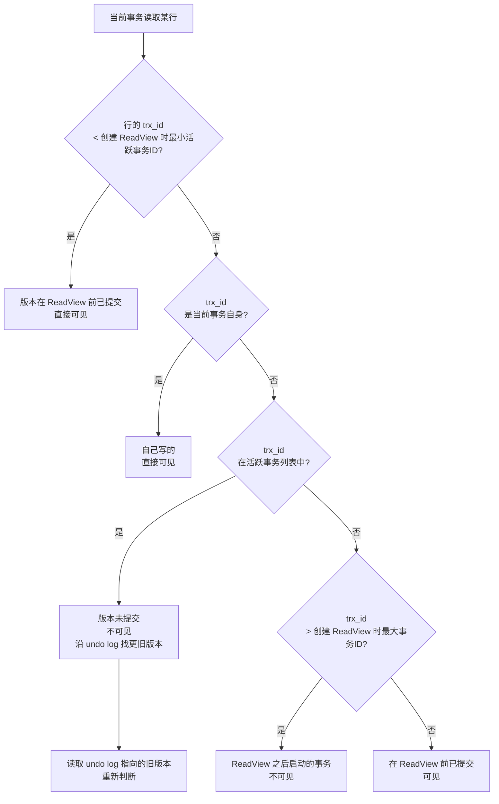

*图：沿图中的节点与箭头阅读，重点是ACID、隔离现象、MVCC、记录/间隙锁和死锁处理放进同一并发时间线。*

---

事务（Transaction）与锁（Lock）是数据库保证数据正确性的两大基石。在并发写入、多步骤业务操作等场景下，理解这两个机制的原理，是设计可靠后端服务——尤其是 Agent 工具调用链——的必备基础。

## ACID：事务的四大保证

事务的核心价值由四个特性定义，通称 ACID：

**Atomicity（原子性）** 事务内的所有操作构成一个不可分割的单元：要么全部成功提交，要么全部回滚。银行转账"扣款+入账"必须同时成功或同时撤销，绝不能只完成一半。InnoDB 通过 **undo log** 记录操作前的数据快照，保证回滚能还原到初始状态。

**Consistency（一致性）** 事务执行前后，数据库必须从一个满足约束的合法状态迁移到另一个合法状态。一致性是业务层的语义目标，原子性、隔离性、持久性三者共同支撑它。

**Isolation（隔离性）** 并发运行的事务之间互不干扰，每个事务感觉自己在独占数据库。隔离的程度由**隔离级别**控制，级别越高，一致性越强，但并发性能越低。

**Durability（持久性）** 事务一旦提交，结果永久保存，即使系统宕机也不丢失。InnoDB 通过 **redo log**（WAL 预写日志）在数据真正写入磁盘前先持久化操作记录，崩溃恢复时可重放日志。

## 事务隔离级别与并发问题

### 三类并发异常

在多个事务并行执行时，可能出现三类数据异常：

- **脏读（Dirty Read）**：事务 A 读到了事务 B **未提交**的数据。若 B 回滚，A 读到的是"幻象"数据。
- **不可重复读（Non-Repeatable Read）**：同一事务内对同一行执行两次 SELECT，结果不同——因为另一个事务在两次读之间**提交了修改**。
- **幻读（Phantom Read）**：同一事务内对同一条件执行两次范围查询，返回的**行数**不同——因为另一个事务在两次读之间**插入或删除了行**。

### 四个隔离级别对照

| 隔离级别 | 脏读 | 不可重复读 | 幻读 | 说明 |
|---|---|---|---|---|
| READ UNCOMMITTED | 可能 | 可能 | 可能 | 最低级别，几乎不用 |
| READ COMMITTED | 否 | 可能 | 可能 | Oracle/PostgreSQL 默认 |
| REPEATABLE READ | 否 | 否 | 可能* | MySQL InnoDB 默认，*通过 MVCC+间隙锁基本消除 |
| SERIALIZABLE | 否 | 否 | 否 | 最高级别，性能最差 |

MySQL InnoDB 在 **REPEATABLE READ** 级别下，普通 SELECT 走快照读（MVCC），`SELECT ... FOR UPDATE` 走当前读并加 Next-Key Lock，两者配合基本消除幻读。（参见 [MySQL 8.4 InnoDB transaction isolation levels](https://docs.oracle.com/cd/E17952_01/mysql-8.4-en/innodb-transaction-isolation-levels.html)；参见 [MySQL 8.4 InnoDB locking](https://docs.oracle.com/cd/E17952_01/mysql-8.4-en/innodb-locking.html)）

## MVCC：InnoDB 的多版本并发控制

MVCC（Multi-Version Concurrency Control）的核心思想是：**读不加锁，写不阻塞读**，通过维护数据的多个历史版本实现非锁定读。

### 关键数据结构

每行数据隐式含有两个字段：
- `trx_id`：最近一次修改该行的事务 ID。
- `roll_pointer`：指向 undo log 中上一个版本的指针，构成版本链。

### ReadView（读视图）

事务在第一次执行快照读时，InnoDB 生成一个 **ReadView**，记录当时活跃（未提交）的事务 ID 集合，用于判断版本链中哪个版本对当前事务可见：



**READ COMMITTED** 每次 SELECT 都生成新 ReadView，所以能看到其他事务最新提交。**REPEATABLE READ** 事务内只在第一次快照读时生成 ReadView，后续复用同一个，保证重复读结果一致。

## 锁的类型体系

### 共享锁与排他锁

| 锁类型 | 标记 | 加锁语句 | 兼容性 |
|---|---|---|---|
| 共享锁（Shared Lock） | S | `SELECT ... LOCK IN SHARE MODE` | S 与 S 兼容，S 与 X 不兼容 |
| 排他锁（Exclusive Lock） | X | `SELECT ... FOR UPDATE` / `INSERT` / `UPDATE` / `DELETE` | X 与任何锁不兼容 |

### 意向锁（Intention Lock）

意向锁是**表级锁**，用于快速判断表中是否已有行级锁，避免加表锁时逐行检查。

- **IS（意向共享锁）**：事务准备在某行加 S 锁前，先在表上加 IS。
- **IX（意向排他锁）**：事务准备在某行加 X 锁前，先在表上加 IX。

意向锁之间完全兼容，只有在申请表级 S/X 锁时才与 IX/IS 产生冲突。

### 行锁的三种形式

InnoDB 的行锁基于**索引**实现，不走索引会退化为表锁：

**记录锁（Record Lock）** 锁定索引上的**单个记录**，精确锁一行。

```sql
-- 走主键等值查询，加记录锁
SELECT * FROM orders WHERE id = 100 FOR UPDATE;
```

**间隙锁（Gap Lock）** 锁定索引记录之间的**间隙**，不锁记录本身，只阻止在该间隙内插入新行，专门用于防止幻读。例如索引值 (10, 20) 之间的间隙锁，阻止插入 id=15 的行。

**临键锁（Next-Key Lock）** = 记录锁 + 其左侧间隙锁，是 InnoDB 在 RR 级别下的**默认行锁**。例如锁定 (10, 20] 这个左开右闭区间。范围查询时，InnoDB 会对扫描到的每个索引记录加临键锁。

```sql
-- 范围查询，加 Next-Key Lock，锁住 (10, 20] 及之后的间隙
SELECT * FROM orders WHERE id > 10 AND id <= 20 FOR UPDATE;
```

## 死锁检测与处理

死锁（Deadlock）发生在两个事务互相等待对方持有的锁，形成循环依赖：

```
事务 A: 持有 row_1 的锁 → 等待 row_2 的锁
事务 B: 持有 row_2 的锁 → 等待 row_1 的锁  →  死锁！
```

InnoDB 提供两种处理机制：

| 机制 | 原理 | 配置参数 | 适用场景 |
|---|---|---|---|
| 超时回滚 | 等待锁超时后，主动回滚当前事务 | `innodb_lock_wait_timeout`（默认 50s） | 简单场景，延迟高 |
| 主动检测 | 维护等待图（Wait-for Graph），发现环路立即回滚代价小的事务 | `innodb_deadlock_detect=ON`（默认开启） | 高并发首选，延迟低 |

**预防死锁的实践原则：**
1. 多个事务访问多行时，始终按**相同顺序**加锁（如按主键升序）。
2. 缩短事务，减少持有锁的时间窗口。
3. 查询走索引，避免范围扫描升级为表锁。

## TypeORM 事务代码示例

```typescript
import { DataSource, QueryRunner } from 'typeorm';

// 方式一：QueryRunner —— 推荐，完全控制事务生命周期
async function transferBalance(
  dataSource: DataSource,
  fromId: number,
  toId: number,
  amount: number,
): Promise<void> {
  const qr: QueryRunner = dataSource.createQueryRunner();
  await qr.connect();
  await qr.startTransaction();

  try {
    // FOR UPDATE 加排他锁，防止并发超扣
    const from = await qr.manager
      .getRepository(Account)
      .createQueryBuilder('a')
      .setLock('pessimistic_write')       // SELECT ... FOR UPDATE
      .where('a.id = :id', { id: fromId })
      .getOneOrFail();

    if (from.balance < amount) throw new Error('余额不足');

    await qr.manager.decrement(Account, { id: fromId }, 'balance', amount);
    await qr.manager.increment(Account, { id: toId }, 'balance', amount);

    await qr.commitTransaction();
  } catch (err) {
    await qr.rollbackTransaction();
    throw err;
  } finally {
    await qr.release();
  }
}

// 方式二：dataSource.transaction 包装器 —— 适合简短事务
await dataSource.transaction(async (manager) => {
  await manager.save(Order, newOrder);
  await manager.decrement(Inventory, { sku: newOrder.sku }, 'stock', 1);
});
```

### TypeORM 乐观锁

```typescript
import { Entity, PrimaryGeneratedColumn, Column, VersionColumn } from 'typeorm';

@Entity()
export class Product {
  @PrimaryGeneratedColumn()
  id: number;

  @Column()
  stock: number;

  @VersionColumn()          // 自动管理版本号，UPDATE 时加 WHERE version = ?
  version: number;
}

// 使用：直接 save，version 不匹配时抛出 OptimisticLockVersionMismatchError
try {
  await productRepository.save(product);
} catch (e) {
  if (e instanceof OptimisticLockVersionMismatchError) {
    // 重新读取最新版本，合并后重试
  }
}
```

## 乐观锁 vs 悲观锁

| 维度 | 乐观锁（Optimistic Lock） | 悲观锁（Pessimistic Lock） |
|---|---|---|
| 核心假设 | 冲突概率低，提交时再校验 | 冲突概率高，操作前先加锁 |
| 实现方式 | 版本号（version）/ 时间戳（updated_at） | `SELECT ... FOR UPDATE` / `LOCK IN SHARE MODE` |
| 并发性能 | 高（无锁等待） | 低（锁等待阻塞） |
| 冲突处理 | 重试或返回错误 | 等待锁释放 |
| 适用场景 | 读多写少、冲突概率低 | 写多、竞争激烈、重试代价高 |
| 典型例子 | 商品详情编辑、配置更新 | 库存扣减、账户余额操作 |

选择原则：**重试成本低 → 乐观锁；重试成本高或冲突率超过 20% → 悲观锁**。

## Agent 后端的意义：幂等性设计

在 AI Agent 场景下，工具调用（Tool Call）失败后会自动重试。若工具函数内有数据库写操作，重试可能导致**重复写入**，引发双扣款、重复创建订单等严重问题。

**解决方案：幂等键（Idempotency Key）+ 唯一约束**

```typescript
// Agent 调用层传入幂等键（通常为 tool_call_id）
async function createOrderIdempotent(
  dataSource: DataSource,
  payload: CreateOrderDto,
  idempotencyKey: string,   // 来自 LLM tool_call_id 或 Agent 生成的 UUID
): Promise<Order> {
  return dataSource.transaction(async (manager) => {
    // 1. 先查重：唯一键命中则直接返回，不重复写
    const existing = await manager.findOne(Order, {
      where: { idempotencyKey },
    });
    if (existing) return existing;

    // 2. 首次写入，数据库层对 idempotency_key 加唯一索引兜底
    const order = manager.create(Order, { ...payload, idempotencyKey });
    return manager.save(order);
  });
}
```

**数据库层兜底：**

```sql
ALTER TABLE orders ADD UNIQUE INDEX uk_idempotency_key (idempotency_key);
```

这样即使应用层并发重试，唯一索引会让第二次插入抛出重复键错误，事务自动回滚，保证最终只有一条记录写入。

**乐观锁天然适合 Agent 的状态更新**：Agent 读取任务状态 → 决策 → 更新状态，整个流程可用版本号保护，避免两个 Agent 实例并发修改同一任务状态。

## 常见误区

**误区一：事务内调用外部 HTTP 接口**

```typescript
// ❌ 危险写法
await dataSource.transaction(async (manager) => {
  await manager.save(order);
  await httpClient.post('/payment-gateway', payload);  // 网络超时 → 事务回滚，但第三方可能已收款！
  await manager.save(paymentRecord);
});
```

外部 HTTP 调用不受数据库事务管辖，一旦超时或失败，数据库回滚而第三方操作无法撤销，形成数据不一致。正确做法：先提交数据库事务，再调用外部接口；或采用事务发件箱模式（Transactional Outbox）。

**误区二：长事务（Long-Running Transaction）**

长事务的危害：
1. 长时间持有行锁/间隙锁，阻塞其他事务，拖垮并发吞吐。
2. undo log 无法被 purge 清理，导致表空间膨胀，甚至引发 MySQL `History list length` 过大。
3. 主从复制延迟：大事务在主库提交后，从库需要重放完整 binlog，造成延迟。

**解决方案**：拆分大事务为小批次，使用游标分页分批提交；业务查询与写入分离，避免事务内执行耗时 SELECT。

**误区三：乐观锁重试不加退避**

```typescript
// ❌ 没有退避的暴力重试，高并发下加剧冲突
while (true) {
  try {
    await productRepository.save(product);
    break;
  } catch (e) { /* 立刻重试 */ }
}

// ✅ 指数退避 + 最大重试次数
for (let i = 0; i < 3; i++) {
  try {
    await productRepository.save(product);
    break;
  } catch (e) {
    if (!(e instanceof OptimisticLockVersionMismatchError) || i === 2) throw e;
    await sleep(50 * 2 ** i);   // 50ms → 100ms → 200ms
    product = await productRepository.findOneByOrFail({ id: product.id });
  }
}
```

## 面试常问要点

**Q：MVCC 是什么？解决了什么问题？**
多版本并发控制，InnoDB 通过 undo log 为每行维护版本链，读操作基于 ReadView 访问历史快照，实现"读不加锁、写不阻塞读"，大幅提升并发性能。

**Q：REPEATABLE READ 如何防止幻读？**
两条防线：普通 SELECT 走快照读（MVCC），整个事务复用同一 ReadView；`SELECT ... FOR UPDATE` 走当前读，InnoDB 对扫描到的索引范围加 Next-Key Lock，阻止其他事务在该范围插入新行。

**Q：间隙锁会锁住哪个范围？**
锁住的是索引记录之间的**开区间**，如索引值 (10, 20) 代表 id 在 11 到 19 之间不允许插入。Next-Key Lock 则是 (10, 20]，包含右边界记录本身。

**Q：为什么 InnoDB 行锁基于索引？**
InnoDB 的行锁锁定的是**索引项**，不走索引时无法定位具体索引项，退化为全表扫描并对所有扫描到的索引记录加锁，效果近似表锁。

**Q：乐观锁和悲观锁如何选型？**
库存扣减、账户余额等冲突概率高、重试代价大 → 悲观锁（FOR UPDATE）；配置项修改、文档协作编辑等冲突概率低 → 乐观锁（version 字段）。Agent 场景中的工具幂等性优先用唯一键约束兜底，状态更新可用乐观锁。

**Q：如何排查线上死锁？**

```sql
-- 查看最近一次死锁详情
SHOW ENGINE INNODB STATUS\G

-- 查看当前锁等待情况（MySQL 8.0+）
SELECT * FROM performance_schema.data_lock_waits;
SELECT * FROM performance_schema.data_locks;
```

## 参考资料

- [MySQL 8.4 InnoDB transaction isolation levels](https://docs.oracle.com/cd/E17952_01/mysql-8.4-en/innodb-transaction-isolation-levels.html)
- [MySQL 8.4 InnoDB locking](https://docs.oracle.com/cd/E17952_01/mysql-8.4-en/innodb-locking.html)
