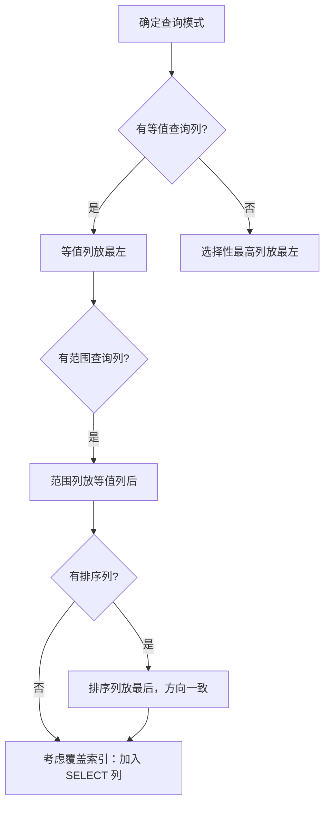

索引（Index）是数据库提升查询性能的核心机制，本质上是用空间换时间的数据结构。对于 AI/Agent 后端工程师来说，无论是存储用户会话、向量元数据，还是构建 RAG 系统的检索层，索引设计直接决定了服务的吞吐瓶颈。

## B+ 树：InnoDB 索引的底层结构

MySQL InnoDB 引擎默认采用 **B+ 树（B+ Tree）** 作为索引结构。理解它是理解一切索引行为的基础。

B+ 树是多路平衡搜索树，与 B 树的核心区别在于：

- **非叶节点只存键值**，不存数据行，可容纳更多键，树高更低（通常 3-4 层）。
- **所有数据行（或主键引用）只存在叶子节点**，查询路径固定，性能稳定。
- **叶子节点以双向链表相连**，天然支持范围扫描（`BETWEEN`、`ORDER BY`、`>/<`）。

```
                   [50]
                  /     \
           [20|30]       [70|80]
          /   |   \       |    \
       [10] [25] [35]   [60]  [90]
        ↔    ↔    ↔      ↔     ↔   ← 叶子链表（顺序连接）
```

### 聚簇索引 vs 二级索引

这是 InnoDB 中最重要的概念对，必须透彻理解。

**聚簇索引（Clustered Index）**：叶子节点直接存放完整的行数据，InnoDB 以主键构建聚簇索引，一张表只能有一个。数据的物理存储顺序与主键顺序一致。

**二级索引（Secondary Index，非主键索引）**：叶子节点存放的不是完整行数据，而是 **索引列值 + 主键值**。当查询需要获取索引列以外的字段时，必须用这个主键值再次查询聚簇索引，这个额外的一次查找称为 **回表（Table Lookup）**。


回表意味着两次 B+ 树查找，高并发下是性能的隐患。后文的覆盖索引正是消除回表的手段。

## 索引类型对比

| 类型 | 英文 | 唯一性 | 允许 NULL | 说明 |
|------|------|--------|-----------|------|
| 主键索引 | Primary Key | 是 | 否 | 聚簇存储，每表一个 |
| 唯一索引 | Unique Index | 是 | 是（多个 NULL） | 约束重复值，可回表 |
| 普通索引 | Normal Index | 否 | 是 | 最常用，无约束 |
| 复合索引 | Composite Index | 可选 | 是 | 多列组合，遵循最左前缀 |
| 全文索引 | Full-Text Index | 否 | 否 | InnoDB 5.6+ 支持，倒排结构 |
| 前缀索引 | Prefix Index | 可选 | 是 | 对长字符串取前 N 字节建索引 |

> 对于 Agent 后端：全文索引（FULLTEXT）是在 MySQL 内实现关键词检索的低成本方案；RAG 场景中若数据量不大，可用 `MATCH ... AGAINST` 替代向量数据库，降低架构复杂度。

## 最左前缀原则（Leftmost Prefix Rule）

复合索引 `(a, b, c)` 在 B+ 树中以 `a → b → c` 的顺序组织排序，因此必须从最左列开始连续使用。

```sql
-- 假设建立复合索引：INDEX idx_abc (a, b, c)

-- ✅ 命中索引
SELECT * FROM t WHERE a = 1;
SELECT * FROM t WHERE a = 1 AND b = 2;
SELECT * FROM t WHERE a = 1 AND b = 2 AND c = 3;
SELECT * FROM t WHERE a = 1 AND b > 2;      -- a 用等值，b 用范围；c 无法继续使用

-- ❌ 不命中索引（跳过了最左列 a）
SELECT * FROM t WHERE b = 2;
SELECT * FROM t WHERE b = 2 AND c = 3;

-- ⚠️ 部分命中（a 命中，但 c 跳过了 b，c 无法使用索引）
SELECT * FROM t WHERE a = 1 AND c = 3;      -- 仅 a 列走索引
```

**关键推论**：范围查询（`>`、`<`、`BETWEEN`、`LIKE 'x%'`）之后的列无法继续利用索引过滤，但可以用来做**索引覆盖**。设计复合索引时，等值查询列应尽量靠前，范围查询列放后面。

## 覆盖索引（Covering Index）

当查询所需的所有列（`SELECT` + `WHERE` + `ORDER BY`）都已包含在某个索引中，MySQL 可以直接从索引返回结果，**无需回表**，这种情况称为覆盖索引。

EXPLAIN 中 `Extra: Using index` 是覆盖索引的标志。

```sql
-- 表: users(id, name, age, email, bio)
-- 索引: INDEX idx_name_age (name, age)

-- ✅ 覆盖索引：查询列 (name, age) 全在索引里
SELECT name, age FROM users WHERE name = 'Alice';
-- Extra: Using index

-- ❌ 非覆盖：email 不在索引里，需要回表
SELECT name, age, email FROM users WHERE name = 'Alice';
-- Extra: (空) 或 Using where
```

**高频接口优化技巧**：对 Agent 对话历史表（`session_id, user_id, created_at, content`）中，若频繁按 `session_id` 分页拉取 `user_id` 和 `created_at`，可建 `INDEX(session_id, created_at, user_id)` 覆盖索引，彻底消除回表。

## EXPLAIN 执行计划解读

```sql
EXPLAIN SELECT * FROM orders WHERE user_id = 100 AND status = 1;
```

```
+----+-------------+--------+------+------------------+---------+------+-------+-------------+
| id | select_type | table  | type | possible_keys    | key     | rows | Extra |
+----+-------------+--------+------+------------------+---------+------+-------+-------------+
|  1 | SIMPLE      | orders | ref  | idx_user_status  | idx_... |   5  | Using index condition |
+----+-------------+--------+------+------------------+---------+------+-------+-------------+
```

### type 字段：性能从好到差

| type 值 | 含义 | 性能 |
|---------|------|------|
| `system` | 表只有一行 | 最优 |
| `const` | 主键或唯一索引等值匹配，最多一行 | 极优 |
| `eq_ref` | JOIN 时被驱动表走主键/唯一索引 | 优 |
| `ref` | 普通索引等值匹配，可能多行 | 良 |
| `range` | 索引范围扫描（`>`/`BETWEEN`/`IN`） | 尚可 |
| `index` | 全索引扫描（遍历整棵索引树） | 差 |
| `ALL` | 全表扫描 | 最差，需优化 |

### Extra 字段关键值

| Extra 值 | 含义 | 应对 |
|----------|------|------|
| `Using index` | 覆盖索引，无回表 | 理想状态 |
| `Using where` | 索引过滤后仍需额外条件判断 | 通常正常 |
| `Using filesort` | 排序无法利用索引，需额外排序操作 | 考虑调整索引列顺序 |
| `Using temporary` | 使用了临时表（GROUP BY/DISTINCT） | 优化 SQL 或加索引 |
| `Using index condition` | 索引条件下推（ICP），减少回表次数 | MySQL 5.6+ 自动优化 |

## 索引失效场景

以下操作会导致索引无法被使用，产生全表扫描：

```sql
-- 1. 对索引列使用函数或表达式
SELECT * FROM t WHERE YEAR(create_time) = 2024;       -- ❌ 失效
SELECT * FROM t WHERE create_time >= '2024-01-01'
  AND create_time < '2025-01-01';                      -- ✅ 有效

-- 2. 隐式类型转换（列为 VARCHAR，传入数字）
SELECT * FROM t WHERE phone = 13800138000;             -- ❌ 失效（MySQL 将 phone 转为数字）
SELECT * FROM t WHERE phone = '13800138000';           -- ✅ 有效

-- 3. LIKE 以通配符开头
SELECT * FROM t WHERE name LIKE '%Alice';              -- ❌ 失效
SELECT * FROM t WHERE name LIKE 'Alice%';              -- ✅ 有效（前缀匹配）

-- 4. OR 条件中存在未索引列
-- a 有索引，b 无索引 → 整体退化为全表扫描
SELECT * FROM t WHERE a = 1 OR b = 2;                 -- ❌ b 无索引时失效

-- 5. NOT IN / NOT EXISTS（优化器可能放弃索引）
SELECT * FROM t WHERE id NOT IN (1, 2, 3);            -- ⚠️ 视数据量决定

-- 6. 索引列参与计算
SELECT * FROM t WHERE id + 1 = 10;                    -- ❌ 失效
SELECT * FROM t WHERE id = 9;                         -- ✅ 有效
```

## 复合索引设计原则



**核心原则总结**：

1. **高选择性（Cardinality）列优先**：`user_id`（百万级不同值）优先于 `status`（只有几个枚举值）。
2. **等值 → 范围 → 排序**：`WHERE a = ? AND b > ? ORDER BY c` 对应索引 `(a, b, c)`。
3. **兼顾覆盖**：将 `SELECT` 中的高频列纳入复合索引末尾，消除回表。
4. **避免冗余**：`(a)` 和 `(a, b)` 同时存在时，`(a)` 完全冗余可删除。
5. **控制总数**：单表索引一般不超过 5-6 个，写密集表更要谨慎。

## TypeORM 中创建索引

在 TypeScript 后端（如 NestJS + TypeORM）中，索引通过装饰器声明：

```typescript
import {
  Entity,
  PrimaryGeneratedColumn,
  Column,
  Index,
  CreateDateColumn,
} from 'typeorm';

// 单列索引
@Entity('agent_sessions')
@Index('idx_user_created', ['userId', 'createdAt'])        // 复合索引
@Index('idx_session_status', ['sessionId', 'status'])      // 复合索引
export class AgentSession {
  @PrimaryGeneratedColumn('uuid')
  id: string;

  @Column({ type: 'varchar', length: 64 })
  @Index()                                                  // 普通单列索引
  sessionId: string;

  @Column({ type: 'bigint' })
  userId: number;

  @Column({ type: 'tinyint', default: 0 })
  status: number;

  @Column({ type: 'text', nullable: true })
  content: string;

  @CreateDateColumn()
  createdAt: Date;
}
```

```typescript
// 唯一索引：防止重复提交
@Entity('agent_tools')
export class AgentTool {
  @PrimaryGeneratedColumn()
  id: number;

  @Column()
  @Index({ unique: true })              // 唯一索引
  toolName: string;

  @Column({ type: 'varchar', length: 32 })
  version: string;
}
```

```typescript
// QueryRunner 手动执行 DDL（迁移脚本中常用）
import { MigrationInterface, QueryRunner } from 'typeorm';

export class AddAgentSessionIndex1700000000000 implements MigrationInterface {
  async up(queryRunner: QueryRunner): Promise<void> {
    await queryRunner.query(`
      CREATE INDEX idx_user_created
      ON agent_sessions (user_id, created_at DESC)
    `);
  }

  async down(queryRunner: QueryRunner): Promise<void> {
    await queryRunner.query(`DROP INDEX idx_user_created ON agent_sessions`);
  }
}
```

## Agent 后端意义：全文检索与向量索引

对于 **RAG（Retrieval-Augmented Generation）** 系统，检索层是关键路径：

- **MySQL FULLTEXT 全文索引**：基于倒排索引（Inverted Index），适合中小规模文档的关键词召回。可作为 Embedding 向量检索的补充，实现混合检索（Hybrid Search）。

```sql
-- 创建全文索引
ALTER TABLE knowledge_chunks ADD FULLTEXT INDEX ft_content (content);

-- 使用自然语言模式检索
SELECT id, title, MATCH(content) AGAINST ('Agent workflow 工具调用') AS score
FROM knowledge_chunks
WHERE MATCH(content) AGAINST ('Agent workflow 工具调用' IN NATURAL LANGUAGE MODE)
ORDER BY score DESC
LIMIT 10;
```

- **向量索引**：MySQL 8.4 开始原生支持 `VECTOR` 类型与 ANN 近似最近邻搜索（`VECTOR INDEX`），可存储 Embedding 向量并做语义检索，降低对独立向量数据库（Milvus/Qdrant）的依赖。

```sql
-- MySQL 8.4+ 向量列与索引（简化示意）
CREATE TABLE doc_embeddings (
  id BIGINT PRIMARY KEY AUTO_INCREMENT,
  doc_id BIGINT NOT NULL,
  embedding VECTOR(1536) NOT NULL,   -- OpenAI text-embedding-3-small 维度
  VECTOR INDEX idx_vec (embedding)   -- ANN 索引
);
```

即使不使用原生向量索引，合理设计普通索引（按 `tenant_id`、`knowledge_base_id`、`created_at` 分区过滤）也能大幅缩减向量召回前的候选集，是 Agent 系统性能优化的低成本手段。

## 常见误区

**误区一：索引越多越好**
索引需要维护。每次 `INSERT`/`UPDATE`/`DELETE` 都要同步更新所有相关索引的 B+ 树，写密集的表（如 Agent 日志表、消息流水）堆砌索引会严重影响写吞吐。

**误区二：对频繁更新的列加索引**
例如 `last_active_at` 每次请求都更新，在其上建索引会使每次更新都触发 B+ 树重新平衡，得不偿失。可考虑延迟写入或冷热分离。

**误区三：前缀索引一定节省空间**
前缀索引（`INDEX(email(20))`）减少了索引体积，但无法用于覆盖索引，因为前缀不等于完整列值，仍需回表。

**误区四：`IN (...)` 一定走 range 扫描**
`IN` 中的值过多时（通常超过数百个），优化器可能放弃索引走全表扫描，应限制 `IN` 的列表长度或改写为子查询。

**误区五：`NULL` 列无法建索引**
InnoDB 支持对 `NULL` 列建索引，`NULL` 值会被存储在索引中。但 `WHERE col IS NULL` 是否走索引取决于数据分布和优化器决策。

## 面试常问

**Q：为什么 InnoDB 选择 B+ 树而不是 B 树或哈希索引？**
B+ 树叶子链表原生支持范围查询和排序；B 树数据分散在各层，范围扫描需要回溯；哈希索引只支持等值查找，不支持范围、排序和 LIKE 前缀，场景受限。

**Q：聚簇索引和非聚簇索引的区别？**
聚簇索引叶子节点即数据行本身（物理存储有序）；非聚簇索引（二级索引）叶子节点存主键值，查完整行需回表。InnoDB 每表必须有聚簇索引，优先取主键，无主键则取第一个唯一非空索引，否则生成隐藏 rowid。

**Q：什么是回表，如何避免？**
二级索引查询到主键后，再去聚簇索引取完整行的过程叫回表（二次查找）。通过**覆盖索引**（将查询列纳入索引）可完全避免。

**Q：联合索引字段顺序如何确定？**
遵循"等值列在左，范围/排序列在右，高选择性在前"的原则，同时考虑是否能构成覆盖索引以消除回表。

**Q：EXPLAIN type = ALL 如何优化？**
全表扫描，首先确认是否缺少索引；其次检查 WHERE 条件是否触发了索引失效场景（函数、类型不匹配、前通配符等）；最后考虑查询本身是否可以改写。

**Q：大表加索引如何不影响线上服务？**
MySQL 5.6+ 支持 `ALTER TABLE ... ADD INDEX` 的在线 DDL（Online DDL），默认采用 `ALGORITHM=INPLACE, LOCK=NONE`，不会长时间锁表。也可借助 `pt-online-schema-change` 或 `gh-ost` 工具做零停机迁移。
