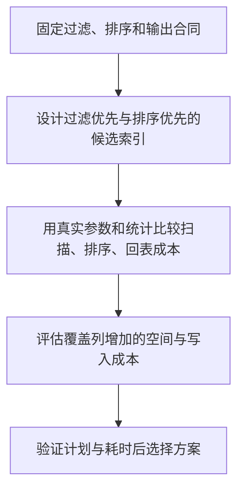

索引（Index）是数据库提升查询性能的核心机制，本质上是用空间换时间的数据结构。对于 AI/Agent 后端工程师来说，无论是存储用户会话、向量元数据，还是构建 RAG 系统的检索层，索引设计可能影响扫描与回表成本，实际吞吐还要看查询、写入、锁和资源。

本文SQL、迁移SQL片段均为未在完整项目运行的示意；应用字段到物理列名的映射须在实际项目核对。讨论InnoDB时以MySQL8.4为基准。

## 贯穿案例：联合索引怎样处理租户订单

查询租户A已付款订单，按创建时间展示最近20条。候选键为 `(tenant_id,status,created_at,id)`。前两列等值把扫描限定在A/paid组，时间与唯一id提供稳定排序；只取索引中已有字段时有机会减少回表。若业务改为查询全部租户并按时间排序，原键先按租户组织，不能照搬这条有序扫描路径。

再看约束：`UNIQUE(tenant_id,event_id)`可避免同一非空事件身份重复，MySQL可空唯一键允许多个NULL，所以未知event_id不能直接成为可靠去重依据。持久化与消息消费还须把事件账本和业务变更放在同一事务，见[异步任务与幂等](../api/async-job-queue.md)。

在相同数据、查询参数和返回合同下，读EXPLAIN的实际键、扫描区间、过滤及排序；有需要时在受控环境运行EXPLAIN ANALYZE，因为它会实际执行。这里没有运行数据库，因此不提供伪造耗时。“索引可用”“优化器选择它”“使用后更快”是三个不同问题。

## B+ 树：InnoDB 索引的底层结构

MySQL InnoDB 引擎默认采用 **B+ 树（B+ Tree）** 作为索引结构。理解它是理解一切索引行为的基础。

B+ 树是多路平衡搜索树，与 B 树的核心区别在于：

- **非叶节点只存键值**，不存完整行，扇出与高度取决于页大小、键宽和数据量。
- **所有数据行（或主键引用）只存在叶子节点**，具体访问成本仍受扫描范围、缓存与回表影响。
- **叶子节点以双向链表相连**，天然支持范围扫描（`BETWEEN`、`ORDER BY`、`>/<`）。

```
                   [50]
                  /     \
           [20|30]       [70|80]
          /   |   \       |    \
       [10] [25] [35]   [60]  [90]
        ↔    ↔    ↔      ↔     ↔   ← 叶子链表（顺序连接）
```

### 聚簇索引 vs 二级索引

这是 InnoDB 中最重要的概念对，必须透彻理解。

**聚簇索引（Clustered Index）**：叶子节点直接存放完整的行数据，InnoDB 以主键构建聚簇索引，一张表只能有一个。行由聚簇索引按键组织，但这不意味着物理磁盘块处处连续或I/O成本固定。（参见 [MySQL 8.4 Reference: InnoDB Index Types](https://docs.oracle.com/cd/E17952_01/mysql-8.4-en/innodb-index-types.html)）

**二级索引（Secondary Index，非主键索引）**：叶子节点存放的不是完整行数据，而是 **索引列值 + 主键值**。当查询需要获取索引列以外的字段时，必须用这个主键值再次查询聚簇索引，这个额外的一次查找称为 **回表（Table Lookup）**。


```mermaid
flowchart LR
    A[查询: SELECT * FROM users WHERE email = 'a@x.com'] --> B[二级索引\nemail → user_id=42]
    B -->|回表| C[聚簇索引\nuser_id=42 → 完整行数据]
    C --> D[返回结果]
```

回表意味着两次 B+ 树查找，高并发下是性能的隐患。后文的覆盖索引正是消除回表的手段。

## 索引类型对比

| 类型 | 英文 | 唯一性 | 允许 NULL | 说明 |
|------|------|--------|-----------|------|
| 主键索引 | Primary Key | 是 | 否 | 聚簇存储，每表一个 |
| 唯一索引 | Unique Index | 是 | 是（多个 NULL） | 约束重复值，可回表 |
| 普通索引 | Normal Index | 否 | 是 | 最常用，无约束 |
| 复合索引 | Composite Index | 可选 | 是 | 多列组合，遵循最左前缀 |
| 全文索引 | Full-Text Index | 否 | 可为空，NULL不产生检索词项 | InnoDB支持，倒排结构，NULL语义见[8.4表15.2](https://docs.oracle.com/cd/E17952_01/mysql-8.4-en/create-index.html) |
| 前缀索引 | Prefix Index | 可选 | 是 | 对字符串前缀建索引；非二进制字符串长度按字符，二进制字符串按字节 |

> 对于 Agent 后端：全文索引（FULLTEXT）是在 MySQL 内实现关键词检索的低成本方案；RAG 场景中若数据量不大，可用 `MATCH ... AGAINST` 替代向量数据库，降低架构复杂度。

## 最左前缀原则（Leftmost Prefix Rule）

复合索引 `(a, b, c)` 在 B+ 树中以 `a → b → c` 的顺序组织排序，前导等值条件通常有利于定位连续范围；MySQL8.4在限定条件下也可能用skip scan，不能把缺前导列直接判为绝对未使用索引。

```sql
-- 假设建立复合索引：INDEX idx_abc (a, b, c)

-- ✅ 命中索引
SELECT * FROM t WHERE a = 1;
SELECT * FROM t WHERE a = 1 AND b = 2;
SELECT * FROM t WHERE a = 1 AND b = 2 AND c = 3;
SELECT * FROM t WHERE a = 1 AND b > 2;      -- a定位、b范围；后续列仍可能参与过滤/覆盖

-- 缺前导列：普通前缀定位受限，是否skip scan/全索引扫描须看实际plan
SELECT * FROM t WHERE b = 2;
SELECT * FROM t WHERE b = 2 AND c = 3;

-- a可缩小范围，c仍可能用于索引内过滤；是否采用何种路径看plan
SELECT * FROM t WHERE a = 1 AND c = 3;      -- a定位，c可能用于索引内过滤
```

**关键推论**：范围查询（`>`、`<`、`BETWEEN`、`LIKE 'x%'`）之后的列通常不能像连续等值前缀一样缩小扫描区间，但仍可能用于索引条件下推、覆盖等。设计复合索引时，等值查询列应尽量靠前，范围查询列放后面。

## 覆盖索引（Covering Index）

当查询所需的所有列（`SELECT` + `WHERE` + `ORDER BY`）都已包含在某个索引中，MySQL 可以直接从索引返回结果，**无需回表**，这种情况称为覆盖索引。

EXPLAIN 中 `Extra: Using index` 是覆盖索引的标志。

```sql
-- 表: users(id, name, age, email, bio)
-- 索引: INDEX idx_name_age (name, age)

-- ✅ 覆盖索引：查询列 (name, age) 全在索引里
SELECT name, age FROM users WHERE name = 'Alice';
-- Extra: Using index

-- ❌ 非覆盖：email 不在索引里，需要回表
SELECT name, age, email FROM users WHERE name = 'Alice';
-- Extra: (空) 或 Using where
```

**高频接口优化技巧**：对 Agent 对话历史表（`session_id, user_id, created_at, content`）中，若频繁按 `session_id` 分页拉取 `user_id` 和 `created_at`，可建 `INDEX(session_id, created_at, user_id)` 覆盖索引，彻底消除回表。

## EXPLAIN 执行计划解读

[MySQL 8.4 EXPLAIN 文档](https://docs.oracle.com/cd/E17952_01/mysql-8.4-en/explain.html) 定义了访问类型、候选/实际使用索引和额外执行信息；优化时要验证计划，而不是只凭索引名称判断是否命中。


```sql
EXPLAIN SELECT * FROM orders WHERE user_id = 100 AND status = 1;
```

```
+----+-------------+--------+------+------------------+---------+------+-------+-------------+
| id | select_type | table  | type | possible_keys    | key     | rows | Extra |
+----+-------------+--------+------+------------------+---------+------+-------+-------------+
|  1 | SIMPLE      | orders | ref  | idx_user_status  | idx_... |   5  | Using index condition |
+----+-------------+--------+------+------------------+---------+------+-------+-------------+
```

### type 字段：访问方式不是完整性能排行

以下成本提示均需要结合行数、扫描与返回合同，不作为访问类型的性能次序。

| type 值 | 含义 | 性能 |
|---------|------|------|
| `system` | 表只有一行 | 单行访问 |
| `const` | 主键或唯一索引等值匹配，最多一行 | 单行定位 |
| `eq_ref` | JOIN时被驱动表唯一定位 | 成本还与外层行数有关 |
| `ref` | 普通索引等值匹配，可能多行 | 看实际命中量 |
| `range` | 索引范围扫描 | 看范围宽度与回表 |
| `index` | 全索引扫描 | 看索引大小与覆盖成本 |
| `ALL` | 全表扫描 | 输出占多数或表很小时可能合理 |

### Extra 字段关键值

| Extra 值 | 含义 | 应对 |
|----------|------|------|
| `Using index` | 覆盖索引，无回表 | 理想状态 |
| `Using where` | 索引过滤后仍需额外条件判断 | 通常正常 |
| `Using filesort` | 排序无法利用索引，需额外排序操作 | 考虑调整索引列顺序 |
| `Using temporary` | 使用了临时表（GROUP BY/DISTINCT） | 优化 SQL 或加索引 |
| `Using index condition` | 索引条件下推（ICP），减少回表次数 | MySQL 5.6+ 自动优化 |

## 索引失效场景

以下写法可能限制普通索引的定位区间；表达式索引、版本、参数与统计会改变计划，示例不作为绝对失效判据：

```sql
-- 1. 对索引列使用函数或表达式
SELECT * FROM t WHERE YEAR(create_time) = 2024;       -- 普通索引定位可能受限
SELECT * FROM t WHERE create_time >= '2024-01-01'
  AND create_time < '2025-01-01';                      -- 保持原列的范围/等值条件

-- 2. 隐式类型转换（列为 VARCHAR，传入数字）
SELECT * FROM t WHERE phone = 13800138000;             -- 普通索引定位可能受限（MySQL 将 phone 转为数字）
SELECT * FROM t WHERE phone = '13800138000';           -- 保持原列的范围/等值条件

-- 3. LIKE 以通配符开头
SELECT * FROM t WHERE name LIKE '%Alice';              -- 普通索引定位可能受限
SELECT * FROM t WHERE name LIKE 'Alice%';              -- 保持原列的范围/等值条件（前缀匹配）

-- 4. OR 条件中存在未索引列
-- a有索引、b无索引，简单Index Merge受限；实际是否全扫描看成本
SELECT * FROM t WHERE a = 1 OR b = 2;                 -- 是否全扫描由实际成本决定

-- 5. NOT IN / NOT EXISTS（优化器可能放弃索引）
SELECT * FROM t WHERE id NOT IN (1, 2, 3);            -- ⚠️ 视数据量决定

-- 6. 索引列参与计算
SELECT * FROM t WHERE id + 1 = 10;                    -- 普通索引定位可能受限
SELECT * FROM t WHERE id = 9;                         -- 保持原列的范围/等值条件
```

## 复合索引设计原则


```mermaid
flowchart TD
    A[固定过滤、排序和输出合同] --> B[设计过滤优先与排序优先的候选索引]
    B --> C[用真实参数和统计比较扫描、排序、回表成本]
    C --> D[评估覆盖列增加的空间与写入成本]
    D --> E[验证计划与耗时后选择方案]
```

**核心原则总结**：

1. **按真实查询设计前导列**：不同值数量不等于某个参数的过滤比例；是否将user_id放在status前，要结合查询是否提供这些条件、数据倾斜、排序与复用成本。
2. **同时评估过滤和排序**：`WHERE a = ? AND b > ? ORDER BY c` 使用 `(a,b,c)` 可能过滤较好，却不保证c跨不同b全局有序；根据实际plan比较范围读取后排序与按排序索引过滤。
3. **兼顾覆盖**：将 `SELECT` 中的高频列纳入复合索引末尾，消除回表。
4. **避免冗余**：`(a,b)`可覆盖某些`(a)`查询，但键宽、约束、排序和实际计划不同；确认使用与成本后再删。
5. **控制总数**：没有通用5–6个上限；按实际读写收益、空间、维护与迁移成本管理。

## 应用迁移中怎样保存同一索引合同

ORM实体属性名未必等于数据库物理列名。将候选索引写入迁移前，先核对表、列、顺序、唯一性与NULL语义，再按MySQL8.4在线DDL支持矩阵指定算法与锁要求。无法实际读取维护者版本API时，不给出可直接运行的ORM装饰器示例。

```sql
-- SQL示意，未在数据库执行；物理列须与实际迁移一致
CREATE INDEX idx_user_created ON agent_sessions (user_id, created_at DESC);
```

加索引仍有元数据锁和资源成本，不能因迁移API调用返回就说线上零影响。

## Agent 后端意义：全文检索与向量检索边界

对于 **RAG（Retrieval-Augmented Generation）** 系统，检索层是关键路径：

- **MySQL FULLTEXT 全文索引**：基于倒排索引（Inverted Index），适合中小规模文档的关键词召回。可作为 Embedding 向量检索的补充，实现混合检索（Hybrid Search）。

```sql
-- 创建全文索引
ALTER TABLE knowledge_chunks ADD FULLTEXT INDEX ft_content (content);

-- 使用自然语言模式检索
SELECT id, title, MATCH(content) AGAINST ('Agent workflow 工具调用') AS score
FROM knowledge_chunks
WHERE MATCH(content) AGAINST ('Agent workflow 工具调用' IN NATURAL LANGUAGE MODE)
ORDER BY score DESC
LIMIT 10;
```

- **向量检索要先确认版本与产品形态**：MySQL 8.4 的数据类型中没有 `VECTOR`；MySQL 9.x 虽提供 `VECTOR(N)` 列，但官方文档明确说明该列不能作为任何类型的 key。因此，不能把 `VECTOR INDEX` DDL 当作 MySQL Community Server 的通用能力。需要 ANN 检索时，应按实际部署选择专用向量数据库或具备向量检索能力的云产品，并单独验证版本、版本形态与索引语法。

```sql
-- 在 MySQL 中先用普通索引缩小租户与知识库范围，
-- 再把候选 ID 交给实际的向量检索层做语义排序。
CREATE INDEX idx_chunk_scope
ON knowledge_chunks (tenant_id, knowledge_base_id, created_at);

SELECT id
FROM knowledge_chunks
WHERE tenant_id = ? AND knowledge_base_id = ?
ORDER BY created_at DESC
LIMIT 1000;
```

即使不使用原生向量索引，合理设计普通索引（按 `tenant_id`、`knowledge_base_id`、`created_at` 分区过滤）也能大幅缩减向量召回前的候选集，是 Agent 系统性能优化的低成本手段。

## 常见误区

**误区一：索引越多越好**
索引需要维护。每次 `INSERT`/`UPDATE`/`DELETE` 都要同步更新所有相关索引的 B+ 树，写密集的表（如 Agent 日志表、消息流水）堆砌索引会严重影响写吞吐。

**误区二：对频繁更新的列加索引**
例如 `last_active_at` 每次请求都更新，在其上建索引会增加索引维护，不是每次都重平衡；是否值得取决于读取收益和实际写入成本。可考虑延迟写入或冷热分离。

**误区三：前缀索引一定节省空间**
前缀索引（`INDEX(email(20))`）减少了索引体积，但无法用于覆盖索引，因为前缀不等于完整列值，仍需回表。

**误区四：`IN (...)` 一定走 range 扫描**
`IN` 中的值过多时（受分布与优化器资源、成本影响，没有通用条数门槛），优化器可能放弃索引走全表扫描，应限制 `IN` 的列表长度或改写为子查询。

**误区五：`NULL` 列无法建索引**
InnoDB 支持对 `NULL` 列建索引，`NULL` 值会被存储在索引中。但 `WHERE col IS NULL` 是否走索引取决于数据分布和优化器决策。

## 面试常问

### 从 B+ 树一路答到最左前缀和 EXPLAIN

一条完整回答链可以这样组织：InnoDB 用 B+ 树让非叶节点只承担导航、提高扇出；叶子有序，等值、范围和排序都能沿同一结构完成。聚簇索引叶子保存整行，二级索引叶子保存主键，因此查询可能回表；覆盖索引则直接从二级索引得到所需列。

联合索引 `(a, b, c)` 按完整键的字典序排列。查询要从最左列建立连续可用前缀：`a = ? AND b = ?` 可有效缩小范围；缺少 `a` 通常不能利用这棵树的有序起点；某列进入范围后，右侧列通常不能继续用于缩小扫描区间，但仍可能用于索引下推、覆盖或排序，不能机械回答“范围后全部失效”。

最后必须用 `EXPLAIN` 验证，而不是只看是否出现索引名。关注 `key`、`key_len`、`type`、`rows`、`filtered` 与 `Extra`，再结合真实基数和耗时判断。优化器可能因选择性低、统计过期、隐式转换、函数包裹或回表成本选择全表扫描；“建了索引”不等于“应该强制使用”。

**Q：为什么 InnoDB 选择 B+ 树而不是 B 树或哈希索引？**
B+ 树叶子链表原生支持范围查询和排序；B 树数据分散在各层，范围扫描需要回溯；哈希索引只支持等值查找，不支持范围、排序和 LIKE 前缀，场景受限。

**Q：聚簇索引和非聚簇索引的区别？**
聚簇索引叶子节点即数据行本身（物理存储有序）；非聚簇索引（二级索引）叶子节点存主键值，查完整行需回表。InnoDB 每表必须有聚簇索引，优先取主键，无主键则取第一个唯一非空索引，否则生成隐藏 rowid。

**Q：什么是回表，如何避免？**
二级索引查询到主键后，再去聚簇索引取完整行的过程叫回表（二次查找）。通过**覆盖索引**（将查询列纳入索引）可完全避免。

**Q：联合索引字段顺序如何确定？**
先固定查询族的过滤、排序和输出合同，比较过滤优先与排序优先的候选；前导等值有利于定位，但范围后列、覆盖和写维护仍参与成本，不能机械按列区分度排序。

**Q：EXPLAIN type = ALL 如何优化？**
先确认扫描是不是主要瓶颈及结果是否占多数；合理的全扫描可以保留。再比较候选索引、条件改写、统计与输出成本，保持相同业务语义后复测。

**Q：大表加索引如何不影响线上服务？**
MySQL 5.6+ 支持 `ALTER TABLE ... ADD INDEX` 的在线 DDL（Online DDL），具体操作能否采用INPLACE/LOCK=NONE须查版本和DDL支持矩阵；仍可能有元数据锁等待、资源争用和开始/结束阶段阻塞。显式提出算法/锁要求并在不支持时失败，迁移工具也有负载、触发器/复制及切换边界，不能承诺零影响。

## 面试口述与教学补充

“InnoDB聚簇叶子保存行，二级索引保存索引键和主键，取额外列可能回表。联合索引按列字典序排列，前导等值通常收窄范围，后续列仍可能过滤或覆盖，缺前导列也要看skip scan条件与成本。最后读计划和实际工作量，而不是背访问类型排行榜。唯一约束的NULL语义、写维护和DDL锁边界都需明确。”

以下为教学模拟追问，不是来源面经原题：

- **查询去掉tenant过滤，仍能直接按created_at取最近20条吗？** 原键先按租户排序，不能自然给出跨租户时间全序；重新比较查询与索引。
- **UNIQUE允许NULL，能拿可空event_id去重吗？** 多个NULL合法；在接入时形成稳定非空事件身份或定义其他明确约束。
- **加索引支持LOCK=NONE，意味着线上没有阻塞吗？** 不意味着；核对DDL矩阵、元数据锁和资源预算，做受控迁移并监控。

## 慢日志变量：阈值、开关与执行计划

[MySQL 8.4 慢查询日志](https://dev.mysql.com/doc/refman/8.4/en/slow-query-log.html)中 `slow_query_log` 控制启停，`long_query_time` 以秒为单位，默认值 10，故设置 10 不是十毫秒。`log_slow_admin_statements` 控制指定管理语句是否可进入慢日志，不是另一种耗时阈值；`min_examined_row_limit` 与不使用索引等设置也影响记录条件。先核对实际版本与会话/全局变量生效范围。

收集 SQL、耗时、检查行与上下文，再看执行计划和数据分布，区分索引选择、排序、锁等待和网络因素。慢日志是定位入口，不能从“没有用某索引”直接推断索引语义失效；优化器可能按成本选择扫描。开启日志与详细分析都有资源成本，在可控制的窗口取样并验证前后负载，别把记录所有语句当零成本方案。

## 出现于（热度来源）

<!-- interview-source-history:start -->
- [字节 Agent 开发一面：RAG、AI Coding 与高并发系统（2026 年 8 月）](../../../interview/bytedance/base/bytedance-base-14.md)
- [字节 Agent 开发一面：推理缓存、网络与存储基础（2026 年 8 月）](../../../interview/bytedance/base/bytedance-base-18.md)
- [字节 AI 全栈一面：Pipeline 质量、Doris 与消息轮播（2026 年 9 月）](../../../interview/bytedance/base/bytedance-base-23.md)
- [小红书部分（小红书与百度合并记录）：LangGraph、Skill 与工程校验（2026 年 8 月发帖）](../../../interview/redbook/ai/redbook-ai-2.md)
- [蚂蚁智能体与大模型应用一面：幻觉、Skill 与 RAG（2026 年 5 月）](../../../interview/antfin/ai/antfin-ai-5.md)
- [字节 Agent Infra 校招：运行时、MySQL 与 LRU（2026 年 9 月）](../../../interview/bytedance/base/bytedance-base-25.md)
- [字节飞书 AI 应用一面：Runtime、评测与后端基础（2026 年 9 月发帖）](../../../interview/bytedance/base/bytedance-base-24.md)
- [百度大模型研发一面：Context、Harness 与 RAG（2026 年 8 月）](../../../interview/baidu/ai/baidu-ai-1.md)
- [蚂蚁 AI 开发一面：协作式 Agent、交付门禁与后端基础（2026 年 8 月）](../../../interview/antfin/ai/antfin-ai-4.md)
- [字节 Agent 开发一面：Skill、MCP 与后端基础（2026 年 7 月）](../../../interview/bytedance/base/bytedance-base-15.md)
- [字节 Agent 一面：会话记忆、并发更新与算法](../../../interview/bytedance/base/bytedance-base-29.md)
- [字节全栈二、三面：幂等、索引与字符串匹配](../../../interview/bytedance/base/bytedance-base-32.md)
- [字节 AI 应用一、二面：MySQL、Redis 与编程基础](../../../interview/bytedance/base/bytedance-base-36.md)
- [字节Agent全栈一面：工具、评测与编码](../../../interview/bytedance/base/bytedance-base-40.md)
- [字节 Agent 实习：缓存一致性、定时任务与后端基础](../../../interview/bytedance/base/bytedance-base-47.md)
- [字节后端与 Agent：运行链路、数据库与网络](../../../interview/bytedance/base/bytedance-base-55.md)
- [字节全栈与测试：JVM、并发与 SQL 排查](../../../interview/bytedance/base/bytedance-base-56.md)
<!-- interview-source-history:end -->

## 参考资料

核验于2026-10-02，机制基准MySQL8.4。既有MySQL9.7 VECTOR边界只用于区分产品/版本，不作为本例部署假设；迁移SQL未在数据库运行，不用于证明性能或DDL无阻塞。

- [MySQL 8.4 Reference: InnoDB Index Types](https://docs.oracle.com/cd/E17952_01/mysql-8.4-en/innodb-index-types.html)
- [MySQL 8.4 Reference: EXPLAIN](https://docs.oracle.com/cd/E17952_01/mysql-8.4-en/explain.html)
- [MySQL 8.4 Reference: Data Types](https://dev.mysql.com/doc/refman/8.4/en/data-types.html)
- [MySQL 9.7 Reference: The VECTOR Type](https://dev.mysql.com/doc/refman/9.7/en/vector.html)

- [MySQL8.4：Range optimization / skip scan](https://dev.mysql.com/doc/refman/8.4/en/range-optimization.html)
- [MySQL8.4：CREATE INDEX与唯一NULL](https://dev.mysql.com/doc/refman/8.4/en/create-index.html)
- [MySQL8.4：Online DDL limitations](https://dev.mysql.com/doc/refman/8.4/en/innodb-online-ddl-limitations.html)
