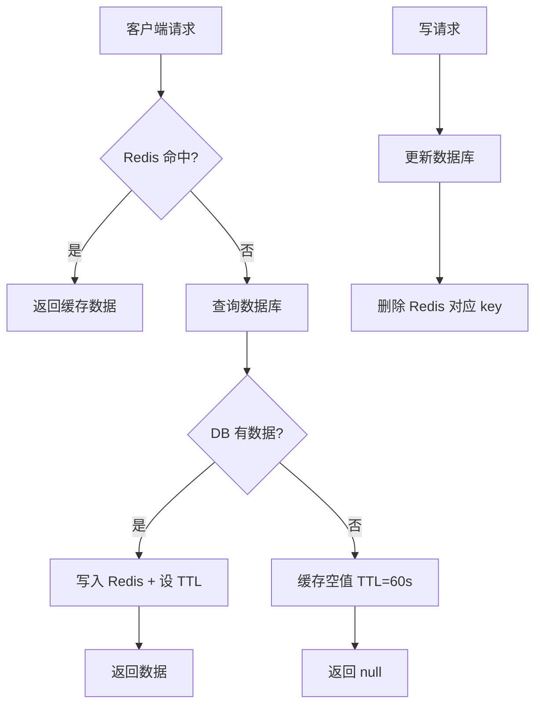
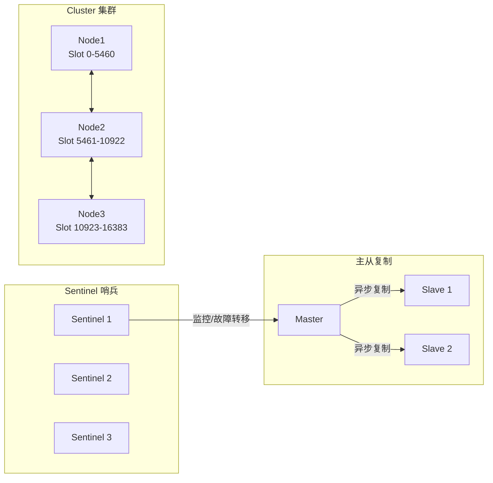

Redis 缓存能大幅降低数据库压力，但使用不当会引发穿透、击穿、雪崩三类经典故障，甚至在 AI Agent 后端造成 LLM 调用成本失控。本文从读写策略选型、三大故障防护、持久化与高可用，到 Semantic Cache 的落地实践，构建一套完整的 Redis 缓存知识体系。

## 缓存读写策略

### 三种策略对比

| 策略 | 读流程 | 写流程 | 优点 | 缺点 | 适用场景 |
|------|--------|--------|------|------|----------|
| **Cache-Aside**（旁路缓存） | 应用先查缓存，未命中再查 DB 并回填 | 应用先写 DB，再删缓存 | 实现简单，可精细控制 | 首次请求有延迟；存在短暂不一致窗口 | 通用场景，Node.js/Spring 最常用 |
| **Write-Through**（同步直写） | 同上 | 应用写缓存层，缓存层同步写 DB | 缓存与 DB 强一致 | 写延迟高；无用数据也占用缓存 | 写频率低、读一致性要求高 |
| **Write-Behind**（异步回写） | 同上 | 应用只写缓存，缓存层异步批量写 DB | 写性能极高 | 宕机丢数据；实现复杂 | 日志聚合、计数器等可容忍丢失的场景 |

### Cache-Aside（旁路缓存）—— 最常用

应用层自己管理缓存读写，数据库是权威数据源（Source of Truth）。

```typescript
// 读：先查缓存，未命中则查 DB 并回填
async function getUser(id: number): Promise<User | null> {
  const cacheKey = `user:${id}`;
  const cached = await redis.get(cacheKey);
  if (cached) return JSON.parse(cached);

  const user = await userRepository.findOneBy({ id });
  if (user) {
    await redis.setex(cacheKey, 3600, JSON.stringify(user));
  }
  return user ?? null;
}

// 写：先更新 DB，再删缓存（而非更新缓存）
async function updateUser(id: number, data: Partial<User>): Promise<void> {
  await userRepository.update(id, data);
  await redis.del(`user:${id}`); // 删除而非更新，避免并发竞争
}
```

**为什么写时删缓存而不是更新缓存？**  
并发场景下，两个写请求先后更新 DB，但回填缓存的顺序可能相反，导致缓存存入旧值。删除是更安全的"懒惰失效（Lazy Invalidation）"方式。

### Cache-Aside 读写流程



---

## 缓存穿透（Cache Penetration）

**定义**：请求的 key 在缓存和数据库中都不存在，每次都穿透缓存直接打到数据库，常见于恶意爬虫或业务逻辑 bug。

### 方案一：缓存空值

对查询为空的 key 也写入缓存，TTL 设短（如 60 秒）：

```typescript
if (!user) {
  await redis.setex(cacheKey, 60, 'NULL'); // 短 TTL 防止内存积压
  return null;
}
```

缺点：对于每次使用不同随机 ID 的恶意攻击无效，会用大量 `NULL` 值撑爆内存。

### 方案二：布隆过滤器（Bloom Filter）

在缓存前置一层布隆过滤器，存储所有合法 key 的哈希指纹。不在过滤器中的请求直接拒绝，不访问数据库。

**核心特性**：
- 判断"不存在"时 100% 准确（无漏判）
- 判断"存在"时有一定误判率（False Positive），可接受
- 标准布隆过滤器不支持删除（需 Counting Bloom Filter）

```typescript
import { createClient } from 'redis';

const redis = createClient();

// 布隆过滤器：用多个哈希函数映射到 Redis BitMap
class BloomFilter {
  private readonly bitSize: number;
  private readonly hashCount: number;
  private readonly redisKey: string;

  constructor(bitSize = 1_000_000, hashCount = 7, redisKey = 'bloom:users') {
    this.bitSize = bitSize;
    this.hashCount = hashCount;
    this.redisKey = redisKey;
  }

  // 简化哈希：生产环境建议用 murmurhash3 等非加密哈希
  private hash(value: string, seed: number): number {
    let h = seed;
    for (let i = 0; i < value.length; i++) {
      h = Math.imul(h ^ value.charCodeAt(i), 0x9e3779b9);
      h ^= h >>> 16;
    }
    return Math.abs(h) % this.bitSize;
  }

  async add(value: string): Promise<void> {
    const pipeline = redis.multi();
    for (let i = 0; i < this.hashCount; i++) {
      pipeline.setBit(this.redisKey, this.hash(value, i), 1);
    }
    await pipeline.exec();
  }

  async exists(value: string): Promise<boolean> {
    const pipeline = redis.multi();
    for (let i = 0; i < this.hashCount; i++) {
      pipeline.getBit(this.redisKey, this.hash(value, i));
    }
    const results = await pipeline.exec() as number[];
    return results.every(bit => bit === 1);
  }
}

// 集成到缓存查询逻辑
const bloom = new BloomFilter();

async function getUserWithBloom(id: number): Promise<User | null> {
  const idStr = String(id);

  // 布隆过滤器前置拦截
  const mayExist = await bloom.exists(idStr);
  if (!mayExist) {
    return null; // 100% 不存在，直接拦截
  }

  const cacheKey = `user:${id}`;
  const cached = await redis.get(cacheKey);
  if (cached) return JSON.parse(cached);

  const user = await userRepository.findOneBy({ id });
  if (user) {
    await redis.setex(cacheKey, 3600, JSON.stringify(user));
  }
  return user ?? null;
}
```

> **Redis Stack 原生支持**：生产环境推荐使用 Redis Stack 的 `BF.ADD` / `BF.EXISTS` 命令，免去自行维护 BitMap 的复杂度。

---

## 缓存击穿（Cache Breakdown）

**定义**：某个**热点 key** 在缓存过期的瞬间，大量并发请求同时穿透到数据库，造成数据库瞬时压力激增。

### 方案一：互斥锁（Mutex Lock）

缓存失效时只允许一个请求重建缓存，其他请求等待或降级返回：

```typescript
async function getHotData(key: string): Promise<Data> {
  const cached = await redis.get(key);
  if (cached) return JSON.parse(cached);

  const lockKey = `lock:${key}`;
  // NX = 不存在才写入，EX = 5 秒过期防死锁
  const locked = await redis.set(lockKey, '1', { NX: true, EX: 5 });

  if (locked) {
    try {
      const data = await db.query(key);
      await redis.setex(key, 3600, JSON.stringify(data));
      return data;
    } finally {
      await redis.del(lockKey); // 必须释放锁
    }
  } else {
    // 未获得锁，短暂等待后重试（或返回降级默认数据）
    await new Promise(resolve => setTimeout(resolve, 50));
    return getHotData(key);
  }
}
```

### 方案二：逻辑过期（Logical Expiration）

Key 永不设 TTL，在 value 中附加逻辑过期时间。到期时异步刷新，读请求直接返回旧值，牺牲一致性换取高可用：

```typescript
interface CacheEntry<T> {
  data: T;
  expireAt: number; // Unix 时间戳（ms）
}

async function getWithLogicalExpiry<T>(
  key: string,
  fetcher: () => Promise<T>,
  ttlMs: number
): Promise<T | null> {
  const raw = await redis.get(key);
  if (!raw) return null; // 冷启动场景需额外预热

  const entry: CacheEntry<T> = JSON.parse(raw);

  if (Date.now() > entry.expireAt) {
    // 异步刷新，不阻塞当前请求
    setImmediate(async () => {
      const fresh = await fetcher();
      const newEntry: CacheEntry<T> = { data: fresh, expireAt: Date.now() + ttlMs };
      await redis.set(key, JSON.stringify(newEntry)); // 不设 Redis TTL
    });
  }

  return entry.data; // 返回旧值
}
```

---

## 缓存雪崩（Cache Avalanche）

**定义**：大量 key **同时过期**，或 Redis 实例宕机，导致所有请求涌入数据库，引发数据库崩溃的连锁反应。

### 解决方案

**1. TTL 随机抖动（Jitter）**

```typescript
const BASE_TTL = 3600;
const jitter = Math.floor(Math.random() * 300); // 0 ~ 300 秒随机值
await redis.setex(key, BASE_TTL + jitter, value);
// 原本同一批次的 key 过期时间被打散，避免同时失效
```

**2. 多级缓存（Multi-Level Cache）**

```
请求 → L1: 进程内缓存（lru-cache / node-cache）→ L2: Redis → L3: 数据库
```

L1 命中率高（微秒级），Redis 宕机时 L1 仍可短时间兜底，大幅降低雪崩传导概率。

**3. 熔断与降级（Circuit Breaker）**

Redis 不可用时，熔断直接降级（返回默认数据或 503），不将压力传导到数据库。可结合 `opossum`（Node.js Circuit Breaker 库）实现。

---

## 缓存一致性：延迟双删策略

Cache-Aside 的写操作存在短暂不一致窗口——先更新 DB、再删缓存期间，其他读请求可能刚好把旧值写回缓存。**延迟双删（Delay Double Delete）**可进一步压缩此窗口：

```typescript
async function updateWithDoubleDelete(id: number, data: Partial<User>): Promise<void> {
  const key = `user:${id}`;

  // 第一次删除（删除旧缓存）
  await redis.del(key);

  // 更新数据库
  await userRepository.update(id, data);

  // 延迟 500ms 后再次删除
  // 目的：覆盖掉更新 DB 期间其他读请求写入的旧缓存
  setTimeout(() => redis.del(key), 500);
}
```

> 注意：延迟双删只能**缩小**不一致窗口，不能完全消除。若需强一致性，需引入分布式锁或基于 Canal 的 Binlog 订阅方案。

---

## Redis 持久化：RDB vs AOF

| 对比维度 | RDB（快照） | AOF（追加日志） | RDB + AOF（推荐生产） |
|---------|------------|----------------|--------------------|
| **持久化方式** | 按时间间隔全量快照 | 记录每条写命令 | 两者结合 |
| **重启恢复速度** | 快（直接加载二进制） | 慢（重放所有命令） | 快（优先用 RDB） |
| **数据丢失风险** | 高（丢失两次快照间的数据） | 低（最多丢失 1 秒，`fsync=everysec`） | 低 |
| **文件体积** | 小 | 大（可 rewrite 压缩） | 中 |
| **适用场景** | 可容忍少量丢失、需快速恢复 | 金融/订单等强一致场景 | 通用生产环境 |

```bash
# redis.conf 启用 RDB + AOF 混合持久化（Redis 4.0+）
appendonly yes
appendfsync everysec       # 每秒 fsync，兼顾性能与安全
aof-use-rdb-preamble yes   # AOF 文件头嵌入 RDB，加速重启
```

---

## Redis 高可用：主从 → 哨兵 → 集群



### 主从复制（Replication）

- Master 处理写请求，Slave 异步同步数据，Slave 可分担读压力
- 异步复制存在复制延迟，Slave 读取可能获得旧数据
- Master 宕机需手动切换，无自动故障转移

### Sentinel（哨兵模式）

- 至少 3 个 Sentinel 节点监控 Master 和 Slave
- Master 宕机时，Sentinel 投票选举新 Master 并自动完成故障转移（Failover）
- 适合数据量不超过单机内存的场景，提供高可用但不提供水平扩容

### Cluster（集群模式）

- 数据按 Hash Slot（共 16384 个）分布在多个 Master 节点
- 每个 Master 可配置 Slave 副本，兼顾高可用与水平扩容
- 客户端需支持 Cluster 协议（`ioredis` 内置支持）
- 跨 slot 的 multi-key 操作受限（需使用 Hash Tag `{tag}` 保证同 slot）

---

## Agent 后端意义：Semantic Cache 减少 LLM 调用成本

对于 AI Agent 后端，LLM API 调用（如 GPT-4、Claude）是最大的成本来源之一。**Semantic Cache（语义缓存）**通过将用户 Prompt 向量化，匹配相似历史问答来复用结果，而不是等待精确字符串匹配。

```typescript
import { createClient } from 'redis';
// 假设使用 @xenova/transformers 或 OpenAI embedding 生成向量
import { embed } from './embeddings';

const redis = createClient(); // 需搭配 RedisSearch / Redis Stack

async function semanticCacheGet(prompt: string, threshold = 0.92): Promise<string | null> {
  const vector = await embed(prompt);

  // 使用 Redis Vector Search（VSS）查找语义相似的历史问题
  const results = await redis.ft.search('idx:semantic_cache', `*=>[KNN 1 @vector $vec AS score]`, {
    PARAMS: { vec: Buffer.from(new Float32Array(vector).buffer) },
    SORTBY: { BY: 'score' },
    RETURN: ['answer', 'score'],
    DIALECT: 2,
  });

  if (results.total === 0) return null;

  const [topResult] = results.documents;
  const similarity = 1 - Number(topResult.value.score); // cosine distance → similarity

  return similarity >= threshold ? String(topResult.value.answer) : null;
}

async function semanticCacheSet(prompt: string, answer: string): Promise<void> {
  const vector = await embed(prompt);
  const key = `semantic:${Date.now()}`;
  await redis.hSet(key, {
    prompt,
    answer,
    vector: Buffer.from(new Float32Array(vector).buffer),
  });
  await redis.expire(key, 86400 * 7); // 语义缓存保留 7 天
}
```

**实际效果**：对于相同意图但措辞略有差异的问题（如"Redis 怎么用？"和"怎么使用 Redis？"），命中率可达 70%+，显著降低 Token 消耗与响应延迟。`LangChain` 和 `Semantic Kernel` 均内置类似机制。

---

## 常见误区

**误区一：认为缓存与数据库可以强一致**  
Cache-Aside 在 DB 写入和缓存删除之间存在天然的时间窗口，不可能做到强一致。若业务强依赖实时一致性（如金融扣款），应直接查询数据库，缓存仅用于读多写少场景。

**误区二：缓存不设 TTL，依赖手动删除**  
手动删除逻辑有遗漏风险，Redis 内存会持续增长直到触发 OOM 或 `maxmemory-policy` 强制淘汰。**所有缓存 key 必须设置 TTL**，逻辑过期方案也应在 Redis 层设置一个兜底 TTL。

**误区三：Write-Behind 适合所有高写场景**  
Write-Behind 在 Redis 宕机时会丢失尚未落盘的数据，不适合订单、支付等不可丢失的业务数据。

**误区四：布隆过滤器可以替代缓存空值**  
布隆过滤器适合拦截"从未存在"的 key（如随机 ID 攻击），但无法处理"曾经存在、后被删除"的 key——被删除的数据无法从布隆过滤器中移除（标准实现），可能误判为"存在"。两种方案可结合使用。

---

## 面试常问要点

- **Cache-Aside 写时为何删缓存不更新？**  
  并发写场景下更新缓存可能导致旧值覆盖新值（Race Condition），删除是更安全的幂等操作，下次读时自然触发缓存重建。

- **先删缓存还是先更新 DB？**  
  推荐先更新 DB 再删缓存。先删缓存期间若有读请求，会将旧 DB 数据回填缓存，产生脏数据；且 DB 写失败时缓存已被清空，需额外处理。延迟双删可进一步收窄不一致窗口。

- **布隆过滤器能删除元素吗？**  
  标准 Bloom Filter 不支持删除（位无法撤销）；Counting Bloom Filter 用计数位替代单位，支持删除但内存占用更大。

- **逻辑过期和 TTL 过期的核心区别？**  
  TTL 过期会产生 Cache Miss，触发 DB 查询；逻辑过期始终有缓存（返回旧值 + 异步刷新），高可用性更好，但存在短暂数据延迟。

- **Redis Sentinel 和 Cluster 如何选型？**  
  数据量在单机范围内、需要高可用自动故障转移 → Sentinel；数据量超出单机内存或需水平扩容写能力 → Cluster。

- **RDB 和 AOF 如何选型？**  
  生产环境推荐 RDB + AOF 混合模式，重启速度快且数据丢失风险低。纯缓存场景（允许丢失）可只用 RDB；强一致业务用 AOF `everysec`。

- **什么是 Semantic Cache？适合 Agent 的哪类场景？**  
  语义缓存用向量相似度代替精确字符串匹配，适合 FAQ 问答、知识检索、代码解释等问题集中、答案可重复利用的 LLM 调用场景，可将缓存命中率从接近 0 提升到 60%+ 以上。
