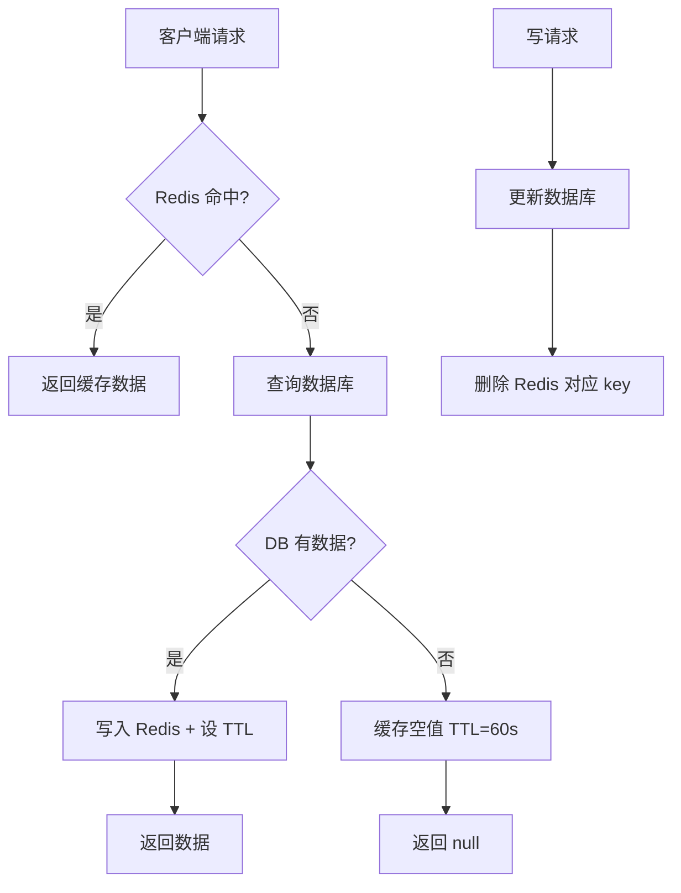
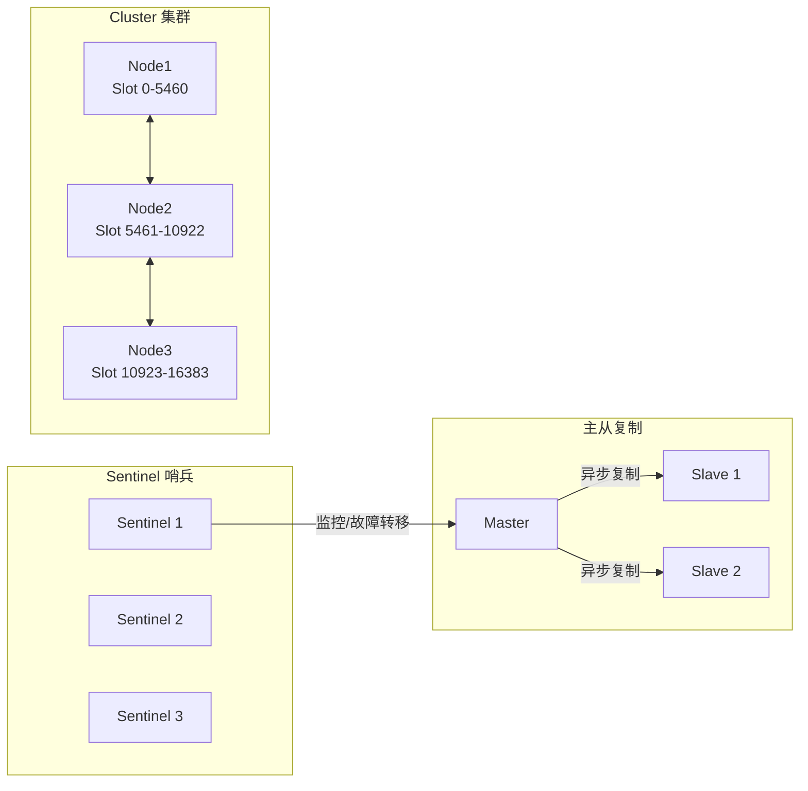

*图：沿图中的节点与箭头阅读，重点是cache-aside、TTL、淘汰、穿透/击穿、并发回填和一致性窗口分开解释。*

---

Redis 缓存能大幅降低数据库压力，但使用不当会引发穿透、击穿、雪崩三类经典故障，甚至在 AI Agent 后端造成 LLM 调用成本失控。本文从读写策略选型、三大故障防护、持久化与高可用，到 Semantic Cache 的落地实践，重点判断缓存如何失效、何时可能读旧值以及故障后谁保存权威数据。本文使用接口中立伪代码与配置示意，未在完整服务运行；缓存读写与数据库提交的具体API由实际部署实现。

## 贯穿案例：Redis 删除了，为什么 L1 还会读旧值

租户 A 的订单 `o17` 在 DB 为 v1，Redis 和两个进程的 L1 都缓存 v1。写请求提交 DB v2，再删除 Redis；若进程 2 的 L1 未失效，它仍会返回 v1。两级缓存意味着两套生命周期，删除 L2 不能自然通知所有 L1。

Redis client-side tracking 能让服务端记住客户端读取的 key，并在对应键修改、过期或淘汰时发送失效通知。客户端收到通知后删除本地副本，再读 Redis/DB。这里的 DB 更新仍需先按应用合同使 Redis 失效；tracking 不是 DB 变更订阅。连接断开、重连或无法确认通知连续性时，应清理相关 L1，并结合 TTL/版本避免持续使用旧值。通知抵达前仍有传播窗口。

反例是失效已经抵达，但一个更早读取 v1 的请求随后回填它；因此失效通知与 TTL 不会自动阻止旧版本回写。对必须验证最新状态的付款或授权，直接在权威事务中校验；对列表展示，可以明确允许短时间旧值，并记录每层命中、数据版本与失效延迟。

## 缓存读写策略

### 三种策略对比

| 策略 | 读流程 | 写流程 | 优点 | 缺点 | 适用场景 |
|------|--------|--------|------|------|----------|
| **Cache-Aside**（旁路缓存） | 应用先查缓存，未命中再查 DB 并回填 | 应用先写 DB，再删缓存 | 实现简单，可精细控制 | 首次请求有延迟；存在短暂不一致窗口 | 以数据库为权威源的通用读缓存 |
| **Write-Through**（同步直写） | 同上 | 应用写缓存层，缓存层同步写 DB | 写入路径集中，成功返回的语义可明确约定 | 写延迟高；跨系统原子提交与并发读仍需另行设计 | 写频率低、读一致性要求高 |
| **Write-Behind**（异步回写） | 同上 | 应用只写缓存，缓存层异步批量写 DB | 可缓冲写入、合并批次 | 未持久/未提交的异步写可能丢失；实现复杂 | 日志聚合、计数器等可容忍丢失的场景 |

### Cache-Aside（旁路缓存）

应用层自己管理缓存读写，数据库是权威数据源（Source of Truth）。

```text
readUser(id):
  cached = cacheRead(id)             # 缓存miss与负缓存标记是不同状态
  if cached == NULL_MARKER: return null
  if cached != MISS: return decode(cached)
  user = databaseRead(id)
  cacheWrite(id, encode(user)或NULL_MARKER, ttlFor(user))
  return user

updateUser(id, changes):
  databaseCommit(id, changes)
  cacheDelete(id)                   # 失败失效写入可重试记录
```

**为什么写时删缓存而不是更新缓存？**  
并发场景下，两个写请求先后更新 DB，但回填缓存的顺序可能相反，导致旧值覆盖新值。删除减少了写入缓存的竞争，却不能消除“旧读请求晚回填”的窗口；删除失败还要有重试与 TTL 兜底。同步直写也不自动获得跨 DB 与缓存的原子性。

### Cache-Aside 读写流程


```mermaid
flowchart TD
    A[客户端请求] --> B{Redis 命中?}
    B -- 是 --> C[返回缓存数据]
    B -- 否 --> D[查询数据库]
    D --> E{DB 有数据?}
    E -- 是 --> F[写入 Redis + 设 TTL]
    F --> G[返回数据]
    E -- 否 --> H[缓存空值 TTL=60s]
    H --> I[返回 null]

    J[写请求] --> K[更新数据库]
    K --> L[删除 Redis 对应 key]
```

---

## 缓存穿透（Cache Penetration）

**定义**：请求的 key 在缓存和数据库中都不存在，每次都穿透缓存直接打到数据库，常见于恶意爬虫或业务逻辑 bug。

### 方案一：缓存空值

对查询为空的 key 也写入缓存，TTL 设短（如 60 秒）：

```text
数据库查无结果 → 缓存独立NULL_MARKER，示例TTL=60秒 → 返回null
下一次读取先识别该标记，不对它作JSON解析
```

缺点：对于每次使用不同随机 ID 的恶意攻击无效，会用大量 `NULL` 值撑爆内存。

### 方案二：布隆过滤器（Bloom Filter）

在缓存前置一层布隆过滤器，存储所有合法 key 的哈希指纹。只有完整装载了合法集合并正确维护新增事件时，未命中才可作为不存在的依据。装载延迟或新增漏同步会误拒绝真实数据，此时必须回源或暂时绕过过滤器。

**核心特性**：
- 对已加入且未错误清除的元素，标准结构不产生假阴性；业务集合同步不完整时不具备这个保证
- 判断"存在"时有一定误判率（False Positive），可接受
- 标准布隆过滤器不支持删除（需 Counting Bloom Filter）

下面是接口中立伪代码，所有位操作须由实际部署的已连接客户端实现并处理错误；不绑定node-redis版本，也没有执行：

```text
装载：对每个合法key，计算k个位置并把位设为1
查询：读取同样k个位置；任一为0且完整装载/新增同步可信时，判不存在
否则进入普通缓存读取：
  miss → 读DB → 将结果或明确负缓存标记按TTL保存
  标记NULL → 返回null；其他缓存值 → 按约定格式解析
```

标准结构的概率性质不替代集合同步；重启、故障装载或同步落后时回源，避免误拒绝真实用户。位操作返回类型和批处理失败语义由所选客户端维护者合同决定。

---

## 缓存击穿（Cache Breakdown）

**定义**：某个**热点 key** 在缓存过期的瞬间，大量并发请求同时穿透到数据库，造成数据库瞬时压力激增。

### 方案一：互斥锁（Mutex Lock）

缓存失效时只允许一个请求重建缓存，其他请求等待或降级返回：

下面用协议级伪代码说明单实例互斥重建，未在完整服务运行：

```text
缓存 miss 后再次检查缓存
owner = 每次获取生成的不可预测唯一值
SET lock:key owner NX EX lease_seconds
若获取失败：有截止时间地等待、读取已回填值或降级；不无限递归
若获取成功：读取 DB → 校验版本/剩余租约 → 回填缓存
finally：原子比较 lock:key 的值，仅仍等于 owner 时删除
```

唯一 owner 与原子比较删除防止请求 A 租约到期后误删请求 B 的锁。租约不保证 A 一定在到期前完成，A 失去租约仍写旧缓存也会造成竞争；必要时对回填版本做条件校验或停止旧工作。数据库关键写还需要其自身版本或 fencing 合同。Redis 主从异步复制的故障切换也有锁丢失边界，不能把此缓存优化当作通用强一致分布式锁。[Redis 分布式锁文档](https://redis.io/docs/latest/develop/clients/patterns/distributed-locks/)说明唯一值、有限租约与安全释放。

### 方案二：逻辑过期（Logical Expiration）

在 value 中附加逻辑过期时间，Redis 层可另设容量与保留期。到期时允许读请求返回约定范围内的旧值。下面只演示逻辑过期读法，刷新还须合并并发、捕获异常、限制旧值最长寿命，不能每个过期请求都启动一个任务：

```text
读取 {data, expireAt, dataVersion}
未逻辑过期 → 返回data
过期且仍在允许旧值窗口 → 合并同key刷新，返回旧data
刷新任务 → 有界读DB，处理错误并条件写入新版本和过期时间
超过最大旧值期限/冷启动/被淘汰 → 按合同回源、等待或降级
```

---

## 缓存雪崩（Cache Avalanche）

**定义**：大量 key **同时过期**，或 Redis 实例宕机，导致所有请求涌入数据库，引发数据库崩溃的连锁反应。

### 解决方案

**1. TTL 随机抖动（Jitter）**

```text
ttl = 基础TTL + 受控随机偏移       # 数字由旧值窗口与负载决定
cacheWrite(key, value, ttl)
```

**2. 多级缓存（Multi-Level Cache）**

```
请求 → L1: 进程内缓存（lru-cache / node-cache）→ L2: Redis → L3: 数据库
```

L1 能减少网络查询，但实际命中率与延迟取决于负载。Redis 宕机时只能按业务允许的旧值窗口兜底；权限、余额等需要权威校验的数据不能无条件从旧缓存返回。

**3. 熔断与降级（Circuit Breaker）**

Redis 不可用时，熔断直接降级（返回默认数据或 503），不将压力传导到数据库。用有界并发、超时及按业务定义的降级实现，所选库需另外核验版本。

---

## 缓存一致性：延迟双删策略

[Redis client-side caching 文档](https://redis.io/docs/latest/develop/reference/client-side-caching/) 通过 tracking 向客户端发送失效通知，但一致性仍有传播窗口；缓存命中不能证明数据与主存储实时一致。


Cache-Aside 的写操作存在短暂不一致窗口——先更新 DB、再删缓存期间，其他读请求可能刚好把旧值写回缓存。这里展示DB提交后立即删、稍后再删的**延迟双删**变体；还有先删再写再删的实现，但其旧值窗口不同，不能混用时序。补偿删除须持久调度，仍不是强一致证明：

```text
databaseCommit(id, changes)
cacheDelete(key)                   # 第一次失效
durableRetryQueue.enqueue(delete_key=key, not_before=稍后)  # 第二次失效
```

> 注意：延迟双删只能**缩小**不一致窗口，不能完全消除。延迟时间没有通用最优值，第二次删除也可能失败或早于慢读回填。锁和 Binlog 订阅同样不自动保证跨系统强一致；强约束动作应在权威事务中验证，缓存只提供工作视图。

---

## Redis 持久化：RDB vs AOF

| 对比维度 | RDB（快照） | AOF（追加日志） | 同时启用RDB与AOF |
|---------|------------|----------------|--------------------|
| **持久化方式** | 按时间间隔全量快照 | 记录每条写命令 | 两者结合 |
| **重启恢复** | 加载快照 | 加载并重放日志；受重写与格式影响 | 同时启用时优先从 AOF 恢复；AOF 可包含 RDB 前导 |
| **数据丢失风险** | 可能丢失最近快照后的修改 | `everysec` 通常约有一秒的未同步窗口；异常存储情况还需考虑 | 取决于实际 AOF 同步、备份与恢复配置 |
| **文件体积** | 受数据量与压缩影响 | 受写量、重写和格式影响 | 没有固定大小排序 |
| **适用场景** | 可接受丢失快照后数据 | 按可容忍丢失窗口选择同步策略 | 结合恢复演练选择；不等于金融账本事务保证 |

```bash
# redis.conf 启用 RDB + AOF 混合持久化（配置示意，须核对部署版本）
appendonly yes
appendfsync everysec       # 每秒 fsync，兼顾性能与安全
aof-use-rdb-preamble yes   # AOF 文件头嵌入 RDB，加速重启
```

---

## Redis 高可用：主从 → 哨兵 → 集群


```mermaid
flowchart LR
    subgraph 主从复制
        M1[Master] -->|异步复制| S1[Slave 1]
        M1 -->|异步复制| S2[Slave 2]
    end

    subgraph Sentinel 哨兵
        Sen1[Sentinel 1] & Sen2[Sentinel 2] & Sen3[Sentinel 3]
        Sen1 -- 监控/故障转移 --> M1
    end

    subgraph Cluster 集群
        N1[Node1\nSlot 0-5460] <--> N2[Node2\nSlot 5461-10922]
        N2 <--> N3[Node3\nSlot 10923-16383]
    end
```

### 主从复制（Replication）

- Master 处理写请求，Slave 异步同步数据，Slave 可分担读压力
- 异步复制存在复制延迟，Slave 读取可能获得旧数据
- Master 宕机需手动切换，无自动故障转移

### Sentinel（哨兵模式）

- [官方建议至少3个独立Sentinel](https://redis.io/docs/latest/operate/oss_and_stack/management/sentinel/)，以便多数派授权具有冗余；具体quorum仍须配置
- Master 宕机时，Sentinel 投票选举新 Master 并自动完成故障转移（Failover）
- 适合数据量不超过单机内存的场景，提供高可用但不提供水平扩容

### Cluster（集群模式）

- 数据按Hash Slot（共16384个）分布在多个Master节点，见[Cluster规范](https://redis.io/docs/latest/operate/oss_and_stack/reference/cluster-spec/)
- 每个 Master 可配置 Slave 副本，兼顾高可用与水平扩容
- 客户端需支持实际部署的Cluster协议与重定向合同
- 跨 slot 的 multi-key 操作受限（需使用 Hash Tag `{tag}` 保证同 slot）

---

## Agent 后端意义：Semantic Cache 减少 LLM 调用成本

对于 AI Agent 后端，LLM API 调用（如 GPT-4、Claude）是最大的成本来源之一。**Semantic Cache（语义缓存）**通过将用户 Prompt 向量化，匹配相似历史问答来复用结果，而不是等待精确字符串匹配。

例如租户 A 问“上周已付款订单总额”，向量检索找到相似问题后，仍需核对租户、权限、时间窗口、数据版本、模型/提示版本及工具合同。只有这些条件符合复用政策才返回旧答案；否则重新计算。相似度不能区分“包含退款”和“不含退款”，也不能证明订单数据没有更新。

语义缓存是工程取舍，需在同一业务数据集上测错误复用率、合格任务成本和命中率。原文没有真实实验，因此这里不给命中率或节省倍率；精确缓存与语义缓存都要避免跨租户泄漏。向量距离到相似度的换算还取决于所选度量，不能任意写 `1-score`。

---

## 常见误区

**误区一：认为缓存与数据库可以强一致**  
本文不协调跨DB写入与缓存失效的简单Cache-Aside协议存在旧值窗口，不能凭TTL或双删声称强一致。付款等强约束动作在权威事务内验证；缓存是否划算依据读写负载与旧值合同，而非只能读多写少。

**误区二：缓存不设 TTL，依赖手动删除**  
手动删除逻辑有遗漏风险，Redis 内存会持续增长直到触发 OOM 或 `maxmemory-policy` 强制淘汰。对可失效业务缓存，TTL 是兜底的一种方式；固定规模、明确删除与容量策略的缓存可使用其他生命周期合同。重点是容量、旧值窗口和恢复均有边界，不能以“永不过期”替代管理。（参见 [Redis key eviction](https://redis.io/docs/latest/develop/reference/eviction/)）

**误区三：Write-Behind 适合所有高写场景**  
没有持久日志或尚未提交的异步写，在宕机时可能丢失；可靠日志可改变恢复合同，但缓存受理仍不等于业务DB提交。订单/付款按业务事实、恢复和对账要求设计。

**误区四：布隆过滤器可以替代缓存空值**  
布隆过滤器适合拦截"从未存在"的 key（如随机 ID 攻击），但无法处理"曾经存在、后被删除"的 key——被删除的数据无法从布隆过滤器中移除（标准实现），可能误判为"存在"。两种方案可结合使用。

---

## 面试常问要点

- **Cache-Aside 写时为何删缓存不更新？**  
  并发写场景下更新缓存可能导致旧值覆盖新值（Race Condition），删除是更安全的幂等操作，下次读时自然触发缓存重建。

- **先删缓存还是先更新 DB？**  
  推荐先更新 DB 再删缓存。先删缓存期间若有读请求，会将旧 DB 数据回填缓存，产生脏数据；且 DB 写失败时缓存已被清空，需额外处理。延迟双删可进一步收窄不一致窗口。

- **布隆过滤器能删除元素吗？**  
  标准 Bloom Filter 不支持删除（位无法撤销）；Counting Bloom Filter 用计数位替代单位，支持删除但内存占用更大。

- **逻辑过期和 TTL 过期的核心区别？**  
  TTL 过期会产生 Cache Miss，触发 DB 查询；逻辑过期允许在约定窗口返回旧值并刷新；冷启动、淘汰或刷新失败时仍可能没有可用缓存，并非始终命中。

- **Redis Sentinel 和 Cluster 如何选型？**  
  数据量在单机范围内、需要高可用自动故障转移 → Sentinel；数据量超出单机内存或需水平扩容写能力 → Cluster。

- **RDB 和 AOF 如何选型？**  
  按RPO、RTO、数据是否可重建选择RDB、AOF或同时启用，并实际做恢复演练；开启两种持久化与AOF采用RDB前导是不同配置维度。`everysec` 不构成强一致或零丢失保证，重要业务事实仍按权威数据库的事务和恢复合同保存。

- **什么是 Semantic Cache？适合 Agent 的哪类场景？**  
  语义缓存用向量相似度代替精确字符串匹配，适合 FAQ 问答、知识检索、代码解释等问题集中、答案可重复利用的 LLM 调用场景，收益须测量，错误复用率和权限隔离必须一起验收。

## 面试口述与教学补充

“我用 DB 保存事实，Redis 与 L1 提供允许过期的读视图。写 DB 后删除 Redis，并让各进程按失效通知或版本清理 L1，但仍检查晚回填、通知断线和删除失败的窗口。持久化解决重启恢复，主从和 Cluster 解决部分可用性或容量问题，都不会自然保证缓存与 DB 原子一致。关键业务动作回到权威事务校验。”

以下为教学模拟追问，不是来源面经原题：

- **锁租约到期后旧请求释放锁，会发生什么？** 无条件 DEL 会删除新 owner 的锁；原子比较 owner 再删，且另行约束旧持有者继续回填。
- **L1 的通知连接断开，但缓存还没过期，继续返回吗？** 按一致性合同清理或降级，不能假设断线期间没有变更。
- **开启 AOF everysec，能把 Redis 当付款事实源吗？** 要看丢失窗口、故障切换、事务和对账要求；配置名称本身不给零丢失或跨 DB 一致保证。

## 出现于（热度来源）

<!-- interview-source-history:start -->
- [字节 Agent 开发一面：推理缓存、网络与存储基础（2026 年 8 月）](../../../interview/bytedance/base/bytedance-base-18.md)（cluster-265dac6c3b53）
- [腾讯 TEG 后端一面：RAG 多智能体与分布式 LRU（2026 年 8 月）](../../../interview/tencent/ai/tencent-ai-6.md)（cluster-27070393eae6）
- [字节 AI 全栈一面：Pipeline 质量、Doris 与消息轮播（2026 年 9 月）](../../../interview/bytedance/base/bytedance-base-23.md)（cluster-3f37b9b18f24）
- [字节 Agent Infra 校招：运行时、MySQL 与 LRU（2026 年 9 月）](../../../interview/bytedance/base/bytedance-base-25.md)（cluster-74e92db1eff9）
- [蚂蚁 AI 开发一面：协作式 Agent、交付门禁与后端基础（2026 年 8 月）](../../../interview/antfin/ai/antfin-ai-4.md)（cluster-910d0b20a897）
- [腾讯 Agent 开发一面：RAG、安全与后端工程（2026 年 5 月）](../../../interview/tencent/ai/tencent-ai-1.md)（cluster-b2e2c5d9624b）
- [字节 Agent 开发一面：Skill、MCP 与后端基础（2026 年 7 月）](../../../interview/bytedance/base/bytedance-base-15.md)（cluster-d0b4e8a8f482）
- [蚂蚁后端 AI 开发一面：Agent、Redis 与短链系统（2026 年 4 月）](../../../interview/antfin/ai/antfin-ai-3.md)（cluster-e11f3de537e5）
<!-- interview-source-history:end -->

## 参考资料

Redis 滚动文档，核验于 2026-10-02。本文配置、客户端片段与协议伪代码未在完整 Redis/DB 服务运行，无性能实验结论。

- [Redis client-side caching](https://redis.io/docs/latest/develop/reference/client-side-caching/)
- [Redis key eviction](https://redis.io/docs/latest/develop/reference/eviction/)

- [Redis：Persistence（RDB/AOF与恢复）](https://redis.io/docs/latest/operate/oss_and_stack/management/persistence/)
- [Redis：SET（NX与过期）](https://redis.io/docs/latest/commands/set/)
- [Redis：Distributed locks（有限租约与安全释放）](https://redis.io/docs/latest/develop/clients/patterns/distributed-locks/)
- [Redis：Replication（异步复制边界）](https://redis.io/docs/latest/operate/oss_and_stack/management/replication/)
