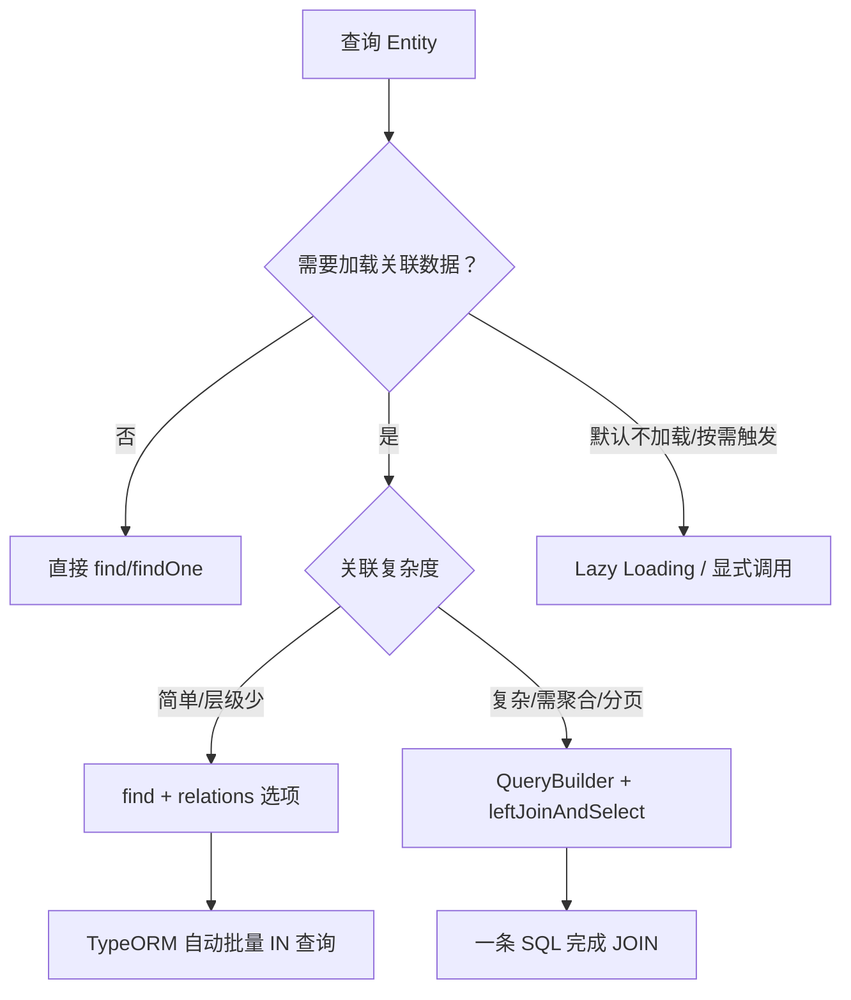
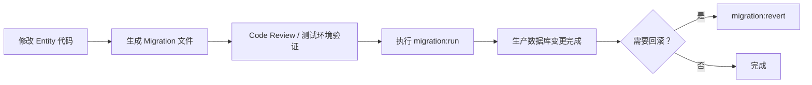

*图：沿图中的节点与箭头阅读，重点是明确 Entity 映射、relation owning side、级联、lazy/eager 加载和事务查询边界。*

---

TypeORM 是 TypeScript 生态中常用的 ORM 之一，通过装饰器（Decorator）将类映射到关系型数据库表，并提供类型化查询 API。对于需要持久化会话历史的 Agent 后端，Entity、关系与事务边界会直接影响状态的一致性。（参见 [TypeORM entities](https://typeorm.io/docs/entity/entities/)）

## 装饰器体系：Entity 的骨架

TypeORM 以装饰器为核心，将普通的 TypeScript 类变成数据库表的映射模型（ORM Mapping）。

```typescript
import {
  Entity,
  PrimaryGeneratedColumn,
  PrimaryColumn,
  Column,
  CreateDateColumn,
  UpdateDateColumn,
  DeleteDateColumn,
  Index,
} from 'typeorm';

@Entity('users')
@Index(['email'], { unique: true })
export class User {
  @PrimaryGeneratedColumn('uuid')
  id: string;

  @Column({ length: 100 })
  name: string;

  @Column()
  email: string;

  @Column({ nullable: true, length: 255 })
  avatar: string | null;

  @CreateDateColumn()
  createdAt: Date;

  @UpdateDateColumn()
  updatedAt: Date;

  @DeleteDateColumn()
  deletedAt: Date | null;
}
```

| 装饰器 | 说明 |
|---|---|
| `@Entity('table_name')` | 标记类为 Entity，括号内指定表名；省略则默认用类名的蛇形命名 |
| `@PrimaryGeneratedColumn()` | 自增整型主键（AUTO_INCREMENT） |
| `@PrimaryGeneratedColumn('uuid')` | UUID 主键，适合分布式或需要隐藏序列规律的场景 |
| `@PrimaryColumn()` | 手动指定主键值，不自动生成 |
| `@Column()` | 普通列，通过 options 定制类型、约束等 |
| `@CreateDateColumn` | 插入时由 ORM 自动设置当前时间 |
| `@UpdateDateColumn` | 每次 save/update 时自动更新为当前时间 |
| `@DeleteDateColumn` | 配合软删除（Soft Delete），标记删除时间而非真正 DELETE |
| `@Index` | 在类级别声明联合索引 |

> `@CreateDateColumn` 和 `@UpdateDateColumn` 由 TypeORM 在 ORM 层管理，**不依赖数据库触发器**，这意味着绕过 ORM 直接执行 SQL 时这两个字段不会自动更新。

## 列类型映射与选项

`@Column` 接受一个 options 对象，关键属性如下：

```typescript
@Column({ type: 'enum', enum: ['admin', 'user', 'guest'], default: 'user' })
role: 'admin' | 'user' | 'guest';

@Column({ type: 'decimal', precision: 10, scale: 2, default: 0 })
balance: number;

@Column({ type: 'text', nullable: true })
bio: string | null;

@Column({ type: 'jsonb', nullable: true })   // PostgreSQL 用 jsonb，MySQL 用 json
metadata: Record<string, unknown> | null;

@Column({ type: 'varchar', length: 512, transformer: encryptTransformer })
secretToken: string;
```

常用 options 速览：

| 选项 | 类型 | 说明 |
|---|---|---|
| `type` | string | 数据库原生类型，如 `varchar`、`text`、`int`、`jsonb`、`enum` 等 |
| `nullable` | boolean | 是否允许 NULL，默认 `false` |
| `default` | any | 数据库层面的 DEFAULT 值 |
| `length` | number | 字符串最大长度，默认 255 |
| `unique` | boolean | 单列唯一约束 |
| `select` | boolean | 设为 `false` 则 `find` 默认不查询此列（适合密码、大字段） |
| `transformer` | ValueTransformer | 读写时的值转换器，常用于加密、枚举转换 |

`type` 的映射因数据库而异（MySQL vs PostgreSQL vs SQLite），建议在 DataSource 配置中固定 `type`，然后统一用 `varchar`/`text`/`int`/`bigint`/`boolean`/`jsonb` 这些跨库兼容的类型。

## 关系映射：四种关联

### OneToMany / ManyToOne（一对多 / 多对一）

这是最常见的关联，用于"一个用户有多篇文章"这类场景。

```typescript
// Post 多对一 User（外键在 Post 表）
@Entity('posts')
export class Post {
  @PrimaryGeneratedColumn()
  id: number;

  @Column()
  title: string;

  @ManyToOne(() => User, (user) => user.posts, { onDelete: 'CASCADE' })
  @JoinColumn({ name: 'user_id' })
  user: User;

  @Column({ name: 'user_id' })
  userId: number;  // 冗余外键列，方便直接查询避免 JOIN
}

// User 一对多 Post
@Entity('users')
export class User {
  @PrimaryGeneratedColumn('uuid')
  id: string;

  @OneToMany(() => Post, (post) => post.user, { cascade: true })
  posts: Post[];
}
```

**关键点：**
- `@JoinColumn` 标注外键列，只在"多"的一侧（ManyToOne）声明
- `onDelete: 'CASCADE'` 是数据库级联，删除父记录时子记录跟着删
- `cascade: true` 是 ORM 级联，通过 `save(user)` 时同时保存 `user.posts`
- 冗余的 `userId` 列让你可以在不 JOIN 的情况下直接用外键过滤，性能更好

### ManyToMany（多对多）

```typescript
@Entity('articles')
export class Article {
  @PrimaryGeneratedColumn()
  id: number;

  @ManyToMany(() => Tag, (tag) => tag.articles, { cascade: ['insert'] })
  @JoinTable({
    name: 'article_tags',          // 中间表表名
    joinColumn: { name: 'article_id' },
    inverseJoinColumn: { name: 'tag_id' },
  })
  tags: Tag[];
}

@Entity('tags')
export class Tag {
  @PrimaryGeneratedColumn()
  id: number;

  @Column({ unique: true })
  name: string;

  @ManyToMany(() => Article, (article) => article.tags)
  articles: Article[];
}
```

`@JoinTable` **只在拥有方（owning side）声明**，另一侧只写 `@ManyToMany`。中间表由 TypeORM 自动管理。（参见 [TypeORM relations](https://typeorm.io/docs/relations/relations/)）

### OneToOne（一对一）

```typescript
@Entity('profiles')
export class Profile {
  @PrimaryGeneratedColumn()
  id: number;

  @Column({ type: 'text', nullable: true })
  bio: string | null;

  @OneToOne(() => User, { onDelete: 'CASCADE', eager: true })
  @JoinColumn({ name: 'user_id' })
  user: User;
}
```

## 关系加载策略：Eager vs Lazy vs QueryBuilder



| 策略 | 配置方式 | 特点 |
|---|---|---|
| Eager Loading | `@ManyToOne(..., { eager: true })` | 每次查询自动 JOIN，无需显式声明；小心滥用 |
| 显式 relations | `findOne({ relations: ['posts'] })` | 推荐做法，按需指定；内部用 IN 批量优化 |
| QueryBuilder JOIN | `leftJoinAndSelect('post.user', 'u')` | 最灵活，支持条件 JOIN、聚合、子查询 |
| Lazy Loading | `Promise<Post[]>` 类型声明 | 访问属性时异步触发查询，容易出现隐式 N+1 |

**生产环境推荐优先使用 QueryBuilder**，它的 SQL 是可预期的，便于调试和性能分析。

```typescript
// QueryBuilder 示例：带分页的关联查询
const [posts, total] = await dataSource
  .getRepository(Post)
  .createQueryBuilder('post')
  .leftJoinAndSelect('post.user', 'user')
  .leftJoinAndSelect('post.tags', 'tag')
  .where('post.userId = :userId', { userId })
  .andWhere('post.createdAt > :since', { since })
  .orderBy('post.createdAt', 'DESC')
  .skip((page - 1) * pageSize)
  .take(pageSize)
  .getManyAndCount();
```

## AI Agent 实战：Session + Message Entity 设计

多轮对话 Agent 的核心需求是**持久化会话历史**（Conversation History）。每轮对话的 prompt 和 response 都需要存储，以便在下一轮构建上下文窗口（Context Window）时还原对话记忆。

```typescript
import {
  Entity, PrimaryGeneratedColumn, Column,
  ManyToOne, OneToMany, JoinColumn,
  CreateDateColumn, Index,
} from 'typeorm';

/** 一个会话（Session）对应 Agent 的一次完整对话流 */
@Entity('ai_sessions')
@Index(['userId', 'createdAt'])
export class AiSession {
  @PrimaryGeneratedColumn('uuid')
  id: string;

  @Column({ name: 'user_id' })
  userId: string;

  @Column({ length: 200, nullable: true })
  title: string | null;

  /** Agent 使用的模型标识，e.g. "claude-opus-4-5" */
  @Column({ length: 100 })
  model: string;

  /** 系统提示词（System Prompt），定义 Agent 人设/能力边界 */
  @Column({ type: 'text', nullable: true })
  systemPrompt: string | null;

  /** 会话级元数据：存储 Agent 工具列表、温度参数等 */
  @Column({ type: 'jsonb', nullable: true })
  agentConfig: Record<string, unknown> | null;

  @CreateDateColumn()
  createdAt: Date;

  @OneToMany(() => AiMessage, (msg) => msg.session, { cascade: ['insert'] })
  messages: AiMessage[];
}

export type MessageRole = 'system' | 'user' | 'assistant' | 'tool';

/** 会话中的单条消息（Message） */
@Entity('ai_messages')
@Index(['sessionId', 'seq'])
export class AiMessage {
  @PrimaryGeneratedColumn()
  id: number;

  @Column({ name: 'session_id' })
  sessionId: string;

  @ManyToOne(() => AiSession, (session) => session.messages, {
    onDelete: 'CASCADE',
  })
  @JoinColumn({ name: 'session_id' })
  session: AiSession;

  /** 消息顺序，0-based，用于还原对话顺序 */
  @Column({ type: 'int', default: 0 })
  seq: number;

  @Column({ type: 'enum', enum: ['system', 'user', 'assistant', 'tool'] })
  role: MessageRole;

  @Column({ type: 'text' })
  content: string;

  /** Tool use 结果或函数调用参数，存 JSON */
  @Column({ type: 'jsonb', nullable: true })
  toolPayload: Record<string, unknown> | null;

  /** Token 消耗，用于配额统计 */
  @Column({ type: 'int', nullable: true })
  tokenCount: number | null;

  @CreateDateColumn()
  createdAt: Date;
}
```

**加载历史消息重建上下文：**

```typescript
// Agent 服务：从数据库还原会话上下文，传给 LLM SDK
async function buildContextMessages(sessionId: string): Promise<ChatMessage[]> {
  const messages = await dataSource
    .getRepository(AiMessage)
    .createQueryBuilder('msg')
    .where('msg.sessionId = :sessionId', { sessionId })
    .orderBy('msg.seq', 'ASC')
    .getMany();

  return messages.map((msg) => ({
    role: msg.role,
    content: msg.content,
    ...(msg.toolPayload ? { tool_use: msg.toolPayload } : {}),
  }));
}
```

这个设计让 Agent 服务无论重启多少次，只要拿到 `sessionId` 就能完整还原对话历史——这是实现**跨请求记忆**（Cross-Request Memory）的最简单可靠方案。

## Repository 模式与 EntityManager

TypeORM 提供两种操作 Entity 的方式：

```typescript
// 方式一：Repository（推荐，有类型约束）
const sessionRepo = dataSource.getRepository(AiSession);

// 基础 CRUD
const session = sessionRepo.create({ userId, model: 'claude-opus-4-5' });
await sessionRepo.save(session);

const found = await sessionRepo.findOneBy({ id: sessionId });
await sessionRepo.softDelete(sessionId);  // 配合 @DeleteDateColumn 软删除

// 方式二：EntityManager（适合跨 Entity 的事务操作）
await dataSource.transaction(async (manager) => {
  const session = manager.create(AiSession, { userId, model });
  await manager.save(session);

  const firstMsg = manager.create(AiMessage, {
    sessionId: session.id,
    role: 'system',
    content: systemPrompt,
    seq: 0,
  });
  await manager.save(firstMsg);
});
```

**Repository vs EntityManager 对比：**

| 维度 | Repository | EntityManager |
|---|---|---|
| 适用场景 | 单 Entity 的 CRUD | 跨多 Entity 的事务操作 |
| 类型安全 | 强（泛型绑定） | 需手动传 Entity 类 |
| 事务支持 | 需要手动注入 manager | 原生支持，推荐跨表操作用 |
| 代码位置 | Service 层 | 复杂业务逻辑/事务脚本 |

## 数据迁移（Migration）：生产安全变更

`synchronize: true` 在开发时很方便，但**严禁用于生产**——它会在启动时自动 ALTER TABLE，可能导致列被删除或数据丢失。



```bash
# 1. 根据 Entity 变更自动生成迁移文件（对比当前 DB schema）
npx typeorm migration:generate src/migrations/AddAiSessionTable \
  -d src/data-source.ts

# 2. 执行迁移（升级）
npx typeorm migration:run -d src/data-source.ts

# 3. 回滚上一次迁移
npx typeorm migration:revert -d src/data-source.ts
```

手写迁移文件示例（适合复杂数据转换）：

```typescript
import { MigrationInterface, QueryRunner, Table } from 'typeorm';

export class AddAiSessionTable1700000000000 implements MigrationInterface {
  async up(queryRunner: QueryRunner): Promise<void> {
    await queryRunner.createTable(
      new Table({
        name: 'ai_sessions',
        columns: [
          { name: 'id', type: 'uuid', isPrimary: true, generationStrategy: 'uuid' },
          { name: 'user_id', type: 'varchar' },
          { name: 'model', type: 'varchar', length: '100' },
          { name: 'created_at', type: 'timestamp', default: 'now()' },
        ],
      }),
    );
  }

  async down(queryRunner: QueryRunner): Promise<void> {
    await queryRunner.dropTable('ai_sessions');
  }
}
```

DataSource 配置建议：

```typescript
// src/data-source.ts
export const AppDataSource = new DataSource({
  type: 'postgres',
  url: process.env.DATABASE_URL,
  entities: [__dirname + '/entities/*.entity{.ts,.js}'],
  migrations: [__dirname + '/migrations/*{.ts,.js}'],
  synchronize: false,          // 生产永远 false
  migrationsRun: false,        // 由 CI/CD 流程控制，不在启动时自动跑
  logging: process.env.NODE_ENV === 'development',
});
```

## 常见误区

### 误区一：循环引用导致序列化死循环

`User` 有 `posts: Post[]`，`Post` 有 `user: User`——直接 `JSON.stringify` 或 `res.json()` 会触发循环引用错误。

```typescript
// 错误：直接返回 Entity 对象
return res.json(user);  // 如果 user.posts[0].user 存在，循环引用崩溃

// 正确做法一：使用 class-transformer 的 @Exclude 装饰器
import { Exclude } from 'class-transformer';

@Entity('posts')
export class Post {
  @ManyToOne(() => User, (user) => user.posts)
  @Exclude()  // 序列化时排除，打破循环
  user: User;
}

// 正确做法二：DTO 转换，只序列化所需字段
const dto = { id: user.id, name: user.name, postCount: user.posts.length };
return res.json(dto);
```

### 误区二：忘记 cascade 导致孤儿数据（Orphan Records）

```typescript
// 问题场景：删除 Session 但 Message 仍残留
await sessionRepo.delete(sessionId);
// 如果 AiMessage 的 @ManyToOne 没有配置 onDelete: 'CASCADE'
// messages 表会留下大量无主消息（orphan data）

// 解决：在 @ManyToOne 加 onDelete
@ManyToOne(() => AiSession, { onDelete: 'CASCADE' })
session: AiSession;

// 或者在 DataSource 级别确保外键约束被创建
```

### 误区三：在事务外调用 save 多次

多次独立 `save` 调用之间如果有一个失败，不会自动回滚已完成的操作。跨多个 Entity 的写入**必须放在同一个事务**中。

### 误区四：eager: true 在高频查询中的性能陷阱

`eager: true` 会在**每次** find 时自动 JOIN，哪怕你只需要主表数据。对于高频、大数据量的查询，这会带来不必要的 IO 开销。应按需使用 `relations` 选项或 QueryBuilder。

## 面试常问

**`@JoinColumn` 和 `@JoinTable` 的区别？**
`@JoinColumn` 用于 OneToOne / ManyToOne，标注外键列在哪一侧（只在拥有方加，即持有外键的表）；`@JoinTable` 用于 ManyToMany，声明中间关联表（只在拥有方加一次）。

**如何避免 N+1 问题？**
用 QueryBuilder 的 `leftJoinAndSelect` 显式 JOIN；或在 `find` 时通过 `relations` 选项，TypeORM 内部会将 N 次子查询优化为 `WHERE id IN (...)` 批量查询。绝不在循环里发关联查询。

**`synchronize: true` 为何不能用于生产？**
TypeORM 在每次应用启动时比较 Entity 定义与数据库结构差异并自动执行 ALTER TABLE，可能删除已不在 Entity 中声明的列，导致不可逆的数据丢失。应通过 Migration 文件进行受控变更。

**软删除（Soft Delete）如何实现？**
给 Entity 加 `@DeleteDateColumn() deletedAt: Date | null`，调用 `repository.softDelete(id)` 只填写 `deletedAt` 字段；TypeORM 的所有 find/findOne 查询会自动追加 `WHERE deletedAt IS NULL`，查询不到已删除数据。需要查询已删除数据时用 `withDeleted()` 选项。

**cascade 选项有哪些值，有什么区别？**
`cascade` 可以是布尔值（`true` 等同于 `['insert', 'update', 'remove', 'soft-remove', 'recover']`）或数组。常见用法是 `['insert']`（仅级联插入新关联对象），这比 `true` 更安全，避免意外的级联删除。

**如何在 NestJS 中使用 Repository？**
通过 `@InjectRepository(Entity)` 装饰器注入，配合 `TypeOrmModule.forFeature([Entity])` 注册。建议将 Repository 操作封装在独立的 Repository 类或 Service 中，不直接在 Controller 操作数据库。

## 参考资料

- [TypeORM entities](https://typeorm.io/docs/entity/entities/)
- [TypeORM relations](https://typeorm.io/docs/relations/relations/)
