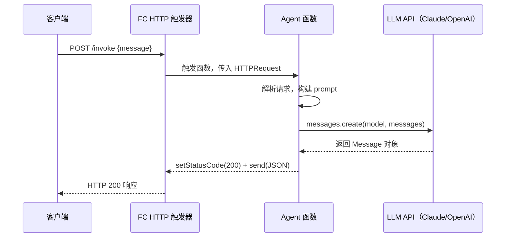
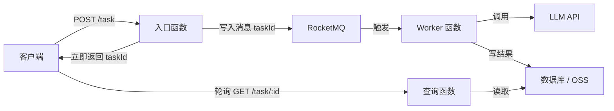

阿里云函数计算（Function Compute，FC）是阿里云的 Serverless FaaS 平台，天然契合 Agent 服务"按需触发、无需常驻"的特性——用户请求到来时执行，没有请求时不消耗任何资源，按量计费精确到毫秒级。

## FaaS 核心概念

FaaS（Function as a Service）的本质是把"一段可运行的代码"作为部署单元，由云平台负责底层的服务器管理、弹性伸缩和高可用，开发者只需关注业务逻辑本身。

三个核心特性：
- **无服务器（Serverless）**：无需关心 OS 补丁、容量规划、机器宕机，平台全部托管
- **按量计费**：精确到 CPU 时间（毫秒）+ 请求次数，空闲时零费用
- **事件驱动**：函数由触发器（HTTP/定时/消息队列）激活，而非常驻进程监听

## FaaS vs 容器服务 vs 传统服务器

| 维度 | FaaS（FC） | 容器服务（ACK） | 传统服务器（ECS） |
|---|---|---|---|
| 冷启动延迟 | 100ms～2s（可优化） | 秒级（已常驻） | 无（常驻进程） |
| 运维成本 | 极低，平台全托管 | 中等，需管理集群 | 高，需自行维护 |
| 弹性能力 | 自动，毫秒级扩缩 | HPA，分钟级 | 手动，慢 |
| 计费模型 | 按调用量 + 执行时长 | 按资源预留量 | 按时包年包月 |
| 有状态支持 | 弱（函数无状态） | 好（可挂载 PV） | 好 |
| 适用场景 | Agent 异步任务、Webhook、定时巡检 | 长连接服务、数据库 | 遗留系统、低迁移成本 |

**对于 Agent 服务**：轻量推理请求、定时触发的 Agent 巡检、消息驱动的异步 Agent pipeline，都是 FaaS 的甜区。强状态、长连接、高并发常驻场景更适合容器服务。

## 阿里云 FC 核心概念

```
服务（Service）
├── 函数（Function）   ← 代码 + 运行时 + 配置
│   ├── 触发器（Trigger）
│   ├── 环境变量（Env Vars）← 结合 KMS 存储 LLM API Key
│   └── 层（Layer）    ← 共享依赖，如 LLM SDK
└── 日志（SLS 集成）
```

| 概念 | 说明 |
|---|---|
| Service | 函数的逻辑分组，共享 VPC/日志/RAM 角色配置 |
| Function | 部署单元，代码 + 运行时（Node.js/Python/Go 等） |
| Trigger | 决定函数何时执行的事件源 |
| Layer | 可复用的依赖层，多函数共享，减少部署包大小 |
| 预留实例 | 始终保持热实例，彻底消除冷启动 |

## 触发器类型

| 触发器 | 适用场景 |
|---|---|
| HTTP 触发器 | 同步 Agent API，直接暴露 HTTPS 端点 |
| 定时触发器（Timer） | 定时巡检、Agent 周期性摘要任务 |
| MNS/RocketMQ 触发器 | 异步 Agent 任务，消息队列解耦长时任务 |
| OSS 触发器 | 文件上传后触发 Agent 处理（如解析 PDF） |
| Tablestore 触发器 | 数据变更驱动 Agent 响应 |

消息队列触发器最适合长时 Agent 任务——用户请求写入队列后立刻返回，FC 消费消息异步执行 LLM 调用，彻底避免 HTTP 超时。

## HTTP 触发器：TypeScript Agent 函数示例

```typescript
// handler.ts — 阿里云 FC Node.js 20 运行时
import type { Context, HTTPRequest, HTTPResponse } from '@fc-nodejs/runtime';
import Anthropic from '@anthropic-ai/sdk';

// 模块级初始化：实例被 FC 复用时无需重新建连
const client = new Anthropic({
  apiKey: process.env.ANTHROPIC_API_KEY!, // 从环境变量读取，绝不硬编码
});

export async function handler(
  req: HTTPRequest,
  resp: HTTPResponse,
  context: Context
): Promise<void> {
  const start = Date.now();
  const body = JSON.parse(req.body ?? '{}');
  const userMessage: string = body.message ?? '';

  const message = await client.messages.create({
    model: 'claude-opus-4-5',
    max_tokens: 1024,
    messages: [{ role: 'user', content: userMessage }],
  });

  // 结构化日志，便于 SLS 查询追踪
  console.log(JSON.stringify({
    level: 'info',
    requestId: context.requestId,
    action: 'llm_call',
    latencyMs: Date.now() - start,
  }));

  resp.setStatusCode(200);
  resp.setHeader('Content-Type', 'application/json');
  resp.send(JSON.stringify({
    reply: message.content[0].type === 'text' ? message.content[0].text : '',
    requestId: context.requestId,
  }));
}
```

函数入口格式为 `文件名.导出函数名`，在 s.yaml 中配置为 `handler: handler.handler`。

## Serverless Devs：s.yaml 配置

Serverless Devs 是阿里云官方的 IaC 工具，`s.yaml` 是声明式配置文件。

```yaml
# s.yaml
edition: 1.0.0
name: agent-service

vars:
  region: cn-hangzhou
  service: agent-svc

services:
  agent-http:
    component: fc
    props:
      region: ${vars.region}
      service:
        name: ${vars.service}
        logConfig: auto          # 自动创建 SLS logstore
        internetAccess: true     # 允许函数访问公网（调用 LLM API）
      function:
        name: agent-handler
        runtime: nodejs20
        codeUri: ./dist          # 打包后的产物目录
        handler: handler.handler
        memorySize: 512          # MB，LLM 调用建议 512+
        timeout: 60              # 秒，LLM P99 延迟可达 20-30s，必须留余量
        environmentVariables:
          NODE_ENV: production
          ANTHROPIC_API_KEY:
            ref:                 # 从 KMS 读取，不明文写入配置
              id: kms_key_id
        layers:
          - acs:fc:cn-hangzhou:123456789:layers/LLM-SDK/versions/1
      triggers:
        - name: http-trigger
          type: http
          config:
            authType: anonymous  # 生产环境建议改为 function 并自行鉴权
            methods: ['POST', 'GET']
```

常用命令：

```bash
# 安装 Serverless Devs
npm install -g @serverless-devs/s

# 本地调用（无需部署，快速验证）
s local invoke -e '{"message": "hello agent"}'

# 构建 TypeScript 并部署
pnpm build && s deploy --use-local

# 线上调用
s invoke --event '{"message": "hello"}'

# 跟踪实时日志
s logs -t
```

## 冷启动优化

FaaS 的主要挑战是**冷启动（Cold Start）**：函数长时间未被调用后，下次请求需要初始化运行时环境，延迟可达数百毫秒到 2 秒，对 Agent API 的响应体验影响显著。

| 优化手段 | 原理 | 适用场景 |
|---|---|---|
| 预留实例（Reserved Instance） | 始终保留热实例，完全消除冷启动 | 延迟敏感的 Agent API |
| 减小代码包（esbuild 打包） | 包小则代码加载快 | 所有场景 |
| 函数层（Layer） | 依赖独立存储，与代码包分离 | 依赖体积大的场景 |
| 模块级初始化 | SDK 实例在模块加载时创建，复用 | 代码级优化 |
| 镜像加速 | 使用阿里云 ACR 加速容器镜像拉取 | Custom Container 模式 |

```typescript
// 好的做法：client 在模块初始化时创建，热实例复用，冷启动时也只初始化一次
const client = new Anthropic({ apiKey: process.env.ANTHROPIC_API_KEY! });

export async function handler(req, resp, context) {
  // 直接复用 client，不在 handler 内重复 new
}
```

## 函数层（Layer）：把 LLM SDK 抽离共享

Layer 是打包好的依赖包，可被同 region 下多个函数挂载，避免每次部署都上传完整 `node_modules`，**函数部署包可从几十 MB 压缩到几 KB**。

```bash
# 打包 LLM SDK 依赖为 Layer
mkdir -p layer/nodejs/node_modules
cd layer/nodejs && npm install @anthropic-ai/sdk openai

# 压缩
cd layer && zip -r ../llm-sdk-layer.zip nodejs/

# 发布 Layer（通过 Serverless Devs）
s layer publish --layer-name LLM-SDK \
  --code llm-sdk-layer.zip \
  --runtime nodejs20
```

Layer 挂载后，函数代码中直接 `import` 即可，无需将 SDK 打入函数包。

## 环境变量与 KMS 密钥管理

LLM API Key 绝不能硬编码，标准做法如下：

1. **阿里云 KMS**：API Key 加密存储，FC 绑定 RAM 角色后运行时自动解密
2. **函数环境变量**：在 FC 控制台或 s.yaml 中配置，运行时通过 `process.env` 读取
3. **配置中心（ACM）**：适合动态更换密钥的场景，无需重新部署函数

```bash
# 使用 KMS 创建加密密钥
aliyun kms CreateSecret \
  --SecretName ANTHROPIC_API_KEY \
  --SecretData "sk-ant-xxxxx" \
  --EncryptionKeyId alias/fc-secret-key
```

函数绑定对应 RAM 角色后自动有权限读取 KMS 密钥，代码和配置文件中不暴露任何明文。

## HTTP 请求到 LLM 的完整流程



## 异步 Agent 任务：结合消息队列

执行时间超过 30 秒的 Agent 任务（多步 Agent、大文档处理）必须异步化：



入口函数立即返回 `taskId`，客户端轮询或通过 WebSocket 接收结果，彻底规避 HTTP 超时限制。

## 监控与日志

FC 提供两层可观测性：

- **FC 监控大盘**：请求量、错误率、延迟分位数（P50/P99）、并发实例数，开箱即用
- **SLS（日志服务）集成**：`console.log` 自动写入 SLS Logstore，支持实时查询和告警规则

建议输出结构化日志，方便按 `requestId` 追踪单次 Agent 请求的完整链路：

```typescript
console.log(JSON.stringify({
  level: 'info',
  requestId: context.requestId,
  action: 'llm_call',
  model: 'claude-opus-4-5',
  latencyMs: Date.now() - start,
  inputTokens: message.usage.input_tokens,
  outputTokens: message.usage.output_tokens,
}));
```

## 常见误区 / 最佳实践 / 面试要点

**常见误区**

- **忽视冷启动影响用户体验**：对延迟敏感的 Agent API 必须开启预留实例，不能依赖"用户多等几秒"。
- **超时设置太短**：LLM 调用 P99 延迟可达 20-30 秒，`timeout` 至少设为 60 秒，流式响应场景更需放宽。
- **将有状态逻辑放入无状态函数**：函数实例随时可能被回收，对话历史、文件缓存等必须外置到 Redis/OSS，不能依赖模块级全局变量跨请求持久化。
- **在 handler 内部 new SDK 实例**：每次调用都重新初始化 HTTP 连接池，浪费冷启动后的预热收益。

**最佳实践**

- Agent 同步接口用 HTTP 触发器 + 预留实例，长任务用 MQ 触发器异步化
- SDK 依赖打 Layer，函数代码包控制在 10MB 以内
- LLM API Key 走 KMS + RAM 角色授权，代码中不存在任何硬编码密钥
- 结构化日志 + requestId，与 SLS 告警联动，实现全链路可观测

**面试要点**

- **FaaS 适合什么场景，不适合什么**：适合无状态、事件驱动、流量不均匀的场景；不适合强状态、长连接、高并发常驻场景。
- **冷启动的本质和优化手段**：首次调用需拉取代码/镜像、初始化运行时，可通过预留实例（消除冷启动）、减小包体积（加速加载）、模块级初始化（复用连接）来缓解。
- **Layer 和直接打包依赖的区别**：Layer 独立发布版本、多函数共享，减少每次部署上传量；Layer 变更需重新发布版本并更新函数绑定，灵活性稍低，适合变化不频繁的基础依赖。
- **FC 函数无状态意味着什么**：同一用户的两次请求可能由不同实例处理，全局变量不跨请求共享；Agent 对话历史等状态必须存入外部存储（Redis/数据库），函数本身只负责处理单次调用。
