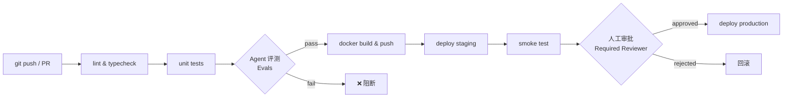

CI/CD 流水线将代码从 `git push` 到生产部署的全过程自动化，让 Agent 服务团队能高频、安全地发布新版本。对 AI/Agent 工程师而言，CI/CD 不仅跑单元测试，还要在流水线中内嵌模型评测（Evals），让每次变更都经过质量门控。

## 核心概念对比

| 概念 | 触发 | 终点 | 是否自动上线 |
|---|---|---|---|
| CI（持续集成 Continuous Integration） | 每次 push/PR | 构建产物（Docker 镜像） | 否 |
| CD（持续交付 Continuous Delivery） | CI 通过后 | 制品推送到 Registry，可一键部署 | 否（人工审批） |
| CD（持续部署 Continuous Deployment） | CI 通过后 | 直接发布到生产 | 是 |

三者是递进关系：先做好 CI，才能做 Continuous Delivery，最终演进到 Continuous Deployment。大多数 Agent 服务团队停在 **持续交付** 阶段——staging 自动上线，production 保留人工审批。

## CI/CD 核心价值

- **快速反馈**：PR 提交后 5 分钟内知道是否破坏了现有功能，而不是合并后才发现。
- **减少人工操作**：打包、推送镜像、SSH 登录服务器部署……这些重复操作全部消除。
- **保证质量门控**：任何一步失败（lint/test/eval）都阻断后续部署，坏代码无法进入生产。

## 完整流水线示意



## GitHub Actions 完整示例

以下是一个 Node.js/TypeScript Agent 服务的完整 workflow，覆盖 lint → test → evals → docker build & push → deploy。

```yaml
# .github/workflows/ci-cd.yml
name: CI/CD Pipeline

on:
  push:
    branches: [main, develop]
  pull_request:
    branches: [main]

env:
  REGISTRY: registry.cn-hangzhou.aliyuncs.com
  IMAGE_NAME: myorg/agent-api

jobs:
  # ---- Stage 1: 代码质量检查 ----
  lint-and-test:
    name: Lint & Test
    runs-on: ubuntu-latest
    steps:
      - uses: actions/checkout@v4

      - uses: pnpm/action-setup@v3
        with:
          version: 9

      - uses: actions/setup-node@v4
        with:
          node-version: '20'
          cache: 'pnpm'

      - name: Install dependencies
        run: pnpm install --frozen-lockfile

      - name: Lint
        run: pnpm lint

      - name: Type check
        run: pnpm typecheck

      - name: Unit tests
        run: pnpm test --coverage

  # ---- Stage 2: Agent 自动评测（Evals）----
  evals:
    name: Agent Evals
    needs: lint-and-test
    runs-on: ubuntu-latest
    steps:
      - uses: actions/checkout@v4

      - uses: pnpm/action-setup@v3
        with:
          version: 9

      - uses: actions/setup-node@v4
        with:
          node-version: '20'
          cache: 'pnpm'

      - name: Install dependencies
        run: pnpm install --frozen-lockfile

      - name: Run evals
        env:
          ANTHROPIC_API_KEY: ${{ secrets.ANTHROPIC_API_KEY }}
          OPENAI_API_KEY: ${{ secrets.OPENAI_API_KEY }}
        run: pnpm eval
        # eval 脚本会对比 baseline 分数，低于阈值则 exit 1 阻断流水线

  # ---- Stage 3: 构建 & 推送 Docker 镜像 ----
  build-and-push:
    name: Build & Push Image
    needs: evals
    runs-on: ubuntu-latest
    if: github.ref == 'refs/heads/main'
    outputs:
      image-tag: ${{ steps.meta.outputs.version }}
    steps:
      - uses: actions/checkout@v4

      - name: Docker meta
        id: meta
        uses: docker/metadata-action@v5
        with:
          images: ${{ env.REGISTRY }}/${{ env.IMAGE_NAME }}
          tags: |
            type=sha,prefix=,suffix=,format=short
            type=raw,value=latest,enable=true

      - name: Login to Aliyun ACR
        uses: docker/login-action@v3
        with:
          registry: ${{ env.REGISTRY }}
          username: ${{ secrets.REGISTRY_USERNAME }}
          password: ${{ secrets.REGISTRY_PASSWORD }}

      - name: Build and push
        uses: docker/build-push-action@v5
        with:
          context: .
          push: true
          tags: ${{ steps.meta.outputs.tags }}
          cache-from: type=gha
          cache-to: type=gha,mode=max

  # ---- Stage 4: 部署 Staging ----
  deploy-staging:
    name: Deploy to Staging
    needs: build-and-push
    runs-on: ubuntu-latest
    environment: staging
    steps:
      - name: Deploy via SSH
        uses: appleboy/ssh-action@v1
        with:
          host: ${{ secrets.STAGING_HOST }}
          username: deploy
          key: ${{ secrets.STAGING_SSH_KEY }}
          script: |
            docker pull ${{ env.REGISTRY }}/${{ env.IMAGE_NAME }}:latest
            docker compose -f /opt/app/docker-compose.yml up -d --no-deps api
            docker system prune -f

  # ---- Stage 5: 部署 Production（需人工审批）----
  deploy-production:
    name: Deploy to Production
    needs: deploy-staging
    runs-on: ubuntu-latest
    environment:
      name: production        # 在 GitHub Repo → Settings → Environments 中配置 Required reviewers
      url: https://api.example.com
    steps:
      - name: Deploy to production
        uses: appleboy/ssh-action@v1
        with:
          host: ${{ secrets.PROD_HOST }}
          username: deploy
          key: ${{ secrets.PROD_SSH_KEY }}
          script: |
            docker pull ${{ env.REGISTRY }}/${{ env.IMAGE_NAME }}:latest
            docker compose -f /opt/app/docker-compose.yml up -d --no-deps api
```

## 环境管理：dev / staging / production

多环境策略是 CI/CD 最重要的实践之一。

```
代码仓库分支策略：
  feature/* → 开发者本地 dev 环境测试
  develop   → 自动部署到 staging（与生产配置接近）
  main      → 部署到 production（人工审批）
```

**staging 的核心价值**：用生产级别的配置（真实数据库副本、真实 LLM API）验证功能，发现只有在生产环境才能复现的问题，比如环境变量缺失、模型响应格式变更等。

## Secret 管理

Agent 服务有大量 API Key 需要保护，包括 LLM 服务的密钥。

**GitHub Secrets 配置路径**：`Repo → Settings → Secrets and variables → Actions`

| Secret 名称 | 用途 |
|---|---|
| `ANTHROPIC_API_KEY` | Claude API 调用（eval 步骤） |
| `OPENAI_API_KEY` | OpenAI API 调用（eval 步骤） |
| `REGISTRY_USERNAME` | 阿里云 ACR / DockerHub 登录用户名 |
| `REGISTRY_PASSWORD` | 阿里云 ACR / DockerHub 密码或 Token |
| `STAGING_SSH_KEY` | 部署到 staging 服务器的 SSH 私钥 |
| `PROD_SSH_KEY` | 部署到 production 服务器的 SSH 私钥 |

在 YAML 中通过 `${{ secrets.KEY_NAME }}` 引用，GitHub Actions 会自动在日志中将其替换为 `***`，防止意外泄漏。**永远不要在 YAML 文件中硬编码任何密钥。**

## 部署策略对比

| 策略 | 原理 | 优点 | 缺点 | 适用场景 |
|---|---|---|---|---|
| 滚动更新 Rolling Update | 逐步替换旧实例 | 成本低，无需双倍资源 | 回滚慢，短暂新旧版本共存 | 大多数 API 服务 |
| 蓝绿部署 Blue-Green | 维护两套环境，流量一次性切换 | 回滚极快（秒级切换），零停机 | 资源成本翻倍 | 对可用性要求高的服务 |
| 金丝雀发布 Canary | 先对小比例流量（5%~10%）上线新版本 | 风险可控，可实时观察指标 | 配置复杂，需要流量分发能力 | 大流量、高风险变更 |

## Agent 服务专项：自动化评测（Evals）作为 CI 步骤

将 Evals 内嵌到 CI 流水线是 AI 工程的核心实践。示例评测脚本：

```typescript
// scripts/eval.ts
import { runEvals } from './evals/runner';

const PASS_THRESHOLD = 0.85; // 85% 准确率才允许部署

async function main() {
  const result = await runEvals({
    testCases: './evals/cases/*.json',
    model: process.env.EVAL_MODEL ?? 'claude-3-5-haiku-latest',
  });

  console.log(`Eval score: ${result.score} (threshold: ${PASS_THRESHOLD})`);

  if (result.score < PASS_THRESHOLD) {
    console.error('Eval failed: score below threshold, blocking deploy');
    process.exit(1); // 非 0 退出码让 GitHub Actions Job 失败
  }

  console.log('Eval passed ✓');
}

main();
```

每次 PR 合并前，CI 都会用最新代码跑 eval，确保 prompt 改动、工具调用逻辑变更不会导致 Agent 质量下滑。

## 常见误区与最佳实践

**误区 1：直接向 main 分支 push 代码**
绕过了 PR review 和 CI 检查，任何一个破坏性改动都会直接部署到生产。应通过 Branch Protection Rule 强制要求 PR + CI 通过后才能合并。

**误区 2：不做 staging 测试，直接从 CI 推到 production**
staging 环境就是用来发现"只有在生产配置下才会出现的问题"的。跳过 staging 等于用生产环境做测试。

**误区 3：把 LLM API Key 写在代码或 Dockerfile ENV 中**
Dockerfile 中的 `ENV` 指令会被打入镜像层，任何拉到镜像的人都能提取密钥。应在运行时通过环境变量注入，或使用 Secrets Manager。

**误区 4：eval 只在本地跑**
模型行为具有随机性和版本依赖性，本地通过不代表 CI 环境通过。将 evals 放入 CI 流水线才能保证每次部署前都有稳定的质量基线。

## 面试要点

- **CI 和 CD 的区别**：CI 是持续集成（每次提交自动验证），CD 分持续交付（人工审批后部署）和持续部署（全自动上线）。面试时区分清楚这三个概念。
- **如何防止 Secret 泄漏**：使用平台 Secret 机制（GitHub Secrets）存储，YAML 中通过变量引用，日志自动脱敏，定期轮换，绝不 hardcode。
- **蓝绿部署 vs 滚动更新**：蓝绿部署同时保有两套环境、流量一次性切换、回滚秒级完成但成本翻倍；滚动更新逐步替换实例、成本低但回滚需要时间。
- **Agent CI/CD 的特殊性**：相比普通后端服务，需要在 CI 中加入 Evals 步骤，用量化指标（准确率、延迟、token 消耗）作为部署质量门控，防止模型退化。
- **数据库迁移与部署顺序**：先执行 `migrate deploy` 再部署新代码（迁移向前兼容），避免新代码遇到旧 Schema 报错。
