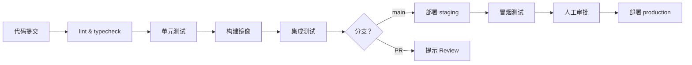

# CI/CD 流水线设计

CI/CD（持续集成/持续交付）将代码从提交到部署的流程自动化，让团队能高频、安全地发布软件。CI 保证每次提交都经过验证，CD 保证验证通过的代码随时可以（或自动）部署到生产。

## 核心概念

| 概念 | 说明 |
|---|---|
| CI（持续集成） | 频繁合并代码，每次触发自动构建和测试 |
| CD（持续交付） | 自动构建制品，随时可以一键部署到生产 |
| CD（持续部署） | 测试通过后自动部署到生产，无需人工干预 |
| Pipeline | 由多个 Stage（阶段）和 Job（任务）组成的自动化工作流 |
| Artifact（制品） | CI 产出物，如 Docker 镜像、编译后的 JS Bundle |

## 典型流水线阶段



## GitHub Actions 完整示例

```yaml
# .github/workflows/ci-cd.yml
name: CI/CD Pipeline

on:
  push:
    branches: [main, develop]
  pull_request:
    branches: [main]

env:
  REGISTRY: registry.cn-hangzhou.aliyuncs.com
  IMAGE_NAME: myorg/api

jobs:
  # ---- Stage 1: 代码质量 ----
  lint-and-test:
    name: Lint & Test
    runs-on: ubuntu-latest
    steps:
      - uses: actions/checkout@v4

      - uses: pnpm/action-setup@v3
        with:
          version: 9

      - uses: actions/setup-node@v4
        with:
          node-version: '20'
          cache: 'pnpm'

      - name: Install dependencies
        run: pnpm install --frozen-lockfile

      - name: Lint
        run: pnpm lint

      - name: Type check
        run: pnpm typecheck

      - name: Unit tests
        run: pnpm test --coverage

      - name: Upload coverage
        uses: codecov/codecov-action@v4
        with:
          token: ${{ secrets.CODECOV_TOKEN }}

  # ---- Stage 2: 构建 & 推送镜像 ----
  build-and-push:
    name: Build & Push Image
    needs: lint-and-test
    runs-on: ubuntu-latest
    if: github.ref == 'refs/heads/main'
    outputs:
      image-tag: ${{ steps.meta.outputs.tags }}
    steps:
      - uses: actions/checkout@v4

      - name: Docker meta
        id: meta
        uses: docker/metadata-action@v5
        with:
          images: ${{ env.REGISTRY }}/${{ env.IMAGE_NAME }}
          tags: |
            type=sha,prefix=,suffix=,format=short
            type=raw,value=latest,enable=${{ github.ref == 'refs/heads/main' }}

      - name: Login to registry
        uses: docker/login-action@v3
        with:
          registry: ${{ env.REGISTRY }}
          username: ${{ secrets.REGISTRY_USERNAME }}
          password: ${{ secrets.REGISTRY_PASSWORD }}

      - name: Build and push
        uses: docker/build-push-action@v5
        with:
          context: .
          push: true
          tags: ${{ steps.meta.outputs.tags }}
          cache-from: type=gha       # 利用 GitHub Actions 缓存加速构建
          cache-to: type=gha,mode=max

  # ---- Stage 3: 部署 Staging ----
  deploy-staging:
    name: Deploy to Staging
    needs: build-and-push
    runs-on: ubuntu-latest
    environment: staging
    steps:
      - name: Deploy via SSH
        uses: appleboy/ssh-action@v1
        with:
          host: ${{ secrets.STAGING_HOST }}
          username: deploy
          key: ${{ secrets.STAGING_SSH_KEY }}
          script: |
            docker pull ${{ env.REGISTRY }}/${{ env.IMAGE_NAME }}:latest
            docker compose -f /opt/app/docker-compose.prod.yml up -d --no-deps api
            docker system prune -f

  # ---- Stage 4: 部署 Production（需手动审批）----
  deploy-production:
    name: Deploy to Production
    needs: deploy-staging
    runs-on: ubuntu-latest
    environment:
      name: production        # GitHub 环境保护，需配置 Required reviewers
      url: https://api.example.com
    steps:
      - name: Deploy to production
        uses: appleboy/ssh-action@v1
        with:
          host: ${{ secrets.PROD_HOST }}
          username: deploy
          key: ${{ secrets.PROD_SSH_KEY }}
          script: |
            docker pull ${{ env.REGISTRY }}/${{ env.IMAGE_NAME }}:latest
            docker compose -f /opt/app/docker-compose.prod.yml up -d --no-deps api
```

## 数据库迁移的处理

```yaml
# 部署前先执行 migration
- name: Run DB migrations
  uses: appleboy/ssh-action@v1
  with:
    host: ${{ secrets.PROD_HOST }}
    username: deploy
    key: ${{ secrets.PROD_SSH_KEY }}
    script: |
      docker run --rm \
        -e DATABASE_URL=${{ secrets.DATABASE_URL }} \
        ${{ env.REGISTRY }}/${{ env.IMAGE_NAME }}:latest \
        pnpm prisma migrate deploy
```

## 密钥与环境变量管理

- **Secrets**：通过 `Settings → Secrets and variables → Actions` 存储，在 YAML 中用 `${{ secrets.KEY }}` 引用，日志中自动脱敏。
- **Environment**：为 staging/production 分别配置不同的 Secrets，并可设置必须审批人（Required reviewers）。
- **永不在 YAML 文件中硬编码密钥**：提交到 Git 的配置文件应视为公开。

## 流水线优化技巧

- **并行 Job**：互不依赖的任务（如 lint 和测试）可并行执行，缩短总耗时。
- **缓存依赖**：`actions/cache` 或 `pnpm` 的 `cache` 选项缓存 `node_modules`，避免每次重装。
- **构建缓存**：Docker BuildKit 的 `cache-from: type=gha` 缓存镜像层。
- **路径过滤**：只有相关文件变更时才触发流水线（`paths` 过滤器）。

## 面试常问

- **CI 和 CD 的区别**：CI 是持续集成（频繁合并+自动验证），CD 是持续交付（自动到部署就绪）或持续部署（自动到生产）。
- **如何防止流水线中密钥泄露**：使用平台的 Secret 机制（GitHub Secrets、GitLab CI Variables），不在代码/日志中打印，定期轮换。
- **蓝绿部署和滚动更新的区别**：蓝绿部署同时保有两套环境，流量一次性切换，回滚极快但成本高；滚动更新逐步替换实例，成本低但回滚较慢。
- **数据库迁移和代码部署的顺序**：新代码需兼容新旧 Schema（向前兼容），先执行 migrate 再部署代码；避免部署后才 migrate 导致旧代码遇到新 Schema 报错。
