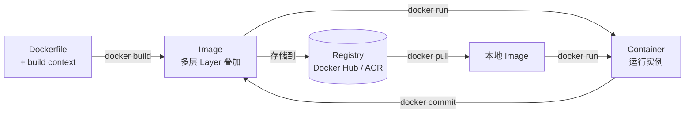

Docker 通过容器技术将应用及其依赖打包成一个可移植的镜像，实现"一次构建，到处运行"，彻底解决"本地能跑、线上挂掉"的环境不一致问题。对于 AI/Agent 工程师而言，掌握 Docker 是将 LangChain、LlamaIndex 等 Agent 服务稳定交付到生产环境的必要基础。

## 容器 vs 虚拟机：本质区别

很多人把容器和虚拟机混为一谈，但二者在架构层面截然不同。

| 维度 | 容器（Container） | 虚拟机（VM） |
|---|---|---|
| 隔离机制 | Linux namespace + cgroups，共享宿主机内核 | Hypervisor（KVM/VMware），每个 VM 含独立 OS 内核 |
| 启动时间 | 秒级（毫秒级） | 分钟级 |
| 镜像体积 | MB 级 | GB 级 |
| 性能损耗 | 接近原生，几乎无额外开销 | 5%-15% 虚拟化开销 |
| 隔离强度 | 进程级，隔离性弱于 VM | OS 级，隔离性更强 |
| 适用场景 | 微服务、CI/CD、Agent 服务部署 | 强隔离要求、不同内核版本需求 |

容器的本质是：在同一个 Linux 内核上，通过 **namespace** 实现进程/网络/文件系统隔离，通过 **cgroups** 限制 CPU/内存资源，而非独立的操作系统。

## Docker 核心概念

在深入实践前，先理清五个核心概念的关系：

| 概念 | 说明 |
|---|---|
| **Image（镜像）** | 只读模板，包含应用代码、运行时、依赖、配置，由 Dockerfile 构建而来 |
| **Container（容器）** | 镜像的运行实例，相互隔离，可启动/停止/删除，可类比为"进程" |
| **Registry（仓库）** | 存储和分发镜像的服务，如 Docker Hub、阿里云 ACR、GitHub Container Registry |
| **Volume（卷）** | 容器外的持久化存储，容器删除后数据不丢失 |
| **Network（网络）** | 容器间通信的虚拟网络，默认 bridge 模式，服务间可用容器名互相访问 |

## Dockerfile 指令详解

Dockerfile 是构建镜像的"菜谱"，每条指令生成一个镜像层（Layer）。

```dockerfile
# FROM：指定基础镜像，是每个 Dockerfile 的第一条指令
FROM node:20-alpine

# WORKDIR：设置工作目录，后续 RUN/COPY/CMD 均在此目录执行
WORKDIR /app

# COPY：将文件从 build context 复制到镜像
COPY package.json pnpm-lock.yaml ./

# RUN：在构建阶段执行命令，结果固化到镜像层
RUN corepack enable && pnpm install --frozen-lockfile

# COPY 源码（放在 RUN install 之后，利用缓存）
COPY . .

# EXPOSE：声明容器监听的端口（仅文档性，不自动映射）
EXPOSE 3000

# ENV：设置环境变量
ENV NODE_ENV=production

# CMD：容器启动时的默认命令，可被 docker run 覆盖
CMD ["node", "dist/index.js"]

# ENTRYPOINT：容器入口，与 CMD 配合使用
# ENTRYPOINT ["node"]
# CMD ["dist/index.js"]
```

**ENTRYPOINT vs CMD 的区别**：ENTRYPOINT 定义"这个容器是什么"，CMD 定义"默认参数"。`docker run my-app --port 8080` 会把 `--port 8080` 附加到 ENTRYPOINT 后，而不是替换它。

## 多阶段构建：TypeScript Node.js 应用示例

Multi-stage Build 是生产环境镜像的标准做法，将构建环境与运行环境彻底分离。以下是 TypeScript Agent 服务的完整示例：

```dockerfile
# ---- Stage 1: 安装依赖 ----
FROM node:20-alpine AS deps
WORKDIR /app
COPY package.json pnpm-lock.yaml ./
RUN corepack enable && pnpm install --frozen-lockfile

# ---- Stage 2: 编译 TypeScript ----
FROM node:20-alpine AS builder
WORKDIR /app
COPY --from=deps /app/node_modules ./node_modules
COPY . .
RUN pnpm build   # tsc 编译，输出到 dist/

# ---- Stage 3: 生产运行镜像（最小化）----
FROM node:20-alpine AS runner
WORKDIR /app
ENV NODE_ENV=production

# 安全：创建非 root 用户
RUN addgroup -S appgroup && adduser -S appuser -G appgroup

# 只从前两个阶段复制必要产物
COPY --from=deps /app/node_modules ./node_modules
COPY --from=builder /app/dist ./dist

# 切换到非 root 用户
USER appuser

EXPOSE 3000
CMD ["node", "dist/index.js"]
```

最终镜像不含 TypeScript 编译器、源码、devDependencies，体积可从 ~1GB 压缩到 ~100MB 以下。

## .dockerignore 的重要性

`.dockerignore` 决定哪些文件被排除在 build context 之外。build context 是 `docker build` 命令传给 Docker daemon 的本地文件集合——如果包含 `node_modules`，每次构建都会传输几百 MB 的无用数据。

```
# .dockerignore
node_modules
.git
dist
*.log
.env
.env.*
coverage
.DS_Store
```

**务必排除**：`node_modules`（镜像内会重新安装）、`.env`（含敏感配置）、`.git`（源码历史无需进入镜像）。

## 镜像分层（Layer）原理与缓存优化

Docker 镜像由一系列只读层叠加而成，每条 `RUN`/`COPY`/`ADD` 指令生成一层。层是内容寻址的——只要内容不变，哈希值不变，构建时直接复用缓存。

```
FROM node:20-alpine          ← Layer 1（基础镜像，极少变）
WORKDIR /app                 ← Layer 2
COPY package.json ./         ← Layer 3（中等变更频率）
RUN pnpm install             ← Layer 4（依赖 Layer 3，package.json 不变则命中缓存）
COPY . .                     ← Layer 5（代码变更最频繁）
RUN pnpm build               ← Layer 6
```

**黄金原则**：变更频率低的指令靠前，变更频繁的指令靠后。`COPY . .` 要放在 `RUN pnpm install` 之后，否则每次改一行代码都会重新安装全部依赖。

## Dockerfile 构建流程



## 常用 Docker 命令速查

```bash
# ---- 镜像操作 ----
docker build -t my-agent:1.0 .          # 构建镜像
docker images                            # 列出本地镜像
docker rmi my-agent:1.0                  # 删除镜像
docker pull node:20-alpine               # 从 Registry 拉取
docker push my-registry/my-agent:1.0    # 推送到 Registry
docker image inspect my-agent:1.0       # 查看镜像详情（包含层信息）

# ---- 容器生命周期 ----
docker run -d \                          # -d 后台运行
  -p 3000:3000 \                         # 宿主机端口:容器端口
  -e OPENAI_API_KEY=$OPENAI_API_KEY \    # 注入环境变量
  --name my-agent \                      # 指定容器名
  my-agent:1.0

docker ps                                # 查看运行中容器
docker ps -a                             # 包含已停止容器
docker logs -f my-agent                  # 实时跟踪日志
docker exec -it my-agent sh             # 进入容器调试
docker stop my-agent && docker rm my-agent

# ---- 资源清理 ----
docker system prune -f                   # 清理悬空镜像、停止的容器
docker volume prune                      # 清理未使用的 Volume
```

## Agent 服务容器化实践

将 LangChain / LlamaIndex Agent 服务打包为 Docker 镜像时，有几个特殊考量：

**1. 向量模型与大文件处理**

避免将模型权重文件打入镜像（可能几 GB），改为运行时从对象存储（OSS/S3）下载，或通过 Volume 挂载：

```bash
docker run -d \
  -v /data/models:/app/models \           # 挂载本地模型目录
  -e MODEL_PATH=/app/models/embedding \
  -e OPENAI_API_KEY=$OPENAI_API_KEY \
  -e TAVILY_API_KEY=$TAVILY_API_KEY \
  -p 8080:8080 \
  my-langchain-agent:1.0
```

**2. 敏感配置注入**

API Key 等敏感信息绝不写入 Dockerfile 或提交到镜像。开发环境用 `--env-file .env`，生产环境通过 Kubernetes Secret 或 CI/CD 平台的环境变量管理注入：

```bash
# 开发环境
docker run --env-file .env my-agent:1.0

# 生产环境（通过 K8s Secret 挂载）
# 在 K8s manifest 中引用 Secret，不在镜像内硬编码
```

**3. 健康检查（Healthcheck）**

Agent 服务通常有初始化阶段（加载模型、连接向量库）。配置 HEALTHCHECK 让编排系统等待服务真正就绪：

```dockerfile
HEALTHCHECK --interval=30s --timeout=10s --start-period=60s --retries=3 \
  CMD curl -f http://localhost:8080/health || exit 1
```

## 安全最佳实践

**非 root 用户运行**：容器进程默认以 root 运行，一旦发生容器逃逸，攻击者将获得宿主机 root 权限。生产镜像必须切换到非特权用户：

```dockerfile
RUN addgroup -S appgroup && adduser -S appuser -G appgroup
USER appuser
```

**最小基础镜像**：
- `node:20-alpine`：基于 Alpine Linux，~5MB，适合大多数 Node.js 服务
- `gcr.io/distroless/nodejs20`：Google 出品，无 shell/包管理器，攻击面极小
- 避免使用 `node:20`（基于 Debian，~900MB）

**镜像扫描**：推送前扫描已知漏洞：

```bash
docker scout cves my-agent:1.0   # Docker 内置扫描
# 或使用 trivy
trivy image my-agent:1.0
```

## 常见误区与面试要点

**常见误区**

- **在容器内存储状态**：容器是无状态的，重启后文件系统恢复到镜像状态。数据库文件、上传文件、日志必须挂载 Volume 或写到外部存储。
- **镜像体积过大**：每个 `RUN` 命令产生一层，`apt install` 后不 `rm -rf /var/lib/apt/lists/*` 会留下包缓存。不使用多阶段构建将导致镜像携带编译器、devDependencies 等无用内容。
- **使用 `latest` 标签**：`latest` 是可变标签，不能保证可重现性。生产环境应固定具体版本（如 `node:20.15.0-alpine`）。
- **把 `.env` 文件 COPY 进镜像**：`docker history` 可以查看每一层的变更，敏感文件一旦进入镜像便难以彻底清除。

**最佳实践清单**

- 多阶段构建，分离构建环境与运行环境
- 编写 `.dockerignore`，排除 `node_modules`、`.git`、`.env`
- 合理排列 Dockerfile 指令顺序，最大化缓存命中
- 非 root 用户运行容器进程
- 使用 alpine 或 distroless 最小基础镜像
- 固定基础镜像版本号，不使用 `latest`
- API Key 等敏感信息通过环境变量注入，绝不写入镜像

**面试要点**

- **容器 vs VM 本质区别**：共享内核（namespace + cgroups）vs Hypervisor 虚拟化，决定了启动速度、镜像体积、隔离强度的差异
- **多阶段构建的作用**：构建产物与运行时分离，最终镜像只含必要文件，减小体积和攻击面
- **镜像层缓存机制**：每层内容哈希唯一，未变则复用缓存；指令顺序决定缓存粒度，package.json 单独 COPY 是标准优化手段
- **ENTRYPOINT 与 CMD 的区别**：ENTRYPOINT 定义容器主进程，CMD 提供可覆盖的默认参数；两者配合使用实现灵活的容器入口
- **容器数据持久化**：Volume（由 Docker 管理，适合生产）vs Bind Mount（绑定宿主机目录，适合开发调试）
