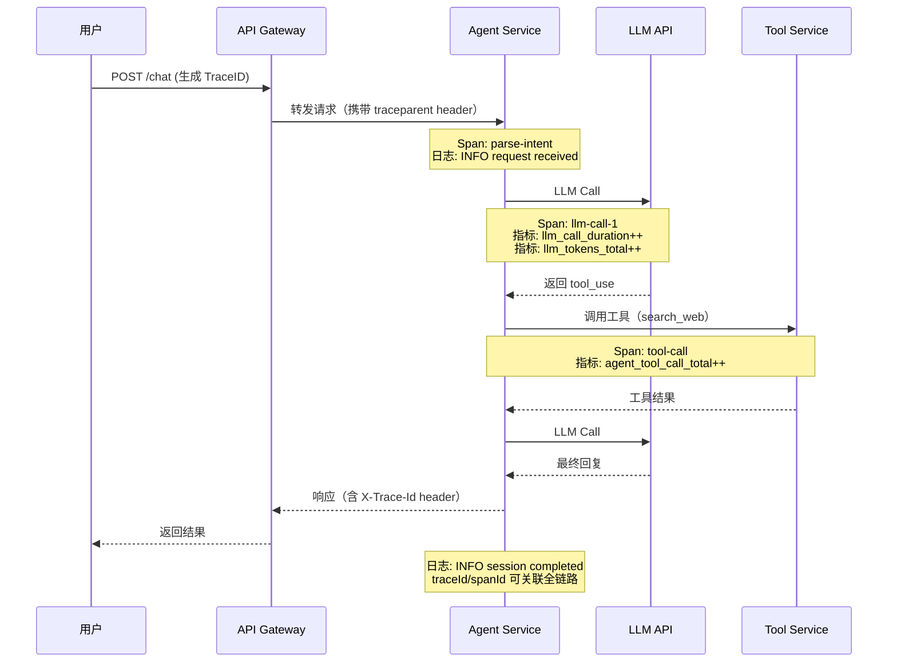

完善的可观测性（Observability）体系是生产系统的"眼睛"——没有它，故障发生时只能靠猜；有了它，问题在用户感知之前就能被发现和定位。对 AI/Agent 服务而言，除常规接口监控外，还需关注 LLM 调用延迟、token 用量、工具调用成功率等专项指标。

## 三大支柱：日志 / 指标 / 追踪

Logging、Metrics、Tracing 并称可观测性三大支柱，定位各不相同：

| 维度 | 日志 (Logging) | 指标 (Metrics) | 追踪 (Tracing) |
|---|---|---|---|
| 数据形态 | 离散事件文本/JSON | 时间序列数值 | 跨服务调用树（Span） |
| 存储成本 | 高 | 低 | 中 |
| 适合场景 | 排查具体错误、审计 | 趋势告警、容量规划 | 定位跨服务慢链路 |
| 代表工具 | ELK、SLS、Loki | Prometheus + Grafana | Jaeger、Zipkin、OpenTelemetry |
| 查询方式 | 全文/字段检索 | PromQL 聚合 | TraceID 追溯 |

三者互补：指标告警触发后，通过 TraceID 跳转到追踪链路，再从 Span 关联到详细日志——这条排障路径在 Agent 服务中尤为关键。

## 结构化日志（Structured Logging）

### JSON 格式 vs 纯文本

纯文本日志（`console.log`）只能全文搜索，无法按字段过滤或聚合。生产环境应输出 JSON，让日志平台自动建索引。

```ts
// logger.ts — 使用 pino（高性能结构化日志库）
import pino from 'pino';

const logger = pino({
  level: process.env.LOG_LEVEL ?? 'info',
  transport: process.env.NODE_ENV === 'development'
    ? { target: 'pino-pretty', options: { colorize: true } }
    : undefined,
  base: { service: 'agent-service', env: process.env.NODE_ENV },
  // 脱敏：自动将匹配字段替换为 [Redacted]
  redact: {
    paths: ['req.headers.authorization', 'body.password', 'llmResponse.content'],
    censor: '[Redacted]',
  },
});

export default logger;
```

输出示例（生产 JSON）：
```json
{
  "level": "info",
  "time": "2024-06-18T10:23:45.123Z",
  "service": "agent-service",
  "traceId": "7f3a9b2c-...",
  "spanId": "d4e5f6a7",
  "msg": "LLM call completed",
  "model": "claude-3-5-sonnet",
  "promptTokens": 1024,
  "completionTokens": 312,
  "durationMs": 2340
}
```

### 日志级别规范

| 级别 | 使用场景 | Agent 服务示例 |
|---|---|---|
| `error` | 需立即处理的故障 | LLM API 连续超时、工具调用抛出未捕获异常 |
| `warn` | 潜在问题、降级处理 | token 用量接近上限、LLM 触发限流后重试成功 |
| `info` | 关键业务事件 | Agent 会话开始/结束、工具调用完成 |
| `debug` | 调试信息，生产不开启 | 每轮对话的完整 prompt/completion |
| `trace` | 极细粒度跟踪 | 流式输出的每个 token chunk |

生产环境通常设置 `LOG_LEVEL=info`，故障排查时临时调为 `debug`。

## 指标（Metrics）：RED 方法

RED 方法是服务级指标的黄金标准：**R**ate（请求速率）、**E**rrors（错误率）、**D**uration（延迟分布）。

```ts
// metrics.ts — Prometheus + prom-client
import { Registry, Counter, Histogram, collectDefaultMetrics } from 'prom-client';

const register = new Registry();
collectDefaultMetrics({ register });

// LLM 调用专项指标
export const llmCallDuration = new Histogram({
  name: 'llm_call_duration_seconds',
  help: 'LLM API call latency',
  labelNames: ['model', 'status'],          // status: success | timeout | rate_limited
  buckets: [0.5, 1, 2, 5, 10, 30, 60],     // LLM 延迟比普通接口高一个量级
  registers: [register],
});

export const llmTokensTotal = new Counter({
  name: 'llm_tokens_total',
  help: 'Total LLM tokens consumed',
  labelNames: ['model', 'type'],            // type: prompt | completion
  registers: [register],
});

export const agentToolCallTotal = new Counter({
  name: 'agent_tool_call_total',
  help: 'Agent tool call count',
  labelNames: ['tool', 'status'],           // status: success | error
  registers: [register],
});

// 暴露 /metrics 端点
app.get('/metrics', async (_req, res) => {
  res.set('Content-Type', register.contentType);
  res.end(await register.metrics());
});
```

Grafana Dashboard 中，核心看板应包含：LLM P50/P95/P99 延迟、token 日消耗趋势、工具调用错误率热力图。

## 链路追踪（Distributed Tracing）

### OpenTelemetry 核心概念

- **Trace**：一次完整请求的调用树，由唯一 `TraceID` 标识
- **Span**：Trace 中的一个操作单元，记录开始/结束时间、标签、事件
- **Context Propagation**：通过 HTTP Header（`traceparent`）在服务间传递上下文

对 Agent 服务而言，一次用户请求可能产生如下 Span 树：

```
Trace: user-request (TraceID: abc123)
├── Span: parse-intent (5ms)
├── Span: llm-call-1 (2340ms)
│   └── Span: http-post /v1/messages
├── Span: tool-call:search_web (800ms)
├── Span: llm-call-2 (1200ms)
└── Span: format-response (12ms)
```

```ts
// otel.ts — OpenTelemetry 初始化
import { NodeSDK } from '@opentelemetry/sdk-node';
import { OTLPTraceExporter } from '@opentelemetry/exporter-trace-otlp-http';
import { Resource } from '@opentelemetry/resources';
import { SEMRESATTRS_SERVICE_NAME } from '@opentelemetry/semantic-conventions';

const sdk = new NodeSDK({
  resource: new Resource({
    [SEMRESATTRS_SERVICE_NAME]: 'agent-service',
  }),
  traceExporter: new OTLPTraceExporter({
    url: process.env.OTEL_EXPORTER_OTLP_ENDPOINT ?? 'http://jaeger:4318/v1/traces',
  }),
});

sdk.start();
```

## Agent 服务监控专项

### LLM 调用追踪

```ts
import { trace, SpanStatusCode } from '@opentelemetry/api';

const tracer = trace.getTracer('agent-service');

async function callLLM(messages: Message[]): Promise<string> {
  return tracer.startActiveSpan('llm.call', async (span) => {
    span.setAttributes({
      'llm.model': 'claude-3-5-sonnet',
      'llm.prompt_tokens': countTokens(messages),
    });

    const start = Date.now();
    try {
      const response = await anthropic.messages.create({ model, messages });

      const durationMs = Date.now() - start;
      span.setAttributes({
        'llm.completion_tokens': response.usage.output_tokens,
        'llm.duration_ms': durationMs,
      });

      // Prometheus 指标
      llmCallDuration.observe({ model, status: 'success' }, durationMs / 1000);
      llmTokensTotal.inc({ model, type: 'prompt' }, response.usage.input_tokens);
      llmTokensTotal.inc({ model, type: 'completion' }, response.usage.output_tokens);

      // INFO 级别只记录元数据，不记录具体内容（避免 PII）
      logger.info({ traceId: span.spanContext().traceId, durationMs,
        promptTokens: response.usage.input_tokens,
        completionTokens: response.usage.output_tokens }, 'LLM call completed');

      return response.content[0].text;
    } catch (err) {
      span.recordException(err as Error);
      span.setStatus({ code: SpanStatusCode.ERROR });
      llmCallDuration.observe({ model, status: 'error' }, (Date.now() - start) / 1000);
      throw err;
    } finally {
      span.end();
    }
  });
}
```

### Prompt/Completion 日志的 PII 脱敏

用户的对话内容可能包含姓名、手机号、地址等敏感信息（PII）。生产环境应遵循最小必要原则：

- **默认不记录** prompt/completion 内容；DEBUG 级别才记录，且只在受控环境启用
- 记录时使用正则替换或 NLP 实体识别脱敏手机号、身份证、邮箱等
- 日志存储需与业务数据隔离，设置独立访问权限和短保留期

### 告警规则：LLM API 超时/限流

```yaml
# prometheus-alert-rules.yml
groups:
  - name: agent-alerts
    rules:
      - alert: LLMHighLatency
        expr: |
          histogram_quantile(0.95,
            rate(llm_call_duration_seconds_bucket{status="success"}[5m])
          ) > 10
        for: 3m
        labels:
          severity: warning
        annotations:
          summary: "LLM P95 延迟超过 10 秒"

      - alert: LLMRateLimited
        expr: |
          rate(llm_call_duration_seconds_count{status="rate_limited"}[5m]) > 0.5
        for: 1m
        labels:
          severity: critical
        annotations:
          summary: "LLM API 每分钟限流次数 > 30，需检查并发控制"

      - alert: AgentToolCallErrorRate
        expr: |
          rate(agent_tool_call_total{status="error"}[5m])
          / rate(agent_tool_call_total[5m]) > 0.1
        for: 2m
        labels:
          severity: warning
        annotations:
          summary: "工具调用错误率 > 10%"
```

## Agent 请求完整可观测性链路



## 阿里云 SLS 集成

阿里云 Simple Log Service (SLS) 是生产环境常用的托管日志方案，支持 100GB/天以上的写入量：

```bash
# 安装阿里云日志 SDK
npm install @alicloud/sls20201230
```

```ts
// 通过环境变量配置（推荐用 ECS 实例角色或 RAM 角色，避免硬编码 AK）
// 实际生产中更常见的做法：应用输出 stdout JSON，
// 由 ilogtail/Logtail Agent 采集后推送到 SLS

// filebeat.yml 等效的 ilogtail 配置片段（YAML）
/*
inputs:
  - Type: input_file
    FilePaths:
      - /var/log/app/*.log
processors:
  - Type: processor_json
    SourceKey: content
    KeepSource: false
flushers:
  - Type: flusher_sls
    Project: my-project
    Logstore: agent-service-logs
    Region: cn-hangzhou
*/
```

SLS 支持通过 SQL 语法做日志分析，例如统计 LLM 调用的 P99 延迟：

```sql
* | SELECT approx_percentile(durationMs, 0.99) AS p99_ms,
           model,
           date_trunc('minute', __time__) AS ts
  WHERE msg = 'LLM call completed'
  GROUP BY model, ts
  ORDER BY ts DESC
```

## 日志采样策略

高流量场景下（>1000 QPS），全量日志成本极高，需要采样：

| 策略 | 适用场景 | 做法 |
|---|---|---|
| 头部采样（Head-based） | 流量均匀 | 请求入口按比例（如 10%）决定是否采样 |
| 尾部采样（Tail-based） | 需保留错误链路 | 先缓存所有 Span，响应完成后：错误 100% 保留，成功按比例丢弃 |
| 优先级采样 | Agent 服务推荐 | 错误/慢请求（>5s）100% 保留；正常请求 5% 采样 |

```ts
// 简单的尾部采样实现示例
function shouldSample(statusCode: number, durationMs: number): boolean {
  if (statusCode >= 500 || durationMs > 5000) return true;   // 错误/慢请求全保留
  return Math.random() < 0.05;                                // 正常请求 5% 采样
}
```

## 常见误区 / 最佳实践 / 面试要点

**常见误区**

- **没有 requestId/traceId**：多条日志无法串联，排查时只能靠时间范围猜测，在多步 Agent 链路中尤为致命
- **记录用户敏感对话**：直接将 prompt/completion 写入日志违反数据合规要求，需要脱敏或默认不记录
- **只看平均延迟**：LLM 调用延迟分布极不均匀，P99 往往是均值的 5-10 倍，平均值会掩盖真实的长尾问题
- **日志级别滥用**：全部用 `info` 导致关键 `error` 淹没在噪音中，或全部用 `debug` 导致生产成本爆炸

**最佳实践**

- 每个请求在入口处生成或透传 `traceId`，通过 AsyncLocalStorage 注入所有子调用的日志 context
- Agent 会话应有 `sessionId`，便于按会话聚合多轮对话的 token 用量和工具调用统计
- LLM 调用单独设置超时（如 60s），并区分 `timeout` 和 `rate_limited` 错误分别告警

**面试要点**

- **Logging / Metrics / Tracing 的区别**：三者互补，指标告警定位问题域，追踪定位调用链，日志提供详细上下文
- **为什么用结构化日志**：JSON 可被平台自动解析建索引，支持字段过滤、聚合分析，而纯文本只能全文搜索
- **RED 方法**：Rate、Errors、Duration，是衡量服务健康度的最小必要指标集
- **OpenTelemetry 的价值**：厂商中立的可观测性标准，一次埋点可同时接入 Jaeger / Zipkin / SLS / DataDog
- **Agent 服务的监控重点**：LLM 调用延迟（比普通接口高 10-100x）、token 消耗（直接影响成本）、工具调用成功率、多轮会话中的错误传播
