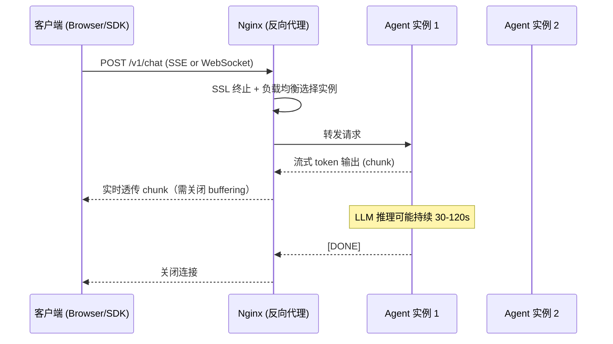

Nginx 是高性能的 HTTP 服务器与反向代理，以事件驱动、异步非阻塞架构著称，单进程可处理数万并发连接。对于 AI/Agent 工程师来说，Nginx 几乎是所有 Agent API 服务的标准流量入口——负责 SSL 终止、负载均衡、以及 LLM 流式响应的稳定透传。

## Nginx 的核心角色

| 角色 | 说明 |
|---|---|
| 反向代理（Reverse Proxy） | 接收外部请求，转发到内网服务，隐藏后端拓扑 |
| 负载均衡（Load Balancer） | 将流量分发到多个后端实例，支持多种调度策略 |
| SSL 终止（SSL Termination） | 在 Nginx 层处理 TLS 握手，后端服务只需处理 HTTP |
| 静态文件服务（Static File Server） | 直接从磁盘响应静态资源，绕过应用层 |
| 限流 / 熔断 | 基于 IP 或连接数的速率限制，防止流量冲击 |

## 正向代理 vs 反向代理

两者最核心的区别在于"代理谁、对谁透明"：

| 维度 | 正向代理 | 反向代理 |
|---|---|---|
| 代理方向 | 代理客户端 | 代理服务端 |
| 谁配置 | 客户端（如浏览器代理设置） | 服务端管理员 |
| 对谁透明 | 服务端不知道真实客户端 | 客户端不知道真实后端 |
| 典型用途 | VPN、科学上网、企业出口代理 | API 网关、CDN 回源、微服务入口 |
| 典型工具 | Squid、Clash | Nginx、HAProxy、Envoy |

## 核心配置结构

Nginx 配置采用三层嵌套的 block 结构：

```
http           ← 全局 HTTP 设置（gzip、日志格式、upstream）
└── server     ← 虚拟主机（监听端口、域名）
    └── location  ← 路径匹配规则（proxy_pass、root、return）
```

```nginx
# /etc/nginx/nginx.conf（精简版）
http {
    # 全局 upstream 定义（所有 server 共享）
    upstream agent_api {
        server 10.0.0.1:8080;
        server 10.0.0.2:8080;
        keepalive 32;
    }

    server {
        listen 443 ssl http2;
        server_name api.example.com;

        # SSL 证书路径
        ssl_certificate     /etc/letsencrypt/live/api.example.com/fullchain.pem;
        ssl_certificate_key /etc/letsencrypt/live/api.example.com/privkey.pem;

        # 路径级别的规则
        location /v1/ {
            proxy_pass http://agent_api;
        }
    }
}
```

`location` 的匹配优先级（从高到低）：`=` 精确匹配 → `^~` 前缀优先 → `~` 正则 → 普通前缀。

## 反向代理基础配置

`proxy_set_header` 是反向代理中最容易被忽视的关键点——不正确透传会导致后端无法获取真实客户端信息：

```nginx
location /api/ {
    proxy_pass http://agent_api;

    # 后端需要知道请求的原始 Host（影响虚拟主机路由）
    proxy_set_header Host              $host;

    # 真实客户端 IP（单层代理用此字段）
    proxy_set_header X-Real-IP         $remote_addr;

    # 多层代理时追加的 IP 链（如 CDN → Nginx → 后端）
    proxy_set_header X-Forwarded-For   $proxy_add_x_forwarded_for;

    # 告知后端原始协议是 HTTP 还是 HTTPS
    proxy_set_header X-Forwarded-Proto $scheme;
}
```

Node.js/Express 读取真实 IP 时需配置 `app.set('trust proxy', 1)`，否则 `req.ip` 只会返回 Nginx 的地址。

## HTTPS 配置

```nginx
# HTTP → HTTPS 强制跳转
server {
    listen 80;
    server_name api.example.com;
    return 301 https://$host$request_uri;
}

server {
    listen 443 ssl http2;
    server_name api.example.com;

    ssl_certificate     /etc/letsencrypt/live/api.example.com/fullchain.pem;
    ssl_certificate_key /etc/letsencrypt/live/api.example.com/privkey.pem;

    # 只允许 TLS 1.2 / 1.3，禁用旧版弱协议
    ssl_protocols             TLSv1.2 TLSv1.3;
    ssl_ciphers               ECDHE-ECDSA-AES128-GCM-SHA256:ECDHE-RSA-AES128-GCM-SHA256;
    ssl_prefer_server_ciphers off;

    # Session 复用，减少握手开销
    ssl_session_cache   shared:SSL:10m;
    ssl_session_timeout 1d;

    # HSTS：告知浏览器 1 年内只用 HTTPS
    add_header Strict-Transport-Security "max-age=31536000" always;

    location / {
        proxy_pass http://agent_api;
        proxy_set_header Host              $host;
        proxy_set_header X-Real-IP         $remote_addr;
        proxy_set_header X-Forwarded-For   $proxy_add_x_forwarded_for;
        proxy_set_header X-Forwarded-Proto https;
    }
}
```

Let's Encrypt 证书申请命令（Certbot）：

```bash
# 安装 Certbot
apt install certbot python3-certbot-nginx

# 自动申请并配置（会修改 Nginx 配置）
certbot --nginx -d api.example.com

# 证书自动续期（写入 cron 或 systemd timer）
certbot renew --quiet
```

## 负载均衡

```nginx
upstream agent_api {
    # 默认轮询（round-robin）
    server 10.0.0.1:8080 weight=2;  # 权重高，分配更多流量
    server 10.0.0.2:8080 weight=1;
    server 10.0.0.3:8080 backup;    # 备用节点，主节点全故障时启用

    # ip_hash; # 同 IP 始终路由到同一节点
    # least_conn; # 优先路由到当前连接数最少的节点

    keepalive 32; # 与后端保持长连接池
}
```

**负载均衡策略对比**：

| 策略 | 配置指令 | 适用场景 |
|---|---|---|
| 轮询（Round Robin） | 默认，无需配置 | 无状态服务，实例性能相近 |
| 加权轮询（Weighted） | `weight=N` | 实例性能差异大时按比例分流 |
| IP Hash | `ip_hash` | 需要会话粘性（Session Sticky） |
| 最少连接（Least Conn） | `least_conn` | 长连接场景，动态均衡后端负载 |

## Agent 服务关键配置

这是 AI 工程师最需要关注的部分。LLM 推理慢、响应以流式输出，默认的 Nginx 配置会在两个地方"翻车"。

### 请求流架构



### SSE (Server-Sent Events) 流式响应

SSE 是目前主流的 LLM streaming 方案（OpenAI/Claude SDK 默认使用）。Nginx 默认会缓冲后端响应，导致所有 token 在推理完成后才一次性发送给客户端，流式效果完全失效。

```nginx
location /v1/chat/completions {
    proxy_pass http://agent_api;

    # ⚠️ 关键：关闭响应缓冲，chunk 实时透传
    proxy_buffering off;

    # 关闭 X-Accel-Buffering 响应头的缓冲控制
    proxy_cache off;

    # LLM 推理时间长，默认 60s 会超时（GPT-4 复杂任务可能 >2min）
    proxy_read_timeout    300s;
    proxy_send_timeout    300s;
    proxy_connect_timeout 10s;

    proxy_set_header Host              $host;
    proxy_set_header X-Real-IP         $remote_addr;
    proxy_set_header X-Forwarded-For   $proxy_add_x_forwarded_for;
    proxy_set_header X-Forwarded-Proto $scheme;
}
```

### WebSocket 升级

Agent 平台的长会话、双向通信场景（如实时工具调用反馈）通常使用 WebSocket。Nginx 默认不转发 `Upgrade` 头，需显式配置：

```nginx
location /ws/ {
    proxy_pass http://agent_api;

    # WebSocket 握手：从 HTTP/1.1 升级协议
    proxy_http_version 1.1;
    proxy_set_header Upgrade    $http_upgrade;
    proxy_set_header Connection "upgrade";

    # WebSocket 长连接，心跳间隔内不能超时
    proxy_read_timeout 3600s;  # 1 小时

    proxy_set_header Host            $host;
    proxy_set_header X-Real-IP       $remote_addr;
    proxy_set_header X-Forwarded-For $proxy_add_x_forwarded_for;
}
```

## CORS 与 Gzip

```nginx
# CORS（跨域资源共享）统一在 Nginx 层处理
location /api/ {
    # 允许指定来源（生产环境不要用 *）
    add_header Access-Control-Allow-Origin  "https://app.example.com" always;
    add_header Access-Control-Allow-Methods "GET, POST, OPTIONS" always;
    add_header Access-Control-Allow-Headers "Authorization, Content-Type" always;

    # 预检请求直接返回 204
    if ($request_method = OPTIONS) {
        return 204;
    }

    proxy_pass http://agent_api;
}
```

```nginx
# Gzip 压缩（放在 http 块）
gzip on;
gzip_comp_level 6;
gzip_min_length 1024;
gzip_types text/plain text/css application/javascript application/json;
gzip_vary on;

# 注意：SSE 流式响应不应开启 gzip，否则会引起缓冲问题
```

## 常见误区与最佳实践

**误区 1：忘记关闭 `proxy_buffering`，SSE 不实时**

Nginx 默认 `proxy_buffering on`，会把后端响应缓存到内存/磁盘再发给客户端。LLM streaming 场景下，所有 token 会在模型推理完成后才一次性推送，"流式"效果完全消失。**必须对 SSE 路径设置 `proxy_buffering off`。**

**误区 2：`proxy_read_timeout` 太短导致 LLM 请求中断**

默认值是 60 秒，对于 GPT-4/Claude 处理复杂任务完全不够。Agent 任务涉及多轮工具调用时推理时间可能超过 2 分钟。建议 Agent API 路径将 timeout 延长至 300s 甚至更长。

**误区 3：WebSocket 忘记设置 `proxy_http_version 1.1`**

`Upgrade` 头只在 HTTP/1.1 中有效。Nginx 默认使用 HTTP/1.0 与后端通信，必须显式声明 `proxy_http_version 1.1`，否则 WebSocket 握手必然失败（返回 101 升级失败或直接 502）。

**误区 4：`X-Forwarded-For` 被篡改**

客户端可以伪造 `X-Forwarded-For` 头。若需要可信的 IP，应在 Nginx 入口用 `proxy_set_header X-Forwarded-For $remote_addr` 覆盖（丢弃客户端传来的值），而非追加。

**最佳实践**：
- SSL 证书用 Certbot 自动管理，不要手动维护有效期
- 为不同业务路径（SSE / REST / WebSocket）分别定义 `location` 块，按需配置 timeout 和 buffering
- `upstream` 块开启 `keepalive`，减少与 Agent 服务频繁建立 TCP 连接的开销
- 生产环境不要在 Nginx 层直接暴露 `server_tokens on`（默认泄露版本号），建议关闭

## 面试要点

- **正向代理与反向代理的区别**：正向代理代理客户端（服务端不知道真实来源），反向代理代理服务端（客户端不知道真实后端）。
- **`X-Forwarded-For` 的作用**：记录请求经过的代理链路，后端通过此字段获取真实客户端 IP，用于日志、限流、风控。多层代理时值为逗号分隔的 IP 链。
- **为什么 SSE 需要 `proxy_buffering off`**：Nginx 缓冲机制会积攒响应再批量发送，直接破坏 Server-Sent Events 的实时性。
- **WebSocket 握手原理**：客户端发送 `Upgrade: websocket` + `Connection: Upgrade` 头，服务端返回 `101 Switching Protocols`，之后连接升级为全双工 WebSocket 协议。Nginx 需要透传这两个头并使用 HTTP/1.1。
- **`keepalive` 在 upstream 中的意义**：Nginx 与后端服务维护一个 TCP 长连接池，避免每个请求都三次握手，显著降低高并发下的延迟和资源消耗。
- **`worker_processes` 怎么配置**：`worker_processes auto` 让 Nginx 自动匹配 CPU 核数；`worker_connections` 控制每个 worker 的最大连接数，理论最大并发 = `worker_processes × worker_connections`。
