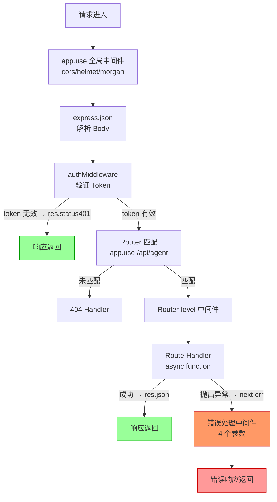

Express 核心原理与中间件需要把“机制是什么”“边界在哪里”“怎样验证”放在同一条学习路径中。本文以 [Express using middleware](https://expressjs.com/en/guide/using-middleware/) 对“应用级、路由级和错误处理中间件及执行顺序”的说明为事实边界，并用 [Express error handling](https://expressjs.com/en/guide/error-handling/) 校准“同步/异步错误传播、默认处理器与 Express 5 Promise 行为”。文中的代码和工程方案用于解释这些机制；涉及具体版本、默认值或部署行为时，应再回到所链接的一手资料确认。


*图：Express 核心原理与中间件的核心组件、信息流与验证边界。*

---

Express 是 Node.js 生态中历史最悠久、使用最广泛的 Web 框架，以"最小化、无主见（unopinionated）"为设计哲学——核心只提供路由和中间件管道，不强制约定目录结构、ORM 或任何业务逻辑组织方式。理解其内部运行机制，有助于写出更健壮的应用，也是面试中被频繁考察的知识点。

## 请求生命周期总览

```mermaid
flowchart LR
    Client -->|HTTP Request| App["app\n(Application-level\nmiddlewares)"]
    App --> Router["Router\n(express.Router())"]
    Router --> MW["Route Middleware\n(router-level)"]
    MW --> Handler["Route Handler\n(req, res, next)"]
    Handler -->|调用 next(err)| ErrMW["Error Middleware\n(err, req, res, next)"]
    Handler -->|res.send/json/end| Client
    ErrMW --> Client

    style ErrMW fill:#f96,stroke:#c00
```

请求进入 Express 后依次经过：Application-level 中间件 → Router 匹配 → Router-level 中间件 → Route Handler。任何环节调用 `next(err)` 都会跳过剩余普通中间件，直接进入最近的错误处理中间件。

## 中间件类型详解

Express 的中间件本质是一个函数 `(req, res, next) => void`，按注册顺序串联为管道。

### 应用级中间件（Application-level）

```typescript
import express, { Request, Response, NextFunction } from 'express';
const app = express();

// 无路径过滤：每个请求都经过
app.use(express.json());
app.use(express.urlencoded({ extended: true }));

// 带路径前缀：仅匹配 /api/* 的请求
app.use('/api', (req: Request, res: Response, next: NextFunction) => {
  console.log(`[API] ${req.method} ${req.path}`);
  next(); // 必须调用，否则请求挂起
});
```

### 路由级中间件（Router-level）

```typescript
import { Router } from 'express';

const agentRouter = Router();

// Router 级别的鉴权中间件，只影响此 Router 内的路由
agentRouter.use(authMiddleware);

agentRouter.post('/chat', async (req: Request, res: Response) => {
  const result = await agentService.chat(req.body.message);
  res.json({ data: result });
});

app.use('/api/agent', agentRouter);
```

### 错误处理中间件（Error-handling，4 参数）

Express 通过**参数个数**识别错误处理中间件——必须声明 4 个参数，缺一不可：

```typescript
import { ErrorRequestHandler } from 'express';

const errorHandler: ErrorRequestHandler = (err, req, res, next) => {
  console.error(err.stack);
  
  const status  = err.status  ?? err.statusCode ?? 500;
  const message = err.expose  ?? status < 500
    ? err.message
    : 'Internal Server Error';
  
  res.status(status).json({ error: message });
};

// 必须注册在所有路由和中间件之后
app.use(errorHandler);
```

### 常用内置与三方中间件

| 中间件 | 来源 | 作用 | Agent 服务典型用途 |
|--------|------|------|-------------------|
| `express.json()` | 内置 | 解析 `application/json` Body | 接收 Agent 工具调用参数 |
| `express.urlencoded()` | 内置 | 解析表单 Body | 后台管理页面 |
| `express.static()` | 内置 | 静态文件服务 | 前端资产 |
| `cors` | 三方 | 跨域资源共享 | Agent 前端直连 API |
| `helmet` | 三方 | 设置安全相关 HTTP 头 | 生产环境安全加固 |
| `morgan` | 三方 | HTTP 请求日志 | 请求审计 |
| `compression` | 三方 | gzip/brotli 响应压缩 | 大型 JSON 响应 |

## Router：模块化路由

`express.Router()` 是一个迷你版 `express` 应用，支持独立的中间件栈和路由，适合按业务域拆分：

```typescript
// routes/agent.ts
import { Router, Request, Response } from 'express';

interface ChatRequest extends Request {
  body: { message: string; sessionId: string };
}

const router = Router();

router.post('/chat', async (req: ChatRequest, res: Response, next) => {
  try {
    const { message, sessionId } = req.body;
    const response = await agentService.chat(sessionId, message);
    res.json({ data: response });
  } catch (err) {
    next(err); // 转发给错误处理中间件
  }
});

router.get('/sessions/:id', async (req, res, next) => {
  try {
    const session = await agentService.getSession(req.params.id);
    if (!session) return res.status(404).json({ error: 'Session not found' });
    res.json({ data: session });
  } catch (err) {
    next(err);
  }
});

export default router;

// app.ts
import agentRouter from './routes/agent';
app.use('/api/agent', agentRouter);
```

## TypeScript 集成：泛型与类型扩展

Express 的 `Request` 和 `Response` 支持泛型参数，可精确描述各端的类型：

```typescript
// Request<Params, ResBody, ReqBody, Query>
import { Request, Response } from 'express';

interface AgentChatBody {
  message: string;
  sessionId: string;
}

interface AgentChatResponse {
  data: { reply: string; toolsUsed: string[] };
}

// 完整类型化的 Handler
async function chatHandler(
  req: Request<{}, AgentChatResponse, AgentChatBody>,
  res: Response<AgentChatResponse>
) {
  const { message, sessionId } = req.body; // 已推断类型
  const reply = await agentService.chat(sessionId, message);
  res.json({ data: reply });
}
```

### 扩展 Request 类型（Augmentation）

在多个路由中共享认证信息时，通过声明合并扩展 `Request`：

```typescript
// types/express.d.ts
import 'express';

declare global {
  namespace Express {
    interface Request {
      user?: {
        id: string;
        email: string;
        role: 'admin' | 'user';
      };
      agentContext?: {
        sessionId: string;
        startedAt: number;
      };
    }
  }
}

// auth.middleware.ts
import { Request, Response, NextFunction } from 'express';
import jwt from 'jsonwebtoken';

export function authMiddleware(req: Request, res: Response, next: NextFunction) {
  const token = req.headers.authorization?.replace('Bearer ', '');
  if (!token) return res.status(401).json({ error: 'No token' });

  try {
    req.user = jwt.verify(token, process.env.JWT_SECRET!) as Express.Request['user'];
    next();
  } catch {
    res.status(401).json({ error: 'Invalid token' });
  }
}
```

## Express + Agent 后端：工具调用端点

AI Agent 框架（如 LangChain、自研 Agent）经常需要通过 HTTP 调用宿主服务提供的"工具（Tools）"。Express 非常适合构建这类工具端点：

```typescript
import express from 'express';
import { z } from 'zod';

const app = express();
app.use(express.json());

// Tool: 搜索知识库
const searchSchema = z.object({
  query: z.string().min(1),
  topK:  z.number().int().min(1).max(20).default(5),
});

app.post('/tools/search', async (req, res, next) => {
  const parsed = searchSchema.safeParse(req.body);
  if (!parsed.success) {
    return res.status(400).json({ error: parsed.error.flatten() });
  }
  
  try {
    const results = await vectorDB.search(parsed.data.query, parsed.data.topK);
    res.json({ results });
  } catch (err) {
    next(err);
  }
});

// Tool: 执行代码
app.post('/tools/execute', async (req, res, next) => {
  try {
    const { code, language } = req.body as { code: string; language: string };
    const output = await sandboxService.run(code, language);
    res.json({ output, exitCode: 0 });
  } catch (err: any) {
    // 工具执行失败不一定是服务错误，返回结构化错误供 Agent 判断
    res.json({ output: err.message, exitCode: 1 });
  }
});

// 全局错误处理（必须最后注册）
app.use((err: any, req: express.Request, res: express.Response, next: express.NextFunction) => {
  res.status(err.status ?? 500).json({ error: err.message ?? 'Internal Server Error' });
});
```

## 路由路径匹配与参数

Express 的路由路径支持字符串、字符串模式和正则三种形式，底层由 `path-to-regexp` 将路径编译为正则表达式进行匹配。理解这一点能避免很多"路由不生效"的困惑：

```typescript
// 路径参数 :param —— 通过 req.params 读取
app.get('/tools/:toolName/runs/:runId', (req, res) => {
  const { toolName, runId } = req.params; // { toolName, runId }
  res.json({ toolName, runId });
});

// 可选参数（Express 5 语法）
app.get('/sessions{/:id}', handler);

// 正则匹配，例如只匹配数字 ID
app.get(/^\/users\/(\d+)$/, handler);

// 通配挂载：app.use 是"前缀匹配"，而 app.get 是"完整匹配"
app.use('/api', router);     // /api、/api/x、/api/x/y 都会进入
app.get('/api', handler);    // 仅精确匹配 /api
```

路由的注册顺序即匹配优先级，Express 一旦命中第一个匹配的路由就不再向下查找（除非该 Handler 调用 `next('route')` 主动放行）。把更具体的路由放在更通用的通配路由之前，是避免覆盖问题的关键。

## 应用与响应局部状态：app.locals 与 res.locals

Express 提供两个跨中间件传递数据的官方位置：`app.locals` 是应用级单例（整个进程共享，适合放配置、数据库连接句柄），`res.locals` 是单次请求级（仅在当前请求生命周期内有效，适合放当前用户、请求追踪 ID）：

```typescript
// 应用级：进程内全局共享
app.locals.llmClient = new Anthropic();
app.locals.appVersion = '1.0.0';

// 请求级：在中间件中写入，后续 Handler 和模板可读取
app.use((req, res, next) => {
  res.locals.requestId = crypto.randomUUID();
  res.locals.user = req.user;
  next();
});
```

在 Agent 服务中，`res.locals.requestId` 常用于把同一次请求里多次 LLM 调用、工具调用的日志串成一条链路，便于排查问题。注意切勿把请求级数据误放进 `app.locals`，否则会造成请求间的数据串扰（典型的并发 Bug）。

## 中间件执行顺序详解



## 常见误区

- **误区：async 路由中的异常会自动传给错误处理中间件** — Express 4.x **不**自动捕获 async 函数抛出的错误，必须显式 `try/catch` + `next(err)`，或使用 `express-async-errors` 补丁。Express 5.x 起原生支持 async 错误转发。

- **误区：错误处理中间件可以注册在任何位置** — 必须注册在所有路由和普通中间件之后，Express 按注册顺序执行，提前注册的错误中间件不会接收到后续路由的错误。

- **误区：next() 调用后 Handler 立即停止** — `next()` 只是触发下一个中间件，当前函数并未结束。不加 `return next()` 时，后续代码仍会执行，可能导致"headers already sent"错误。

- **误区：Router 就是 app 的子集，可以随意互换** — `Router` 没有 `listen()`、没有全局错误处理链，不能独立运行，只能挂载到 `app` 或另一个 `Router`。

## 最佳实践

- 所有 async 路由 Handler 统一用 `try/catch` + `next(err)` 包裹，或全局引入 `express-async-errors`。
- 错误处理中间件必须声明 4 个参数，且注册在所有路由之后。
- 用 `express.Router()` 按业务域（agent、auth、admin）拆分路由文件，通过 `app.use('/api/xxx', router)` 挂载。
- 用声明合并（`declare global namespace Express`）扩展 `Request` 类型，避免到处使用 `(req as any).user`。
- 输入校验在 Route Handler 入口处统一用 `zod` 或 `class-validator` 处理，校验失败立即返回 400，不进入业务逻辑。
- 生产环境错误响应不暴露 stack trace，开发环境可以在错误中间件中附加调试信息。
- Agent 工具端点的错误响应应区分"服务异常（5xx）"和"工具执行失败（业务错误，仍 2xx 但含 exitCode）"，让 Agent 能正确判断是否重试。

## 面试要点

- **Q：Express 中间件是如何串联执行的？**  
  A：Express 内部维护一个中间件数组，每次 `app.use(fn)` 将函数压入数组。收到请求时，按注册顺序逐个调用中间件，每个中间件通过调用 `next()` 将控制权传给下一个。调用链是同步驱动的，`next()` 本质是调用数组中的下一个函数。

- **Q：如何正确处理 Express 中 async 路由的错误？**  
  A：Express 4.x 不捕获 async 函数的 rejected Promise，需要 `try/catch` + `next(err)`，或使用 `express-async-errors` 包自动 monkey-patch。Express 5.x 原生支持 async 错误转发，不再需要额外处理。

- **Q：`app.use()` 和 `app.get()` 的区别是什么？**  
  A：`app.use()` 匹配以指定路径**开头**的所有请求（任意 HTTP 方法），常用于挂载中间件和 Router。`app.get()` 精确匹配路径且仅匹配 GET 方法，常用于注册具体路由处理器。

- **Q：在构建 AI Agent 工具服务时，Express 有哪些注意事项？**  
  A：工具调用的参数校验要做严格的 schema 验证（防止 Prompt Injection 带来的恶意参数）；工具执行失败应返回结构化结果而非 5xx，让 Agent 能自主决策是否重试；LLM 流式响应端点需要在路由层手动管理 `res.write` 和 `res.end`，或考虑迁移到 Koa（`ctx.body = stream`）获得更好的流处理体验。

## 参考资料

- [Express using middleware](https://expressjs.com/en/guide/using-middleware/)
- [Express error handling](https://expressjs.com/en/guide/error-handling/)
