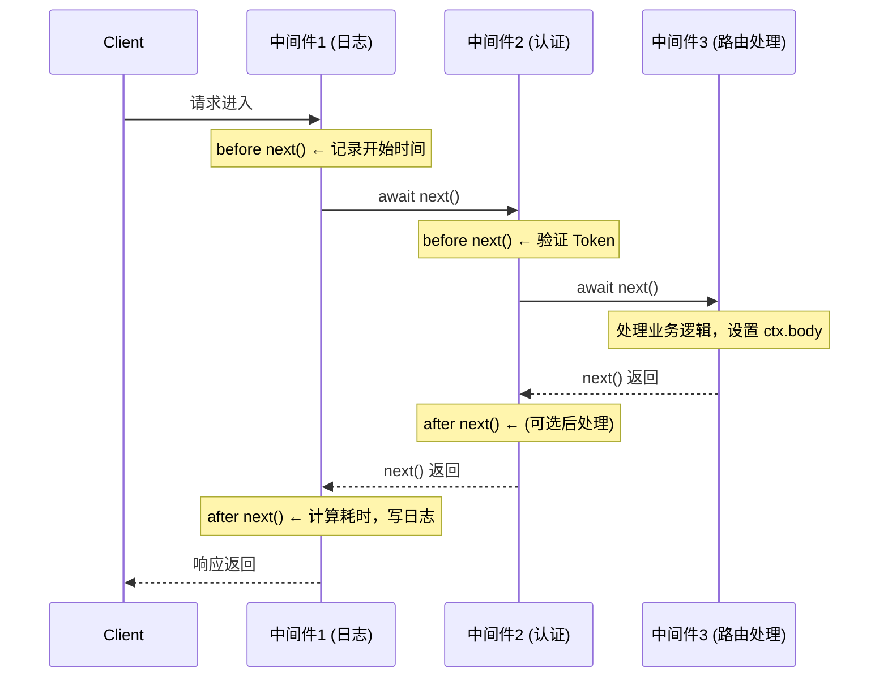

*图：沿图中的节点与箭头阅读，重点是async/await 控制流准确解释请求 Context、洋葱模型、异常回溯和响应写入时机。*

---

Koa 的中间件以 `async/await` 和洋葱式控制流组织请求，使嵌套调用、响应回溯和集中错误捕获更显式；它改善了组合方式，但错误边界与响应终止仍需应用正确实现。

## Koa vs Express：核心差异

Koa 刻意保持极简内核，不内置任何路由、Body 解析等功能，所有能力通过中间件组合实现。

| 维度 | Koa | Express |
|------|-----|---------|
| **异步模型** | 原生 `async/await`，`next()` 返回 Promise | 回调为主，需额外包装支持 async |
| **错误处理** | `try/catch` + 顶层中间件统一捕获 | 需要四参数 `(err, req, res, next)` 中间件 |
| **内置功能** | 极简，无路由、无 Body 解析 | 内置路由、静态文件服务 |
| **Context 对象** | 统一 `ctx`（融合 `req`/`res` 并扩展） | 分离的 `req`/`res` |
| **中间件执行** | 洋葱模型：`next()` 前 + `next()` 后均执行 | 线性：`next()` 前执行，后续逻辑不会回溯 |
| **体积** | ~600 行核心代码 | ~几千行 |
| **生态** | 社区中间件（`@koa/router`、`koa-body`） | 更丰富的官方/社区中间件 |

## 洋葱模型（Onion Model）

Koa 中间件的执行顺序形如洋葱：请求从最外层中间件依次穿透到最内层，响应时再从内层依次返回外层。每个中间件在 `await next()` 之前处理"入方向"逻辑，`await next()` 之后处理"出方向"逻辑。



这一模式使得**计时、日志、链路追踪**等横切关注点天然适合用 Koa 实现，因为可以在同一个中间件函数里同时持有请求前和响应后的状态。

## compose() 实现原理

Koa 使用 `koa-compose` 将中间件数组串联成一个递归的异步函数链：

```typescript
type Middleware<T> = (ctx: T, next: () => Promise<void>) => Promise<void>;

function compose<T>(middlewares: Middleware<T>[]) {
  return function(ctx: T, next?: () => Promise<void>): Promise<void> {
    let index = -1;

    function dispatch(i: number): Promise<void> {
      if (i <= index) {
        return Promise.reject(new Error('next() called multiple times'));
      }
      index = i;

      let fn: Middleware<T> | undefined = middlewares[i];
      if (i === middlewares.length) fn = next; // 到达末尾，调用外部 next
      if (!fn) return Promise.resolve();

      try {
        // 将 dispatch(i+1) 作为当前中间件的 next
        return Promise.resolve(fn(ctx, dispatch.bind(null, i + 1)));
      } catch (err) {
        return Promise.reject(err);
      }
    }

    return dispatch(0);
  };
}
```

关键点：
- `dispatch(i)` 调用第 `i` 个中间件，并将 `dispatch(i+1)` 作为其 `next`
- `index` 防止同一中间件多次调用 `next()`（常见 bug）
- 整个链返回一个 `Promise`，可以被顶层 `try/catch` 统一捕获

## Context 对象（ctx）

`ctx` 是 Koa 对原生 `req`/`res` 的封装，同时是中间件间共享数据的载体：

```typescript
import Koa, { Context, Next } from 'koa';

const app = new Koa();

app.use(async (ctx: Context, next: Next) => {
  // ctx.request — Koa 封装的请求对象
  const method = ctx.request.method;   // 等同于 ctx.method
  const path   = ctx.request.path;     // 等同于 ctx.path
  const query  = ctx.request.query;    // 已解析的 QueryString 对象
  const body   = ctx.request.body;     // 需要 koa-body 中间件

  // ctx.response — Koa 封装的响应对象
  ctx.response.status = 200;           // 等同于 ctx.status
  ctx.response.body   = { ok: true };  // 等同于 ctx.body

  // ctx.state — 中间件间传递数据的命名空间（推荐用法）
  ctx.state.userId = 'u-123';

  // ctx.throw — 抛出 HTTP 错误，触发错误处理中间件
  if (!ctx.headers.authorization) {
    ctx.throw(401, 'Unauthorized');
  }

  await next();
});
```

`ctx.state` 是中间件间通信的约定位置，类似 Express 的 `res.locals`。在 TypeScript 中可以通过声明合并扩展类型：

```typescript
declare module 'koa' {
  interface DefaultState {
    userId: string;
    agentSessionId?: string;
  }
}
```

## 自定义中间件示例

### 计时中间件

```typescript
import { Context, Next } from 'koa';

export async function timingMiddleware(ctx: Context, next: Next): Promise<void> {
  const start = Date.now();
  await next(); // 等待所有后续中间件和路由处理完成
  const ms = Date.now() - start;
  ctx.set('X-Response-Time', `${ms}ms`);
  console.log(`${ctx.method} ${ctx.path} — ${ms}ms`);
}
```

### 统一错误处理中间件

```typescript
import { Context, Next } from 'koa';

export async function errorMiddleware(ctx: Context, next: Next): Promise<void> {
  try {
    await next();
  } catch (err: unknown) {
    const error = err as { status?: number; message?: string; expose?: boolean };

    ctx.status = error.status ?? 500;
    ctx.body = {
      error: ctx.status < 500 || error.expose
        ? error.message
        : 'Internal Server Error',
    };

    // 将错误事件转发给 app，触发 app.on('error') 回调
    ctx.app.emit('error', err, ctx);
  }
}

// 注册：错误处理中间件必须是第一个注册的
app.use(errorMiddleware);
app.use(timingMiddleware);
app.use(router.routes());
```

洋葱模型的优势在此体现：`errorMiddleware` 通过 `try/catch` 包裹 `await next()` 即可捕获**整个中间件链**中抛出的任何错误，无论错误发生在第几层。（参见 [Koa official documentation](https://koajs.com/)）

## 常用中间件生态

```typescript
import Router from '@koa/router';
import { koaBody } from 'koa-body';
import session from 'koa-session';

const router = new Router({ prefix: '/api' });

// Body 解析：支持 JSON、form、multipart
app.use(koaBody({ multipart: true }));

// Session
app.use(session({ key: 'koa:sess', maxAge: 86400000 }, app));

// 路由
router.post('/agent/chat', async (ctx) => {
  const { message } = ctx.request.body as { message: string };
  ctx.body = await agentService.chat(ctx.state.userId, message);
});

app.use(router.routes());
app.use(router.allowedMethods()); // 自动处理 OPTIONS 和 405
```

## Agent 后端应用：流式 SSE 响应

Koa 非常适合为 AI Agent 服务构建 SSE（Server-Sent Events）流式端点，因为它对响应流的控制比 Express 更直接：

```typescript
import { PassThrough } from 'stream';
import Anthropic from '@anthropic-ai/sdk';

const anthropic = new Anthropic();

router.post('/agent/stream', async (ctx: Context) => {
  const { messages } = ctx.request.body as { messages: MessageParam[] };

  ctx.set({
    'Content-Type':  'text/event-stream',
    'Cache-Control': 'no-cache',
    'Connection':    'keep-alive',
  });
  ctx.status = 200;

  const passThrough = new PassThrough();
  ctx.body = passThrough;

  // 启动 LLM 流式调用，不阻塞中间件链
  (async () => {
    try {
      const stream = anthropic.messages.stream({
        model: 'claude-opus-4-5',
        max_tokens: 2048,
        messages,
      });

      for await (const chunk of stream) {
        if (chunk.type === 'content_block_delta' && chunk.delta.type === 'text_delta') {
          passThrough.write(`data: ${JSON.stringify({ text: chunk.delta.text })}\n\n`);
        }
      }
    } finally {
      passThrough.write('data: [DONE]\n\n');
      passThrough.end();
    }
  })();
});
```

Koa 的 `ctx.body = stream` 模式使流式响应写法简洁，配合 `PassThrough` 可以在异步 LLM 流和 HTTP 响应之间做桥接。

## 处理客户端断连与取消

AI Agent 的流式响应往往持续数十秒，用户可能中途关闭页面。如果服务端不感知客户端断连，LLM 调用会继续消耗 Token 配额、白白产生费用。Koa 可以监听底层 `req` 的 `close` 事件，结合 `AbortController` 中止下游 LLM 请求：

```typescript
router.post('/agent/stream', async (ctx: Context) => {
  const controller = new AbortController();

  // 客户端断开连接时触发
  ctx.req.on('close', () => {
    controller.abort(); // 中止 LLM 调用，停止计费
  });

  const stream = anthropic.messages.stream(
    { model: 'claude-opus-4-5', max_tokens: 2048, messages },
    { signal: controller.signal }, // 传入取消信号
  );
  // ... 转发 stream 到 ctx.body
});
```

这种"断连即取消"的模式是生产级 Agent 服务必须考虑的细节，否则恶意或频繁刷新的客户端会导致后端资源和 LLM 费用失控。

## 中间件分支与组合复用

由于 `koa-compose` 本身就是把一组中间件压成一个中间件，我们可以利用它实现按路径或条件挂载子中间件链，复用同一套鉴权/日志组合：（参见 [koa-compose reference implementation](https://github.com/koajs/compose)）

```typescript
import compose from 'koa-compose';

// 把多个中间件组合成一个，便于按需挂载
const protectedChain = compose([authMiddleware, rateLimitMiddleware]);

router.use('/agent', protectedChain); // 仅 /agent 路径下生效
router.use('/public', loggingMiddleware);
```

这让中间件成为可像函数一样自由组合的单元，避免在每条路由上重复书写相同的横切逻辑，对工具数量众多的 Agent 后端尤为实用。

## 常见误区

- **误区：Koa 中 next() 不 await 就是"并发"** — 不 await next() 会导致中间件在后续逻辑完成前就返回，ctx.body 可能未被设置，且 after-next 逻辑执行顺序混乱。
- **误区：ctx.body 设置后响应立即发送** — Koa 在整个中间件链执行完毕后才调用 `res.end()`，所以后续中间件仍可修改响应。
- **误区：错误处理中间件要注册在最后** — 与 Express 相反，Koa 的错误处理中间件需要注册在**最前面**，因为它需要通过 `try/catch` 包裹后续所有中间件。
- **误区：Koa 和 Express 中间件可以互换** — Koa 中间件签名是 `(ctx, next)` 而非 `(req, res, next)`，需要用 `koa-connect` 等适配器转换。

## 最佳实践

- 错误处理中间件始终注册为第一个中间件，用 `try/catch` 包裹 `await next()`。
- 中间件间共享数据统一使用 `ctx.state`，避免污染 `ctx` 顶层命名空间。
- 路由文件通过 `@koa/router` 模块化，按业务域拆分（`agentRouter`、`authRouter`），用 `app.use(router.routes())` 挂载。
- 流式 Agent 响应用 `PassThrough` 桥接 LLM SDK 和 HTTP 响应流，避免在中间件内部 `await` 完整响应。
- 为 `ctx.state` 声明 TypeScript 接口，获得全链路类型提示。
- `app.on('error')` 注册全局错误日志，捕获 `ctx.app.emit('error')` 转发的错误。

## 面试要点

- **Q：解释 Koa 洋葱模型与 Express 线性模型的区别。**  
  A：Express 中间件在调用 `next()` 后控制权单向传递，无法在当前函数中等待后续结果。Koa 的 `next()` 返回 Promise，`await next()` 后代码会在所有后续中间件完成后继续执行，形成"入→最深层→出"的洋葱结构，非常适合计时、日志、事务等需要"前后各做一次"的场景。

- **Q：koa-compose 如何防止中间件多次调用 next()？**  
  A：`compose` 内部维护一个 `index` 变量记录已执行到的中间件序号。`dispatch(i)` 时，若 `i <= index`，说明 `next()` 被重复调用，直接 `reject` 一个错误。

- **Q：Koa 中如何实现全局错误处理？**  
  A：在应用顶层注册一个用 `try/catch` 包裹 `await next()` 的中间件，捕获后通过 `ctx.app.emit('error', err, ctx)` 将错误传给 `app.on('error')` 回调，同时设置合适的 HTTP 状态码和响应体。

- **Q：为什么 Koa 适合 AI Agent 流式接口？**  
  A：Koa 对 Node.js Stream 有原生支持（`ctx.body` 可以直接赋值为可读流），配合 `async/await` 可以干净地编写异步流处理逻辑，避免了 Express 中需要手动调用 `res.write`/`res.end` 并管理各种生命周期事件的复杂度。

## 参考资料

- [Koa official documentation](https://koajs.com/)
- [koa-compose reference implementation](https://github.com/koajs/compose)
