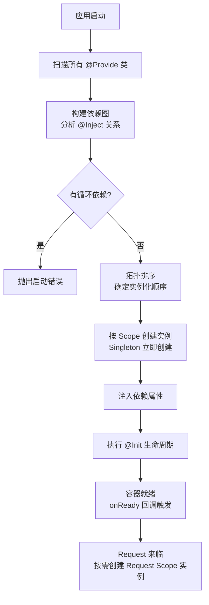

Midway.js 是阿里巴巴开源的 Node.js 全栈框架，以 TypeScript 为一等公民，其核心是一套装饰器驱动的 IoC（Inversion of Control）容器，让开发者通过 `@Provide` / `@Inject` 声明依赖关系而非手动管理对象生命周期，显著提升了 Node.js 服务的可维护性与可测试性。

## IoC 容器：理解依赖注入的本质

传统 Node.js 开发中，模块之间通过 `require` 直接引用，调用者负责创建依赖对象。IoC 容器将这一控制权反转：

```
传统方式：UserService 自己 new UserRepository()
IoC 方式：容器扫描 @Provide，发现 UserService 依赖 UserRepository，自动创建并注入
```

Midway 的 IoC 容器（`@midwayjs/core`）在应用启动阶段扫描所有带 `@Provide` 的类，构建依赖图，按拓扑顺序完成实例化。



## 核心装饰器

### @Provide 与 @Inject

```typescript
// service/llm-client.service.ts
import { Provide, Scope, ScopeEnum, Init, Destroy } from '@midwayjs/core';
import OpenAI from 'openai';

@Provide()
@Scope(ScopeEnum.Singleton)   // 全局唯一，不随请求销毁
export class LlmClientService {
  private client: OpenAI;

  @Init()  // 容器初始化时自动调用，相当于异步构造函数
  async init() {
    this.client = new OpenAI({
      apiKey: process.env.OPENAI_API_KEY,
    });
  }

  @Destroy()  // 应用关闭时自动调用
  async destroy() {
    // 清理连接资源
  }

  async chat(messages: OpenAI.ChatCompletionMessageParam[]) {
    return this.client.chat.completions.create({
      model: 'gpt-4o',
      messages,
    });
  }
}
```

```typescript
// service/agent.service.ts
import { Provide, Inject } from '@midwayjs/core';
import { LlmClientService } from './llm-client.service';
import { ToolRegistryService } from './tool-registry.service';

@Provide()
export class AgentService {
  @Inject()
  llmClient: LlmClientService;   // 容器自动注入 Singleton 实例

  @Inject()
  toolRegistry: ToolRegistryService;

  async runAgent(userMessage: string, availableTools: string[]) {
    const tools = await this.toolRegistry.getToolSchemas(availableTools);
    return this.llmClient.chat([
      { role: 'user', content: userMessage },
    ]);
  }
}
```

`@Inject()` 默认按属性名对应的类名（驼峰转换后）解析，也可以显式指定标识符：`@Inject('customIdentifier')`。

### @Configuration 与应用引导

`@Configuration` 是 Midway 应用的入口配置类，相当于 NestJS 的 `AppModule`：

```typescript
// src/configuration.ts
import { Configuration, App } from '@midwayjs/core';
import * as koa from '@midwayjs/koa';
import * as validate from '@midwayjs/validate';
import { LoggingMiddleware } from './middleware/logging.middleware';
import { AgentModule } from './agent/agent.module';

@Configuration({
  imports: [
    koa,          // Web 框架组件
    validate,     // 参数验证组件
    AgentModule,  // 自定义业务模块
  ],
  importConfigs: [
    { default: require('./config/config.default') },
  ],
})
export class MainConfiguration {
  @App('koa')
  app: koa.Application;

  async onReady() {
    // 容器初始化完成后执行
    this.app.useMiddleware([LoggingMiddleware]);
  }

  async onStop() {
    // 应用关闭前执行，用于清理资源
  }
}
```

## Scope（作用域）详解

Midway 支持三种 Scope，通过 `@Scope(ScopeEnum.xxx)` 指定，默认为 Singleton：

| Scope | 枚举值 | 生命周期 | 实例数量 | 典型用途 |
|-------|--------|---------|---------|---------|
| Singleton | `ScopeEnum.Singleton` | 与应用同生命周期 | 全局唯一 1 个 | LLM Client、DB 连接池、配置服务 |
| Request | `ScopeEnum.Request` | 每个请求独立，请求结束销毁 | 每请求 1 个 | 携带请求 ID 的 Logger、用户 Context |
| Prototype | `ScopeEnum.Prototype` | 每次 `@Inject` 都创建新实例 | 无限制 | 有内部状态且不可复用的计算器类 |

```typescript
// 典型 Request Scope 用法：携带请求追踪 ID
import { Provide, Scope, ScopeEnum, Init } from '@midwayjs/core';
import { Context } from '@midwayjs/koa';
import { Inject } from '@midwayjs/core';

@Provide()
@Scope(ScopeEnum.Request)
export class RequestContextService {
  @Inject()
  ctx: Context;  // Midway 自动注入 Koa Context（也是 Request Scope）

  private traceId: string;

  @Init()
  async init() {
    // 从请求头读取或生成 Trace ID
    this.traceId = (this.ctx.get('x-trace-id') as string) || crypto.randomUUID();
  }

  getTraceId() {
    return this.traceId;
  }
}
```

### Singleton 注入 Request Scope 的陷阱

```typescript
// 错误示例：Singleton Service 注入 Request Scope 的依赖
@Provide()
@Scope(ScopeEnum.Singleton)   // 全局单例
export class BadAgentService {
  @Inject()
  requestCtx: RequestContextService;   // Request Scope！

  // 问题：requestCtx 在第一次请求时被注入，此后固定为第一个请求的实例
  // 所有后续请求拿到的都是同一个 requestCtx，traceId 永远是第一个请求的值
}

// 正确方式：在方法中通过容器动态获取
import { MidwayContainer, IMidwayContainer } from '@midwayjs/core';

@Provide()
@Scope(ScopeEnum.Singleton)
export class GoodAgentService {
  @Inject()
  applicationContext: IMidwayContainer;  // 注入容器本身

  async runWithContext() {
    // 每次调用时动态从容器获取当前请求作用域的实例
    const reqCtx = await this.applicationContext.getAsync(RequestContextService);
    console.log(reqCtx.getTraceId());
  }
}
```

## Controller 层与路由装饰器

```typescript
// controller/agent.controller.ts
import { Controller, Post, Body, Param, Inject } from '@midwayjs/core';
import { AgentService } from '../service/agent.service';
import { RunAgentDTO } from '../dto/run-agent.dto';

@Controller('/api/agents')
export class AgentController {
  @Inject()
  agentService: AgentService;

  @Post('/:agentId/run')
  async runAgent(
    @Param('agentId') agentId: string,
    @Body() dto: RunAgentDTO,
  ) {
    const result = await this.agentService.runAgent(dto.message, dto.tools);
    return { success: true, data: result };
  }
}
```

## 函数式注入 API（不依赖装饰器）

Midway 也提供函数式 API 来手动操作容器，适合在非类环境中（如初始化脚本）使用：

```typescript
import { createLightApp } from '@midwayjs/mock';
import { AgentService } from './service/agent.service';

// 在测试或脚本中手动获取容器实例
const app = await createLightApp();
const container = app.getApplicationContext();

// 手动从容器获取实例（等效于 @Inject）
const agentService = await container.getAsync(AgentService);
await agentService.runAgent('hello', []);
```

## 多框架集成能力

Midway IoC 容器与运行时框架解耦，同一套 Service 代码可以运行在不同框架下：

| 运行时 | 导入方式 | 适用场景 |
|--------|---------|---------|
| Koa | `@midwayjs/koa` | HTTP API 服务 |
| Express | `@midwayjs/express` | 兼容 Express 中间件生态 |
| EggJS | `@midwayjs/egg` | 阿里系企业框架迁移 |
| Serverless FC | `@midwayjs/faas` | 阿里云函数计算部署 |
| gRPC | `@midwayjs/grpc` | 微服务 RPC 通信 |

同一个 `AgentService` 被 `@Provide` 标注后，无论上层是 HTTP 还是 Serverless 触发器，DI 容器的行为完全一致。

## Agent 后端适配性

Midway DI 对 Agent 服务的构建有以下直接价值：

- **LLM Client 单例化**：将 `OpenAI` / `Anthropic` 客户端注册为 Singleton，整个应用复用同一连接池，避免重复初始化
- **工具注册表模式**：`ToolRegistryService` 作为 Singleton 在启动时加载所有工具 schema，Agent Controller 注入后按需调用
- **请求追踪**：Request Scope 的 `TraceService` 自动绑定每次 Agent 调用的 Trace ID，便于多工具调用链路追踪
- **阿里云 FC 适配**：Midway 官方支持 `@midwayjs/faas`，同一套代码可以直接部署到函数计算，实现 Agent Tool 的 Serverless 化

## 常见误区

- **误区 1：忘记 `@Provide()` 导致注入 undefined**。类必须带 `@Provide()` 才会被容器扫描，缺少装饰器时 `@Inject()` 解析结果为 `undefined`，且错误往往在运行时才暴露。
- **误区 2：在 Singleton 中直接持有 Request Scope 的引用**。如上文所示，Singleton 的属性在首次解析后就固定，不会随请求更新，应通过容器动态获取。
- **误区 3：混淆 `@Init` 和构造函数**。Midway 的 `@Init` 支持 `async`，适合异步初始化（如数据库连接）；构造函数中不应放异步逻辑。
- **误区 4：Prototype Scope 滥用**。Prototype 每次注入都创建新实例，若该类持有昂贵资源（DB 连接），会造成严重资源泄漏。

## 最佳实践

- Service 层默认使用 Singleton Scope，无状态设计，方法参数传递请求相关数据
- 需要感知请求上下文时，用 Request Scope 并通过 `@Inject() ctx` 读取，不要在 Singleton 中缓存请求数据
- 将第三方 SDK 初始化（LLM Client、Redis Client）放在 `@Init()` 方法中，配合 `@Destroy()` 做资源清理
- 单元测试使用 `@midwayjs/mock` 的 `createLightApp()` + `mockClassProperty()` 注入 mock 依赖，不启动完整 HTTP 服务
- 模块按领域划分目录，每个目录包含 controller、service、dto、entity，通过 `@Configuration` 的 `imports` 组合

## 面试关键点

- **`@Provide` 的本质是什么？** 将类的元数据注册到 IoC 容器，使容器能够按标识符（默认为类名驼峰）找到并实例化该类，是 IoC 的"注册"步骤。
- **为什么 Singleton 不能直接注入 Request Scope 的依赖？** Singleton 实例在整个应用生命周期只创建一次，其属性在首次依赖解析时固定，无法随每次请求更新；必须通过容器动态 `getAsync` 获取当前请求的实例。
- **属性注入（Midway）vs 构造函数注入（NestJS）各有何优劣？** 属性注入代码更简洁，但依赖关系不在类型签名中体现；构造函数注入使依赖显式可见，单元测试无需容器即可直接传入 mock，更利于隔离测试。
- **`@Init` 和 `constructor` 的区别？** 构造函数同步执行，无法 `await`；`@Init` 由容器在实例化后异步调用，适合数据库连接、配置加载等异步初始化场景。
- **Midway DI 和 NestJS DI 的核心区别？** Midway 以属性注入为主，注册标识符基于类名；NestJS 以构造函数注入为主，标识符基于 TypeScript 类型元数据。Midway 与阿里云生态（FC、EDAS）深度集成，NestJS 在 npm 生态和国际社区更为广泛。
