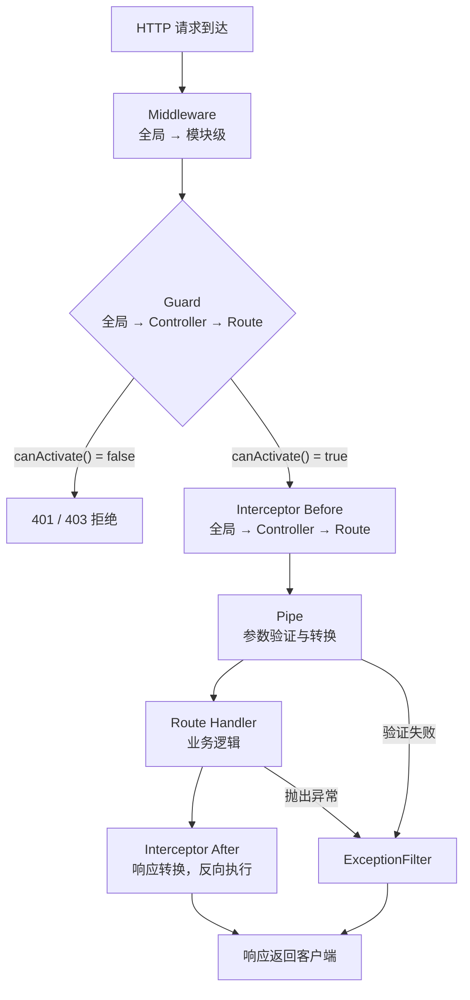

NestJS 是一个受 Angular 启发、基于 TypeScript 构建的 Node.js 服务端框架，通过装饰器（Decorator）、依赖注入（Dependency Injection）和强制模块化，为企业级后端提供了清晰、可测试的架构规范，也是构建多工具 Agent 服务后端的理想选择。

## 设计哲学：Angular 在后端的延伸

NestJS 将 Angular 的三大设计理念移植到 Node.js 服务端：

1. **装饰器驱动**：路由、权限、日志全部通过装饰器声明，业务代码零配置
2. **IoC 容器**：依赖关系由框架管理，开发者只声明"需要什么"而非"如何创建"
3. **强制模块化**：每个业务领域封装为独立 Module，明确依赖边界，避免"大泥球"架构

这套设计在团队规模扩大后优势尤为明显——新成员进入任何模块都能快速理解结构。

## 核心构建块

NestJS 应用由以下核心构建块组成，各司其职：

| 构建块 | 装饰器 | 职责 |
|--------|--------|------|
| Module | `@Module()` | 封装一个业务域，声明依赖关系 |
| Controller | `@Controller()` | 处理 HTTP 请求，路由入口，不含业务逻辑 |
| Provider / Service | `@Injectable()` | 业务逻辑载体，可被注入任意地方 |
| Middleware | `@Injectable()` + `implements NestMiddleware` | 请求预处理，类似 Express 中间件 |
| Guard | `@Injectable()` + `implements CanActivate` | 鉴权/授权，返回 boolean 决定是否放行 |
| Interceptor | `@Injectable()` + `implements NestInterceptor` | 环绕请求，可修改请求和响应 |
| Pipe | `@Injectable()` + `implements PipeTransform` | 数据验证与转换 |
| ExceptionFilter | `@Catch()` + `implements ExceptionFilter` | 统一异常处理 |

### Module 系统

```typescript
// agents/agents.module.ts — Agent 工具服务模块示例
import { Module } from '@nestjs/common';
import { AgentsController } from './agents.controller';
import { AgentsService } from './agents.service';
import { LlmModule } from '../llm/llm.module';         // 导入 LLM 模块

@Module({
  imports: [LlmModule],           // 声明依赖的其他模块
  controllers: [AgentsController],
  providers: [AgentsService],
  exports: [AgentsService],       // 其他模块可注入 AgentsService
})
export class AgentsModule {}
```

模块分四种形态：

- **Feature Module**：封装单一业务域（如 `AgentsModule`、`UsersModule`）
- **Shared Module**：被多个 Feature Module 导入，通过 `exports` 暴露 Provider
- **Global Module**：用 `@Global()` 标注，无需 imports 即可在全局使用，适合配置、日志等基础设施
- **Dynamic Module**：通过 `forRoot()` / `forFeature()` 接受配置参数，适合数据库连接、第三方 SDK 初始化

### Controller 与路由装饰器

```typescript
// agents/agents.controller.ts
import {
  Controller, Get, Post, Body, Param, Query,
  UseGuards, UseInterceptors,
} from '@nestjs/common';
import { AgentsService } from './agents.service';
import { ApiKeyGuard } from '../guards/api-key.guard';
import { LatencyInterceptor } from '../interceptors/latency.interceptor';
import { RunToolDto } from './dto/run-tool.dto';

@Controller('agents')
@UseGuards(ApiKeyGuard)               // Controller 级别：所有路由都鉴权
@UseInterceptors(LatencyInterceptor)  // Controller 级别：所有路由都记录延迟
export class AgentsController {
  constructor(private readonly agentsService: AgentsService) {}

  // GET /agents/:agentId/tools?page=1&limit=10
  @Get(':agentId/tools')
  listTools(
    @Param('agentId') agentId: string,
    @Query('page') page = 1,
    @Query('limit') limit = 10,
  ) {
    return this.agentsService.listTools(agentId, { page, limit });
  }

  // POST /agents/:agentId/run
  @Post(':agentId/run')
  runTool(
    @Param('agentId') agentId: string,
    @Body() dto: RunToolDto,
  ) {
    return this.agentsService.runTool(agentId, dto);
  }
}
```

## 依赖注入

### 构造函数注入

NestJS 推荐构造函数注入，依赖关系显式声明，单元测试时可直接 mock：

```typescript
// agents/agents.service.ts
import { Injectable, NotFoundException } from '@nestjs/common';
import { LlmService } from '../llm/llm.service';
import { ToolRegistryService } from '../tools/tool-registry.service';

@Injectable()
export class AgentsService {
  constructor(
    private readonly llmService: LlmService,           // 自动注入
    private readonly toolRegistry: ToolRegistryService, // 自动注入
  ) {}

  async runTool(agentId: string, dto: RunToolDto) {
    const tool = await this.toolRegistry.find(dto.toolName);
    if (!tool) throw new NotFoundException(`Tool "${dto.toolName}" not found`);
    return this.llmService.invoke({ agentId, tool, input: dto.input });
  }
}
```

### 循环依赖与 forwardRef

当两个 Provider 互相依赖时，NestJS 提供 `forwardRef` 延迟解析：

```typescript
import { Injectable, forwardRef, Inject } from '@nestjs/common';

@Injectable()
export class ServiceA {
  constructor(
    @Inject(forwardRef(() => ServiceB))
    private serviceB: ServiceB,
  ) {}
}

@Injectable()
export class ServiceB {
  constructor(
    @Inject(forwardRef(() => ServiceA))
    private serviceA: ServiceA,
  ) {}
}
```

循环依赖往往是架构设计问题的信号，优先考虑拆分共用逻辑到第三个 Service。

### Provider 作用域与自定义 Provider

NestJS 的 Provider 默认是单例（`DEFAULT` Scope），整个应用生命周期内只实例化一次、所有注入点共享同一对象。这对无状态的 Service 是最优选择，但当 Provider 需要持有"每次请求独立"的状态时（如当前请求的 Trace 上下文），就要切换作用域：

| Scope | 实例数量 | 适用场景 |
|-------|---------|---------|
| `DEFAULT`（单例） | 全应用 1 个 | 无状态 Service、LLM 客户端、连接池 |
| `REQUEST` | 每个请求 1 个 | 需要请求级上下文（当前用户、Trace ID） |
| `TRANSIENT` | 每次注入 1 个 | 每个消费者需独立实例的工具类 |

```typescript
import { Injectable, Scope } from '@nestjs/common';

@Injectable({ scope: Scope.REQUEST }) // 每个请求新建实例
export class AgentContextService {
  readonly traceId = crypto.randomUUID();
  readonly toolCalls: string[] = [];
}
```

注意：`REQUEST` 作用域有"传染性"——任何注入了它的 Provider 也会被提升为请求作用域，进而带来性能开销，因此应谨慎使用。

除了 `useClass`，NestJS 还支持多种自定义 Provider 形式，常用于注入第三方 SDK 或工厂创建的对象：

```typescript
@Module({
  providers: [
    // useValue：注入一个常量/已有实例
    { provide: 'CONFIG', useValue: { region: 'cn-hangzhou' } },
    // useFactory：动态创建，可注入其他依赖（如根据配置初始化 LLM 客户端）
    {
      provide: 'LLM_CLIENT',
      useFactory: (config: ConfigService) =>
        new Anthropic({ apiKey: config.get('ANTHROPIC_API_KEY') }),
      inject: [ConfigService],
    },
  ],
})
export class LlmModule {}
```

用字符串或 Symbol 作为注入令牌（Injection Token）时，消费方需配合 `@Inject('LLM_CLIENT')` 显式声明，这是注入非类对象的标准做法。

## 请求生命周期与执行顺序



执行顺序口诀：**中间件 → 守卫 → 拦截器前 → 管道 → 处理器 → 拦截器后 → 异常过滤器**

## Guard、Middleware、Interceptor 对比

| 维度 | Middleware | Guard | Interceptor |
|------|-----------|-------|-------------|
| 执行时机 | 路由匹配之前 | 路由匹配之后，Handler 之前 | Handler 前后都可介入 |
| 访问路由元数据 | 否 | 是（通过 `ExecutionContext` + `Reflector`） | 是 |
| 典型用途 | 日志、请求体解析、CORS | API Key 验证、JWT 解码、RBAC 权限 | 响应格式统一、LLM 调用计时、缓存 |
| 可修改响应 | 否 | 否（只能放行或拒绝） | 是 |
| 返回值 | 无 | `boolean \| Observable<boolean>` | `Observable` |

## 完整示例：Agent 工具端点（Guard + Interceptor）

下面展示一个完整的 Agent tool 端点，包含 API Key 鉴权 Guard 和 LLM 延迟日志 Interceptor：

```typescript
// guards/api-key.guard.ts
import { Injectable, CanActivate, ExecutionContext, UnauthorizedException } from '@nestjs/common';
import { ConfigService } from '@nestjs/config';

@Injectable()
export class ApiKeyGuard implements CanActivate {
  constructor(private config: ConfigService) {}

  canActivate(context: ExecutionContext): boolean {
    const request = context.switchToHttp().getRequest<Request>();
    const key = (request.headers as Record<string, string>)['x-api-key'];
    const validKey = this.config.get<string>('AGENT_API_KEY');

    if (!key || key !== validKey) {
      throw new UnauthorizedException('Invalid or missing API key');
    }
    return true;
  }
}
```

```typescript
// interceptors/latency.interceptor.ts — 记录 LLM 调用延迟
import {
  Injectable, NestInterceptor, ExecutionContext,
  CallHandler, Logger,
} from '@nestjs/common';
import { Observable } from 'rxjs';
import { tap } from 'rxjs/operators';

@Injectable()
export class LatencyInterceptor implements NestInterceptor {
  private readonly logger = new Logger(LatencyInterceptor.name);

  intercept(context: ExecutionContext, next: CallHandler): Observable<unknown> {
    const req = context.switchToHttp().getRequest();
    const start = Date.now();
    const label = `${req.method} ${req.url}`;

    return next.handle().pipe(
      tap({
        next: () => {
          this.logger.log(`${label} — ${Date.now() - start}ms`);
        },
        error: (err) => {
          this.logger.error(`${label} FAILED — ${Date.now() - start}ms`, err.stack);
        },
      }),
    );
  }
}
```

```typescript
// agents/agents.module.ts — 完整模块装配
import { Module } from '@nestjs/common';
import { APP_GUARD, APP_INTERCEPTOR } from '@nestjs/core';
import { AgentsController } from './agents.controller';
import { AgentsService } from './agents.service';
import { ApiKeyGuard } from '../guards/api-key.guard';
import { LatencyInterceptor } from '../interceptors/latency.interceptor';

@Module({
  controllers: [AgentsController],
  providers: [
    AgentsService,
    // 全局注册方式（也可在 main.ts 用 app.useGlobalGuards）
    { provide: APP_GUARD, useClass: ApiKeyGuard },
    { provide: APP_INTERCEPTOR, useClass: LatencyInterceptor },
  ],
})
export class AgentsModule {}
```

## Agent 后端适配性

NestJS 的模块化架构与 Agent 系统的多工具设计天然契合：

- 每个 Agent Tool 实现为独立的 Feature Module（`WebSearchModule`、`CodeExecModule`、`DatabaseQueryModule`），可按需动态加载
- Guard 统一处理 API Key / JWT 认证，Agent Orchestrator 调用各工具端点时鉴权一致
- Interceptor 集中记录每次 LLM 调用的 token 用量和延迟，为 Agent 性能分析提供数据
- Dynamic Module（`AgentModule.forRoot({ maxParallelTools: 5 })`）支持按部署环境注入不同配置
- NestJS 内置 `@nestjs/microservices` 可将工具函数以消息队列方式驱动，实现 Agent 工具的异步并行调度

## 常见误区

- **误区 1：Middleware 能替代 Guard**。Middleware 在路由匹配前执行，无法读取路由上的自定义元数据（如 `@Roles('admin')`），做权限控制必须用 Guard。
- **误区 2：所有逻辑都写进 Controller**。Controller 只应负责参数解析和调用 Service，业务逻辑、数据库操作应在 Service 层，否则丧失可测试性。
- **误区 3：循环依赖用 forwardRef 解决就好了**。forwardRef 是临时补丁，循环依赖通常意味着需要提取公共 Service 或重新划分模块边界。
- **误区 4：全局 Module 越多越方便**。`@Global()` 模块破坏了显式依赖声明原则，应仅用于真正全局的基础设施（Logger、Config、EventBus）。

## 最佳实践

- 保持 Controller 薄：只做参数解析 + DTO 验证 + 调用 Service，不写 if-else 业务逻辑
- 使用 `class-validator` + `ValidationPipe` 全局开启请求体验证，避免手动判断字段
- Module 按业务域划分，一个 Module 对应一个目录，目录内包含 controller、service、dto、entity
- 用 `ConfigModule.forRoot()` + `@nestjs/config` 统一管理环境变量，不要直接读 `process.env`
- 单元测试使用 `Test.createTestingModule()`，只提供被测 Service 和 mock 依赖，不需要启动整个应用

## 面试关键点

- **NestJS 模块体系解决了什么问题？** 通过强制模块化明确了依赖边界，`exports` 字段控制依赖可见性，避免 Express 项目中常见的全局依赖混乱（"大泥球"架构）。
- **Guard 和 Middleware 的核心区别？** Middleware 在路由匹配前执行，无法访问路由元数据；Guard 在路由匹配后执行，可通过 `Reflector` 读取 `@SetMetadata` 注入的路由级元数据，因此 RBAC 等复杂权限必须用 Guard。
- **Interceptor 的 `next.handle()` 返回什么？** 返回 RxJS `Observable`，代表 Handler 执行流，可用 `tap`/`map`/`catchError` 等操作符在 Handler 前后注入逻辑或修改响应数据。
- **`@Module` 的 `exports` 字段作用？** 控制本模块哪些 Provider 对外可见；未 export 的 Provider 仅在本模块内可注入，是依赖封装的关键机制。
- **如何在全局注册 Guard/Interceptor？** 两种方式：`main.ts` 中 `app.useGlobalGuards(new Guard())` （无法注入依赖），或在 Module 中用 `{ provide: APP_GUARD, useClass: Guard }` （可享受 DI，推荐）。
