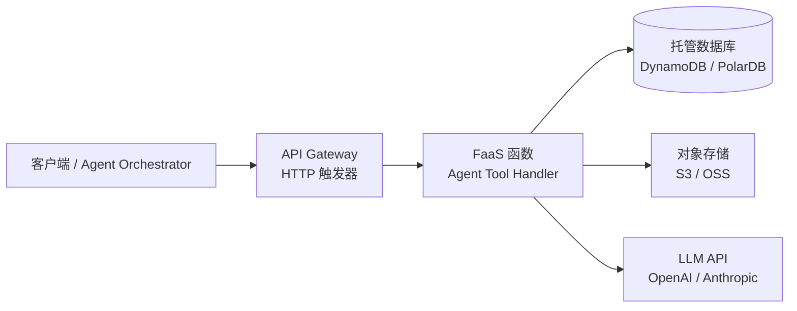
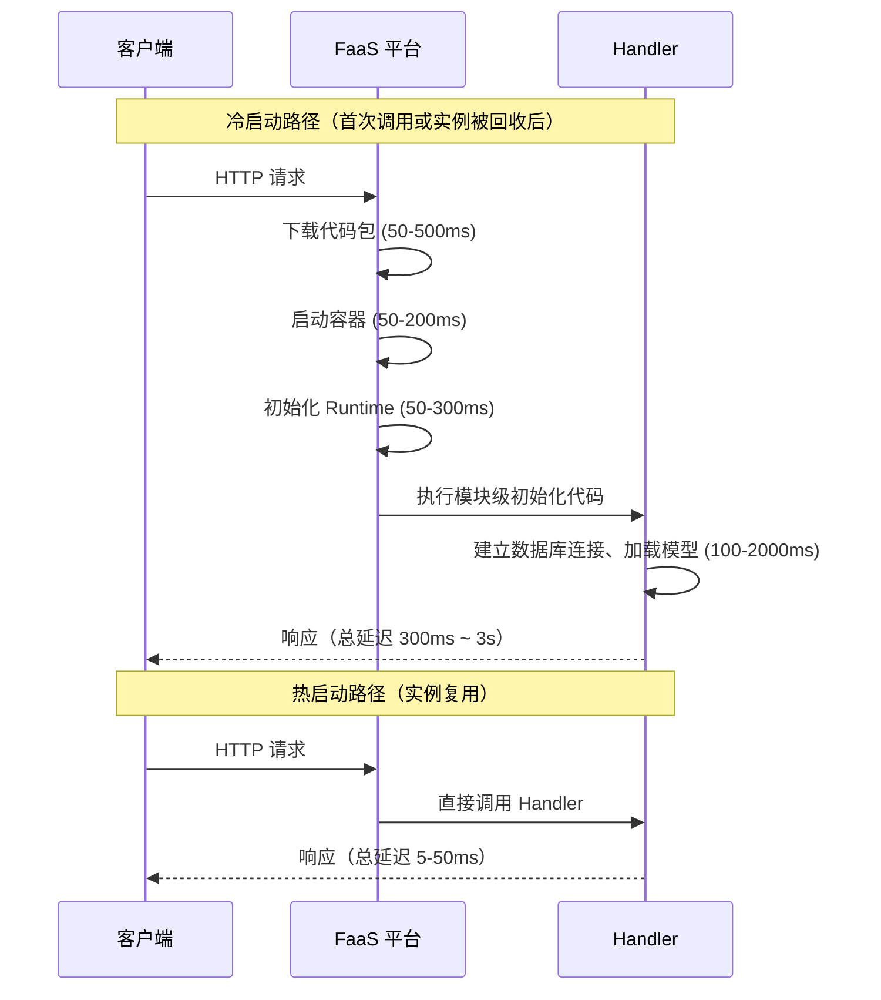

Serverless（无服务器）并非没有服务器，而是开发者无需管理服务器——云平台负责容器调度、弹性扩缩容和运维，开发者只需关注函数逻辑本身；它代表了云计算从"租服务器"到"按用量购买算力"的范式转变，对构建 Agent 工具服务有重要意义。

## FaaS + BaaS：Serverless 的两个支柱

Serverless 架构通常由两类托管服务共同构成：

| 类型 | 全称 | 核心特征 | 典型产品 |
|------|------|---------|---------|
| FaaS | Function as a Service | 运行无状态函数，按调用次数 + 执行时长计费 | AWS Lambda、阿里云 FC、腾讯云 SCF |
| BaaS | Backend as a Service | 托管的后端能力：数据库、对象存储、消息队列、身份认证 | Firebase、AWS DynamoDB、阿里云 OSS、Auth0 |



一个典型的 Serverless Agent Tool：HTTP 请求触发 FaaS 函数，函数调用 LLM API 生成回复，结果写入托管数据库，文件存入对象存储，全程无需运维任何服务器进程。

## 核心特性

### 无状态与短暂执行

FaaS 函数的每次调用在逻辑上是独立的：同一函数的不同并发调用可能在不同容器实例上执行，本地内存、文件系统状态不跨调用共享。

### 事件驱动

FaaS 函数由事件触发，而非持续监听：

| 触发类型 | 典型场景 | 平台示例 |
|---------|---------|---------|
| HTTP / API Gateway | REST API、BFF 层、Agent 工具端点 | API GW + Lambda、FC HTTP 触发器 |
| 定时器 | 数据聚合、模型微调任务调度 | EventBridge Cron、FC 定时触发 |
| 消息队列 | 异步任务、Agent 工具结果回调 | SQS、阿里云 MNS |
| 对象存储事件 | 上传文件后自动处理（OCR、转码） | S3 Event、OSS 触发 |
| 数据库变更流 | 数据同步、审计日志 | DynamoDB Streams |

### 自动弹性与按量计费

平台自动根据并发请求数扩缩容，0 请求时缩容至 0 实例，费用归零；高峰时可在秒级扩展至数千并发。计费维度：**调用次数 + 执行时长 × 内存规格（GB·秒）**。

## 冷启动问题

**冷启动（Cold Start）**是 FaaS 最核心的挑战。当函数长时间无调用，平台回收容器实例；新请求到来时需重新初始化，产生额外延迟。



### 缓解冷启动的策略

| 策略 | 效果 | 成本 |
|------|------|------|
| **预置并发（Provisioned Concurrency）** | 彻底消除冷启动，预留热实例 | 按预留实例数量计费（较高） |
| **定时预热（Scheduled Warm-up）** | 定时触发函数防止实例被回收 | 极低（几乎免费的调用次数） |
| **减小部署包体积** | 缩短代码下载时间 | 开发成本（使用 esbuild/bundle） |
| **模块级初始化** | 连接复用，减少每次 Handler 的初始化开销 | 无额外成本 |
| **选择轻量运行时** | Node.js / Python 冷启动远快于 Java / .NET | 可能需要重写语言 |

## 执行上下文复用：全局变量的双刃剑

FaaS 平台在实例未被回收时会复用执行上下文，模块级变量（Handler 函数外部的变量）在同一实例的多次热调用间保持：

```typescript
// 正确利用执行上下文复用：数据库连接在模块级初始化
import { PrismaClient } from '@prisma/client';

// 模块级变量：实例复用时不会重新创建，节省连接建立时间
let prisma: PrismaClient | undefined;

function getPrisma(): PrismaClient {
  if (!prisma) {
    prisma = new PrismaClient();
  }
  return prisma;
}

export const handler = async (event: unknown) => {
  const db = getPrisma();   // 热启动时直接返回已有连接
  // ...
};
```

```typescript
// 危险：将请求级状态放入模块级变量
let currentUserId: string;   // 错误！不同请求会互相覆盖此值

export const handler = async (event: APIGatewayEvent) => {
  currentUserId = event.requestContext.authorizer?.userId;  // 竞态条件！
  // 并发请求下，currentUserId 会被后一个请求覆盖
};

// 正确：请求相关状态始终在 Handler 内部处理
export const handler = async (event: APIGatewayEvent) => {
  const currentUserId = event.requestContext.authorizer?.userId;  // 局部变量，安全
};
```

## 三种部署形态对比

| 维度 | Serverless (FaaS) | 容器 (Container) | 传统服务器 |
|------|-------------------|-----------------|---------|
| 运维负担 | 极低（平台全托管） | 中等（需管理编排、健康检查） | 高（OS、依赖、监控全自管） |
| 弹性能力 | 自动，秒级扩至万级并发 | 需配置 HPA，分钟级扩容 | 需手动扩容或预购 |
| 冷启动 | 有（毫秒到秒级） | 无（进程常驻） | 无 |
| 长连接支持 | 弱（有执行超时限制） | 好 | 好 |
| 成本模型 | 按用量，稀疏流量极省 | 按实例数，需预留容量 | 按时间，固定成本 |
| 最大执行时长 | 15min（Lambda）/ 24h（阿里云 FC） | 无限制 | 无限制 |
| 适合场景 | 事件驱动、低频 API、Agent 工具端点 | 长运行服务、WebSocket、复杂状态 | 高流量稳定服务、数据库 |

## 主流平台对比

| 特性 | AWS Lambda | 阿里云 FC | 腾讯云 SCF |
|------|-----------|----------|-----------|
| 运行时 | Node.js 20、Python 3.12、Java 21、Go 等 | Node.js 18/20、Python 3.10、Java 11、PHP | Node.js 18、Python 3.10、Java 11、Go |
| 最大执行时长 | 15 分钟 | 24 小时（弹性实例） | 12 小时 |
| 预置并发 | 支持，细粒度配置 | 支持（预留实例） | 支持 |
| 部署工具 | SAM CLI、AWS CDK | Serverless Devs（`s deploy`） | SCF CLI、Serverless Framework |
| 与云生态集成 | AWS 全系（最丰富） | 阿里云 OSS、RDS、MNS 深度集成 | 腾讯云 COS、CMQ 集成 |
| 适用团队 | 海外业务、国际化部署 | 国内业务、阿里云技术栈 | 国内业务、腾讯云技术栈 |

## TypeScript 示例：Midway Serverless Agent Tool

以下展示使用 Midway.js Serverless 框架实现一个 Agent 工具函数的完整代码，部署到阿里云 FC：

```typescript
// src/function/agent-tool.ts
import { ServerlessTrigger, ServerlessTriggerType, Inject } from '@midwayjs/core';
import { FaaSContext } from '@midwayjs/faas';
import { AgentToolService } from '../service/agent-tool.service';

// Agent 工具输入/输出结构
interface ToolInvokeEvent {
  toolName: string;
  input: Record<string, unknown>;
  sessionId: string;
}

interface ToolInvokeResult {
  success: boolean;
  output?: unknown;
  error?: string;
  latencyMs: number;
}

export class AgentToolHandler {
  @Inject()
  ctx: FaaSContext;

  @Inject()
  agentToolService: AgentToolService;

  // HTTP 触发器入口
  @ServerlessTrigger(ServerlessTriggerType.HTTP, {
    path: '/invoke',
    method: 'post',
  })
  async invoke(): Promise<ToolInvokeResult> {
    const body = this.ctx.request.body as ToolInvokeEvent;
    const start = Date.now();

    if (!body?.toolName || !body?.input) {
      this.ctx.status = 400;
      return { success: false, error: 'Missing toolName or input', latencyMs: 0 };
    }

    try {
      const output = await this.agentToolService.run(body.toolName, body.input, body.sessionId);
      return { success: true, output, latencyMs: Date.now() - start };
    } catch (err) {
      console.error('[AgentTool] invoke failed', { tool: body.toolName, err });
      this.ctx.status = 500;
      return {
        success: false,
        error: err instanceof Error ? err.message : 'Unknown error',
        latencyMs: Date.now() - start,
      };
    }
  }
}
```

```typescript
// src/service/agent-tool.service.ts
import { Provide, Scope, ScopeEnum, Inject, Init } from '@midwayjs/core';
import { LlmClientService } from './llm-client.service';

@Provide()
@Scope(ScopeEnum.Singleton)  // FC 实例复用时，单例服务不重建
export class AgentToolService {
  @Inject()
  llmClient: LlmClientService;

  private toolRegistry: Map<string, (input: Record<string, unknown>) => Promise<unknown>>;

  @Init()
  async init() {
    // 启动时注册所有可用工具
    this.toolRegistry = new Map([
      ['web_search', async (input) => this.webSearch(input as { query: string })],
      ['code_exec', async (input) => this.codeExec(input as { code: string })],
    ]);
  }

  async run(toolName: string, input: Record<string, unknown>, sessionId: string) {
    const tool = this.toolRegistry.get(toolName);
    if (!tool) throw new Error(`Unknown tool: ${toolName}`);
    return tool(input);
  }

  private async webSearch(input: { query: string }) {
    // 调用搜索 API
    return { results: [], query: input.query };
  }

  private async codeExec(input: { code: string }) {
    // 沙箱执行代码
    return { output: '', exitCode: 0 };
  }
}
```

```yaml
# f.yml — Midway Serverless 部署配置
service: agent-tools

provider:
  name: aliyun
  runtime: nodejs18

functions:
  agent-tool:
    handler: src/function/agent-tool.AgentToolHandler.invoke
    timeout: 300  # 5 分钟，足够大多数 Agent 工具调用
    memorySize: 512
    triggers:
      - name: httpTrigger
        type: http
        config:
          authType: anonymous
          methods: [POST]
```

## Agent + Serverless：机遇与挑战

**优势：**
- **无限并行工具调用**：Agent Orchestrator 同时调用数百个工具函数，FaaS 自动弹性扩缩容，无需预置服务器
- **工具即函数**：每个 Agent Tool（web search、code exec、database query）独立部署为 FaaS 函数，故障隔离，独立更新
- **成本优化**：工具调用通常是突发性的，Serverless 按调用计费，相比常驻进程节省 70%+ 成本

**挑战：**
- **冷启动延迟**：对于 P99 延迟敏感的工具（如实时搜索），需要预置并发消除冷启动
- **执行超时**：Lambda 最大 15 分钟，阿里云 FC 最大 24 小时；长耗时的 Agent 任务（如大文件分析）需要拆分或使用异步模式
- **调试复杂性**：多个 FaaS 函数组成的 Agent 系统，分布式追踪（OpenTelemetry）是必要投入
- **状态传递**：Agent 工具间的中间状态（对话历史、上下文窗口）必须外置到 Redis 或数据库

## 常见误区

- **误区 1：全局变量可以安全共享状态**。同一函数的不同并发实例之间全局变量不共享；即使是同一实例，全局变量的生命周期取决于容器是否被回收，不可依赖其持久性。应使用外部存储（Redis、数据库）共享状态。
- **误区 2：冷启动只影响极少数请求，可以忽略**。对于 Agent 系统，一次 Agent Run 可能并行调用 10+ 工具，任何一个工具冷启动都会成为整体延迟瓶颈，P99 延迟受影响显著。
- **误区 3：部署包越大功能越全**。FaaS 包越大，代码下载时间越长，冷启动越慢；应使用 esbuild 或 webpack 打包，只包含运行时真正需要的依赖，目标 < 10MB。
- **误区 4：Serverless 适合所有场景**。长连接（WebSocket、gRPC Streaming）、需要大量本地计算的 AI 推理、高频持续流量（比固定规格容器成本更高）等场景并不适合 FaaS。

## 最佳实践

- 将数据库连接、SDK 初始化等耗时操作放在 Handler 函数**外部**（模块级），利用容器复用避免重复初始化
- 设置 `context.callbackWaitsForEmptyEventLoop = false`（AWS Lambda），防止数据库长连接阻塞函数退出
- 使用 esbuild / webpack 打包并启用 tree-shaking，将部署包控制在 5MB 以内
- 为核心路径（如 Agent 工具主要入口）开启预置并发，非核心路径依靠定时预热即可
- 通过环境变量而非代码内硬编码传入密钥，使用平台的 Secret Manager（KMS、Parameter Store）在运行时注入

## 面试关键点

- **冷启动的本质是什么，有哪些优化手段？** 本质是容器实例从零初始化的时间开销（代码下载 + Runtime 启动 + 初始化代码执行）。优化手段：预置并发（彻底消除）、减小包体积（缩短下载时间）、模块级初始化（复用连接）、定时预热（防止实例回收）、选择轻量运行时（Node.js 优于 Java）。
- **为什么 FaaS 函数必须设计为无状态？** 同一函数的并发调用分布在不同容器实例，本地内存无法跨实例共享；实例可随时被平台回收，本地状态无法保证持久化。所有需要共享或持久化的状态必须外置。
- **执行上下文复用（Context Reuse）是什么？** FaaS 平台在实例未被回收时复用同一进程的全局变量，模块级初始化的对象（DB 连接、HTTP Client）在热启动时无需重建。这是性能优化的关键，但也是状态污染的来源——请求级数据绝不能写入模块级变量。
- **Serverless vs 容器，什么情况下选 Serverless？** 流量稀疏/波动大（省成本）、事件驱动异步任务、无状态短时计算、Agent 工具函数（并行调用需求高）；长连接、大量本地状态、持续高并发流量则选容器。
- **Agent + Serverless 的核心挑战是什么？** 冷启动延迟影响工具调用 P99、执行超时限制长任务、FaaS 无状态导致 Agent 上下文必须外置、多函数分布式调用链路追踪复杂。
