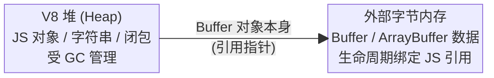
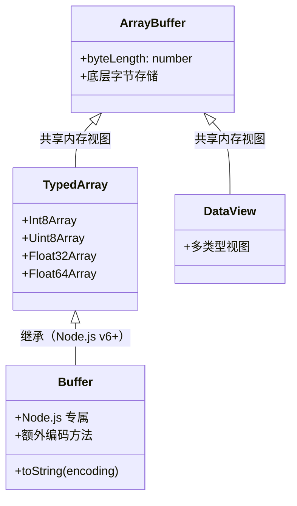

*图：沿图中的节点与箭头阅读，重点是Buffer 视为字节视图，准确解释编码、切片/共享内存、边界检查和文本解码。*

---

Buffer 是 Node.js 处理二进制数据的核心类，它是 `Uint8Array` 的子类并代表固定长度的字节视图。其底层 `ArrayBuffer` 内存可计入 V8 堆外统计，但 Buffer 对象与底层内存的可达性仍由 JavaScript 引用和垃圾回收生命周期约束；“堆外”不等于“不受 GC 影响”。创建、编码、切片和池化语义以 [Node.js Buffer API](https://nodejs.org/api/buffer.html) 为准。

## Buffer 是什么

JavaScript 语言本身只处理 Unicode 字符串，没有处理二进制数据的原生机制。Node.js 引入 Buffer 类填补这一空缺：

- **固定大小**：创建后长度不可改变（类似 C 的数组）
- **外部字节内存**：数据可以位于 V8 heap 之外，但仍绑定到受 GC 追踪的 JavaScript 对象
- **Uint8Array 子类**：Node.js v6+ 中 Buffer 继承自 `Uint8Array`，兼容所有 TypedArray 接口



## 三种创建方式

### Buffer.alloc — 安全分配

分配指定字节数的 Buffer，**所有字节初始化为 0**。这是最安全的方式，不会泄露旧内存数据。

```typescript
// 分配 10 字节，全部填充为 0
const buf1 = Buffer.alloc(10);
console.log(buf1); // <Buffer 00 00 00 00 00 00 00 00 00 00>

// 分配并用指定值填充
const buf2 = Buffer.alloc(10, 0xff);
console.log(buf2); // <Buffer ff ff ff ff ff ff ff ff ff ff>
```

### Buffer.allocUnsafe — 高性能分配

分配内存但**不初始化**，可能包含旧数据（内存碎片）。速度更快（省去清零开销），但必须在写入数据后再读取，否则可能泄露敏感信息。

```typescript
const buf = Buffer.allocUnsafe(10);
// 内容未定义，可能包含任意旧数据
console.log(buf); // <Buffer xx xx xx xx xx xx xx xx xx xx>（x 为随机值）

// 必须先写入再读取
buf.fill(0); // 手动清零后才安全
```

> **内部实现细节**：`Buffer.allocUnsafe` 可对小于 `Buffer.poolSize >>> 1` 的分配使用预分配池。`Buffer.poolSize` 的默认值随 Node 版本变化，代码不应硬编码 4 KiB/8 KiB；在目标运行时读取该值并用基准确认收益。

### Buffer.from — 从现有数据创建

```typescript
// 从字符串创建（指定编码）
const fromStr = Buffer.from('Hello, Agent!', 'utf8');

// 从数字数组创建
const fromArr = Buffer.from([0x48, 0x65, 0x6c, 0x6c, 0x6f]);
console.log(fromArr.toString()); // "Hello"

// 从 ArrayBuffer 创建（共享底层内存，不复制！）
const ab = new ArrayBuffer(8);
const fromAB = Buffer.from(ab);

// 从另一个 Buffer 复制（独立内存）
const original = Buffer.from('hello');
const copy = Buffer.from(original);
```

## 三种方式对比

| 方式 | 初始化 | 速度 | 安全性 | 适用场景 |
|------|--------|------|--------|----------|
| `Buffer.alloc(n)` | 全零填充 | 慢 | 高 | 默认选择，存敏感数据 |
| `Buffer.allocUnsafe(n)` | 不初始化 | 快 | 低 | 高性能场景，写后立即覆盖 |
| `Buffer.allocUnsafe(n)` + `fill` | 手动填充 | 中 | 中 | 需要特定初始值 |
| `Buffer.from(data)` | 复制数据 | 中 | 高 | 从已有数据创建 |

## 编码：utf8、base64、hex、binary

[WHATWG Encoding Standard](https://encoding.spec.whatwg.org/) 规定了 UTF-8 编解码和错误处理；切分多字节序列时应使用流式解码器保留边界状态，不能把任意字节切片都当成完整文本。


Buffer 在字符串和二进制之间转换时需要指定编码：

```typescript
const buf = Buffer.from('Hello 你好', 'utf8');

// 转换为不同编码的字符串
console.log(buf.toString('utf8'));   // "Hello 你好"
console.log(buf.toString('base64')); // "SGVsbG8g5L2g5aW9"
console.log(buf.toString('hex'));    // "48656c6c6f20e4bda0e5a5bd"
console.log(buf.toString('binary')); // Latin-1 编码（不推荐用于多字节字符）

// base64 编码/解码（常用于 HTTP 传输）
const encoded = buf.toString('base64');
const decoded = Buffer.from(encoded, 'base64');
console.log(decoded.toString('utf8')); // "Hello 你好"

// hex 编码（常用于调试、哈希展示）
const hexStr = buf.toString('hex');
const fromHex = Buffer.from(hexStr, 'hex');
```

## Buffer、TypedArray 与 ArrayBuffer 的关系



```typescript
// Buffer 是 Uint8Array 的子类
const buf = Buffer.from([1, 2, 3]);
console.log(buf instanceof Uint8Array); // true

// Buffer 可直接传给 Web API（如 crypto）
import crypto from 'crypto';
const hash = crypto.createHash('sha256');
hash.update(buf); // 接受 Uint8Array，Buffer 完全兼容

// 与 Float32Array 共享 ArrayBuffer（零拷贝）
const floats = new Float32Array([1.0, 2.0, 3.0]);
const buf2 = Buffer.from(floats.buffer); // 共享同一块内存！
```

## 切片：slice 共享内存 vs from 复制

这是 Buffer 中最容易出错的概念：

```typescript
const original = Buffer.from([1, 2, 3, 4, 5]);

// buf.slice() — 共享内存！修改 slice 会影响原 Buffer
const shared = original.slice(1, 4); // [2, 3, 4]
shared[0] = 99;
console.log(original); // <Buffer 01 63 03 04 05>  ← 原 Buffer 被修改了！

// Buffer.from(slice) — 复制内存，独立副本
const copied = Buffer.from(original.slice(1, 4));
copied[0] = 88;
console.log(original); // 原 Buffer 不受影响

// Node.js v17.5+ 推荐用 subarray（语义更清晰，同样共享内存）
const sub = original.subarray(1, 4);
```

> **注意**：`buf.slice()` 与 `Array.prototype.slice()` 不同——数组的 slice 返回副本，Buffer 的 slice 返回视图（共享内存）。

## TypeScript 实战：序列化 Float32 Embedding 向量

在 Agent 服务中，Float32 向量的二进制大小固定为 `维度 × 4` 字节；JSON 大小取决于数字文本精度、分隔符和序列化器。二进制通常避免文本解析，但节省比例与速度必须用目标数据、存储协议和运行时实测。

```typescript
// src/utils/embedding-buffer.ts

/**
 * 将 Float32Array Embedding 向量序列化为 Buffer，用于 Redis 存储
 * 1536 维 float32 向量 = 1536 * 4 = 6144 字节
 */
export function serializeEmbedding(embedding: Float32Array): Buffer {
  // 直接用 Float32Array 的底层 ArrayBuffer 创建 Buffer（零拷贝）
  return Buffer.from(
    embedding.buffer,
    embedding.byteOffset,
    embedding.byteLength
  );
}

/**
 * 从 Buffer 反序列化为 Float32Array
 */
export function deserializeEmbedding(buf: Buffer): Float32Array {
  // 确保字节对齐（Float32Array 需要 4 字节对齐）
  if (buf.byteOffset % 4 !== 0) {
    // 如果不对齐，创建副本
    const copy = Buffer.allocUnsafe(buf.length);
    buf.copy(copy);
    return new Float32Array(copy.buffer, copy.byteOffset, copy.length / 4);
  }
  return new Float32Array(buf.buffer, buf.byteOffset, buf.length / 4);
}

// Redis 存储示例
import { createClient } from 'redis';

const redis = createClient();

export async function storeEmbedding(
  key: string,
  embedding: Float32Array
): Promise<void> {
  const buf = serializeEmbedding(embedding);
  // 存储为 binary string（Redis 的 SET 支持二进制安全）
  await redis.set(key, buf);
  console.log(`Stored ${embedding.length}d embedding as ${buf.byteLength} bytes`);
}

export async function loadEmbedding(key: string): Promise<Float32Array | null> {
  const raw = await redis.getBuffer(key);
  if (!raw) return null;
  return deserializeEmbedding(raw);
}

// 使用示例
async function example() {
  // 模拟 OpenAI text-embedding-3-small 返回的 1536 维向量
  const embedding = new Float32Array(1536).fill(0).map(() => Math.random());

  await storeEmbedding('doc:123:embedding', embedding);

  const loaded = await loadEmbedding('doc:123:embedding');
  console.log('Dimensions:', loaded?.length); // 1536
  console.log('First value:', loaded?.[0]);   // 与原始值一致
}
```

### JSON vs Binary 存储对比

```typescript
const dims = 1536;
const embedding = new Float32Array(dims).fill(0.123456789);

// JSON 存储
const jsonStr = JSON.stringify(Array.from(embedding));
console.log('JSON size:', jsonStr.length, 'bytes'); // ~约 10,000+ 字节

// Binary 存储
const binBuf = serializeEmbedding(embedding);
console.log('Binary size:', binBuf.byteLength, 'bytes'); // 6144 字节（固定）
// 二进制大小固定；与 JSON 的差值以真实数据测量
```

## Buffer 池与性能

`Buffer.allocUnsafe` 可对小于 `Buffer.poolSize >>> 1` 的分配使用预分配池。阈值公式是 API 行为，默认 poolSize 则是版本敏感实现值：

```typescript
console.log(Buffer.poolSize); // 在当前 Node 运行时读取，不硬编码默认值

// 小 Buffer：从池中分配，极快
const small = Buffer.allocUnsafe(100);   // 可能从当前运行时的池中切片

// 大 Buffer：独立分配，绕过池
const large = Buffer.allocUnsafe(Buffer.poolSize); // 超过半池阈值，独立分配

// 池化意味着多个小 Buffer 共享同一块 ArrayBuffer
const a = Buffer.allocUnsafe(1);
const b = Buffer.allocUnsafe(1);
console.log(a.buffer === b.buffer); // 可能为 true（同一池）
```

**性能建议**：频繁创建小 Buffer（如解析网络数据包）时使用 `allocUnsafe`，利用池化提升性能；存储密码、Token 等敏感数据时必须用 `alloc` 或写入后立即清零。

## 常见误区

- **off-by-one（差一错误）**：操作 Buffer 时索引从 0 开始，`buf.slice(0, n)` 返回前 n 个字节（不含第 n 个），与字符串 `substring` 行为一致，但容易在计算 byteOffset 时出错。
- **编码不匹配**：`Buffer.from(str, 'utf8')` 后用 `buf.toString('latin1')` 读取，多字节字符会乱码。编码必须前后一致。
- **slice 共享内存的意外修改**：以为 `buf.slice()` 是副本，修改后发现原数据被污染。需要独立副本时用 `Buffer.from(buf.slice(...))`。
- **Float32Array 字节对齐**：从任意偏移量的 Buffer 创建 `Float32Array` 时，`byteOffset` 必须是 4 的倍数，否则抛出 `RangeError`，需先检查或复制。
- **混淆 Buffer.length 和字节数**：对于多字节字符，`Buffer.from(str).length` 是字节数，不等于字符数。`'你好'.length === 2`，但 `Buffer.from('你好').length === 6`（UTF-8 每个汉字 3 字节）。

## 最佳实践

- 创建新 Buffer 时**默认使用 `Buffer.alloc`**，只在明确需要性能优化且立即覆盖内容时改用 `allocUnsafe`。
- 处理 Embedding 向量时，用 `Float32Array` + `Buffer.from(arr.buffer)` 的零拷贝方式，避免 JSON 序列化带来的类型转换开销。
- 对 Buffer 执行切片操作时，明确区分"需要视图"（`slice`/`subarray`）和"需要副本"（`Buffer.from`），避免意外的数据污染。
- 在 Agent 服务的向量检索热路径上，预分配固定大小的 Buffer 池，复用内存减少 GC 压力。
- 使用 TypeScript 时，为 Buffer 相关函数添加明确的类型标注，避免将 `Buffer`、`Uint8Array`、`ArrayBuffer` 混用导致的运行时错误。
- 生产代码中避免 `toString('binary')`，这种编码对多字节字符数据不安全，优先用 `base64` 或 `hex`。

## 面试考点

**Q：Buffer 的“堆外”内存是否与 GC 无关？**
A：不是。字节数据可以不占 V8 heap，但 Buffer/ArrayBuffer 的 JavaScript 包装对象仍由 GC 追踪；对象不可达后底层资源才可被回收。[`process.memoryUsage()`](https://nodejs.org/api/process.html#processmemoryusage)把这类内存计入 `external`/`arrayBuffers` 等指标。排障应同时观察 heap 与 external，而不是认为 Buffer 会绕过生命周期管理。

**Q：`buf.slice()` 和 `Buffer.from(buf)` 的区别？**
A：`buf.slice(start, end)` 返回原 Buffer 的**内存视图**，两者共享同一块底层内存，修改任一方都会影响另一方；`Buffer.from(buf)` 会**复制**数据，返回完全独立的新 Buffer，修改互不影响。

**Q：如何高效地将 Float32Array Embedding 存入 Redis？**
A：通过 `Buffer.from(float32arr.buffer, float32arr.byteOffset, float32arr.byteLength)` 共享底层字节；1536 维 Float32 固定为 6144 字节。与 JSON 的体积和速度差异取决于数值文本、序列化器、Redis 客户端是否复制数据和网络协议，必须在目标链路基准测试。读取时还要检查 byteOffset 的 4 字节对齐和端序契约。

**Q：`Buffer.allocUnsafe` 的安全风险是什么，何时可以使用？**
A：`allocUnsafe` 分配的内存未清零，可能包含旧进程数据（密码、密钥等敏感信息）。当且仅当分配后**立即**用业务数据覆盖全部内容时才安全使用，例如将网络数据包写入 Buffer、从文件读取数据到 Buffer 等场景。绝不能在写入之前读取 `allocUnsafe` 的内容。

## 参考资料

- [Node.js Buffer API](https://nodejs.org/api/buffer.html)
- [WHATWG Encoding Standard](https://encoding.spec.whatwg.org/)
- [Node.js process.memoryUsage documentation](https://nodejs.org/api/process.html#processmemoryusage)
