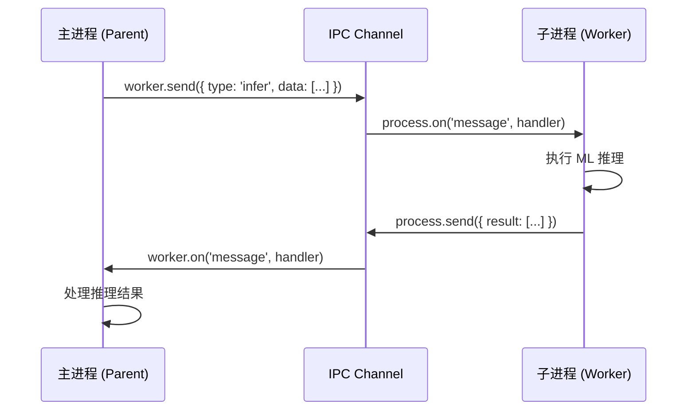
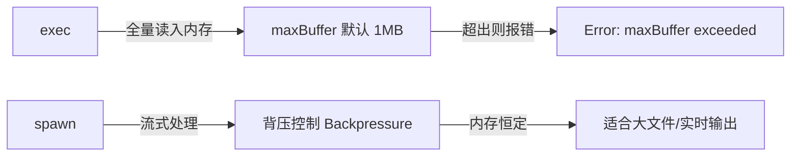

Node.js 基于单线程事件循环设计，对于 CPU 密集型任务或需要调用外部可执行文件的场景，子进程 (Child Process) 是突破这一限制的核心机制。在 Agent 后端服务中，子进程常用于调用 Python ML 推理脚本、执行系统命令或隔离危险操作。

## 为什么需要子进程

Node.js 主进程运行在单线程上，长时间的 CPU 运算（如图像处理、模型推理）会阻塞事件循环，导致所有 HTTP 请求无法响应。子进程通过操作系统级别的进程隔离解决这一问题：

- **CPU 密集型任务**：将矩阵运算、模型推理交给子进程，主进程继续处理请求
- **调用外部程序**：执行 Python 脚本、FFmpeg、系统 CLI 工具
- **进程隔离**：子进程崩溃不影响主进程稳定性
- **并行执行**：多个子进程真正并行利用多核 CPU

## 4 个核心 API

`child_process` 模块提供 4 个创建子进程的方法，适用场景各不相同。

### spawn

最底层的 API，以流 (Stream) 方式处理 stdin/stdout/stderr，适合**大数据量输出**或**长时间运行**的进程。

```typescript
import { spawn } from 'child_process';

const ls = spawn('ls', ['-lh', '/usr']);

ls.stdout.on('data', (data: Buffer) => {
  console.log(`stdout: ${data}`);
});

ls.stderr.on('data', (data: Buffer) => {
  console.error(`stderr: ${data}`);
});

ls.on('close', (code: number | null) => {
  console.log(`child process exited with code ${code}`);
});
```

### exec

在 shell 中执行命令字符串，将**全部输出缓冲到内存**后回调，适合输出量小的短命令。

```typescript
import { exec } from 'child_process';
import { promisify } from 'util';

const execAsync = promisify(exec);

async function getNodeVersion(): Promise<string> {
  const { stdout } = await execAsync('node --version');
  return stdout.trim();
}
```

### execFile

与 `exec` 类似但**不通过 shell**，直接执行可执行文件，避免 shell 注入风险，适合执行已知路径的二进制文件。

```typescript
import { execFile } from 'child_process';
import { promisify } from 'util';

const execFileAsync = promisify(execFile);

async function runPython(scriptPath: string, args: string[]): Promise<string> {
  const { stdout } = await execFileAsync('python3', [scriptPath, ...args]);
  return stdout;
}
```

### fork

专为 **Node.js 子进程**设计，在 `spawn` 基础上建立了 **IPC 通道 (Inter-Process Communication)**，父子进程可通过 `process.send()` / `process.on('message')` 互发消息。

```typescript
// parent.ts
import { fork } from 'child_process';
import path from 'path';

const worker = fork(path.resolve(__dirname, 'worker.js'));

worker.send({ type: 'compute', payload: [1, 2, 3] });

worker.on('message', (result: unknown) => {
  console.log('Worker result:', result);
});

// worker.ts
process.on('message', (msg: { type: string; payload: number[] }) => {
  if (msg.type === 'compute') {
    const sum = msg.payload.reduce((a, b) => a + b, 0);
    process.send?.({ result: sum });
  }
});
```

## API 对比表

| 特性 | spawn | exec | execFile | fork |
|------|-------|------|----------|------|
| 输出方式 | Stream 流 | Buffer 缓冲 | Buffer 缓冲 | Stream + IPC |
| 是否经过 shell | 否 | 是 | 否 | 否（Node.js） |
| IPC 通道 | 无 | 无 | 无 | 有 |
| 适用场景 | 大输出/长运行 | 小输出 shell 命令 | 直接执行二进制 | Node.js 子进程通信 |
| 内存风险 | 低（流式） | 高（全量缓冲） | 高（全量缓冲） | 低 |
| shell 注入风险 | 低 | 高 | 无 | 无 |

## stdio 继承与 IPC 通道

### stdio 选项

`spawn` 的 `stdio` 选项控制标准流的处理方式：

```typescript
import { spawn } from 'child_process';

// 'inherit': 子进程直接使用父进程的 stdio（终端可见）
const child1 = spawn('npm', ['install'], { stdio: 'inherit' });

// 'pipe': 通过管道捕获（默认）
const child2 = spawn('ls', [], { stdio: 'pipe' });

// 'ignore': 丢弃输出
const child3 = spawn('daemon', [], { stdio: 'ignore' });

// 混合配置: [stdin, stdout, stderr, ipc]
const child4 = spawn('node', ['worker.js'], {
  stdio: ['pipe', 'pipe', 'pipe', 'ipc']
});
```

### fork() IPC 消息流



## TypeScript 实战：Agent 后端调用 Python ML 推理

在 Agent 服务中，常见场景是 Node.js 后端接收请求，通过子进程调用 Python 模型推理脚本，然后将结果返回给用户。

```typescript
// src/inference/python-bridge.ts
import { spawn } from 'child_process';
import path from 'path';

interface InferenceRequest {
  modelName: string;
  input: string;
  maxTokens: number;
}

interface InferenceResponse {
  output: string;
  latencyMs: number;
  tokens: number;
}

export async function runPythonInference(
  req: InferenceRequest
): Promise<InferenceResponse> {
  return new Promise((resolve, reject) => {
    const scriptPath = path.resolve(__dirname, '../../scripts/infer.py');
    const args = [
      '--model', req.modelName,
      '--max-tokens', String(req.maxTokens),
    ];

    const child = spawn('python3', [scriptPath, ...args], {
      stdio: ['pipe', 'pipe', 'pipe'],
      timeout: 30_000, // 30s 超时
    });

    // 向子进程 stdin 写入 JSON 数据
    child.stdin.write(JSON.stringify({ input: req.input }));
    child.stdin.end();

    const stdoutChunks: Buffer[] = [];
    const stderrChunks: Buffer[] = [];

    child.stdout.on('data', (chunk: Buffer) => stdoutChunks.push(chunk));
    child.stderr.on('data', (chunk: Buffer) => stderrChunks.push(chunk));

    child.on('close', (code: number | null, signal: NodeJS.Signals | null) => {
      if (signal) {
        reject(new Error(`Process killed by signal: ${signal}`));
        return;
      }
      if (code !== 0) {
        const errMsg = Buffer.concat(stderrChunks).toString('utf8');
        reject(new Error(`Python process exited with code ${code}: ${errMsg}`));
        return;
      }
      try {
        const raw = Buffer.concat(stdoutChunks).toString('utf8');
        resolve(JSON.parse(raw) as InferenceResponse);
      } catch (e) {
        reject(new Error(`Failed to parse Python output: ${e}`));
      }
    });

    child.on('error', (err: Error) => {
      reject(new Error(`Failed to spawn process: ${err.message}`));
    });
  });
}
```

```python
# scripts/infer.py
import sys, json, time

def main():
    data = json.loads(sys.stdin.read())
    start = time.time()
    # 模拟推理
    output = f"Inference result for: {data['input']}"
    latency = int((time.time() - start) * 1000)
    print(json.dumps({"output": output, "latencyMs": latency, "tokens": 42}))

if __name__ == "__main__":
    main()
```

## exec vs spawn：缓冲与流的权衡



`exec` 的 `maxBuffer` 默认为 **1MB**，输出超过此限制会抛出错误。可通过选项调整，但根本上不适合大数据场景：

```typescript
// 增大缓冲区（不推荐用于大输出）
exec('cat large-file.log', { maxBuffer: 10 * 1024 * 1024 }, callback);

// 正确做法：改用 spawn 流式处理
const proc = spawn('cat', ['large-file.log']);
proc.stdout.pipe(fs.createWriteStream('output.log'));
```

## 错误处理：退出码、信号与超时

```typescript
import { spawn } from 'child_process';

function spawnWithTimeout(
  cmd: string,
  args: string[],
  timeoutMs: number
): Promise<string> {
  return new Promise((resolve, reject) => {
    const child = spawn(cmd, args);
    const chunks: Buffer[] = [];

    // 设置超时
    const timer = setTimeout(() => {
      child.kill('SIGTERM'); // 先发 SIGTERM
      setTimeout(() => child.kill('SIGKILL'), 5000); // 5s 后强制 SIGKILL
      reject(new Error(`Process timed out after ${timeoutMs}ms`));
    }, timeoutMs);

    child.stdout.on('data', (d: Buffer) => chunks.push(d));

    child.on('close', (code: number | null, signal: NodeJS.Signals | null) => {
      clearTimeout(timer);
      if (signal === 'SIGTERM' || signal === 'SIGKILL') {
        reject(new Error(`Process killed: ${signal}`));
      } else if (code === 0) {
        resolve(Buffer.concat(chunks).toString());
      } else {
        reject(new Error(`Exited with code ${code}`));
      }
    });

    child.on('error', (err) => {
      clearTimeout(timer);
      reject(err);
    });
  });
}
```

**常见退出码含义：**

| 退出码 | 含义 |
|--------|------|
| 0 | 成功 |
| 1 | 通用错误 |
| 2 | shell 命令使用错误 |
| 126 | 命令无执行权限 |
| 127 | 命令未找到 |
| 130 | Ctrl+C (SIGINT) |
| 137 | SIGKILL（OOM 或强制杀死） |

## detached 与后台守护进程

默认情况下，子进程的生命周期与父进程绑定，父进程退出时子进程也会收到信号。若需要让子进程在父进程退出后继续运行（如启动一个长期运行的 Agent 任务守护进程），可使用 `detached` 选项并调用 `child.unref()` 切断父子关联：

```typescript
import { spawn } from 'child_process';
import fs from 'fs';

const out = fs.openSync('./daemon.log', 'a');
const child = spawn('node', ['long-task.js'], {
  detached: true,             // 子进程脱离父进程进程组
  stdio: ['ignore', out, out], // 重定向输出到文件，不依赖父进程 stdio
});

child.unref(); // 父进程不再等待子进程，可独立退出
```

注意 `detached` 在不同操作系统行为有差异：Windows 会让子进程拥有独立控制台，Unix 系统则使其成为新进程组的组长 (group leader)。若不调用 `unref()`，事件循环仍会因子进程引用而保持存活。

## 控制运行环境：cwd 与 env

子进程默认继承父进程的工作目录和环境变量，但在 Agent 服务中常需要隔离运行环境——例如为不同租户的工具调用注入不同的 API Key，或限制脚本只能访问特定目录：

```typescript
const child = spawn('python3', ['tool.py'], {
  cwd: '/sandbox/tenant-123',          // 限定工作目录
  env: {
    PATH: process.env.PATH,            // 显式传递必要变量
    OPENAI_API_KEY: tenantApiKey,      // 注入租户专属密钥
    // 不传递父进程的其他敏感环境变量，缩小泄漏面
  },
});
```

显式构造 `env` 而非直接展开 `...process.env`，可以避免把数据库密码、内部 Token 等敏感信息泄漏给沙箱中运行的第三方脚本，这是 Agent 工具沙箱化的重要一环。

## 安全：shell 注入风险

`exec` 将命令字符串传给 shell 解析，用户输入直接拼接是严重安全漏洞：

```typescript
// 危险：shell 注入
const userInput = 'file.txt; rm -rf /';
exec(`cat ${userInput}`); // 实际执行了 rm -rf /

// 安全：使用 execFile 或 spawn，参数独立传递
execFile('cat', [userInput]); // userInput 被视为纯参数，不经过 shell 解析

// 安全：使用 spawn
spawn('cat', [userInput]);
```

**原则：永远不要将用户输入直接拼接到 `exec` 的命令字符串中。**

## 常见误区

- **误用 `exec` 处理大输出**：`exec` 将全部输出缓冲到内存，日志文件、模型输出等大数据应使用 `spawn` 流式处理。
- **忘记监听 `error` 事件**：若可执行文件不存在，`spawn`/`exec` 会触发 `error` 事件而非 `close`，不监听会导致未捕获异常崩溃进程。
- **`fork` 用于非 Node.js 脚本**：`fork` 内部用 `process.execPath`（当前 Node.js 二进制）执行，只能运行 `.js` 文件，Python 脚本应用 `spawn`。
- **IPC 消息传递大对象**：`fork` 的 IPC 通道序列化消息为 JSON，传递大型张量或 Embedding 向量效率极低，应改用共享内存 (SharedArrayBuffer) 或临时文件。
- **子进程泄漏**：忘记在父进程退出时清理子进程，可在 `process.on('exit')` 中统一调用 `child.kill()` 清理。

## 最佳实践

- 优先使用 `execFile`/`spawn` 代替 `exec`，消除 shell 注入攻击面。
- 始终为子进程设置超时，防止 Agent 任务因外部进程挂起而永久阻塞。
- 通过 stdin/stdout 传递结构化 JSON 与 Python 脚本通信，比命令行参数更安全可靠。
- Agent 服务中建议维护一个子进程池 (Process Pool)，避免每次请求都 `spawn` 新进程带来的启动开销（Python 进程冷启动可达数百毫秒）。
- 使用 `stdio: 'inherit'` 在开发调试时透传子进程输出，生产环境改为 `pipe` 并写入结构化日志。
- 监控子进程内存和 CPU 使用，防止 ML 推理进程消耗过多资源影响主服务。

## 面试考点

**Q：spawn 和 exec 的本质区别是什么？**
A：`spawn` 返回流对象，数据实时传输，内存占用恒定；`exec` 先将所有输出缓冲到内存再回调，受 `maxBuffer` 限制（默认 1MB），适合输出小的短命令。

**Q：fork 比 spawn 多了什么能力？**
A：`fork` 在 `spawn` 基础上自动建立了 IPC 通道，父子进程可通过 `send/message` 互发 JavaScript 对象（内部序列化为 JSON），而 `spawn` 只能通过 stdin/stdout 传输字节流。

**Q：如何防止 exec 的 shell 注入攻击？**
A：使用 `execFile` 或 `spawn`，将命令和参数分开传递，参数不经过 shell 解析。若必须使用 `exec`，对用户输入进行严格白名单校验，绝不直接拼接到命令字符串。

**Q：Agent 服务中为什么要用进程池而非每次 spawn？**
A：Python 等解释型语言进程启动成本高（初始化解释器、加载模型可能需要秒级时间），进程池预热 N 个 Worker 进程，请求到来时直接通过 stdin 发送数据，延迟从秒级降至毫秒级。
