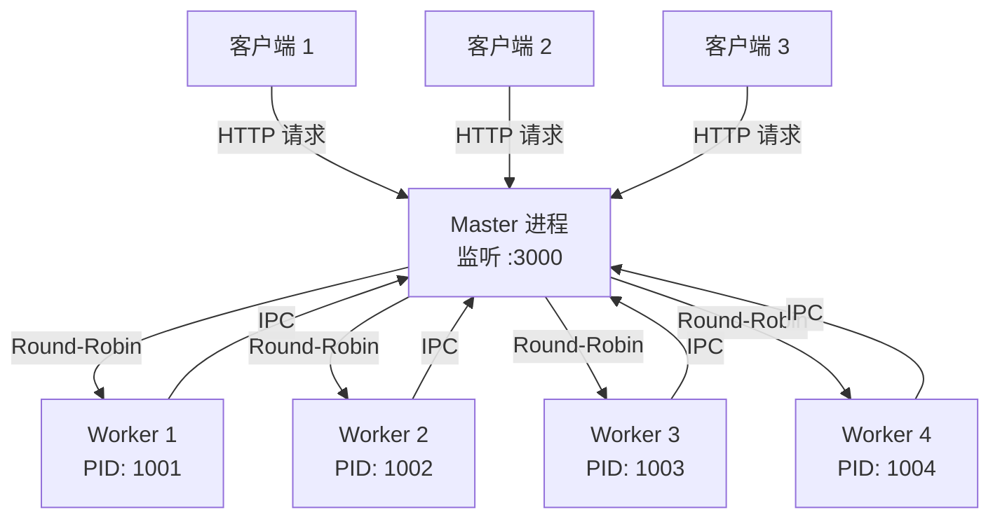
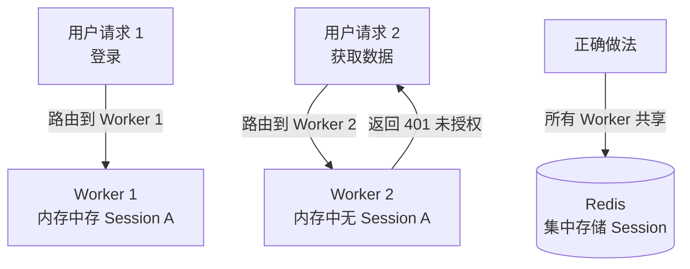

Node.js 进程天然只能跑在单个 CPU 核心上，在多核服务器上意味着大量算力被白白浪费。`cluster` 模块通过 Master/Worker 模型允许多个进程共享同一个 TCP 端口，是 Node.js 在生产环境实现水平扩展的经典方案，也是构建高并发 Agent API 服务的重要基础。

## 核心问题：单进程无法利用多核

一台 8 核服务器上，未使用 cluster 的 Node.js 服务 CPU 利用率上限约为 12.5%（1/8）。`cluster` 模块的解决思路是：

1. **主进程 (Master)** 监听端口，不处理业务逻辑
2. **工作进程 (Worker)** 处理实际请求，每个 Worker 跑在独立 CPU 核心上
3. 主进程通过负载均衡策略将连接分发给各 Worker



## Master/Worker 架构详解

### 共享 TCP Socket 的原理

多个 Worker 进程绑定同一端口是可能的，因为实际上只有 Master 进程调用了 `bind()` 和 `listen()`，Worker 进程通过 IPC 从 Master 接收文件描述符 (File Descriptor)，复用同一个 socket。

```typescript
import cluster from 'cluster';
import os from 'os';
import http from 'http';

const numCPUs = os.cpus().length;

if (cluster.isPrimary) {
  console.log(`Master PID: ${process.pid}, forking ${numCPUs} workers`);

  for (let i = 0; i < numCPUs; i++) {
    cluster.fork();
  }

  cluster.on('exit', (worker, code, signal) => {
    console.log(`Worker ${worker.process.pid} died (${signal || code}). Restarting...`);
    cluster.fork(); // 自动重启崩溃的 Worker
  });

} else {
  // 每个 Worker 独立创建 HTTP 服务，共享父进程的 socket
  http.createServer((req, res) => {
    res.writeHead(200);
    res.end(`Hello from Worker ${process.pid}\n`);
  }).listen(3000);

  console.log(`Worker ${process.pid} started`);
}
```

## TypeScript 实战：Agent API 服务的 Cluster 配置

```typescript
// src/cluster.ts
import cluster, { Worker } from 'cluster';
import os from 'os';
import path from 'path';

interface WorkerInfo {
  pid: number;
  startTime: number;
  requestCount: number;
}

const workers = new Map<number, WorkerInfo>();

function startWorker(): Worker {
  const worker = cluster.fork();

  workers.set(worker.id, {
    pid: worker.process.pid ?? 0,
    startTime: Date.now(),
    requestCount: 0,
  });

  // 监听 Worker 发来的自定义消息（如请求计数）
  worker.on('message', (msg: { type: string; count?: number }) => {
    if (msg.type === 'request_count') {
      const info = workers.get(worker.id);
      if (info) info.requestCount = msg.count ?? 0;
    }
  });

  return worker;
}

if (cluster.isPrimary) {
  const numWorkers = parseInt(process.env.WORKERS ?? '') || os.cpus().length;
  console.log(`[Master] Starting ${numWorkers} Agent API workers`);

  for (let i = 0; i < numWorkers; i++) {
    startWorker();
  }

  // 打印各 Worker 状态
  setInterval(() => {
    console.log('[Master] Worker status:');
    workers.forEach((info, id) => {
      console.log(`  Worker ${id} (PID: ${info.pid}): ${info.requestCount} requests`);
    });
  }, 30_000);

  cluster.on('exit', (worker, code, signal) => {
    workers.delete(worker.id);
    console.log(`[Master] Worker ${worker.id} died. Respawning...`);
    startWorker();
  });

} else {
  // Worker 进程启动实际的 Express/Fastify 应用
  require(path.resolve(__dirname, 'app'));
}
```

## 负载均衡策略

### Round-Robin（轮询，Linux 默认）

Node.js cluster 模块在 Linux 和 macOS 上默认使用**轮询策略**：主进程接受所有连接，然后依次分发给各 Worker。

```typescript
import cluster from 'cluster';

// 显式设置调度策略（Linux 上默认已是 SCHED_RR）
cluster.schedulingPolicy = cluster.SCHED_RR;
// 或使用 OS 调度
cluster.schedulingPolicy = cluster.SCHED_NONE;
```

| 策略 | 说明 | 适用场景 |
|------|------|----------|
| `SCHED_RR`（轮询） | Master 均匀分发连接 | 默认，绝大多数场景 |
| `SCHED_NONE`（OS 调度） | 由操作系统决定哪个 Worker 接受 | Windows（无 RR 实现） |

## 零停机重启（Graceful Reload）

生产环境发布新代码时，不能直接重启所有进程（会中断正在处理的请求）。标准做法是滚动重启：

```typescript
// 在 Master 进程中处理 SIGUSR2 信号触发滚动重启
process.on('SIGUSR2', async () => {
  console.log('[Master] Graceful reload triggered');
  const workerIds = Object.keys(cluster.workers ?? {});

  for (const id of workerIds) {
    await new Promise<void>((resolve) => {
      const worker = cluster.workers?.[id];
      if (!worker) return resolve();

      // 通知 Worker 停止接受新请求
      worker.send({ type: 'shutdown' });

      // 等待 Worker 处理完当前请求后退出
      worker.on('exit', () => {
        console.log(`[Master] Worker ${id} exited, starting replacement`);
        startWorker(); // 立即启动新 Worker
        resolve();
      });

      // 强制超时保护
      setTimeout(() => worker.kill(), 30_000);
    });
  }
});
```

```typescript
// 在 Worker 进程（app.ts）中
process.on('message', (msg: { type: string }) => {
  if (msg.type === 'shutdown') {
    console.log(`[Worker ${process.pid}] Graceful shutdown initiated`);
    server.close(() => {
      process.exit(0);
    });
  }
});
```

## 状态共享问题：Session 与缓存

**这是 Cluster 最大的陷阱**：每个 Worker 有独立的内存空间，存储在内存中的状态无法跨 Worker 共享。



```typescript
// 错误：内存存储在多 Worker 下失效
const sessions = new Map<string, object>(); // 每个 Worker 各自一份

// 正确：使用 Redis 作为集中式 Session 存储
import session from 'express-session';
import RedisStore from 'connect-redis';
import { createClient } from 'redis';

const redisClient = createClient({ url: process.env.REDIS_URL });

app.use(session({
  store: new RedisStore({ client: redisClient }),
  secret: process.env.SESSION_SECRET!,
  resave: false,
  saveUninitialized: false,
}));
```

**Agent 服务同理**：Agent 的对话历史 (Conversation History)、工具调用状态等如果存在内存中，同一用户的后续请求若被路由到不同 Worker，将无法获取上下文。必须使用 Redis、数据库等外部存储。

## cluster.fork() vs Worker Threads vs Child Process

| 维度 | cluster.fork() | Worker Threads | Child Process |
|------|---------------|----------------|---------------|
| 隔离级别 | 进程（独立内存） | 线程（共享内存） | 进程（独立内存） |
| 内存开销 | 高（每 Worker ~50MB+） | 低（共享 V8 堆） | 高 |
| 通信方式 | IPC / socket | SharedArrayBuffer / MessageChannel | IPC / stdin-stdout |
| 适用场景 | HTTP 服务水平扩展 | CPU 密集型计算 | 调用外部程序 |
| 共享端口 | 是 | 否 | 否 |
| 崩溃影响 | 仅该 Worker | 可能崩溃主线程 | 仅该子进程 |
| Agent 场景 | 多核 API 服务 | 向量计算/Embedding | Python 推理脚本 |

## PM2 Cluster 模式

生产环境通常用 PM2 管理 Cluster，无需在代码中手写 cluster 逻辑：

```bash
# ecosystem.config.js
```

```javascript
// ecosystem.config.js
module.exports = {
  apps: [{
    name: 'agent-api',
    script: './dist/app.js',
    instances: 'max',        // 等于 CPU 核心数
    exec_mode: 'cluster',    // 启用 cluster 模式
    max_memory_restart: '1G',
    env_production: {
      NODE_ENV: 'production',
      PORT: 3000,
    },
  }],
};
```

```bash
# 零停机重启
pm2 reload agent-api

# 查看各 Worker 状态
pm2 list
pm2 monit
```

PM2 cluster 模式会自动处理 Worker 崩溃重启、负载均衡和滚动重启，是生产部署的推荐方案。

## 常见误区

- **以为所有 Worker 共享内存**：最常见的误区。每个 Worker 是独立进程，内存完全隔离，不要在内存中存任何需要跨请求共享的状态。
- **Master 进程处理业务逻辑**：Master 应只负责管理 Worker 生命周期，不要在 Master 中处理 HTTP 请求，否则会成为单点瓶颈。
- **Worker 数量越多越好**：Worker 数一般设为 CPU 核心数，超出后进程切换开销反而降低性能。I/O 密集型应用可适当增加（如 CPU * 2），CPU 密集型严格等于核心数。
- **不处理 Worker 崩溃**：生产环境必须监听 `cluster.on('exit')` 并自动重启，否则 Worker 崩溃后请求量直接减少 1/N。
- **Cluster 解决不了 CPU 密集型**：如果 Agent 请求本身需要大量 CPU 计算（如 Embedding 生成），Cluster 只是多开了几个同样阻塞的进程，应配合 Worker Threads 使用。

## 最佳实践

- 将 Cluster 管理逻辑与业务代码分离，主进程文件只做 fork，业务逻辑在单独的 `app.ts` 中。
- Agent API 服务设计为**无状态 (Stateless)**，将所有状态外置到 Redis/数据库，充分发挥 Cluster 水平扩展能力。
- 生产环境优先使用 PM2 或 Kubernetes 的 Pod 副本代替手写 cluster 代码，运维成本更低。
- 为每个 Worker 设置内存上限（`max_memory_restart`），防止内存泄漏的 Worker 拖垮整台服务器。
- 滚动重启时，新 Worker 完全就绪后再关闭旧 Worker，通过健康检查端点（`/health`）确认就绪状态。
- 在容器化（Docker/K8s）环境中，每个容器只运行单个 Node.js 进程，通过 K8s 的 Deployment replicas 实现水平扩展，不再需要 cluster 模块。

## 面试考点

**Q：Node.js cluster 模块如何让多个进程监听同一端口不冲突？**
A：实际上只有 Master 进程调用 `bind()` + `listen()`，Master 通过 IPC 将 socket 的文件描述符传递给 Worker 进程，Worker 复用这个 fd 接收连接，操作系统层面只有一个 socket 在监听。

**Q：cluster 和 Worker Threads 的核心区别是什么，各自适合什么场景？**
A：cluster 是多进程，内存完全隔离，适合 HTTP 服务水平扩展；Worker Threads 是多线程，共享内存空间，适合 CPU 密集型计算（如 Embedding 向量运算）且不需要完全隔离的场景。cluster 内存开销更大，但进程间互不影响，稳定性更高。

**Q：Cluster 模式下 Session 失效的根本原因和解决方案？**
A：根本原因是每个 Worker 进程有独立内存，同一用户的两次请求可能被路由到不同 Worker，第二个 Worker 内存中不存在第一次存的 Session。解决方案是将 Session 存储迁移到所有 Worker 都能访问的 Redis，使用 `connect-redis` 等适配器。

**Q：如何实现 Node.js cluster 的零停机重启？**
A：滚动重启策略：向 Worker 发送 `shutdown` 消息，Worker 调用 `server.close()` 停止接受新连接，等待已有连接处理完毕后退出；Master 监听 Worker `exit` 事件后立即 fork 新 Worker。整个过程始终有 Worker 在服务，实现零停机。
