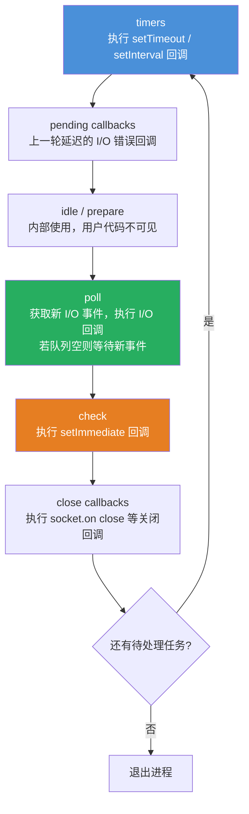
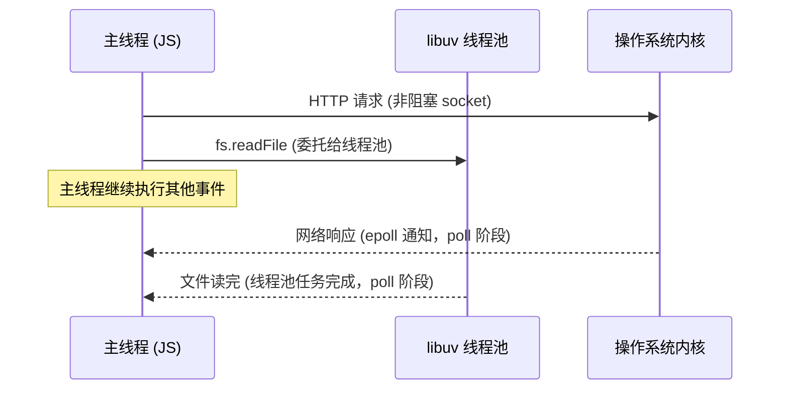

*图：沿图中的节点与箭头阅读，重点是准确区分事件循环阶段、microtask/nextTick 队列、线程池与 I/O 回调。*

---

Node.js 之所以能以单线程处理数以万计的并发连接，根本在于它的事件循环 (Event Loop) 机制——理解每个阶段的执行顺序与微任务插入时机，是写出可预期异步代码、排查诡异 Bug、以及正确评估 AI Agent 服务吞吐量上限的必备前提。

## 为什么 Node.js 选择单线程非阻塞 I/O

传统多线程服务器（如 Apache）为每个请求创建一个线程，线程上下文切换成本随并发量线性增长，且每个线程都要独占栈内存（通常 8 MB），高并发时内存消耗极大。Node.js 采用"单线程事件循环 + libuv 异步 I/O"模型：JavaScript 代码运行在单一主线程，所有 I/O（文件、网络、数据库）操作委托给操作系统内核或 libuv 线程池异步执行，完成后通过回调通知主线程。

这个模型的核心优势在于：I/O 等待期间主线程可以继续处理其他事件，而不是白白阻塞。对于 AI Agent 服务来说，并发调用多个 LLM API（如 OpenAI、Claude）时，每个 HTTP 请求在等待模型响应的几秒内，事件循环可以同时派发其他请求、处理 webhook、写日志——这直接决定了服务的并发吞吐上限。

## 事件循环的六个阶段

libuv 驱动的事件循环每次迭代（tick）按严格顺序经历以下六个阶段：



### 阶段详解

**1. timers（定时器）**
执行所有到期的 `setTimeout` 和 `setInterval` 回调。"到期"是指回调的延迟时间已过，但 Node.js 不保证精确时刻——如果 poll 阶段耗时过长，timers 回调会相应推迟。

**2. pending callbacks（挂起回调）**
执行上一轮事件循环中被推迟的 I/O 回调，通常是某些 TCP 错误（如 `ECONNREFUSED`）的回调。

**3. idle / prepare**
仅供 libuv 内部使用，Node.js 用户代码不会在此阶段执行。

**4. poll（轮询）**
这是最核心的阶段，分两件事：
- 计算阻塞等待 I/O 的时长
- 处理 poll 队列中的 I/O 回调（文件读写、网络响应等）

当 poll 队列清空且没有 `setImmediate` 任务时，事件循环会在此阶段短暂等待新的 I/O 事件；一旦有 timers 即将到期，便结束等待回到 timers 阶段。

**5. check（检查）**
执行所有 `setImmediate` 回调。`setImmediate` 专为"I/O 回调之后、timers 之前"这个时机设计。

**6. close callbacks（关闭回调）**
执行 `socket.on('close', ...)` 等资源关闭事件的回调。

## 微任务队列 (Microtask Queue)

微任务队列不属于上述六个阶段，而是在**每个阶段结束后**（以及 timers 阶段每个回调执行后）立即清空，优先级高于下一阶段的宏任务。

Node.js 有两类微任务，按优先级排序：

1. `process.nextTick` 队列（更高优先级）
2. Promise 微任务队列（`Promise.resolve().then(...)`）

```typescript
// 执行顺序演示
import { setImmediate as setImmediateNode } from 'timers';

console.log('1: 同步代码');

setTimeout(() => console.log('2: setTimeout'), 0);

setImmediateNode(() => console.log('3: setImmediate'));

Promise.resolve().then(() => console.log('4: Promise.then'));

process.nextTick(() => console.log('5: process.nextTick'));

console.log('6: 同步代码结束');

// 输出顺序：
// 1: 同步代码
// 6: 同步代码结束
// 5: process.nextTick     ← 微任务，nextTick 队列先清空
// 4: Promise.then         ← 微任务，Promise 队列后清空
// 2: setTimeout           ← 宏任务（timers 阶段）
// 3: setImmediate         ← 宏任务（check 阶段）
```

## setImmediate vs setTimeout 的顺序不确定性

在主模块顶层（非 I/O 回调内）调用 `setTimeout(fn, 0)` 和 `setImmediate(fn)` 时，两者的顺序是**不确定的**，取决于进程启动后的耗时与定时器精度：

```typescript
// 顶层调用 — 顺序不确定
setTimeout(() => console.log('timeout'), 0);
setImmediate(() => console.log('immediate'));
// 可能输出 timeout → immediate，也可能 immediate → timeout

// 在 I/O 回调内调用 — 顺序确定，setImmediate 先于 setTimeout
import fs from 'fs';
fs.readFile('/etc/hostname', () => {
  setTimeout(() => console.log('timeout'), 0);
  setImmediate(() => console.log('immediate'));
  // 始终输出：immediate → timeout
  // 原因：readFile 回调在 poll 阶段执行，poll 阶段结束后下一个是 check 阶段
});
```

## libuv 线程池与 I/O 集成

[libuv 设计文档](https://docs.libuv.org/en/v1.x/design.html) 区分事件循环的 I/O polling 与线程池执行路径；文件系统等部分操作完成后再把回调交回事件循环，并非所有异步 I/O 都在池中执行。


虽然 JavaScript 运行在单线程，libuv 仍维护共享线程池处理部分阻塞工作；默认容量和允许范围随 Node/libuv 版本而变化，部署时应以当前运行时文档和压测为准，并可在进程启动前通过 `UV_THREADPOOL_SIZE` 调整。线程池常用于：

- 文件系统操作（`fs.readFile` 等）
- DNS 解析（`dns.lookup`）
- 部分加密操作（`crypto` 模块的同步哈希等）
- 用户自定义的本地插件（Native Addons）

网络 I/O（TCP/UDP）直接使用操作系统的非阻塞 socket + `epoll`/`kqueue`/`IOCP`，不占用线程池。



## nextTick 洪泛导致的饥饿 (Starvation)

`process.nextTick` 在每个阶段结束后无条件清空，如果在 nextTick 回调内递归调用 `process.nextTick`，会造成**事件循环饥饿**——后续所有 I/O、定时器永远得不到执行：

```typescript
// 危险：无限 nextTick 递归，I/O 永远无法响应
function dangerousRecursion() {
  process.nextTick(dangerousRecursion); // 永远不会让出控制权
}
dangerousRecursion();

// 正确：需要递归处理时，用 setImmediate 让出给 I/O
function safeRecursion(items: string[], index = 0) {
  if (index >= items.length) return;
  processItem(items[index]);
  setImmediate(() => safeRecursion(items, index + 1)); // 每次迭代都允许 I/O 插入
}
```

## AI Agent 服务中的意义

在构建 AI Agent 后端时，事件循环健康度直接影响服务质量：

```typescript
import OpenAI from 'openai';

const client = new OpenAI();

// 正确：并发发起多个 LLM 调用，事件循环在等待响应时处理其他请求
async function parallelAgentCalls(prompts: string[]): Promise<string[]> {
  // Promise.all 让所有 HTTP 请求几乎同时发出，等待期间事件循环自由运转
  const results = await Promise.all(
    prompts.map(prompt =>
      client.chat.completions.create({
        model: 'gpt-4o',
        messages: [{ role: 'user', content: prompt }],
      })
    )
  );
  return results.map(r => r.choices[0].message.content ?? '');
}

// 错误：在 LLM 回调中做大量 CPU 计算，阻塞事件循环
async function blockedHandler(prompt: string) {
  const result = await client.chat.completions.create({
    model: 'gpt-4o',
    messages: [{ role: 'user', content: prompt }],
  });
  // 假设这里有 200ms 的向量计算 — 阻塞期间其他所有请求卡住
  const embedding = computeEmbeddingSync(result.choices[0].message.content!);
  return embedding;
}
```

Agent 服务的吞吐量瓶颈往往不在 LLM 调用速度，而在于：
- 回调中是否有同步 CPU 操作（应移至 Worker Threads）
- nextTick/Promise 是否被滥用导致 I/O 响应延迟
- libuv 线程池是否被 `dns.lookup` 或文件操作耗尽

## 四种异步 API 对比

| API | 队列类型 | 执行时机 | 优先级 | 适用场景 |
|---|---|---|---|---|
| `process.nextTick(fn)` | nextTick 队列（微任务） | 当前阶段结束后立即 | 最高 | 确保回调在当前操作完成后、I/O 之前执行；错误传播 |
| `Promise.resolve().then(fn)` | Promise 微任务队列 | nextTick 队列清空后立即 | 次高 | 链式异步操作；async/await 底层机制 |
| `setTimeout(fn, 0)` | timers 队列（宏任务） | 下一次 timers 阶段（不精确） | 中 | 延迟执行；与浏览器兼容的异步代码 |
| `setImmediate(fn)` | check 队列（宏任务） | 当前 poll 阶段之后 | 中 | I/O 回调后立即执行；避免 setTimeout 不确定性 |

## 常见误解

**误解 1：`setTimeout(fn, 0)` 是"立即"执行**
实际上 Node.js 会将最小延迟截断为约 1ms，且必须等待 timers 阶段到来才执行，期间 poll 阶段可能阻塞数毫秒。

**误解 2：Promise 比 process.nextTick 更快**
恰好相反——`process.nextTick` 的优先级高于 Promise 微任务。在 Node.js v11 之前两者行为还有阶段性差异，v11+ 之后才统一到"每个宏任务后清空所有微任务"。（参见 [Node.js event loop, timers, and process.nextTick](https://nodejs.org/learn/asynchronous-work/event-loop-timers-and-nexttick)）

**误解 3：Node.js 完全是单线程的**
主线程（JavaScript 执行）是单线程，但 libuv 线程池、操作系统异步 I/O、以及 `worker_threads` 允许真正的多线程。

**误解 4：大量 async/await 会绕过事件循环**
`async/await` 是 Promise 的语法糖，每个 `await` 都会向 Promise 微任务队列注册一个延续，仍然完全受事件循环调度。

## 最佳实践

- **不要在热路径上滥用 `process.nextTick`**：频繁使用会推迟 I/O 响应，用 `queueMicrotask` 或 `Promise` 替代无特殊需求的场景。
- **CPU 密集操作移出主线程**：超过 ~10ms 的同步计算应放入 Worker Threads，否则影响所有并发请求的响应时间。
- **扩大 libuv 线程池**：如果 Agent 服务大量使用 `fs` 或 `crypto`，设置 `UV_THREADPOOL_SIZE=16`（或更大）避免线程池成为瓶颈。
- **监控事件循环延迟**：使用 `perf_hooks` 的 `monitorEventLoopDelay` 或 APM 工具（如 Clinic.js）检测 lag，及时发现阻塞操作。
- **I/O 回调内优先选 `setImmediate`**：顺序可预测，避免 `setTimeout(fn, 0)` 的不确定性。

## 面试重点

1. **描述事件循环六个阶段及各自的职责**，重点说清 poll 阶段的等待逻辑。
2. **微任务 vs 宏任务**：nextTick > Promise > setImmediate ≈ setTimeout 的优先级关系，以及 nextTick 洪泛的危险。
3. **`setImmediate` vs `setTimeout(fn, 0)` 在 I/O 回调内为何顺序确定？** 答：I/O 回调在 poll 阶段执行，poll 之后紧接 check 阶段（setImmediate），timers 要等下一轮。
4. **libuv 线程池处理哪些操作？** 文件 I/O、DNS lookup、部分 crypto；网络 I/O 不走线程池。
5. **如何诊断事件循环阻塞？** 使用 `perf_hooks.monitorEventLoopDelay`、`--prof` 火焰图、或 Clinic.js Doctor。

## 参考资料

- [Node.js event loop, timers, and process.nextTick](https://nodejs.org/learn/asynchronous-work/event-loop-timers-and-nexttick)
- [libuv design overview](https://docs.libuv.org/en/v1.x/design.html)
