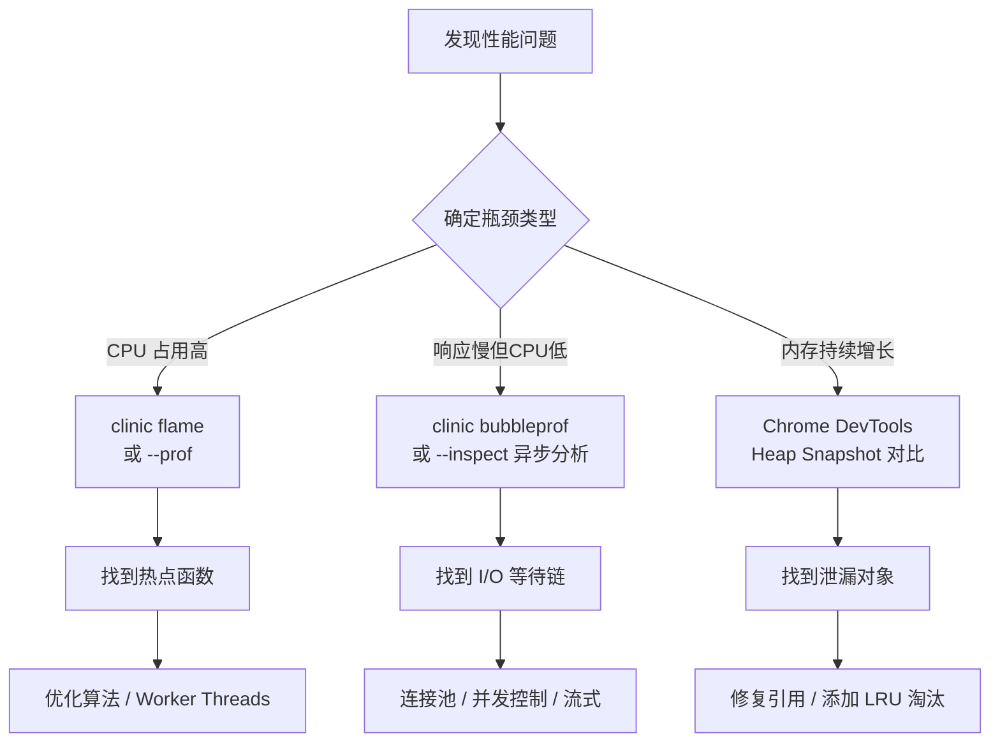

Node.js 的单线程事件循环模型在 I/O 密集型场景下性能卓越，但遇到 CPU 密集任务、内存泄漏或不合理的异步模式时，性能会急剧下降。系统性地掌握性能瓶颈分析与调优方法，是构建高吞吐 Node.js 后端（尤其是 AI Agent 服务）的核心竞争力。

## 性能瓶颈分类

理解瓶颈类型是调优的前提。Node.js 的性能问题通常归属于三类：

| 瓶颈类型 | 典型场景 | 症状 | 调优方向 |
|---------|---------|------|---------|
| **CPU-bound** | JSON 大量序列化、复杂计算、Prompt 处理 | Event Loop 延迟高，`--prof` 热点集中 | Worker Threads、算法优化、缓存计算结果 |
| **I/O-bound** | 数据库查询、LLM API 调用、文件读写 | CPU 低但响应慢，大量 pending Promise | 连接池、并发控制、流式处理 |
| **Memory** | 长期运行服务内存持续增长 | `process.memoryUsage()` RSS 不断攀升 | 修复泄漏、LRU 淘汰、减少全局引用 |

在 AI Agent 服务中，**I/O-bound** 是最常见瓶颈——单次 LLM API 调用可能耗时 2-30 秒，服务器等待期间应最大化并发，而不是串行阻塞。

## Profiling 工具链

### --prof：V8 内置 CPU Profiler

```bash
# 启动时注入 profiler
node --prof server.js

# 生成可读报告（isolate-*.log 自动生成）
node --prof-process isolate-0x*.log > profile.txt
```

`profile.txt` 中关注 `[Bottom up (heavy) profile]` 区域，找到占用 ticks 最多的函数。这是定位 CPU 热点最快的方式。

### Clinic.js：可视化诊断套件

```bash
npm install -g clinic

# Doctor：综合诊断（CPU、内存、Event Loop 延迟）
clinic doctor -- node server.js

# Flame：火焰图，找 CPU 热点
clinic flame -- node server.js

# Bubbleprof：异步操作可视化，找 I/O 瓶颈
clinic bubbleprof -- node server.js
```

Clinic.js 生成 HTML 报告，适合快速定位"是哪类问题"。Agent 服务中 Bubbleprof 特别有用——可以直观看到 LLM 请求在异步链中占据了多长时间。

### node --inspect + Chrome DevTools

```bash
node --inspect server.js
# 或在运行中动态附加
kill -SIGUSR1 <pid>
```

打开 Chrome 访问 `chrome://inspect`，连接后可进行：
- **CPU profiling**：录制一段时间内的函数调用热图
- **Memory snapshot**：对比两个堆快照找内存泄漏
- **Allocation instrumentation**：逐分配跟踪内存增长



## 内存泄漏：原因与检测

### 常见泄漏来源

**1. 闭包意外持有大对象**

```typescript
// 危险：每次请求都把整个 requestData 关进闭包
function createHandler(requestData: LargeObject) {
  return function() {
    // 只用了 requestData.id，但整个对象被持有
    console.log(requestData.id);
  };
}

// 修复：只提取需要的字段
function createHandler(requestData: LargeObject) {
  const id = requestData.id; // 只持有原始值
  return function() {
    console.log(id);
  };
}
```

**2. 事件监听器未清理**

```typescript
// 危险：每次调用都添加新监听器，从不移除
class AgentSession {
  constructor(emitter: EventEmitter) {
    emitter.on('message', this.handleMessage); // 积累泄漏
  }
}

// 修复：保存引用并在销毁时清理
class AgentSession {
  private handler = this.handleMessage.bind(this);
  
  constructor(private emitter: EventEmitter) {
    emitter.on('message', this.handler);
  }
  
  destroy() {
    this.emitter.off('message', this.handler);
  }
}
```

**3. 全局 Map/Set 无限增长**

```typescript
// 危险：会话缓存永不过期
const sessions = new Map<string, SessionData>();
sessions.set(sessionId, data); // 永远不删除

// 修复：使用 LRU 或设置 TTL
```

### 用 heapdump 检测泄漏

```typescript
import heapdump from 'heapdump';

// 定时生成堆快照
setInterval(() => {
  heapdump.writeSnapshot(`./heap-${Date.now()}.heapsnapshot`);
}, 60_000);
```

用 Chrome DevTools 的 Memory 面板加载两个时间点的 `.heapsnapshot`，使用 **Comparison** 视图，按 `# Delta`（数量增量）排序，持续增长的对象类型即为泄漏来源。

## V8 优化原理：Hidden Classes 与 Inline Caches

V8 为每个对象维护一个 **hidden class**（隐藏类），记录属性的类型和布局。当多个对象共享同一 hidden class，V8 可以使用 **inline cache（IC）** 直接内存偏移访问属性，极大提升速度。

**多态（Polymorphism）会破坏 IC：**

```typescript
// 危险：两个对象形状不同，V8 无法复用 IC
function getX(obj: { x: number }) {
  return obj.x;
}
getX({ x: 1 });                // hidden class A
getX({ x: 1, y: 2 });         // hidden class B — IC 降级为 megamorphic

// 规则：同类对象始终用相同的属性顺序初始化
interface Point { x: number; y: number; }
function makePoint(x: number, y: number): Point {
  return { x, y }; // 始终 x 在前
}
```

**动态添加属性同样有害：**

```typescript
// 危险
const obj: any = {};
obj.name = 'agent'; // transition 1
obj.id = 123;       // transition 2 — 每次 transition 改变 hidden class

// 修复：在构造时声明所有属性
const obj = { name: 'agent', id: 123 };
```

## async/await vs Callback 的性能误区

常见误解是 `async/await` 比 callback 慢。实际上：

- **现代 V8（Node.js 12+）** 对 `async/await` 有专项优化，开销已接近零
- **真正的性能差异**来自错误的并发模式，而非语法

```typescript
// 反模式：串行等待，LLM 调用总耗时 = A + B + C
async function badAgent() {
  const a = await callLLM('step-a');
  const b = await callLLM('step-b');
  const c = await callLLM('step-c');
  return [a, b, c];
}

// 正确：并发执行，总耗时 = max(A, B, C)
async function goodAgent() {
  const [a, b, c] = await Promise.all([
    callLLM('step-a'),
    callLLM('step-b'),
    callLLM('step-c'),
  ]);
  return [a, b, c];
}

// 有依赖关系时：用 Promise 链而非嵌套 await
async function chainedAgent() {
  const context = await fetchContext();
  const [analysis, summary] = await Promise.all([
    callLLM('analyze', context),
    callLLM('summarize', context),
  ]);
  return callLLM('synthesize', { analysis, summary });
}
```

## 连接池：数据库与 LLM API 客户端

每次请求都建立新连接会产生巨大的 TCP 握手 + TLS 协商开销，对 HTTPS（LLM API）尤为突出。

```typescript
import { Pool } from 'pg';
import Anthropic from '@anthropic-ai/sdk';

// 数据库连接池：全局单例
const dbPool = new Pool({
  host: process.env.DB_HOST,
  max: 20,           // 最大连接数
  idleTimeoutMillis: 30_000,
  connectionTimeoutMillis: 2_000,
});

// LLM 客户端：复用 HTTP Keep-Alive 连接
// SDK 内部使用 undici/node-fetch，默认启用连接复用
// 全局实例化，避免每次请求新建
const anthropic = new Anthropic({
  apiKey: process.env.ANTHROPIC_API_KEY,
  maxRetries: 3,
  timeout: 60_000,
});

// Agent 服务中的正确用法
export async function runAgent(query: string) {
  // 不要在函数内 new Anthropic()！
  const stream = anthropic.messages.stream({ /* ... */ });
  return stream;
}
```

对于需要限制并发 LLM 请求数的场景（避免 Rate Limit），可以使用信号量：

```typescript
import { Semaphore } from 'async-mutex';

const llmSemaphore = new Semaphore(10); // 最多 10 个并发 LLM 请求

async function rateLimitedLLMCall(prompt: string) {
  const [_, release] = await llmSemaphore.acquire();
  try {
    return await callLLM(prompt);
  } finally {
    release();
  }
}
```

## 缓存策略

### 内存 LRU 缓存：Agent 对话上下文

Agent 服务中，同一 `sessionId` 的上下文频繁读取，使用 LRU 缓存可以大幅减少 Redis 访问次数。

```typescript
import { LRUCache } from 'lru-cache';

interface ConversationContext {
  messages: Array<{ role: string; content: string }>;
  metadata: Record<string, unknown>;
  updatedAt: number;
}

// 全局 LRU：最多缓存 500 个会话，每条 TTL 10 分钟
const contextCache = new LRUCache<string, ConversationContext>({
  max: 500,
  ttl: 10 * 60 * 1000, // 10 分钟（毫秒）
  updateAgeOnGet: true,  // 访问时刷新 TTL
  sizeCalculation: (value) => {
    // 按消息数量估算大小，防止单个超大会话占满缓存
    return value.messages.length;
  },
  maxSize: 10_000, // 总消息数上限
});

export class ConversationService {
  constructor(private redis: RedisClient) {}

  async getContext(sessionId: string): Promise<ConversationContext | null> {
    // L1: 内存 LRU
    const cached = contextCache.get(sessionId);
    if (cached) return cached;

    // L2: Redis
    const raw = await this.redis.get(`ctx:${sessionId}`);
    if (!raw) return null;

    const ctx = JSON.parse(raw) as ConversationContext;
    contextCache.set(sessionId, ctx); // 回填 L1
    return ctx;
  }

  async setContext(sessionId: string, ctx: ConversationContext): Promise<void> {
    contextCache.set(sessionId, ctx);
    await this.redis.setex(`ctx:${sessionId}`, 600, JSON.stringify(ctx));
  }
}
```

### 缓存层级对比

| 缓存层 | 延迟 | 容量 | 适用场景 |
|--------|------|------|---------|
| 进程内 LRU | < 1ms | 受内存限制 | 热点会话上下文、LLM 结果去重 |
| Redis | 1-5ms | 数十 GB | 跨实例共享状态、分布式 Session |
| CDN | 10-50ms | 无限 | 静态资源、公开 API 响应 |

## AI Agent 服务专项优化

LLM 调用延迟（2-30s）远超任何数据库查询，性能策略需围绕此重心展开：

1. **流式输出（Streaming）**：用 `stream()` 替代等待完整响应，首 token 时间（TTFT）从 5s 降到 <500ms，用户感知延迟大幅下降。

2. **工具调用并发**：当 Agent 决定调用多个 Tool 时，用 `Promise.all` 并发执行，而非等待每个工具依次完成。

3. **提前终止无效推理**：用 `AbortController` 给 LLM 请求设置超时，避免慢请求阻塞资源。

```typescript
async function callLLMWithTimeout(prompt: string, timeoutMs = 30_000) {
  const controller = new AbortController();
  const timer = setTimeout(() => controller.abort(), timeoutMs);
  
  try {
    return await anthropic.messages.create(
      { model: 'claude-opus-4-5', max_tokens: 1024, messages: [{ role: 'user', content: prompt }] },
      { signal: controller.signal }
    );
  } finally {
    clearTimeout(timer);
  }
}
```

## 常见误区

- **误区：async/await 比 callback 性能差** — Node.js 12+ 之后两者开销相当，问题在于串行 vs 并发模式，而非语法。
- **误区：Node.js 不适合 CPU 密集任务** — Worker Threads 可以将计算密集型任务卸载到独立线程，主线程继续处理 I/O。
- **误区：内存用得多代表有泄漏** — V8 的 GC 有 delay，内存峰值后会回收；只有长期单调增长才是泄漏信号。
- **误区：连接池越大越好** — 数据库有最大连接数限制，过大的池反而导致连接争用和更高的内存占用。

## 最佳实践

- 使用 `clinic doctor` 作为性能诊断的第一步，快速判断瓶颈类型。
- LLM 客户端必须全局单例，绝不在请求处理函数内部实例化。
- Agent 中无依赖关系的 Tool 调用一律 `Promise.all` 并发。
- 对话上下文缓存采用 LRU + Redis 两级架构，避免频繁冷读取。
- 对象初始化时声明所有属性，避免动态添加字段破坏 V8 hidden class。
- 所有长期存活的 EventEmitter 监听器必须在销毁时显式 `off`。
- 用 `AbortController` 为每个外部 API 调用设置合理超时。

## 面试要点

- **Q：如何排查 Node.js 服务内存泄漏？**  
  A：使用 Chrome DevTools Heap Snapshot 功能，对比两个时间点的快照，在 Comparison 视图按数量增量排序，定位持续增长的对象，再追踪其 Retaining Tree 找到持有引用的代码。

- **Q：Node.js 单线程如何处理 CPU 密集型任务？**  
  A：通过 `worker_threads` 模块将计算任务卸载到 Worker 线程，主线程专注 I/O。也可以用 `child_process.fork` 开启子进程。

- **Q：V8 的 hidden class 对性能有什么影响？**  
  A：V8 用 hidden class 追踪对象形状，形状相同的对象可以共享 inline cache，属性访问接近 C++ 速度。动态添加属性或不一致的初始化顺序会导致 IC 退化为 megamorphic，性能下降数倍。

- **Q：在 AI Agent 服务中，最重要的性能优化是什么？**  
  A：LLM API 连接复用（全局客户端单例）、并发工具调用（Promise.all）、流式响应（降低 TTFT）、会话上下文 LRU 缓存（减少 Redis 轮询）这四点收益最大。
