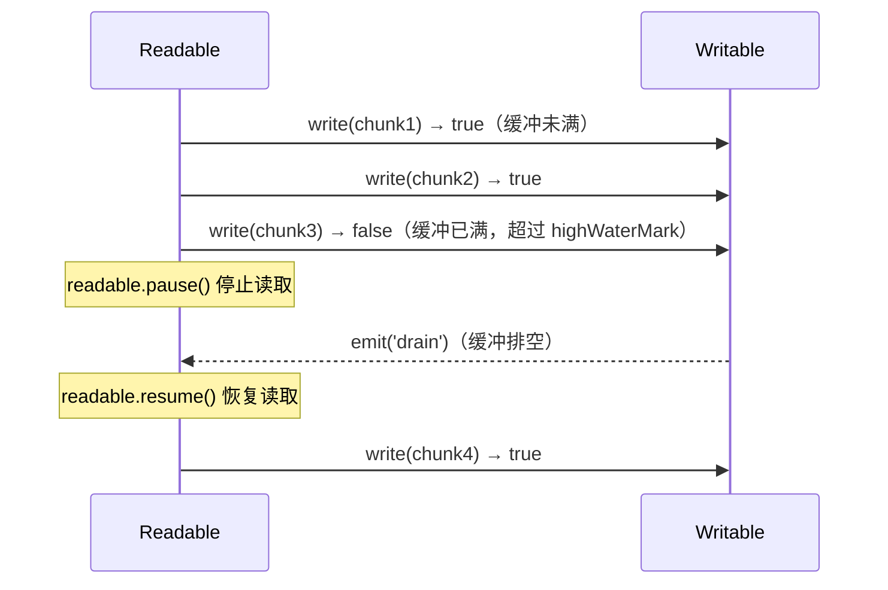

*图：沿 Readable → Transform → Writable 读取数据流；`write()` 返回 `false` 时反向暂停读取，`drain` 后恢复，错误与销毁信号沿管道传播。*

---

将大文件整体读入内存会让峰值占用随文件大小增长，在内存受限的进程中可能触发 OOM；Stream 则通过分块、缓冲区和背压把占用约束在由 `highWaterMark` 与下游消费速率共同决定的范围内。它不会自动保证固定内存，但能为文件处理和 LLM 流式响应提供可控的 I/O 管道。

## 为什么 Stream 比整体读写更高效

传统“读全部 → 处理 → 写全部”模式会让内存峰值随数据量增长，而 Stream 以**块（chunk）**传递数据：生产者（Readable）产出 chunk，消费者（Writable）增量处理，无需等待完整数据。内存中排队的数据受各阶段 `highWaterMark`、对象模式、实现和下游速度共同影响；默认值也随流类型与 Node 版本变化。

在 AI Agent 服务中，这一特性直接对应两个场景：
- **LLM 流式响应**：OpenAI / Anthropic API 以 SSE 或 chunked HTTP 返回 token，必须用 Stream 逐块转发给前端，而不是等待整个响应完成。
- **大规模向量文件处理**：处理百万行 embedding 文件时，流式读取 → Transform 解析 → 流式写入数据库，避免 OOM。

## 四种 Stream 类型

Node 同时提供维护者记录的 [WHATWG Web Streams API](https://nodejs.org/api/webstreams.html)；它与经典 Node Stream 的对象和背压接口不同，互操作时应使用官方适配方法而不是假定两者可直接混用。


| 类型 | 方向 | 可读 | 可写 | 典型示例 |
|---|---|---|---|---|
| `Readable` | 只读 | 是 | 否 | `fs.createReadStream`、HTTP 请求体、`process.stdin` |
| `Writable` | 只写 | 否 | 是 | `fs.createWriteStream`、HTTP 响应、`process.stdout` |
| `Duplex` | 双向独立 | 是 | 是 | TCP socket、`net.Socket`（读写缓冲区相互独立） |
| `Transform` | 双向转换 | 是 | 是 | `zlib.createGzip`、加密流、自定义解析器（读写共享内部状态）|

`Duplex` 和 `Transform` 的区别：Duplex 的读写两端相互独立（像一根双向管道中的两根独立水管），Transform 的写入端直接产生读取端的输出（像过滤器）。

## Flowing 模式与 Paused 模式

Readable Stream 有两种工作模式，影响数据消费方式：

**Paused 模式（默认）**：Stream 不会自动推送数据，消费者必须显式调用 `.read()` 拉取。

**Flowing 模式**：一旦切换，Stream 尽可能快地推送数据。切换触发条件：
- 添加 `data` 事件监听器
- 调用 `.resume()`
- 通过 `.pipe()` 连接到 Writable

```typescript
import { createReadStream } from 'fs';

const readable = createReadStream('/var/log/agent.log', { encoding: 'utf8' });

// 方式 1：Flowing 模式（监听 data 事件）
readable.on('data', (chunk: string) => {
  process.stdout.write(chunk);
});
readable.on('end', () => console.log('读取完成'));

// 方式 2：Paused 模式（手动拉取，适合精细控制）
readable.on('readable', () => {
  let chunk: string | null;
  while ((chunk = readable.read(1024)) !== null) {
    process.stdout.write(chunk);
  }
});
```

## pipe() 与 pipeline()

### pipe()

[`readable.pipe(writable)`](https://nodejs.org/api/stream.html) 将 Readable 的输出自动流入 Writable，内置背压处理（Writable 写不过来时自动暂停 Readable）。但 `pipe()` 不会替你完成整条链路的统一错误治理：某一环报错后，是否以及如何清理其他流取决于调用方的错误处理，遗漏处理可能留下未关闭资源。

```typescript
import { createReadStream, createWriteStream } from 'fs';
import { createGzip } from 'zlib';

// 危险：任意流报错不会销毁其他流
createReadStream('large-embeddings.jsonl')
  .pipe(createGzip())
  .pipe(createWriteStream('large-embeddings.jsonl.gz'));
```

### pipeline()（推荐）

`stream.pipeline()` 是 Node.js 10+ 引入的标准化管道函数，会把错误传播给 callback/Promise，并在失败时按 [Node.js Stream API](https://nodejs.org/api/stream.html#streampipelinesource-transforms-destination-callback) 的规则销毁仍需关闭的流。已经发出 `end`/`close` 或 `finish`/`close` 的流属于例外；pipeline 还可能留下部分事件监听器，因此“销毁所有流且无副作用”并不准确。

```typescript
import { createReadStream, createWriteStream } from 'fs';
import { createGzip } from 'zlib';
import { pipeline } from 'stream/promises'; // Node.js 15+ 提供 Promise 版本

async function compressFile(input: string, output: string): Promise<void> {
  await pipeline(
    createReadStream(input),
    createGzip(),
    createWriteStream(output)
  );
  console.log(`压缩完成: ${output}`);
}
// 任意环节出错 → Promise reject；仍活跃的流按 pipeline 规则清理
```

## 背压机制 (Backpressure)

背压是 Stream 的核心安全机制，防止快速 Readable 压垮慢速 Writable。

**工作原理：**
1. `writable.write(chunk)` 返回 `false` 表示内部缓冲区已满（超过 `highWaterMark`）
2. Readable 应停止生产（调用 `readable.pause()`）
3. Writable 缓冲区排空后触发 `drain` 事件
4. Readable 收到信号后恢复（`readable.resume()`）



```typescript
import { Readable, Writable } from 'stream';

function manualPipeWithBackpressure(readable: Readable, writable: Writable): void {
  readable.on('data', (chunk: Buffer) => {
    const canContinue = writable.write(chunk);
    if (!canContinue) {
      readable.pause();                       // 背压：暂停读取
      writable.once('drain', () => {
        readable.resume();                    // 缓冲排空后恢复
      });
    }
  });
  readable.on('end', () => writable.end());
}
```

`highWaterMark` 可以在创建 Stream 时自定义，单位是字节（对象模式下是对象数量）：

```typescript
// 适合网络流式传输的小缓冲区，减少延迟
const readable = createReadStream('data.bin', { highWaterMark: 4096 });

// 适合高吞吐批量写入的大缓冲区
const writable = createWriteStream('output.bin', { highWaterMark: 64 * 1024 });
```

## 自定义 Transform Stream

Transform Stream 是最常用的自定义流类型，适用于数据解析、格式转换、加密/解密等场景。

```typescript
import { Transform, TransformCallback } from 'stream';

interface ParsedLogEntry {
  timestamp: string;
  level: string;
  message: string;
}

/**
 * JSONL（JSON Lines）解析 Transform Stream
 * 输入：包含不完整行的 Buffer chunks
 * 输出：解析后的 ParsedLogEntry 对象（对象模式）
 *
 * 在 AI Agent 服务中可用于流式解析 LLM 输出的结构化日志
 */
class JsonLineParser extends Transform {
  private buffer = '';

  constructor() {
    super({
      readableObjectMode: true,  // 输出端：对象模式
      writableObjectMode: false, // 输入端：Buffer/string
    });
  }

  _transform(chunk: Buffer, _encoding: BufferEncoding, callback: TransformCallback): void {
    this.buffer += chunk.toString('utf8');
    const lines = this.buffer.split('\n');
    // 最后一个元素可能是不完整的行，留存到下一个 chunk
    this.buffer = lines.pop() ?? '';

    for (const line of lines) {
      const trimmed = line.trim();
      if (!trimmed) continue;
      try {
        const parsed = JSON.parse(trimmed) as ParsedLogEntry;
        this.push(parsed); // 向可读端推送对象
      } catch {
        // 忽略非 JSON 行（如注释、空行）
      }
    }
    callback();
  }

  _flush(callback: TransformCallback): void {
    // 处理文件末尾没有换行符的最后一行
    const trimmed = this.buffer.trim();
    if (trimmed) {
      try {
        this.push(JSON.parse(trimmed) as ParsedLogEntry);
      } catch {
        // 忽略解析失败
      }
    }
    callback();
  }
}

// 使用示例：流式解析 AI Agent 的结构化日志
async function parseAgentLogs(logPath: string): Promise<void> {
  const { pipeline } = await import('stream/promises');
  const { createReadStream } = await import('fs');
  const { Writable } = await import('stream');

  const parser = new JsonLineParser();
  let entryCount = 0;

  const sink = new Writable({
    objectMode: true,
    write(entry: ParsedLogEntry, _enc, cb) {
      if (entry.level === 'ERROR') {
        console.error(`[${entry.timestamp}] ${entry.message}`);
      }
      entryCount++;
      cb();
    },
  });

  await pipeline(createReadStream(logPath), parser, sink);
  console.log(`处理了 ${entryCount} 条日志`);
}
```

## AI Agent 服务中的流式 LLM 响应

Streaming LLM 响应是 Stream 在 Agent 服务中最重要的应用场景——将模型逐 token 输出通过 SSE 转发给客户端，大幅降低首 token 延迟 (TTFT)：

```typescript
import OpenAI from 'openai';
import { IncomingMessage, ServerResponse } from 'http';
import { PassThrough } from 'stream';

const openai = new OpenAI();

async function streamLLMResponse(
  req: IncomingMessage,
  res: ServerResponse,
  userMessage: string
): Promise<void> {
  // 设置 SSE 响应头
  res.writeHead(200, {
    'Content-Type': 'text/event-stream',
    'Cache-Control': 'no-cache',
    'Connection': 'keep-alive',
  });

  const stream = openai.beta.chat.completions.stream({
    model: 'gpt-4o',
    messages: [{ role: 'user', content: userMessage }],
  });

  // 每收到一个 token 立即写入响应
  for await (const chunk of stream) {
    const delta = chunk.choices[0]?.delta?.content;
    if (delta) {
      res.write(`data: ${JSON.stringify({ token: delta })}\n\n`);
    }
  }

  res.write('data: [DONE]\n\n');
  res.end();
}
```

## Stream 核心事件

| 事件 | 所属类型 | 触发时机 | 常见用途 |
|---|---|---|---|
| `data` | Readable | 有新 chunk 可消费（Flowing 模式）| 实时处理数据块 |
| `readable` | Readable | 缓冲区有数据可读（Paused 模式）| 手动拉取模式下的信号 |
| `end` | Readable | 所有数据已消费完毕 | 完成统计、关闭资源 |
| `finish` | Writable | 所有数据已写入底层资源 | 确认写入完成 |
| `drain` | Writable | 内部缓冲区排空，可继续写入 | 背压恢复信号 |
| `error` | 所有类型 | 流发生错误 | 错误处理（务必监听） |
| `close` | 所有类型 | 底层资源（如文件描述符）已关闭 | 最终清理 |
| `pipe` / `unpipe` | Writable | 被 pipe 连接 / 断开 | 调试管道结构 |

## 常见误解

**误解 1：`pipe()` 会自动处理错误**
`pipe()` 本身不建立完整的错误传播链；中间 Transform 抛出 `error` 时，需要应用负责其他流的关闭。独立文件/压缩管道通常优先用 `pipeline()`；但复用流、HTTP `IncomingMessage`/response socket 等场景要先评估 pipeline 的 destroy 行为和残留监听器，必要时显式编排生命周期。

**误解 2：Stream 一定比整体读写快**
Stream 减少的是内存峰值，不是总 I/O 时间。对于小文件（< 1 MB），一次性读取反而因为减少了事件循环切换次数而更快。

**误解 3：`readable.on('data')` 和 `readable.read()` 可以混用**
监听 `data` 事件会将流切换到 Flowing 模式，此后调用 `.read()` 可能返回 `null`。两种模式不应混用。

**误解 4：`objectMode` 时 `highWaterMark` 的单位是字节**
对象模式下 `highWaterMark` 的单位是**对象数量**，默认值是 16（而非 16 KB）。

## 最佳实践

- **默认从 `pipeline()` 开始，但检查边界**：文件与一次性转换链通常合适；HTTP 响应、可复用流和自定义关闭协议需验证 destroy/监听器行为。
- **在一个地方处理错误**：使用 pipeline 的 Promise/callback 记录错误；只有组件确实拥有该流时才额外监听，避免重复消费同一错误。
- **适当调整 `highWaterMark`**：网络流式场景调小（减延迟），批量磁盘 I/O 调大（提吞吐）。
- **Transform 的 `_flush` 不要忘记**：处理末尾不完整数据是最容易遗漏的地方。
- **对象模式慎用**：对象模式的 Stream 无法直接通过 HTTP 响应输出，需要在管道末尾序列化回 Buffer/string。
- **AI Agent 场景强制流式响应**：凡是调用 LLM API，优先选择 streaming 模式，SSE 或 chunked transfer，减少客户端感知延迟。

## 面试重点

1. **`pipe()` 和 `pipeline()` 的区别**：错误传播、默认清理、已关闭流例外、dangling listeners 与 HTTP socket 边界。
2. **背压是什么？如何工作？** `write()` 返回 `false` → `pause()` → `drain` 事件 → `resume()`，防止内存溢出。
3. **Duplex 和 Transform 的区别**：Transform 读写共享同一个处理函数（`_transform`），Duplex 两端完全独立。
4. **如何自定义 Transform Stream？** 实现 `_transform(chunk, encoding, callback)` 和 `_flush(callback)` 两个方法。
5. **`highWaterMark` 在对象模式和 Buffer 模式下单位有何不同？** 对象模式是对象数，Buffer 模式是字节数。
6. **Stream 在 AI 服务中的核心应用场景**：LLM 流式输出转发（SSE）、大规模 embedding 文件的低内存处理。

## 参考资料

- [Node.js Stream API](https://nodejs.org/api/stream.html)
- [Node.js Web Streams API](https://nodejs.org/api/webstreams.html)
