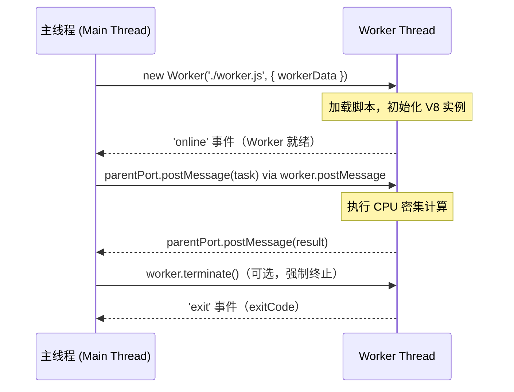

*图：沿图中的节点与箭头阅读，重点是说明 worker 适合 CPU 密集任务而非普通异步 I/O，并明确消息复制、Transferable 与 SharedArrayBuffer。*

---

Node.js 的异步 API 很适合让主线程在等待 I/O 时继续处理其他事件，但长时间 CPU 计算——例如文本分词、图像处理或本地数值任务——仍会阻塞事件循环。`worker_threads` 可以把这类 JavaScript 计算转移到独立线程；是否获益取决于任务粒度、数据传输和线程池调度成本。

## CPU 密集任务对事件循环的威胁

[Node.js `worker_threads` 文档](https://nodejs.org/api/worker_threads.html) 明确 worker 适合 CPU 密集型 JavaScript，普通异步 I/O 通常直接使用 Node 的异步 API 更合适；频繁任务还应池化以摊薄启动成本。


Node.js 主线程同时负责运行 JavaScript 代码和驱动事件循环（Event Loop）。一旦主线程被同步计算占据，所有等待中的 I/O 回调、计时器、HTTP 请求都无法得到调度：

```typescript
import http from 'http';

// 模拟 CPU 密集型任务：计算 1000 个向量的余弦相似度
function computeCosineSimilarityBatch(vectors: number[][]): number[] {
  const base = vectors[0];
  return vectors.slice(1).map(v => {
    const dot = v.reduce((sum, val, i) => sum + val * base[i], 0);
    const magA = Math.sqrt(base.reduce((s, x) => s + x * x, 0));
    const magB = Math.sqrt(v.reduce((s, x) => s + x * x, 0));
    return dot / (magA * magB);
  });
}

const server = http.createServer((req, res) => {
  if (req.url === '/compute') {
    // 假设这里耗时 300ms — 在这 300ms 内所有其他 HTTP 请求全部卡住
    const vectors = generateRandomVectors(1000, 1536); // 1536 维，GPT-4 embedding 维度
    const similarities = computeCosineSimilarityBatch(vectors);
    res.end(JSON.stringify({ count: similarities.length }));
  } else {
    res.end('ok'); // 在 /compute 处理期间，这个响应也会被延迟 300ms
  }
});
```

## 三种并发方案对比

Node.js 提供三种跨越单线程限制的方式，各有适用场景：

| 维度 | Worker Threads | Child Process | Cluster |
|---|---|---|---|
| **内存共享** | 支持 `SharedArrayBuffer` | 不支持（独立进程内存） | 不支持（独立进程内存） |
| **通信方式** | `postMessage`（结构化克隆）| IPC 管道（序列化/反序列化）| IPC 管道 |
| **启动成本** | 低（线程级）| 高（进程级，需 fork）| 高（进程级）|
| **隔离性** | 弱（共享进程内存，崩溃影响主线程）| 强（独立进程，崩溃不影响主进程）| 强 |
| **适用场景** | CPU 密集、频繁通信、共享大数据 | 运行独立脚本、沙箱执行、调用外部工具 | HTTP 服务多核负载均衡 |
| **Node.js 版本** | v10.5+（稳定 v12+）| 所有版本 | v0.6+ |

**选型原则：**
- 需要共享大型内存（如向量矩阵）→ Worker Threads + SharedArrayBuffer
- 需要运行不受信任代码或外部脚本 → Child Process
- 需要水平扩展 HTTP 服务利用多核 → Cluster（或更推荐 PM2/容器编排）

## Worker 生命周期与基础通信



### workerData 与 parentPort

`workerData` 是创建 Worker 时传入的初始化数据（结构化克隆，只读副本）；`parentPort` 是 Worker 内部与主线程通信的双向消息端口：

```typescript
// worker.ts — Worker 线程执行的脚本
import { workerData, parentPort, isMainThread } from 'worker_threads';

// 防止 Worker 脚本被直接运行
if (isMainThread) {
  throw new Error('这个文件只能作为 Worker 脚本运行');
}

interface WorkerInput {
  vectors: number[][];
  baseVector: number[];
}

interface WorkerOutput {
  similarities: number[];
  computeTimeMs: number;
}

function cosineSimilarity(a: number[], b: number[]): number {
  const dot = a.reduce((sum, val, i) => sum + val * b[i], 0);
  const magA = Math.sqrt(a.reduce((s, x) => s + x * x, 0));
  const magB = Math.sqrt(b.reduce((s, x) => s + x * x, 0));
  return dot / (magA * magB);
}

// 从 workerData 获取初始化参数
const { vectors, baseVector } = workerData as WorkerInput;

const start = Date.now();
const similarities = vectors.map(v => cosineSimilarity(baseVector, v));
const computeTimeMs = Date.now() - start;

// 计算完成后通知主线程
parentPort!.postMessage({ similarities, computeTimeMs } satisfies WorkerOutput);
```

```typescript
// main.ts — 主线程
import { Worker } from 'worker_threads';
import path from 'path';

function runVectorWorker(
  vectors: number[][],
  baseVector: number[]
): Promise<{ similarities: number[]; computeTimeMs: number }> {
  return new Promise((resolve, reject) => {
    const worker = new Worker(path.resolve(__dirname, './worker.js'), {
      workerData: { vectors, baseVector },
    });

    worker.on('message', resolve);
    worker.on('error', reject);
    worker.on('exit', (code) => {
      if (code !== 0) reject(new Error(`Worker 异常退出，退出码: ${code}`));
    });
  });
}

// 主线程保持响应，Worker 在后台计算
async function handleRequest(vectors: number[][], baseVector: number[]) {
  console.log('开始向量计算，主线程继续处理其他请求...');
  const result = await runVectorWorker(vectors, baseVector);
  console.log(`计算完成，耗时 ${result.computeTimeMs}ms，结果数: ${result.similarities.length}`);
  return result;
}
```

## SharedArrayBuffer 与 Atomics

`postMessage` 使用结构化克隆（Structured Clone）传输数据，传输大型数组时会有复制开销。`SharedArrayBuffer` 允许主线程和 Worker 线程共享同一块内存，配合 `Atomics` 进行原子操作避免竞争条件：（参见 [HTML structured clone algorithm](https://html.spec.whatwg.org/multipage/structured-data.html#structured-cloning)）

```typescript
import { Worker, isMainThread, workerData, parentPort } from 'worker_threads';

const VECTOR_DIM = 1536;
const VECTOR_COUNT = 1000;

if (isMainThread) {
  // 分配共享内存：Float32Array，每个向量 1536 个 float32
  const sharedBuffer = new SharedArrayBuffer(
    VECTOR_COUNT * VECTOR_DIM * Float32Array.BYTES_PER_ELEMENT
  );
  const sharedVectors = new Float32Array(sharedBuffer);

  // 主线程填充数据（实际场景来自数据库或文件）
  for (let i = 0; i < sharedVectors.length; i++) {
    sharedVectors[i] = Math.random();
  }

  // Worker 可以直接读取共享内存，无需复制数据
  const worker = new Worker(__filename, {
    workerData: {
      sharedBuffer,     // 传递 SharedArrayBuffer 引用（零拷贝）
      vectorCount: VECTOR_COUNT,
      vectorDim: VECTOR_DIM,
    },
  });

  worker.on('message', (result: { topK: number[] }) => {
    console.log('Top-K 相似向量索引:', result.topK);
  });

} else {
  // Worker 线程：直接访问共享内存，无需反序列化
  const { sharedBuffer, vectorCount, vectorDim } = workerData as {
    sharedBuffer: SharedArrayBuffer;
    vectorCount: number;
    vectorDim: number;
  };

  const vectors = new Float32Array(sharedBuffer);
  const baseVector = vectors.slice(0, vectorDim); // 第一个向量作为查询向量

  const similarities: Array<{ index: number; score: number }> = [];
  for (let i = 1; i < vectorCount; i++) {
    const v = vectors.slice(i * vectorDim, (i + 1) * vectorDim);
    const dot = baseVector.reduce((sum, val, j) => sum + val * v[j], 0);
    // 简化：假设已归一化，直接用点积作为余弦相似度
    similarities.push({ index: i, score: dot });
  }

  similarities.sort((a, b) => b.score - a.score);
  const topK = similarities.slice(0, 10).map(s => s.index);

  parentPort!.postMessage({ topK });
}
```

**`Atomics` 的使用场景：** 当多个线程需要对共享内存中的同一位置进行读-改-写操作时，`Atomics.add`、`Atomics.compareExchange` 等原子操作保证操作的不可分割性，防止竞争条件。

## 线程池模式（Thread Pool Pattern）

为每个任务创建新 Worker 的开销较大（需要初始化 V8 实例），生产环境应使用**线程池**复用 Worker：

```typescript
import { Worker } from 'worker_threads';
import path from 'path';

interface Task<T, R> {
  data: T;
  resolve: (result: R) => void;
  reject: (error: Error) => void;
}

class WorkerPool<T, R> {
  private workers: Worker[] = [];
  private queue: Task<T, R>[] = [];
  private idleWorkers: Worker[] = [];

  constructor(
    private readonly workerScript: string,
    private readonly poolSize: number
  ) {
    for (let i = 0; i < poolSize; i++) {
      this.addWorker();
    }
  }

  private addWorker(): void {
    const worker = new Worker(path.resolve(this.workerScript));

    worker.on('message', (result: R) => {
      const task = this.getNextTask();
      if (task) {
        worker.postMessage(task.data);
        // 注意：此处需要重新绑定 resolve/reject，实际实现需要 Map 跟踪
        task.resolve(result); // 简化示意
      } else {
        this.idleWorkers.push(worker);
      }
    });

    worker.on('error', (err) => {
      console.error('Worker 错误:', err);
      // 从池中移除损坏的 Worker 并补充新的
      this.workers = this.workers.filter(w => w !== worker);
      this.addWorker();
    });

    this.workers.push(worker);
    this.idleWorkers.push(worker);
  }

  private getNextTask(): Task<T, R> | undefined {
    return this.queue.shift();
  }

  run(data: T): Promise<R> {
    return new Promise<R>((resolve, reject) => {
      const idleWorker = this.idleWorkers.pop();
      if (idleWorker) {
        // 有空闲 Worker，直接派发
        idleWorker.postMessage(data);
        // 生产实现：用 Map<Worker, Task> 跟踪任务归属
        this.queue.unshift({ data, resolve, reject }); // 简化示意
      } else {
        // 所有 Worker 繁忙，入队等待
        this.queue.push({ data, resolve, reject });
      }
    });
  }

  async destroy(): Promise<void> {
    await Promise.all(this.workers.map(w => w.terminate()));
  }
}

// 使用示例：Agent 服务中的向量计算线程池
const vectorPool = new WorkerPool<number[][], number[]>(
  './vector-worker.js',
  4 // 根据 CPU 核心数调整，一般为 os.cpus().length - 1
);
```

> 生产场景推荐使用成熟的线程池库如 `piscina`，它提供完整的任务队列、Worker 健康检查和负载均衡功能。

## AI Agent 服务中的典型应用

在构建 AI Agent 后端时，以下场景特别适合 Worker Threads：

```typescript
// 场景：并行处理多个文档的 embedding 计算（本地模型）
import { Worker } from 'worker_threads';
import os from 'os';

interface EmbeddingTask {
  documentId: string;
  text: string;
}

interface EmbeddingResult {
  documentId: string;
  embedding: number[];
}

// 将大批量文档分片，分配给多个 Worker 并行处理
async function batchComputeEmbeddings(
  documents: EmbeddingTask[]
): Promise<EmbeddingResult[]> {
  const workerCount = Math.min(os.cpus().length - 1, documents.length);
  const chunkSize = Math.ceil(documents.length / workerCount);

  const chunks = Array.from({ length: workerCount }, (_, i) =>
    documents.slice(i * chunkSize, (i + 1) * chunkSize)
  );

  const workerPromises = chunks
    .filter(chunk => chunk.length > 0)
    .map(
      chunk =>
        new Promise<EmbeddingResult[]>((resolve, reject) => {
          const worker = new Worker('./embedding-worker.js', {
            workerData: { documents: chunk },
          });
          worker.on('message', resolve);
          worker.on('error', reject);
        })
    );

  const results = await Promise.all(workerPromises);
  return results.flat();
}
```

## 常见误解

**误解 1：Worker Threads 共享全局变量**
Worker 线程有独立的 V8 堆，`global` 对象、模块缓存、事件监听器完全隔离。共享数据只能通过 `postMessage`（复制）或 `SharedArrayBuffer`（零拷贝共享）。

**误解 2：Worker Threads 适合 I/O 密集型任务**
I/O 密集型任务应交给 Node.js 原生的异步 I/O（libuv 已经在后台处理），创建 Worker 处理 I/O 反而增加通信开销。Worker Threads 的价值在于 **CPU 密集型**计算。

**误解 3：Worker 中可以访问 `require.main`、`__dirname` 等**
Worker 脚本与普通模块相同，可以使用 `__dirname`、`__filename`。但 `isMainThread` 为 `false`，应使用它区分主线程和 Worker 环境。

**误解 4：`terminate()` 立即停止 Worker 执行**
`terminate()` 会尽快停止 Worker，但正在执行的原子操作（`Atomics.wait`）不会被立即中断。优雅退出应通过消息协商，让 Worker 自行退出。

## 最佳实践

- **使用 `piscina` 等成熟线程池库**：自己实现线程池容易出现任务泄漏和 Worker 状态管理问题。
- **避免传输大型对象**：`postMessage` 会深拷贝数据，传输 10 MB 的 JSON 有显著开销；改用 `SharedArrayBuffer` 或 `Transferable` 对象（`ArrayBuffer` 可转移所有权，零拷贝）。
- **线程池大小设为 `CPU 核心数 - 1`**：留一个核心给事件循环和 I/O 操作。
- **Worker 脚本用 `isMainThread` 守护**：防止 Worker 脚本被误作为主脚本执行。
- **监控 Worker 健康状态**：监听 `exit` 事件，异常退出（非 0 退出码）时及时补充新 Worker。
- **TypeScript 项目中编译 Worker 脚本**：Worker 文件需要单独编译为 `.js`，或通过 `ts-node` / `tsx` 在 `workerData` 中传入 `eval` 代码（不推荐生产使用）。

## 面试重点

1. **Worker Threads、Child Process、Cluster 三者的适用场景**：内存共享/通信频率/隔离需求是选型的三个维度。
2. **SharedArrayBuffer 为什么需要 COOP/COEP 头？** 浏览器环境中 Spectre 漏洞导致浏览器限制了 SAB，需要 `Cross-Origin-Opener-Policy` 和 `Cross-Origin-Embedder-Policy` 响应头（Node.js 环境无此限制）。
3. **如何实现 Worker 线程池？** 核心是维护空闲 Worker 队列和待处理任务队列，Worker 完成任务后检查队列并立即派发下一个任务。
4. **`postMessage` 的 Transferable 对象是什么？** `ArrayBuffer` 可以作为 Transferable 传输——转移后原线程失去所有权，目标线程获得，实现零拷贝。
5. **Worker Threads 中能使用所有 Node.js 模块吗？** 大部分可以，但 `cluster` 模块仅主线程有效；`process.exit()` 会终止整个进程（包括所有 Worker），Worker 内应使用 `process.exitCode` + 正常退出。
6. **AI Agent 场景下为何需要 Worker Threads？** 本地 embedding 计算、向量相似度搜索、文本分词等 CPU 密集操作如果在主线程执行，会阻塞所有并发 LLM 请求的调度。

## 参考资料

- [Node.js worker_threads API](https://nodejs.org/api/worker_threads.html)
- [HTML structured clone algorithm](https://html.spec.whatwg.org/multipage/structured-data.html#structured-cloning)
