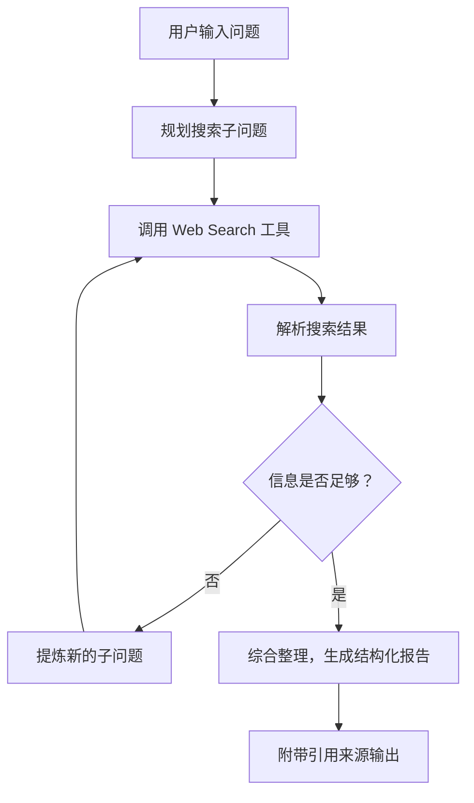
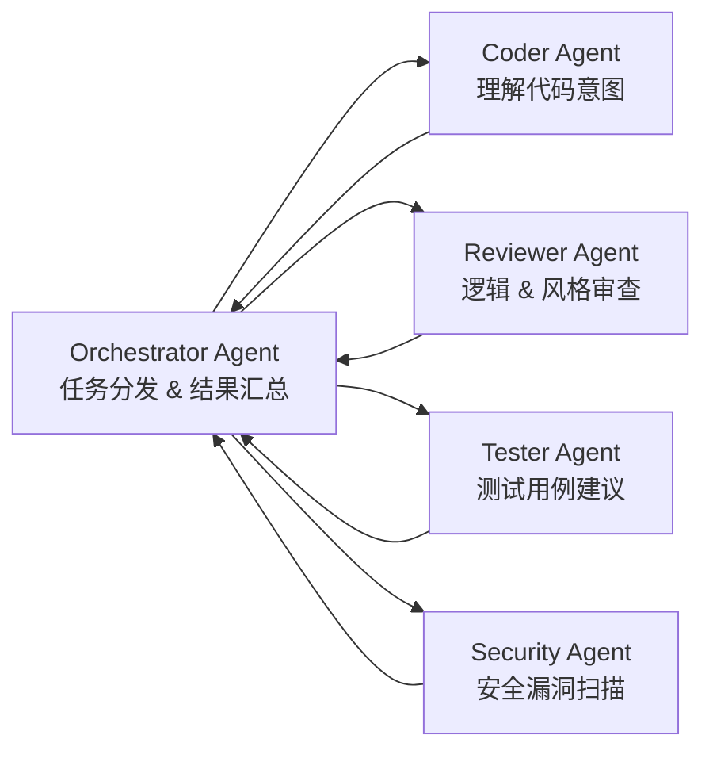

*图：沿图中的节点与箭头阅读，重点是作品集从截图集合升级为可运行项目、架构/权衡、评估证据、可复现说明和安全边界。*

---

做 Agent 工程师，最容易踩的坑之一，就是作品集里全是"跑通了就行"的 demo。能跑，和能打，是两件完全不同的事。

我说的"能打"，是指你在设计和介绍项目时，展现出了**生产级别的思考方式**：你考虑过准确率吗？你知道系统在哪里会出错吗？你有没有量化过效果？相比于传统后端，Agent 的能力边界还没有完全标准化，面试官很难只靠八股文来判断你的水平——他需要看你真实做过什么、踩过什么坑、交付过什么结果。一个设计扎实、有评估指标、有取舍思考的项目，比十个"接了 API 然后返回结果"的小 demo 有价值得多。

下面我给你梳理三类最值得做的 Agent 项目原型，每一类都有它独特的考察维度。

---

## 项目一：RAG 知识库问答 Agent

这是目前企业里落地最多的 Agent 场景，也是面试官最熟悉的方向。正因为它"常见"，做得跟别人一样就没有区分度。

**它能展现什么**

RAG 项目的核心挑战在于检索质量和回答质量的协同。你需要展示对 embedding 选型、chunk 策略取舍、召回率与精确率平衡的理解。

**如何让项目出彩**

基础 RAG 流程（切片 → 向量化 → 召回 → 生成）人人都会讲，关键是你在这条链路上做了哪些深入工作：

| 维度 | 普通做法 | 能打的做法 |
|------|----------|------------|
| 检索策略 | 纯向量相似度搜索 | Hybrid Search（向量 + BM25），RRF 融合排序 |
| Chunk 策略 | 固定 token 数切割 | 对比语义切割 vs 固定切割的召回效果，有数据说话 |
| 评估体系 | "感觉回答还不错" | 建立 QA 测试集，计算 Faithfulness、Context Precision |
| 难例分析 | 没有 | 整理出哪类问题效果差，给出改进方案 |

真正有说服力的项目，一定要有**评估数据**。手工构造 50~100 个问答对，跑 RAGAS 评估，把数字写进项目文档。"Faithfulness 从 0.61 优化到 0.84"这一句话，比任何描述性语言都有力量。

**知识库参考**：知识库 → RAG 全部内容，包括 Hybrid Search 实现、评估指标详解。

---

## 项目二：深度研究 Agent（Deep Research Agent）

这类项目的核心是展示你对**多步规划**和**工具使用**的理解，比 RAG 更复杂，区分度也更高。

**它能展现什么**

Deep Research Agent 的本质是：给定一个复杂问题，Agent 自主规划搜索策略、调用工具、整合多轮信息，最终给出有引用的结构化报告。考察你对 Agent Loop、Context 管理、Tool Call 设计的综合理解。

**架构设计**

典型架构是 ReAct 循环：

工具链至少应包含 Web Search、URL 内容抓取、结果摘要三个工具，工具的参数设计和错误处理质量直接影响 Agent 稳定性。

**如何让项目出彩**

保存并展示 Agent 的中间推理链，体现"它是怎么一步步缩小问题范围的"。做到每个关键论断都有对应 URL 和原文片段支撑，并在前端实现引用高亮体验。如果还加上流式输出，演示时的冲击力会强很多。

**知识库参考**：知识库 → AI 智能体 → `agent-deep-research`、`agent-react`、`context-engineering`。

---

## 项目三：多智能体系统

这是三类项目里复杂度最高的，也是最能体现 Agent 架构设计能力的方向。

**它能展现什么**

单 Agent 解决不了的问题，需要多个 Agent 分工协作。这类项目考察你对**编排模式**（Orchestrator + Workers）、Agent 间通信、职责划分的理解。

**示例：代码 Review 多智能体**

代码 Review 天然适合多 Agent，因为它有多个正交的审查维度：

Orchestrator 解析 PR diff，分发给各专项 Agent，收集结果后合并输出结构化 Review 报告。每个 Worker Agent 都有独立的 System Prompt 和工具集。

展示**编排决策**才是亮点：为什么这里并行、那里串行？某个 Worker 报错时如何降级？这些细节是面试官真正感兴趣的。

**知识库参考**：知识库 → AI 智能体 → `multi-agent`、`build-agent-framework`。

---

## 从 Demo 到生产：五个必须考虑的维度

[Anthropic 的 Agent eval 指南](https://www.anthropic.com/engineering/demystifying-evals-for-ai-agents) 将 task、trial、grader、结果聚合和轨迹审读作为可复现评估的组成部分；作品集应公开数据集边界和失败切片，而不只展示最佳样例。

[OpenAI Agents SDK Tracing](https://openai.github.io/openai-agents-python/tracing/) 可以记录一次 run 中的模型生成、工具调用、handoff 和 guardrail；展示 trace 时应脱敏输入输出并说明采样策略。

不管做哪类项目，以下几点是"能打"作品集的标配：

**① 评估指标（Eval）** — 没有数字就没有说服力。"优化前 xx，优化后 xx"是最有力的表述。

**② 错误处理** — 工具调用失败怎么重试？LLM 输出格式不对怎么解析？边界情况的处理体现工程成熟度。

**③ 成本控制** — 每次对话消耗多少 token？有没有做缓存或 Context 压缩？成本意识是生产环境的基本要求。

**④ 可观测性** — 接入 LangSmith 或 Langfuse，能展示每次 Agent 调用的完整链路。

**⑤ 延迟优化** — 有没有做流式输出？工具调用有没有并行化？哪个环节是瓶颈？

---

## 三个会让作品集"掉分"的常见误区

[OpenAI Agents SDK Guardrails](https://openai.github.io/openai-agents-python/guardrails/) 区分输入、输出与工具 guardrail 的执行边界；作品集应说明哪些动作被校验或阻断，以及 guardrail 没有覆盖什么。

**只有 Happy Path** — 演示全程顺风顺水，一换奇怪的问题就崩了。你需要对边界情况有答案。

**没有 Eval** — "这个项目效果很好"在高段位面试里几乎没有说服力。哪怕 20 个手工测试用例，也要有数字。

**堆工具不如深一个** — 接了七八个工具浅尝辄止，不如把一个工具的参数设计、错误处理、输出格式吃透。深度永远比广度更有价值。

---

项目做完了，怎么写进简历、怎么在面试中有条理地介绍、怎么量化你的贡献——这是另一门学问，我们下一篇来专门聊聊。

## 参考资料

- [Demystifying evals for AI agents — Anthropic](https://www.anthropic.com/engineering/demystifying-evals-for-ai-agents)
- [Tracing — OpenAI Agents SDK](https://openai.github.io/openai-agents-python/tracing/)
- [Guardrails — OpenAI Agents SDK](https://openai.github.io/openai-agents-python/guardrails/)
