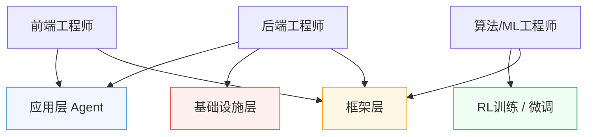

*图：沿图中的节点与箭头阅读，重点是正式计算机课程框架与职业任务数据区分 Agent 应用、平台、评估、安全和研究工程岗位。*

---

很多同学听到"Agent 工程师"这个词，第一反应是：这是不是算法岗？要懂模型训练吗？是不是需要很强的数学背景？

我当时也有过一样的困惑。但深入了解之后发现，现实情况要比想象中宽广得多——**Agent 工程师并不是一个单一的岗位，而是一个包含多个细分方向的职业生态**。不同背景的人，都有自己适合的切入口。

## Agent 工程师到底在做什么

[GitHub Agentic AI Developer 能力域](https://learn.microsoft.com/en-us/credentials/certifications/agentic-ai-developer/) 覆盖 Agent 架构、工具与环境、状态、评估调优和多 Agent 协调，说明岗位产出通常跨应用、平台与质量环节。

如果用一句话描述 Agent 工程师的日常，我会说：**他们在让 AI 真正"干活"**。

不同于传统的 AI 应用（输入一个问题，得到一个回答），Agent 系统的特点是：AI 能够自主规划步骤、调用外部工具、执行多轮动作，完成一个复杂任务。比如帮你自动搜索资料并汇总成报告，比如在代码仓库里自动修复 bug 并提交 PR。

> 如果你还不熟悉智能体（Agent）的基本概念，建议先去看看 **知识库 → AI 智能体** 这一章节，那里有对 Agent 定义、架构和典型场景的完整介绍，会让你对后续内容理解更顺畅。

Agent 工程师的日常工作，大致包括：设计 Prompt 策略和工具调用流程、调试执行链路中的幻觉和工具调用失败问题、评估 Agent 在不同场景下的成功率、与产品团队对齐能力边界，以及根据任务选择合适的基础模型和 RAG 策略。

听起来像"技术杂家"？没错，这个角色确实需要横跨多个知识域，但这也正是它的魅力所在。

## 四个主要方向，你站哪一侧

[OpenAI 的 Agent 构建指南](https://cdn.openai.com/business-guides-and-resources/a-practical-guide-to-building-agents.pdf) 将模型、工具、指令、编排、guardrails、人工介入和评估视为相互依赖的工程责任；真实岗位名称可能不同，应以这些产出判断方向。

Agent 工程师这个大帽子下，分着四条非常不同的路。

### 应用层（Application Layer）

应用层通常更直接复用前端、后端和产品工程经验，但进入门槛取决于岗位的业务域、可靠性要求与团队分工，不能仅按“应用层”标签判断难度。

应用层 Agent 工程师的核心任务：**用现有的大模型和 Agent 框架，构建面向用户的产品和功能**。你可能在做客服 Agent、代码助手、自动化办公工具，或者把 AI 能力嵌入到已有的业务系统。

这类岗位通常重视工程实现、产品判断和评估能力；涉及检索、排序或模型调优时也可能需要统计与机器学习基础。前端经验有助于交互原型，后端经验有助于工具、状态和可靠性，具体优势取决于交付物。

### 框架层（Framework Layer）

框架层工程师做的事是：**给其他 Agent 开发者提供工具和"脚手架"**。LangChain、LlamaIndex、AutoGen 这类框架背后，就是框架层工程师在维护和演进。这个方向需要更深的工程设计能力，理解 Agent 的执行模型、记忆管理、工具编排机制，后端背景的工程师在这里更有优势。

### RL训练 / 微调（Reinforcement Learning / Fine-tuning）

[Anthropic Research](https://www.anthropic.com/research) 将 Alignment、Interpretability、Societal Impacts 与 Frontier Red Team 等团队明确分开，研究工程与安全治理也不应被统称为“模型训练岗”。

这是最靠近"模型本体"的方向。**通过 RLHF、DPO 等方式，让模型学会更好地执行 Agent 任务**，比如减少幻觉、提升工具调用准确率、改善多步推理能力。对数学基础和 ML 工程能力要求较高，通常需要算法背景。如果你对大模型原理有兴趣，可以补充 **知识库 → 大模型基础** 的内容，那里从 Transformer 结构到预训练、微调流程都有完整介绍。

### 基础设施层（Infra）

Infra 工程师关心的是：**Agent 在大规模生产环境下能不能跑起来，跑得快不快，花钱多不多**。包括模型推理服务的部署、多 Agent 并发调度、长上下文的缓存优化，以及降低每次 Agent 调用的 token 成本。

这是后端和基础架构工程师的主战场。有分布式系统、高并发服务经验的同学入门会很自然，推荐配合 **知识库 → 数据研发 / 后端研发** 的内容一起理解。

## 四个方向的横向对比

| 方向 | 核心技能要求 | 入门难度 | 职业天花板 |
|------|------------|---------|----------|
| 应用层 | Prompt Engineering、API 集成、产品思维 | ⭐⭐ | 产品负责人 / AI 产品总监 |
| 框架层 | 系统设计、工程架构、开源协作 | ⭐⭐⭐ | 开源项目 Maintainer / 技术专家 |
| RL训练/微调 | 数学基础、ML 工程、评估体系 | ⭐⭐⭐⭐ | 模型负责人 / 研究员 |
| Infra | 分布式系统、性能优化、成本工程 | ⭐⭐⭐⭐ | 大规模系统架构师 |

## 传统工程师怎么转型

这是我最想聊的一个话题。

**前端工程师**的优势：能快速理解用户需求、有组件化思维、熟悉异步编程——这些在应用层 Agent 开发中全都用得上。弱点是缺少后端系统设计和模型原理的认知，但不需要一次补全。

**后端工程师**的切入点更灵活：API 设计、数据库、分布式系统的积累，在框架层和 Infra 方向有直接迁移价值。需要补的是 LLM 特性认知——上下文窗口、token 计费、工具调用协议等。

**不管哪个方向，建议都一样：先动手做一个真实的 Agent 应用**。哪怕只是本地运行的小工具，构建过程中遇到的每一个问题，都会指向你真正需要补强的地方。

## 用岗位产出而不是热度判断方向

岗位名称、招聘数量和薪酬会随地区、公司和时间快速变化，本文的职责来源不能支持统一的市场排名。阅读当期 JD 时，优先核对可交付物：是用户功能、runtime/平台、评估与质量、安全治理，还是研究实验；再看协作对象、值班责任和可验证的成功指标。

转型顺序也不必固定。更稳妥的做法是选择一个能复用既有经验、又能产出完整证据链的项目：实现可运行功能，记录架构取舍，用 eval 和 trace 展示质量，并明确权限与失败边界。项目证据比“赛道热度”更能说明适配度。

## 参考资料

- [GitHub Certified: Agentic AI Developer (beta)](https://learn.microsoft.com/en-us/credentials/certifications/agentic-ai-developer/)
- [A practical guide to building agents — OpenAI](https://cdn.openai.com/business-guides-and-resources/a-practical-guide-to-building-agents.pdf)
- [Research — Anthropic](https://www.anthropic.com/research)
