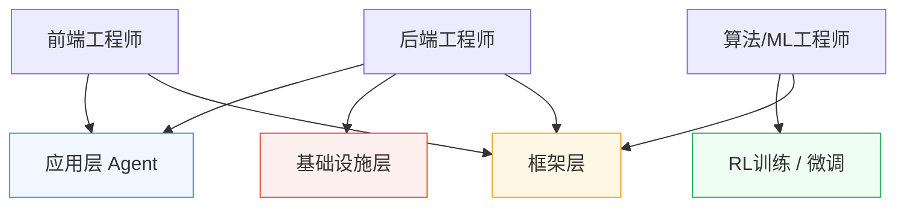

很多同学听到"Agent 工程师"这个词，第一反应是：这是不是算法岗？要懂模型训练吗？是不是需要很强的数学背景？

我当时也有过一样的困惑。但深入了解之后发现，现实情况要比想象中宽广得多——**Agent 工程师并不是一个单一的岗位，而是一个包含多个细分方向的职业生态**。不同背景的人，都有自己适合的切入口。

## Agent 工程师到底在做什么

如果用一句话描述 Agent 工程师的日常，我会说：**他们在让 AI 真正"干活"**。

不同于传统的 AI 应用（输入一个问题，得到一个回答），Agent 系统的特点是：AI 能够自主规划步骤、调用外部工具、执行多轮动作，完成一个复杂任务。比如帮你自动搜索资料并汇总成报告，比如在代码仓库里自动修复 bug 并提交 PR。

> 如果你还不熟悉智能体（Agent）的基本概念，建议先去看看 **知识库 → AI 智能体** 这一章节，那里有对 Agent 定义、架构和典型场景的完整介绍，会让你对后续内容理解更顺畅。

Agent 工程师的日常工作，大致包括：设计 Prompt 策略和工具调用流程、调试执行链路中的幻觉和工具调用失败问题、评估 Agent 在不同场景下的成功率、与产品团队对齐能力边界，以及根据任务选择合适的基础模型和 RAG 策略。

听起来像"技术杂家"？没错，这个角色确实需要横跨多个知识域，但这也正是它的魅力所在。

## 四个主要方向，你站哪一侧

Agent 工程师这个大帽子下，分着四条非常不同的路。

### 应用层（Application Layer）

这是招聘量最大、门槛相对最低的方向，也是我最推荐前端/全栈工程师首先考虑的切入点。

应用层 Agent 工程师的核心任务：**用现有的大模型和 Agent 框架，构建面向用户的产品和功能**。你可能在做客服 Agent、代码助手、自动化办公工具，或者把 AI 能力嵌入到已有的业务系统。

这个方向对数学能力要求低，更看重工程实现能力、产品思维和 Prompt Engineering。前端工程师在这里有天然优势——懂用户体验，能快速搭出可交互的原型，这在 Agent 产品迭代中非常重要。

### 框架层（Framework Layer）

框架层工程师做的事是：**给其他 Agent 开发者提供工具和"脚手架"**。LangChain、LlamaIndex、AutoGen 这类框架背后，就是框架层工程师在维护和演进。这个方向需要更深的工程设计能力，理解 Agent 的执行模型、记忆管理、工具编排机制，后端背景的工程师在这里更有优势。

### RL训练 / 微调（Reinforcement Learning / Fine-tuning）

这是最靠近"模型本体"的方向。**通过 RLHF、DPO 等方式，让模型学会更好地执行 Agent 任务**，比如减少幻觉、提升工具调用准确率、改善多步推理能力。对数学基础和 ML 工程能力要求较高，通常需要算法背景。如果你对大模型原理有兴趣，可以补充 **知识库 → 大模型基础** 的内容，那里从 Transformer 结构到预训练、微调流程都有完整介绍。

### 基础设施层（Infra）

Infra 工程师关心的是：**Agent 在大规模生产环境下能不能跑起来，跑得快不快，花钱多不多**。包括模型推理服务的部署、多 Agent 并发调度、长上下文的缓存优化，以及降低每次 Agent 调用的 token 成本。

这是后端和基础架构工程师的主战场。有分布式系统、高并发服务经验的同学入门会很自然，推荐配合 **知识库 → 数据研发 / 后端研发** 的内容一起理解。

## 四个方向的横向对比

| 方向 | 核心技能要求 | 入门难度 | 职业天花板 |
|------|------------|---------|----------|
| 应用层 | Prompt Engineering、API 集成、产品思维 | ⭐⭐ | 产品负责人 / AI 产品总监 |
| 框架层 | 系统设计、工程架构、开源协作 | ⭐⭐⭐ | 开源项目 Maintainer / 技术专家 |
| RL训练/微调 | 数学基础、ML 工程、评估体系 | ⭐⭐⭐⭐ | 模型负责人 / 研究员 |
| Infra | 分布式系统、性能优化、成本工程 | ⭐⭐⭐⭐ | 大规模系统架构师 |

## 传统工程师怎么转型

这是我最想聊的一个话题。

**前端工程师**的优势：能快速理解用户需求、有组件化思维、熟悉异步编程——这些在应用层 Agent 开发中全都用得上。弱点是缺少后端系统设计和模型原理的认知，但不需要一次补全。

**后端工程师**的切入点更灵活：API 设计、数据库、分布式系统的积累，在框架层和 Infra 方向有直接迁移价值。需要补的是 LLM 特性认知——上下文窗口、token 计费、工具调用协议等。

**不管哪个方向，建议都一样：先动手做一个真实的 Agent 应用**。哪怕只是本地运行的小工具，构建过程中遇到的每一个问题，都会指向你真正需要补强的地方。

## 市场信号：谁在招，招什么

近两年 Agent 工程师的需求快速增长，且不再局限于 AI 原生公司。

**应用层** 是需求量最大的方向，字节跳动、阿里、腾讯、美团等头部公司业务线都在招聘能"用 AI 做产品"的工程师，JD 中"有 Agent 开发经验优先"已经成为标配。薪酬与传统前端相比有明显溢价，应届 SSP 普遍在 30w+。

**框架层和 Infra** 的需求集中在 AI 基础设施公司（百川、月之暗面、MiniMax 等）和大厂 AI 平台团队，数量相对少，但薪酬天花板更高。**RL/微调** 仍是"精英市场"，顶尖团队抢的是有 top 论文或模型组经验的人，对应届生竞争激烈，但需求随模型迭代持续增加。

如果你正在准备秋招，我的建议是：**把应用层作为起点，打开 Agent 工程师的大门，在工作中再根据兴趣决定是否往框架层或 Infra 深耕**。

这条赛道还很新，市场上还没有人建立起三五年的经验壁垒。**现在入场，你不是在追赶别人，而是和大家一起从起点出发。**
