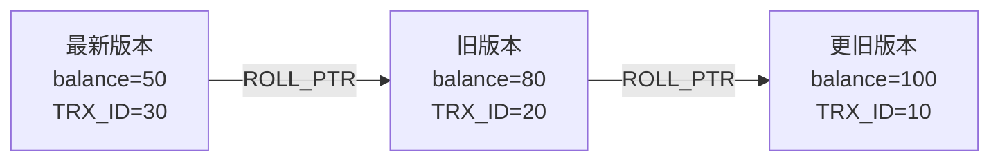

# 事务隔离级别与 MVCC 原理

设想一个最普通的转账场景:账户 A 有 100 元,事务 T1 正在把 A 的余额读出来准备做风控校验,与此同时事务 T2 把 A 扣掉了 50 元。如果 T1 在 T2 提交前后各读了一次,两次读到的值竟然不一样;又或者 T2 扣款后回滚了,而 T1 却已经按"50 元"做出了决策。这类问题的本质是:**并发的读和写交织在一起,缺乏隔离时,事务看到的数据是"不一致"甚至"不存在"的中间态**。

数据库通过"事务隔离级别"来约定:在并发面前,一个事务能看到什么、不能看到什么。理解隔离级别和它背后的 MVCC,几乎是后端工程师的必修课。即便在如今的 AI/Agent 工程里,多个 Agent 并发读写同一份状态(任务队列、向量元数据、会话记忆)时,同样会撞上脏读、幻读这些经典问题——数据库几十年沉淀下来的隔离模型,正是这类并发协调最成熟的参考答案。

## 三类并发读问题

在没有足够隔离的情况下,并发会带来三类典型的读异常。

### 脏读(Dirty Read)

一个事务读到了**另一个事务尚未提交**的修改。

```sql
-- T2 还没提交
UPDATE account SET balance = 50 WHERE id = 1;  -- T2 改成 50,未 commit

-- T1 此时读到 50
SELECT balance FROM account WHERE id = 1;        -- T1 读到 50(脏数据)

-- T2 回滚
ROLLBACK;  -- 余额其实仍是 100,但 T1 已经按 50 做了决策
```

T1 读到的 50 是一笔"幽灵数据",一旦 T2 回滚,这个值从未真实存在过。

### 不可重复读(Non-Repeatable Read)

同一个事务内,**多次读同一行**,结果却变了——因为期间另一个事务修改并提交了该行。

```sql
-- T1
SELECT balance FROM account WHERE id = 1;  -- 第一次:100

-- T2 提交了一笔扣款
UPDATE account SET balance = 50 WHERE id = 1;
COMMIT;

-- T1 再读
SELECT balance FROM account WHERE id = 1;  -- 第二次:50,前后不一致
```

重点在"同一行的值变了",关注的是 **UPDATE** 带来的不一致。

### 幻读(Phantom Read)

同一个事务内,**多次执行同一个范围查询**,后一次比前一次多出(或少了)若干行——因为期间另一个事务 INSERT/DELETE 并提交了。

```sql
-- T1
SELECT COUNT(*) FROM account WHERE balance > 80;  -- 第一次:5 行

-- T2 插入一条满足条件的新记录并提交
INSERT INTO account(id, balance) VALUES (99, 200);
COMMIT;

-- T1 再查
SELECT COUNT(*) FROM account WHERE balance > 80;  -- 第二次:6 行,凭空多出"幻影行"
```

幻读和不可重复读的区别:不可重复读针对**已存在行的修改**,幻读针对**满足条件的行集合发生增减**(INSERT/DELETE)。

## 四个隔离级别

SQL 标准定义了四个隔离级别,本质是用"允许多少异常"来换"多少并发性能"。隔离越强,并发度越低。

| 隔离级别 | 脏读 | 不可重复读 | 幻读 |
| --- | --- | --- | --- |
| 读未提交 Read Uncommitted | 可能 | 可能 | 可能 |
| 读已提交 Read Committed (RC) | 不会 | 可能 | 可能 |
| 可重复读 Repeatable Read (RR) | 不会 | 不会 | 标准允许 / InnoDB 基本避免 |
| 串行化 Serializable | 不会 | 不会 | 不会 |

- **读未提交**:几乎不加约束,能读到别人未提交的数据,会脏读。实践中极少使用。
- **读已提交**:只能读到已提交的数据,杜绝脏读。但每次读都看到"最新已提交版本",因此同一事务内两次读可能不同——不可重复读、幻读都可能发生。Oracle、PostgreSQL 默认采用此级别。
- **可重复读**:保证同一事务内多次读同一数据结果一致。按 SQL 标准它仍允许幻读,但 **InnoDB 通过 MVCC + 间隙锁,在 RR 下基本消除了幻读**(后文详述)。
- **串行化**:最强,事务之间形如串行执行,所有异常都不会出现。InnoDB 在此级别会给普通 SELECT 隐式加共享锁,并发大幅下降。

**InnoDB 的默认隔离级别是可重复读(RR)**,这是 MySQL 区别于多数数据库的一个重要特征(早年也与 binlog 的 statement 复制安全性有关)。下面就以 RR 为主线,讲清它为何能做到既高效又一致——答案就是 MVCC。

## MVCC 原理

MVCC(Multi-Version Concurrency Control,多版本并发控制)的核心思想:**读不加锁,写不阻塞读**。它让每行数据保留多个历史版本,不同事务按各自的"时间点"去看对应的版本,从而实现"读写并发"。

### 隐藏列

InnoDB 给每一行聚簇索引记录额外维护两个关键隐藏列:

- **DB_TRX_ID**:最近一次修改(INSERT/UPDATE)这行的事务 ID。事务 ID 单调递增,可以理解为"时间戳"。
- **DB_ROLL_PTR**:回滚指针,指向该行在 undo log 中的上一个版本。

(此外还有 DB_ROW_ID,在没有主键时作为隐式行号,与版本控制关系不大。)

### undo 版本链

每次 UPDATE,InnoDB 并不就地"覆盖"旧值,而是:把旧版本写入 **undo log**,新记录的 `DB_ROLL_PTR` 指向那个旧版本。多次修改后,这些版本通过回滚指针串成一条链,称为**版本链**——链头是最新值,顺着指针往下是越来越旧的历史值。



有了版本链,"读哪个版本"就成了关键问题。这由 **ReadView** 决定。

### ReadView 与可见性判断

ReadView 是事务在执行快照读时生成的一张"可见性快照",记录了那一刻系统里活跃(未提交)事务的情况。它主要包含四个字段:

- **m_ids**:生成 ReadView 时,所有**活跃(未提交)事务的 ID 列表**。
- **min_trx_id**:m_ids 中的最小值。
- **max_trx_id**:下一个将要分配的事务 ID(即当前最大事务 ID + 1)。
- **creator_trx_id**:生成这个 ReadView 的事务自身 ID。

对版本链上某个版本(其修改者为 `trx_id`),可见性判断规则如下:

1. `trx_id == creator_trx_id`:这行是当前事务自己改的,**可见**。
2. `trx_id < min_trx_id`:该版本在 ReadView 生成前就已提交,**可见**。
3. `trx_id >= max_trx_id`:该版本由 ReadView 生成之后才开启的事务所改,**不可见**。
4. `min_trx_id <= trx_id < max_trx_id`:
   - 若 `trx_id` 在 m_ids 中,说明生成快照时它还没提交,**不可见**;
   - 若不在 m_ids 中,说明已提交,**可见**。

如果当前版本不可见,就顺着 `DB_ROLL_PTR` 找版本链上更旧的版本,重复判断,直到找到第一个可见版本(或到链尾,意味着该行对本事务不可见)。

**RC 与 RR 的差异,正在于 ReadView 的生成时机**:

- **RC**:每次执行 SELECT(快照读)都**重新生成**一个 ReadView。所以每次都能看到"此刻最新已提交"的数据——这就解释了 RC 为何会不可重复读。
- **RR**:**只在事务内第一次快照读时生成一次** ReadView,之后整个事务复用它。因此整个事务看到的是同一个时间点的快照,自然避免了不可重复读,也大大缓解了幻读。

这一个"何时建快照"的细节,就是两个隔离级别行为差异的根源,值得记牢。

## 快照读 vs 当前读

理解了 MVCC,就要区分两种读:

- **快照读(Snapshot Read)**:普通的 `SELECT ... `,走 MVCC,读的是 ReadView 对应的历史版本,不加锁。这是常态,也是 MVCC 提升并发的来源。
- **当前读(Current Read)**:读取**最新已提交版本并加锁**,确保读到的就是当前真实的数据。以下语句都是当前读:

```sql
SELECT ... LOCK IN SHARE MODE;   -- 加共享锁(S 锁)
SELECT ... FOR UPDATE;            -- 加排他锁(X 锁)
UPDATE ...;                       -- 隐含当前读
DELETE ...;                       -- 隐含当前读
INSERT ...;                       -- 写操作
```

为什么 UPDATE/DELETE 必须是当前读?因为修改必须基于"最新真实值",否则会丢失更新。比如 `UPDATE account SET balance = balance - 50` 若读的是旧快照,扣款就会出错。

## RR 下如何缓解幻读

这里有个常被误解的点:**MVCC 只能保证快照读不出现幻读,挡不住当前读的幻读**。

- 对**快照读**:RR 全程复用同一个 ReadView,后插入的行 `DB_TRX_ID >= max_trx_id`,按规则不可见,所以反复执行同样的 `SELECT`,行集合不变,没有幻读。
- 对**当前读**:`SELECT ... FOR UPDATE`、`UPDATE`、`DELETE` 读的是最新数据,MVCC 帮不上忙。这时 InnoDB 用**锁**来防幻读,关键是**间隙锁(Gap Lock)与临键锁(Next-Key Lock)**。

间隙锁锁住的不是某条已存在的记录,而是索引记录之间的"间隙",阻止其他事务往这个范围里 INSERT 新行。临键锁 = 行锁(锁住记录本身) + 间隙锁(锁住记录前的间隙),是 InnoDB 在 RR 下加锁的默认形态。

```sql
-- T1(RR),当前读锁住 balance > 80 的范围及其间隙
SELECT * FROM account WHERE balance > 80 FOR UPDATE;

-- T2 试图插入一条满足条件的新行
INSERT INTO account(id, balance) VALUES (99, 200);  -- 被间隙锁阻塞,直到 T1 提交
```

正因为间隙锁挡住了"满足条件的新行被插入",T1 再次执行同一范围的当前读时不会冒出幻影行。所以可以这样总结 InnoDB RR 下的防幻读策略:

- **快照读** → 靠 **MVCC**(同一 ReadView)避免幻读;
- **当前读** → 靠 **临键锁 / 间隙锁** 避免幻读。

两者配合,InnoDB 才能在保留 RR 高并发的同时,把幻读控制到极低程度。需要注意的是,间隙锁只在 RR 级别生效,RC 级别会退化为只锁命中的行(基本没有间隙锁),这也是 RC 并发更高但更易幻读的原因之一。

## 小结

| 概念 | 关键点 |
| --- | --- |
| 脏读 | 读到未提交数据 |
| 不可重复读 | 同一行两次读值不同(UPDATE) |
| 幻读 | 同一范围两次读行数变化(INSERT/DELETE) |
| MVCC | 隐藏列 + undo 版本链 + ReadView,实现无锁快照读 |
| RC vs RR | 每次读建 ReadView vs 事务内复用一个 ReadView |
| 快照读 | 普通 SELECT,读历史版本,不加锁 |
| 当前读 | FOR UPDATE / UPDATE / DELETE,读最新版本并加锁 |
| RR 防幻读 | 快照读靠 MVCC,当前读靠间隙锁 / 临键锁 |

把这套模型理解透,你不仅能解释 MySQL 的并发行为,也能在任何多写者并发的系统里(包括多 Agent 协同读写共享状态时)更清醒地判断:这里到底需要哪一级别的隔离,要付出多少并发代价。
