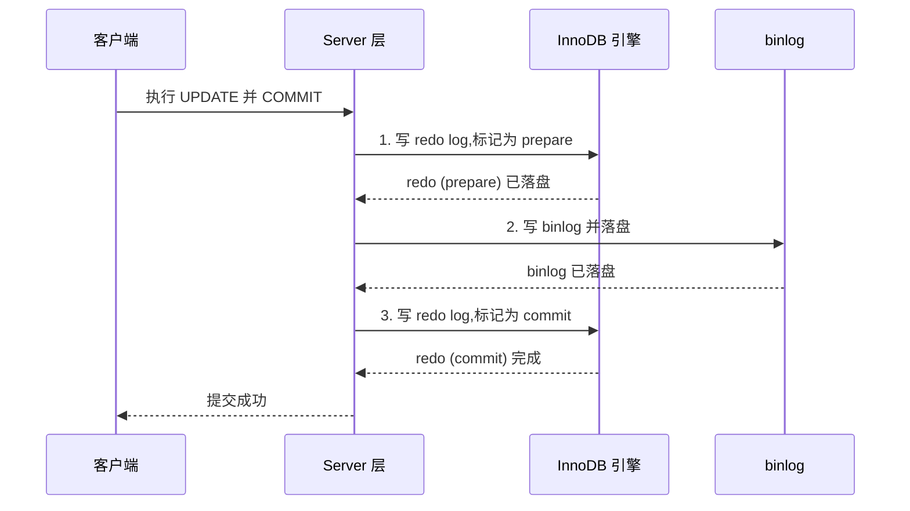
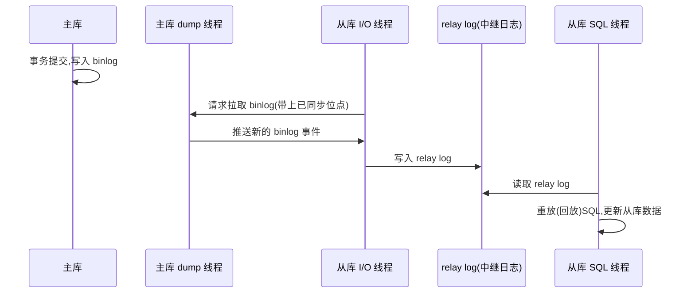

# redo log、undo log 与 binlog 有什么区别?

想象这样一个场景:你的程序刚刚执行了一笔转账,MySQL 返回"提交成功",紧接着机房突然断电。重启之后,这笔转账还在吗?再设想另一个场景:一个事务执行到一半,你发现金额算错了,执行了 `ROLLBACK`,数据库是如何把已经改过的行"恢复原状"的?

这两个问题——**宕机后数据为何不丢**、**事务为何能回滚**——正是 MySQL 三种核心日志存在的根本原因。它们分别是 redo log、undo log 和 binlog。很多人会把它们混为一谈,觉得"不都是日志吗"。但只要你理解了它们各自要解决的问题,就会发现三者职责完全不同,甚至处在不同的软件层次上。这篇文章会把"为什么需要它们"讲清楚。

## 先理解一个前提:为什么不直接写磁盘?

InnoDB 操作数据时,并不会每改一行就立刻把对应的数据页(默认 16KB)刷回磁盘。原因很现实:磁盘的随机写非常慢,而一个事务可能只改了某一页里的几个字节。如果每次都把整页随机刷盘,性能会惨不忍睹。

所以 InnoDB 采用了**缓冲池(Buffer Pool)**:数据页先在内存里改,改完的页叫"脏页",稍后再由后台线程批量、择机刷回磁盘。

这就带来一个致命问题:如果脏页还没刷盘,数据库就宕机了,内存里的修改岂不是全丢了?提交成功的事务怎么保证不丢?

redo log 就是为了堵住这个窟窿而生的。

## redo log:让 InnoDB 具备 crash-safe 能力

### 它是什么

redo log 是 **InnoDB 存储引擎层**特有的日志,记录的是**物理层面的修改**——"对某个表空间、某个数据页、某个偏移量,做了什么改动"。它不关心 SQL 语义,只关心"哪一页的哪个位置变成了什么"。

### WAL:先写日志,再写数据

redo log 的核心思想叫 **WAL(Write-Ahead Logging,预写式日志)**:在修改数据页之前,先把"我要做什么改动"顺序写进 redo log。

关键就在于这个**顺序写**。把修改意图追加写入 redo log 是顺序 I/O,远比把分散的脏页随机刷盘快得多。于是事务提交时,只要 redo log 落了盘(配合 `innodb_flush_log_at_trx_commit=1`),就可以告诉用户"提交成功"了,脏页则可以从容地在后台慢慢刷。

这样一来,即使刚提交完就宕机,脏页没来得及刷,重启时 InnoDB 也能**重放(redo)** redo log 里记录的修改,把那些丢失的页恢复出来。这就是所谓的 **crash-safe(崩溃安全)**。可以用一句话概括:redo log 把"随机写数据页"的可靠性,转化为了"顺序写日志"的可靠性。

### 循环写与两个关键位点

redo log 文件大小是固定的,通常由若干个文件组成一个逻辑环。InnoDB 用两个指针来管理它:

- `write pos`:当前写入位置,一边写一边向前推进。
- `checkpoint`:表示"这之前的修改对应的脏页都已经安全刷盘了",这部分日志空间可以被覆盖复用。

两个指针都在环上顺时针移动。`write pos` 追上 `checkpoint` 时,说明日志写满了,必须先推进 checkpoint(即先刷一批脏页)才能继续写。这种**循环写**的方式决定了 redo log 不是用来做历史归档的——旧的内容会被新的覆盖,它只保证"已提交但还没刷盘的那部分修改"能被恢复。

## undo log:回滚的依据,也是 MVCC 的基石

redo log 解决了"提交了不能丢",但它管不了"没提交想反悔"。这正是 undo log 的职责。

### 它是什么

undo log 是**逻辑日志**,记录的是"想要撤销某个操作,需要做的反向操作"。它和 redo log 的物理记录方式不同,更接近语义层面的回退指令:

- 你 `INSERT` 了一行,undo log 记下"删除这一行";
- 你 `DELETE` 了一行,undo log 记下"重新插入这一行";
- 你 `UPDATE` 把某字段从 A 改成 B,undo log 记下"把它从 B 改回 A"。

### 两大用途

**用途一:事务回滚。** 执行 `ROLLBACK` 时,InnoDB 顺着 undo log 把这个事务做过的修改逐条反向执行,数据就回到了事务开始前的样子。文章开头"金额算错了能回滚"的问题,答案就在这里。

**用途二:MVCC 的版本链。** 这是 undo log 更精妙的作用。InnoDB 的每一行数据都隐藏着两个字段:`DB_TRX_ID`(最近修改它的事务 ID)和 `DB_ROLL_PTR`(回滚指针)。每次修改一行,旧版本数据并不会立即丢弃,而是通过回滚指针被串成一条**版本链**,链上的历史版本就保存在 undo log 里。

当一个读事务来读这一行时,它会根据自己的 **Read View(一致性视图)** 沿着版本链向后找,挑出"对自己可见的那个版本"。这就是 InnoDB 在 RR、RC 隔离级别下实现**一致性非锁定读(快照读)**的原理——读操作不必加锁,也不会被写操作阻塞,大大提升了并发能力。

正因为 undo log 还要支撑 MVCC,所以它不能在事务提交后立刻删除。只有当没有任何活跃事务还可能用到某个历史版本时,后台的 purge 线程才会清理对应的 undo 记录。

## binlog:Server 层的逻辑日志,服务于复制与归档

前面两种日志都属于 InnoDB 引擎层。但 MySQL 是分层架构的:上面是 **Server 层**(负责连接、解析、优化、执行),下面是**存储引擎层**(InnoDB、MyISAM 等可插拔)。binlog 就属于 Server 层,因此**无论用什么存储引擎,binlog 都存在**。

### 它是什么

binlog(归档日志)记录的是所有**更改数据**的逻辑操作,即"这条语句/这次行变更做了什么"。它有几种格式:

- `STATEMENT`:记录原始 SQL 语句,日志量小,但某些函数(如 `NOW()`、`UUID()`)在主从重放时可能产生不一致。
- `ROW`:记录每一行被改成了什么样子,精确可靠,是目前推荐的默认格式,代价是日志量较大。
- `MIXED`:两者折中,由 MySQL 自行选择。

### 与 redo log 的本质区别

很多人最容易混淆 binlog 和 redo log,这里特别强调:

- **写入方式不同**:binlog 是**追加写**——一个文件写满了就切到下一个文件,旧文件会保留下来,可以一直追溯历史;redo log 是**循环写**,会被覆盖。
- **用途不同**:binlog 用于**主从复制**和**基于时间点的归档恢复(PITR)**;redo log 只用于崩溃恢复,不能拿来做数据归档或搭建从库。

打个比方:redo log 像汽车的备用电瓶,只保证"刚发生但还没落实的事"不丢;binlog 则像行车记录仪,完整记录走过的每一段路,可以回放。

## 三者对照表

| 维度 | redo log | undo log | binlog |
| --- | --- | --- | --- |
| 所在层次 | InnoDB 引擎层 | InnoDB 引擎层 | MySQL Server 层 |
| 日志类型 | 物理日志(页的物理修改) | 逻辑日志(反向操作) | 逻辑日志(语句或行变更) |
| 核心作用 | 崩溃恢复 / crash-safe | 事务回滚 + MVCC 版本链 | 主从复制 + 归档恢复 |
| 写入方式 | 循环写(固定大小,会覆盖) | 随事务产生,purge 后清理 | 追加写(持续保留,可归档) |
| 是否所有引擎都有 | 否,InnoDB 独有 | 否,InnoDB 独有 | 是,Server 层统一记录 |
| 关注点 | 数据不丢 | 数据可回退、可多版本读 | 数据可复制、可重放 |

## 为什么需要两阶段提交?

现在出现了一个棘手的问题:一次更新事务,既要写 redo log(保证 crash-safe),又要写 binlog(保证主从一致)。这是两份独立的日志,如果不加协调,只要写完其中一份就宕机,两者就会"打架":

- 如果**先写 redo log 并提交,再写 binlog,但 binlog 还没写就宕机**:主库重启后能恢复出这条修改(数据有),但 binlog 里没有它,从库收不到这条变更——主从数据不一致。
- 如果**先写 binlog,再写 redo log,但 redo log 没写就宕机**:主库重启后这条修改没了(数据无),可 binlog 里却有它,将来用 binlog 恢复或同步从库时,会凭空多出一条数据——同样不一致。

根因在于:**两份日志各自的"提交"动作不是原子的**。MySQL 用**两阶段提交(2PC)**来解决,把 redo log 的提交拆成 prepare 和 commit 两步,中间夹着 binlog 的写入:

崩溃恢复时,InnoDB 会逐条检查处于 prepare 状态的 redo log,判断逻辑如下:

- redo log 已是 **commit** 状态 → 事务完整,直接生效。
- redo log 处于 **prepare** 状态:
  - 如果对应的 **binlog 完整存在** → 说明只差最后一步 commit,补提交(认为成功)。
  - 如果对应的 **binlog 不存在/不完整** → 说明 binlog 还没写成功就崩了,回滚这个事务。

这套机制保证了一个关键结论:**只有 binlog 写成功,事务才算最终成功**。redo log 和 binlog 由此达成一致,主库的数据状态与传给从库的 binlog 永远对得上。这里的"prepare→提交外部资源→commit"思路,其实就是分布式事务里 2PC 的经典范式,在很多 AI Agent 工程里串联多个外部工具调用、需要保证"要么都生效要么都不生效"时,也常常借鉴这种先预留、再确认的两阶段设计。

## 主从复制:binlog 是如何被"搬"到从库的

binlog 最重要的用武之地就是主从复制。它的基本流程围绕三个角色展开:主库的 binlog、从库的 I/O 线程和 SQL 线程,以及从库本地的 relay log(中继日志)。

把流程拆开说清楚:

1. **主库写 binlog**:主库上的事务正常提交,产生的变更被记录进 binlog。
2. **binlog dump**:从库连上主库后,主库会启动一个专门的 **dump 线程**,把 binlog 内容按从库当前的复制位点推送过去。
3. **写入 relay log**:从库的 **I/O 线程**接收这些事件,原样写进本地的 relay log(中继日志)。relay log 起到缓冲作用,让网络传输和数据重放解耦。
4. **回放 relay log**:从库的 **SQL 线程**读取 relay log,把里面的变更在从库上重新执行一遍,从库数据于是追上了主库。

默认情况下这是**异步复制**:主库写完 binlog 就返回客户端,不等从库确认,因此从库可能有短暂延迟。如果对一致性要求更高,可以采用**半同步复制**(主库等至少一个从库收到 binlog 才返回),或基于 GTID 的复制来简化位点管理。

## 小结

- **redo log**:InnoDB 引擎层、物理日志、循环写。核心是 WAL,把随机写转为顺序写,提供 crash-safe,回答了"宕机后已提交数据为何不丢"。
- **undo log**:InnoDB 引擎层、逻辑日志。既是事务回滚的依据,又通过版本链支撑 MVCC 快照读,回答了"事务为何能回滚、读为何不用加锁"。
- **binlog**:Server 层、逻辑日志、追加写。服务于主从复制和归档恢复,是数据能被"复制"和"重放"的根基。
- **两阶段提交**:用 redo prepare → 写 binlog → redo commit 的顺序,保证两份日志在任何宕机点都能达成一致。

理解了这三者各自要解决什么问题,你就不会再把它们混为一谈——它们不是同一件事的三个名字,而是数据库为"不丢、可回退、可复制"这三个独立目标分别打造的三套机制。
